# 用你的树莓派和蓝色组合预测天气

> 原文：<https://www.sitepoint.com/forecasting-weather-with-ibm-watson-bluemix-raspberry-pi/>

IBM Bluemix 和 Raspberry Pi 是构建具有不可思议潜力的设备的完美组合。在这个系列中，我们一直在探索这种潜力，并慢慢建立我们的树莓 Pi 可以做什么。在第一篇文章中，我们探索了如何将树莓 Pi 连接到 IBM Bluemix、IBM Watson 和 Node-RED 上，在第二篇文章中，我们通过 IBM Watson 的文本到语音转换功能为我们的树莓 Pi 赋予了声音。如果你还没有读过这些，我建议你读完之后再回到这里！在本文中，我们将让 Pi 能够告诉我们所在地区的天气预报。


SitePoint/PatCat 的作品，徽标权利:IBM 和 Raspberry Pi 基金会

这个示例可以完全独立于前面的创建，但是它将使用相同的节点来实现文本到语音的功能——所以您需要保留这些节点！

## 将气象公司数据服务添加到 blue mix

为了给你带来一些非常有价值的天气结果，IBM 的人真的买下了气象公司。这意味着您现在可以访问所有的全球数据、预测等等！那里有很多。要将它添加到您的 IBM Bluemix 设置中，请返回到 [Bluemix 服务页面](https://console.ng.bluemix.net/catalog/#services)并输入“天气”来过滤您的选项并找到“IBM Bluemix 的天气公司数据”服务:


可供我们测试的初始计划是一个免费计划。它有以下限制:

> Weather Company Data Free 计划允许您为每个 Bluemix 帐户每分钟最多拨打 10 次电话给 Weather Company，最多拨打 10，000 次 API 电话。

在弹出的选项中，将您的空间保留为“dev”(如果这是您在其他教程中使用的空间)，将服务保留为未绑定，以便您可以在其他应用程序中重用它，根据需要重命名服务(我保留原样)，保留凭据，然后单击“创建”！

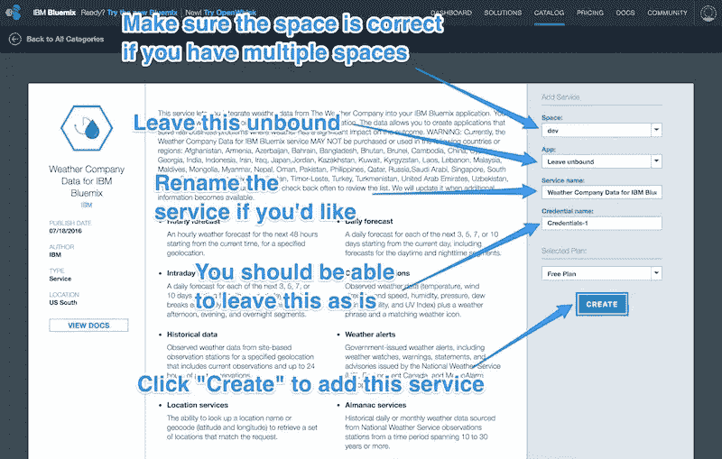

为了能够从 Node-RED(或任何地方)使用这项服务，我们需要证明我们是请求者的凭证。转到“服务凭据”页面，将用户名和密码详细信息复制到安全的地方:

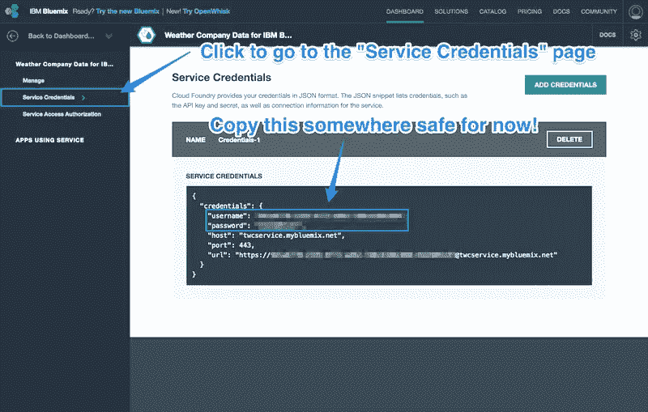

## 在红色节点中访问我们的天气数据

打开与我们之前的教程*相同的流程(如果你是从零开始，你将能够遵循这些步骤中的大部分，只是知道你需要回到[第 2 部分](https://www.sitepoint.com/teaching-your-raspberry-pi-to-speak-with-ibm-watson/)了解如何做文本到语音的细节)。*

我们将一个新的功能节点拖到我们的流程中，我将它放在另一个节点的下面(如果您愿意，您可以为此创建一个全新的流程):

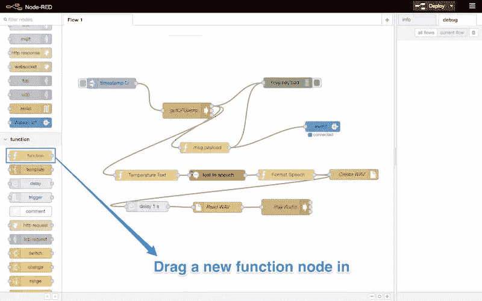

将该函数命名为“hourlyWeatherURL”，或者您喜欢的任何名称。然后输入以下 JavaScript 代码:

```
msg.url = 'https://twcservice.mybluemix.net:443/api/weather/v1/geocode/{latitude}/{longitude}/forecast/hourly/48hour.json?units=m&language=en-US';
return msg;
```

你会注意到有两个地方你需要定制。在`{latitude}`和`{longitude}`字段中添加您自己的纬度和经度。如果你不确定你的城市的价值，[美国宇航局有一个可爱的经纬度探测器](http://mynasadata.larc.nasa.gov/latitudelongitude-finder/)。对我的城市悉尼来说，看起来是这样的:

```
msg.url = 'https://twcservice.mybluemix.net:443/api/weather/v1/geocode/-33.8671417236/151.2071075439/forecast/hourly/48hour.json?units=m&language=en-US';
return msg;
```

如果你更喜欢华氏温度而不是摄氏温度，也可以改变一个`units`变量。`units=m`是公制(摄氏度)`units=e`是英制(法伦海特)。因为我们在澳大利亚使用摄氏温度，所以我用了`units=m`。

一旦你把这些都输入进去，点击“完成”:

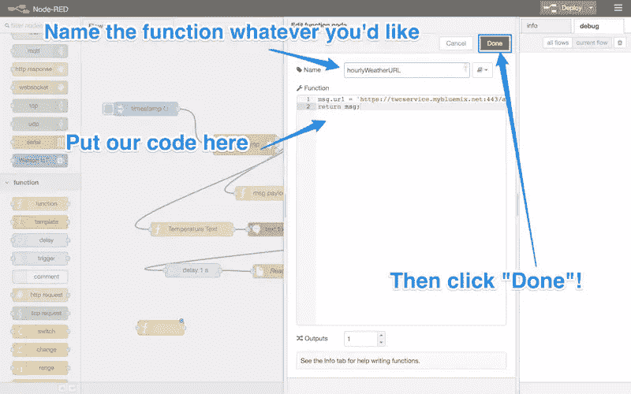

接下来，我们希望能够向天气数据服务发出 HTTP 请求，该服务使用我们在第一个节点中设置的 URL。为此，我们将“http 请求”节点拖入:

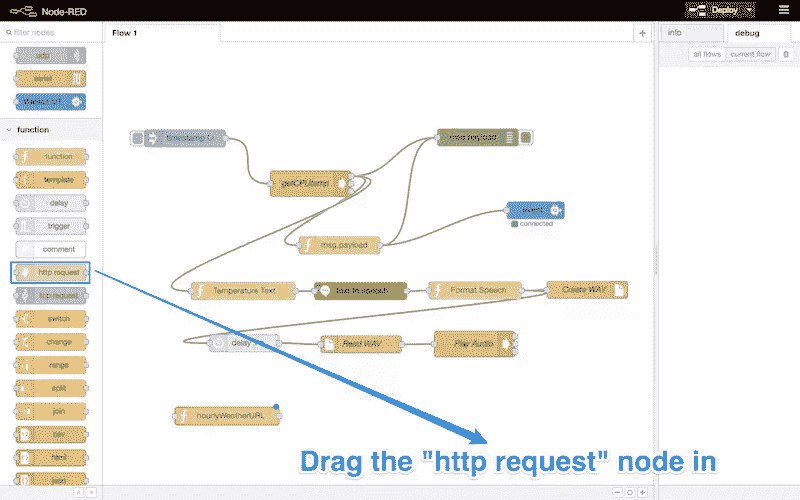

然后，我们双击它以打开其设置，并执行以下操作:

*   勾选“使用基本身份验证”——我们将需要包含我们之前复制的用户名和密码。
*   添加前面提到的用户名和密码。
*   选择“一个解析的 JSON 对象”作为我们的返回值——这样我们将收到一个 JSON 对象，我们可以在下面的节点中进一步过滤。
*   随便你怎么命名，我选了“恢复天气”。
*   点击“完成”！

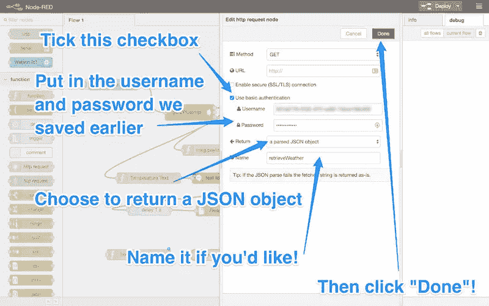

为了从我们的第一个节点获取 URL，我们必须记住将它连接到我们的“http 请求”节点:

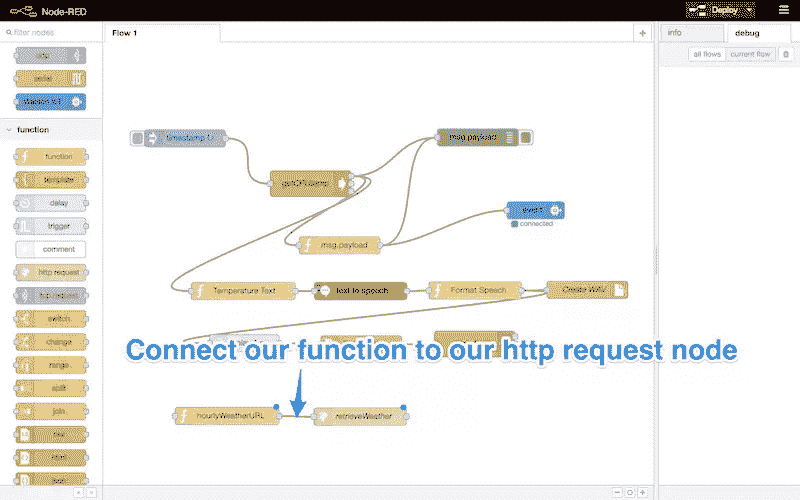

然后，拖入一个“调试”节点，并将其连接到末尾。这将使我们能够看到哪些数据正在通过的日志，以检查它是否在工作:

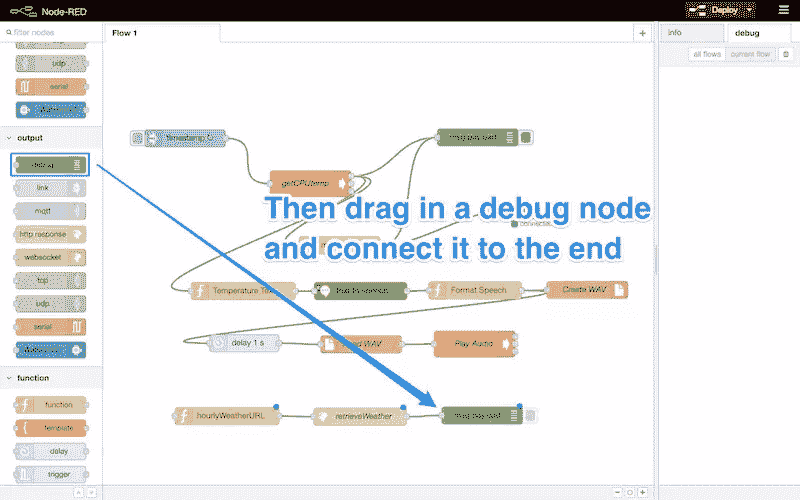

最后，我们需要一个开始整个过程的方法。为此，拖动一个新的“注入”节点，并将其连接到起点:

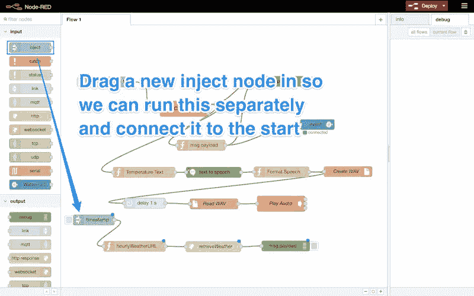

现在我们准备好测试它了！点击“部署”:

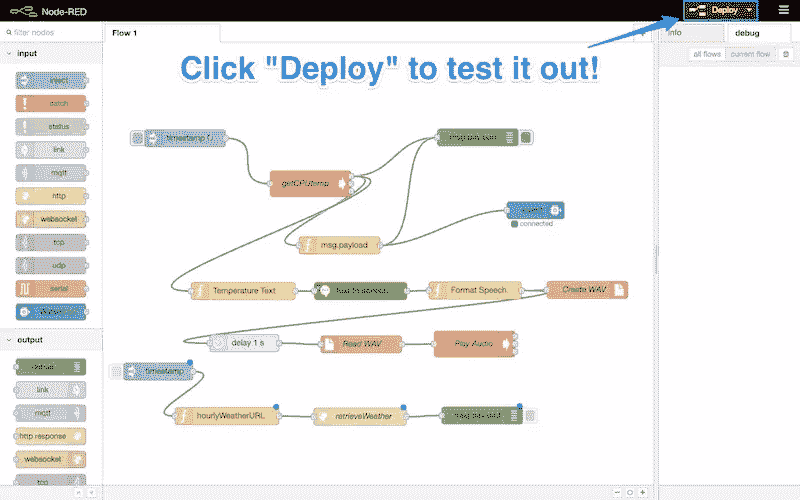

为了运行我们的流，我们需要单击标签为“timestamp”的“inject”节点上的小方形按钮。这将运行我们的天气请求，并在我们的调试选项卡中显示数据:

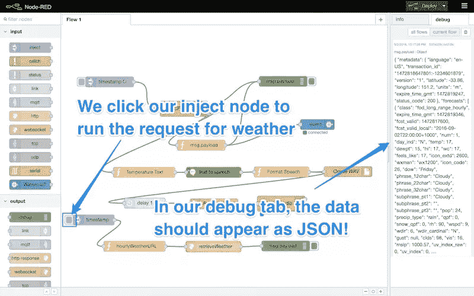

太棒了。一切都应该如我们所愿。

返回的`msg.payload`包含一组对未来几个小时的预测。我们取数组中的第一项来获取当前小时。`msg.payload`整体看起来有点像这样:

```
{
  "metadata": {
    ...
  },
  "forecasts": [
    {
      "class": "fod_long_range_hourly",
      "expire_time_gmt": 1472786395,
      "fcst_valid": 1472785200,
      "fcst_valid_local": "2016-09-02T13:00:00+1000",
      "num": 1,
      "day_ind": "D",
      "temp": 16,
      "dewpt": 14,
      "hi": 16,
      "wc": 16,
      "feels_like": 16,
      "icon_extd": 1200,
      "wxman": "wx2500",
      "icon_code": 12,
      "dow": "Friday",
      "phrase_12char": "Rain",
      "phrase_22char": "Rain",
      "phrase_32char": "Rain",
      "subphrase_pt1": "Rain",
      "subphrase_pt2": "",
      "subphrase_pt3": "",
      "pop": 93,
      "precip_type": "rain",
      "qpf": 0.96,
      "snow_qpf": 0.0,
      "rh": 92,
      "wspd": 8,
      "wdir": 17,
      "wdir_cardinal": "NNE",
      "gust": null,
      "clds": 100,
      "vis": 6.0,
      "mslp": 1006.8,
      "uv_index_raw": 0.83,
      "uv_index": 1,
      "uv_warning": 0,
      "uv_desc": "Low",
      "golf_index": 2,
      "golf_category": "Very Poor",
      "severity": 1
    },
    ... (the next hours go here)
```

现在让我们超越基本的调试日志，让我们的 Pi 通过它之前学习的说话能力告诉我们这个数据！

## 提醒我们的 Pi 如何说话

为了让我们的 Pi 说话，就像本系列前一篇文章中的 CPU 温度一样，我们只需要复制该教程中的最后七个节点。您可以通过拖动并选择它们，然后按 Ctrl+C(在 Windows 上)或 Cmd+C(在 Mac 上)来复制它们:

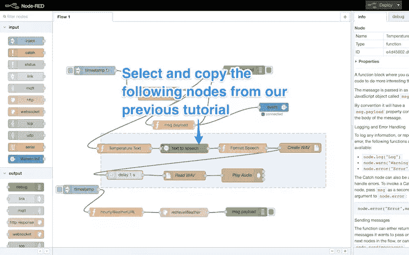

使用 Ctrl+V(在 Windows 上)或 Cmd+V(在 Mac 上)粘贴它们，并将它们整齐地放置在我们的新天气流下面。将第一个函数重命名为“Weather Text ”,并将其连接到我们的“retrieveWeather”节点，以便它也从该节点获取输出:

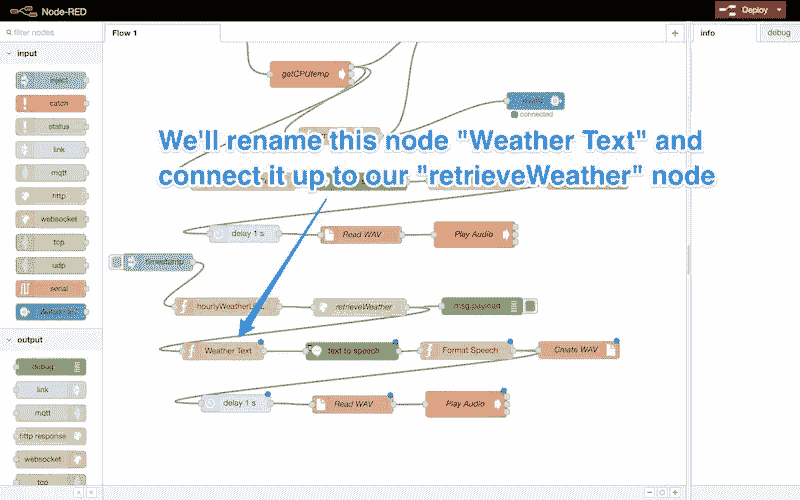

然后双击“天气文本”功能。在此范围内，我们可以设置希望 Pi 显示的内容。首先，让我们将这段 JavaScript 代码放入其中:

```
msg.payload = "The current temperature is " + 
              msg.payload.forecasts[0].temp +
              " degrees celsius";
return msg;
```

这将告诉我们的 Pi，我们希望输出的结构返回*“当前温度是 X 摄氏度”*(如果您使用华氏温度，可以在这里随意更改)。

现在，如果你想让 Pi 继续告诉你它的 CPU 温度，你可以跳过这一步，但是我个人觉得天气更有趣，我不想再听到关于它的 CPU 了。如果您像我一样，双击另一个流中较旧的“时间戳”节点。取消重复设置并取消勾选“开始时注射一次？”。这样，只有当我们点击并告诉它运行时，流才会运行。然后点击“完成”:

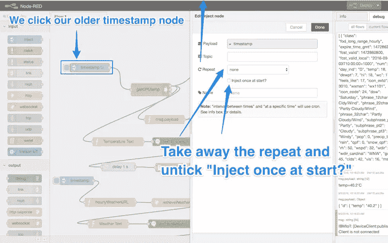

现在，我们可以将天气流设置为自动运行。双击新的“时间戳”节点，并将其设置为您想要的重复频率(我选择每 30 分钟一次)。点按“开始时注射一次？”以便当您部署流程时，它也能自动运行。然后像往常一样点击“完成”:

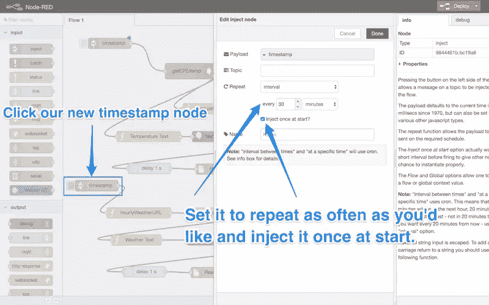

部署这些变化，我们将有一个当前温度的自动通知很好地告诉我们！

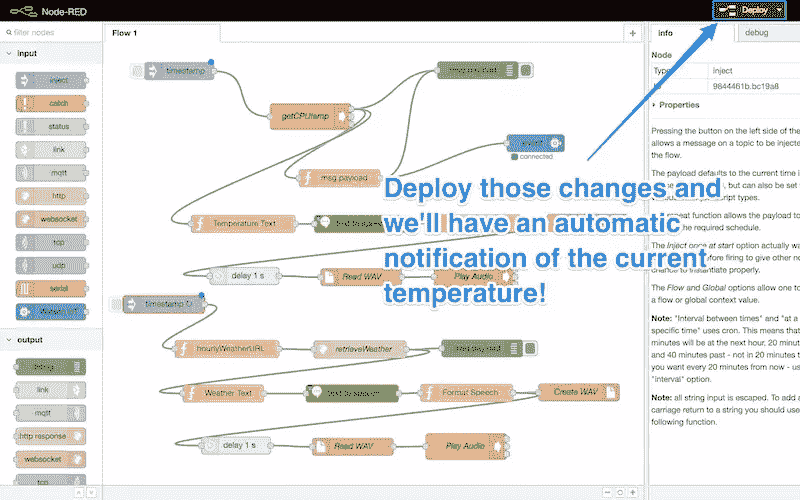

## 我们还能做什么？

想知道该服务还能提供哪些数据吗？您可以在[Weather Company Data For IBM Bluemix API](https://twcservice.mybluemix.net/rest-api/)页面上找到 weather API 可以提供的所有可能性。在本例中，我们使用了“按地理编码的 48 小时每小时预测”API。为了让我们的例子更高级一点，让我们添加一个小时内是否会下雨的数据，就像这样*(下一个小时只是返回的数组中的第二个值)*:

```
msg.payload = "The current temperature is " + 
              msg.payload.forecasts[0].temp +
              " degrees celsius. " +
              "There is a " +
              msg.payload.forecasts[1].pop + 
              " percent chance of " +
              msg.payload.forecasts[1].precip_type +
              " in an hour.";
return msg;
```

我们甚至可以更进一步，添加关于温度(当你添加湿度和风时)是否真的*感觉*像那个温度的信息。API 有一个字段，我们可以这样访问它:

```
var tempToSay = msg.payload.forecasts[0].temp != msg.payload.forecasts[0].feels_like ? 
        "The current temperature is " + msg.payload.forecasts[0].temp + 
        " degrees celsius, but it will feel more like " + 
        msg.payload.forecasts[0].feels_like + ". " : 
        "The current temperature is " + msg.payload.forecasts[0].temp + 
        " degrees celsius. ";

msg.payload = tempToSay +
              "There is a " +
              msg.payload.forecasts[1].pop + 
              " percent chance of " +
              msg.payload.forecasts[1].precip_type +
              " in an hour.";
return msg;
```

基本上，上面的代码只在`msg.payload.forecasts[0].feels_like`值不同于`msg.payload.forecasts[0].temp`值时才提到它。

## 结论

有了它，我们就有了一个树莓皮，它能以各种方式告诉我们天气预报。从风的数据到积雪，这里有更多的信息！甚至还有一个代表打高尔夫球的天气条件的值，这看起来非常具体。权力现在在你手中！

如果你想让你的蓝莓派有更多的功能，不要害怕！随着我们继续探索 Bluemix 平台的更多可能性，本系列还会有更多内容。我很享受这个过程，在这里我有很大的抱负！

你用 Bluemix 和 Raspberry Pi 构建了什么令人兴奋的东西吗？或者你有什么想用 Bluemix 制作的东西需要我们介绍吗？在评论里留言吧！

## 分享这篇文章