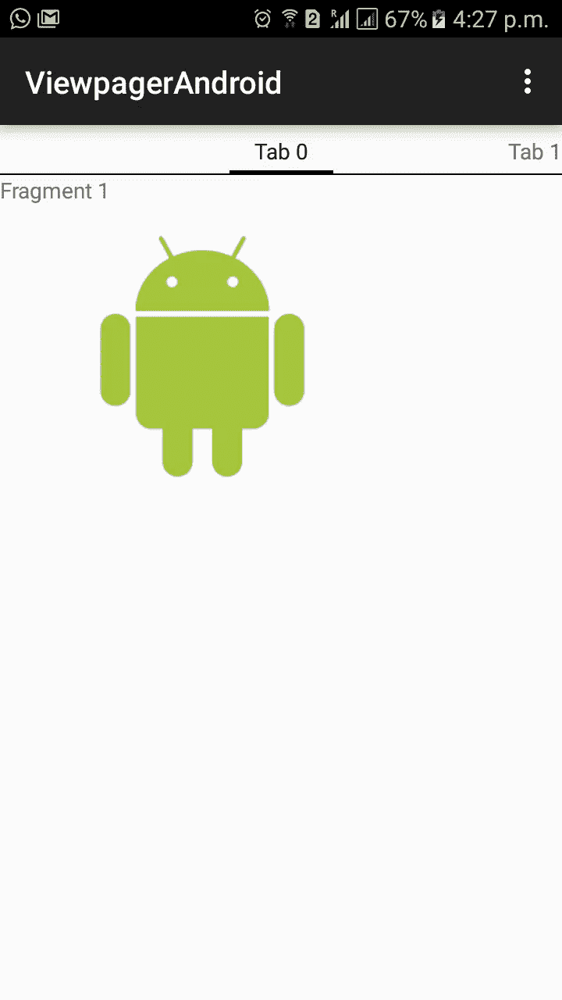
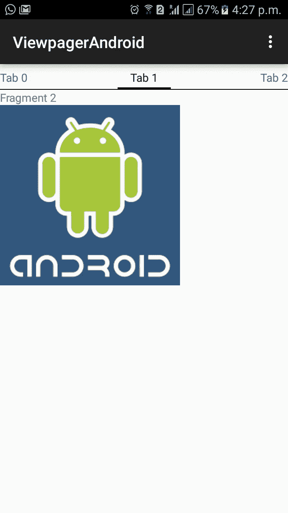
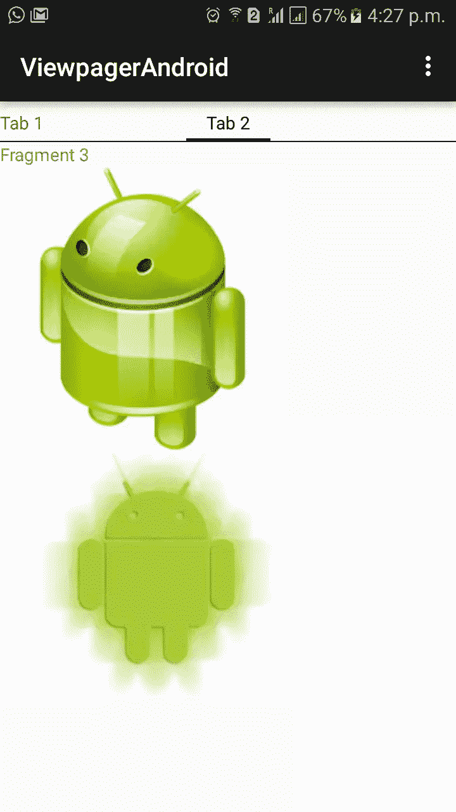

# 使用 ViewPager 在 Android 中创建滑动屏幕 UI

> 原文：<https://www.sitepoint.com/using-viewpager-to-create-a-sliding-screen-ui-in-android/>

Android 提供了许多 UI 控件来为你的应用程序创建漂亮的 UI 屏幕。一个常见的 UI 需求是在多个屏幕之间滑动。例如，照片幻灯片。Android 提供了一个用于创建滑动屏幕的 UI 控件，名为 [ViewPager](https://developer.android.com/reference/android/support/v4/view/ViewPager.html) 。本教程将解释如何使用 ViewPager 在 Android 应用程序中创建滑动屏幕 UI。

你可以在 [GitHub](https://github.com/sitepoint-editors/ViewPagerAndroid) 上找到这篇文章的代码

## 将视图寻呼机添加到您的活动中

创建一个新的*空白活动*项目，并从向活动添加一个 ViewPager 开始。像任何其他 UI 控件一样，在布局文件中定义 ViewPager。将 *activity_main.xml* 更改为以下内容:

```
<?xml version="1.0" encoding="utf-8"?>
<LinearLayout xmlns:android="http://schemas.android.com/apk/res/android"
    android:layout_width="match_parent"
    android:layout_height="match_parent"
    android:orientation="vertical">

    <android.support.v4.view.ViewPager
        android:id="@+id/vpPager"
        android:layout_width="match_parent"
        android:layout_height="wrap_content">

        <android.support.v4.view.PagerTabStrip
            android:id="@+id/pager_header"
            android:layout_width="match_parent"
            android:layout_height="wrap_content"
            android:layout_gravity="top"
            />
    </android.support.v4.view.ViewPager>
</LinearLayout> 
```

在上面的布局中，有一个 LinearLayout，包含一个 id 为“vpPage”的 ViewPager。还有一个名为`PagerTabStrip`的嵌套视图，它根据 ViewPager 中的页数指示屏幕顶部的选项卡。一旦创建了布局，更新*MainActivity.java*以使用该布局，如下所示:

```
package com.viewpagerandroid; // Update to match your package

import android.support.v4.app.Fragment;
import android.support.v4.app.FragmentManager;
import android.support.v4.app.FragmentPagerAdapter;
import android.support.v4.view.ViewPager;
import android.os.Bundle;
import android.support.v7.app.AppCompatActivity;
import android.view.Menu;
import android.view.MenuItem;

public class MainActivity extends AppCompatActivity {

    @Override
    protected void onCreate(Bundle savedInstanceState) {
        super.onCreate(savedInstanceState);
        setContentView(R.layout.activity_main);
        ViewPager vpPager = (ViewPager) findViewById(R.id.vpPager);
    }
} 
```

在上面的代码中，I 是一个`MainActivity`，它将创建的布局设置为它的内容视图。然后它使用函数`findViewById`查询`ViewPager`的引用。

## 为 ViewPager 创建片段

您需要将 ViewPager 中的每个屏幕定义为一个片段。每个屏幕可以是不同片段类的一个实例，或者是具有不同内容的同一片段类的不同实例。这个应用程序将包含三个屏幕。两个屏幕有一个文本字段和一个图像，一个屏幕有一个文本字段和两个图像。基于此，您将需要两个片段类。

布局和片段类如下:

*fragment_one_img.xml*

```
<?xml version="1.0" encoding="utf-8"?>
<LinearLayout xmlns:android="http://schemas.android.com/apk/res/android"
    android:orientation="vertical"
    android:layout_width="match_parent"
    android:layout_height="match_parent">

    <TextView
        android:id="@+id/txtMain"
        android:layout_width="match_parent"
        android:layout_height="wrap_content" />

    <ImageView
        android:id="@+id/imgMain"
        android:layout_width="wrap_content"
        android:layout_height="wrap_content" />

</LinearLayout> 
```

*FragmentWithOneImage.java*

```
package com.viewpagerandroid;

import android.os.Bundle;
import android.support.v4.app.Fragment;
import android.view.LayoutInflater;
import android.view.View;
import android.view.ViewGroup;
import android.widget.ImageView;
import android.widget.TextView;

public class FragmentWithOneImage extends Fragment {
    private String title;
    private int image;

    public static FragmentWithOneImage newInstance(String title, int resImage) {
        FragmentWithOneImage fragment = new FragmentWithOneImage();
        Bundle args = new Bundle();
        args.putInt("image", resImage);
        args.putString("title", title);
        fragment.setArguments(args);
        return fragment;
    }

    @Override
    public void onCreate(Bundle savedInstanceState) {
        super.onCreate(savedInstanceState);
        image = getArguments().getInt("image", 0);
        title = getArguments().getString("title");
    }

    @Override
    public View onCreateView(LayoutInflater inflater, ViewGroup container,
                             Bundle savedInstanceState) {
        View view = inflater.inflate(R.layout.fragment_one_img, container, false);
        TextView tvLabel = (TextView) view.findViewById(R.id.txtMain);
        tvLabel.setText(title);

        ImageView imageView = (ImageView) view.findViewById(R.id.imgMain);
        imageView.setImageResource(image);
        return view;
    }
} 
```

*fragment_two_images.xml*

```
<?xml version="1.0" encoding="utf-8"?>
<LinearLayout xmlns:android="http://schemas.android.com/apk/res/android"
    android:orientation="vertical"
    android:layout_width="match_parent"
    android:layout_height="match_parent">

    <TextView
        android:id="@+id/txtMain"
        android:layout_width="match_parent"
        android:layout_height="wrap_content" />

    <ImageView
        android:id="@+id/imgMain"
        android:layout_width="wrap_content"
        android:layout_height="wrap_content" />

    <ImageView
        android:id="@+id/imgSecondary"
        android:layout_width="wrap_content"
        android:layout_height="wrap_content" />

</LinearLayout> 
```

*FragmentWithTwoImages.java*

```
package com.viewpagerandroid;

import android.os.Bundle;
import android.support.v4.app.Fragment;
import android.view.LayoutInflater;
import android.view.View;
import android.view.ViewGroup;
import android.widget.ImageView;
import android.widget.TextView;

public class FragmentWithTwoImages extends Fragment {
    private String title;
    private int imageMain;
    private int imageSecondary;

    public static FragmentWithTwoImages newInstance(String title, int resMainImage, int resSecondaryImage) {
        FragmentWithTwoImages fragment = new FragmentWithTwoImages();
        Bundle args = new Bundle();
        args.putInt("imageMain", resMainImage);
        args.putInt("imageSecondary", resSecondaryImage);
        args.putString("title", title);
        fragment.setArguments(args);
        return fragment;
    }

    @Override
    public void onCreate(Bundle savedInstanceState) {
        super.onCreate(savedInstanceState);
        imageMain = getArguments().getInt("imageMain", 0);
        imageSecondary = getArguments().getInt("imageSecondary", 0);
        title = getArguments().getString("title");
    }

    @Override
    public View onCreateView(LayoutInflater inflater, ViewGroup container,
                             Bundle savedInstanceState) {
        View view = inflater.inflate(R.layout.fragment_two_images, container, false);
        TextView tvLabel = (TextView) view.findViewById(R.id.txtMain);
        tvLabel.setText(title);

        ImageView imageView = (ImageView) view.findViewById(R.id.imgMain);
        imageView.setImageResource(imageMain);

        ImageView imageViewSecondary = (ImageView) view.findViewById(R.id.imgSecondary);
        imageViewSecondary.setImageResource(imageSecondary);
        return view;
    }
} 
```

在上面的代码`FragmentWithOneImage`中，有一个`getInstance`方法，它获取片段中显示的文本和图像资源 id。该片段扩展了 *fragment_one_img.xml* 布局，并设置了文本和图像资源 id。类似地 *FragmentWithTwoImages* 展开 *fragment_two_images.xml* 布局并设置文本和两个图像资源 id。

## 实现 PagerAdapter

现在你已经创建了你需要的一个`PagerAdapter`片段，你将在`ViewPager`上设置它。尽管你可以直接从`PagerAdapter`扩展，Android 提供了另一个基类`FragmentPagerAdapter`，它实现了基本的功能，在`PagerAdapter`中将片段显示为页面。

通过将这个类添加到*MainActivity.java*来扩展来自`FragmentPagerAdapter`的适配器:

```
public static class MyPagerAdapter extends FragmentPagerAdapter {
    private static int NUM_ITEMS = 3;

    public MyPagerAdapter(FragmentManager fragmentManager) {
        super(fragmentManager);
    }

    // Returns total number of pages.
    @Override
    public int getCount() {
        return NUM_ITEMS;
    }

    // Returns the fragment to display for a particular page.
    @Override
    public Fragment getItem(int position) {
        switch (position) {
            case 0:
                return FragmentWithOneImage.newInstance("Fragment 1", R.drawable.android_1);
            case 1:
                return FragmentWithOneImage.newInstance("Fragment 2", R.drawable.android_2);
            case 2:
                return FragmentWithTwoImages.newInstance("Fragment 3", R.drawable.android_3, R.drawable.android_4);
            default:
                return null;
        }
    }

    // Returns the page title for the top indicator
    @Override
    public CharSequence getPageTitle(int position) {
        return "Tab " + position;
    }

} 
```

**注意**:您需要添加上面提到的图像。你可以在这里找到他们。

`MyPagerAdapter`类从`FragmentPagerAdapter`扩展而来，并覆盖了`getCount`方法，该方法返回适配器将显示多少页面。在这个例子中，你想显示三页，它返回三页。`getItem`方法返回片段的实例以显示在屏幕上。`getPageTitle`方法返回特定页面的标题。一旦创建了`MyPagerAdapter`，你需要在`onCreate`函数中的`ViewPager`上设置它的实例，如下所示:

```
FragmentPagerAdapter adapterViewPager;

@Override
protected void onCreate(Bundle savedInstanceState) {
    super.onCreate(savedInstanceState);
    setContentView(R.layout.activity_main);

    ViewPager vpPager = (ViewPager) findViewById(R.id.vpPager);
    adapterViewPager = new MyPagerAdapter(getSupportFragmentManager());
    vpPager.setAdapter(adapterViewPager);
  } 
```

如果你运行这个应用程序，你会看到三个屏幕，你可以在它们之间滑动，如下所示。







## 向屏幕幻灯片添加动画

您可以通过设置 [ViewPager 在页面幻灯片上实现不同的动画。页面转换器](https://developer.android.com/reference/android/support/v4/view/ViewPager.PageTransformer.html)。要实现这一点，您必须覆盖`transformPage`方法。在此功能中，您可以根据屏幕上的位置提供自定义动画，有许多开源库形式的变换可供您使用，例如 [ToxicBakery。view page transforms](https://github.com/ToxicBakery/ViewPagerTransforms)。

要使用自定义动画，将其添加到 *build.gradle (Module: App)* 中的依赖项，如下所示:

```
dependencies {
  ...
  compile 'com.ToxicBakery.viewpager.transforms:view-pager-transforms:1.2.32@aar'
} 
```

现在你可以在`onCreate`方法中的`ViewPager`上添加`PageTransformer`，如图所示:

```
@Override
protected void onCreate(Bundle savedInstanceState) {
   super.onCreate(savedInstanceState);
   setContentView(R.layout.activity_main);

   ViewPager vpPager = (ViewPager) findViewById(R.id.vpPager);
   adapterViewPager = new MyPagerAdapter(getSupportFragmentManager());
   vpPager.setAdapter(adapterViewPager);
   vpPager.setPageTransformer(true, new RotateUpTransformer());
} 
```

现在，如果你运行应用程序并滑动屏幕，它们会在滑动时向上旋转。

## 下一页

Android 提供的`ViewPager`控件可以很容易地将灵活的滑动屏幕添加到您的应用程序中，并让您可以将相同或不同类型的页面添加到您的滑动屏幕中。

如果您有任何意见或问题，请告诉我。

## 分享这篇文章