# 向 React 本机应用添加分析

> 原文：<https://www.sitepoint.com/adding-analytics-to-a-react-native-app/>

分析有助于开发人员了解用户如何使用他们的应用程序，以及功能或改进是否值得花费宝贵的时间。大多数原生平台都内置了选项，但是跨平台开发工具比如 React Native 呢？不出所料，有许多选项可用，在本文中，我将研究如何使用 Segment.io 和 Keen.io 向 React 原生应用程序添加分析。

我假设你已经有了创建 React 原生应用的经验(如果你没有，这里有 [SitePoint 的快速入门指南](https://www.sitepoint.com/quick-tip-installing-react-native/))，所以将只展示如何设置应用并解释特定于分析的代码。我将在本教程中重点介绍 Android，但 iOS 的过程应该是类似的。你可以在 [GitHub](https://github.com/sitepoint-editors/RN_KeenIO_Segment_Analytics) 上找到完整的源代码。

## Segment.io 和 Keen.io 是什么？

Segment.io 是一项服务，可让您从网站、移动应用程序和电子邮件活动中聚合分析数据，并将其自动发送到您使用的不同服务。它提供了一个单一的 API，您可以使用它来收集任何平台上的分析数据(例如，移动应用程序、网站、Sendgrid、Stripe)。例如，如果您想从 Stripe 中了解支付数据，请将其连接到您的 Segment.io 帐户，以便每当有人通过 Stripe 向您支付时，它都会自动得到通知，并将相应的数据发送到您选择的数据仓库。

Keen.io 是您可以与 Segment.io 集成的服务之一。Keen.io 是一种提供用于收集、探索和可视化分析数据的 API 的服务。我不会使用收集功能，因为 Segment.io 会处理这个问题。

总而言之，我将使用 Segment.io API 来收集分析数据，这些数据将被发送到 Keen.io 进行分析。

## 设置 Segment.io 和 Keen.io

首先[在 Keen.io](https://keen.io/signup) 注册一个账户。输入您的电子邮件、公司名称和密码后，您将看到以下屏幕:

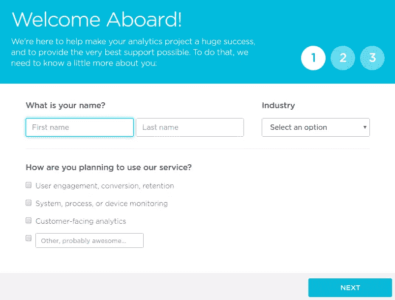

用适用于你的项目的值来回答问题，直到你完成。然后你会看到你的第一个 Keen.io 项目:

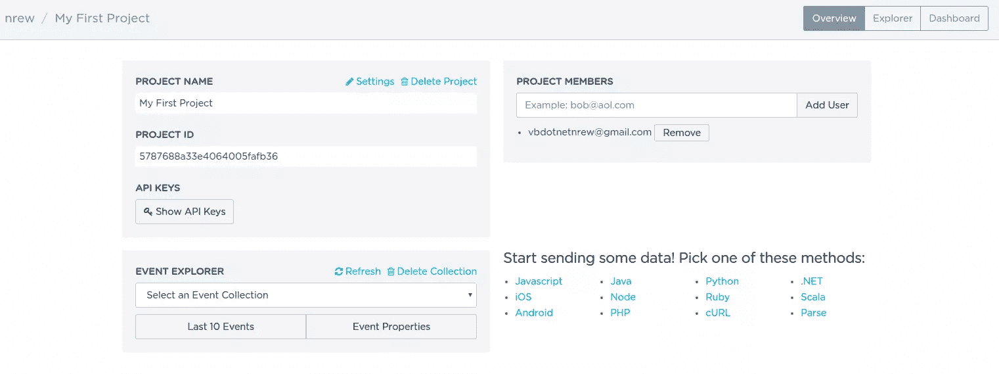

暂时先不做这个，打开一个新的浏览器标签，[注册一个 Segment.io 账户](https://segment.com/signup)。您将看到以下屏幕:

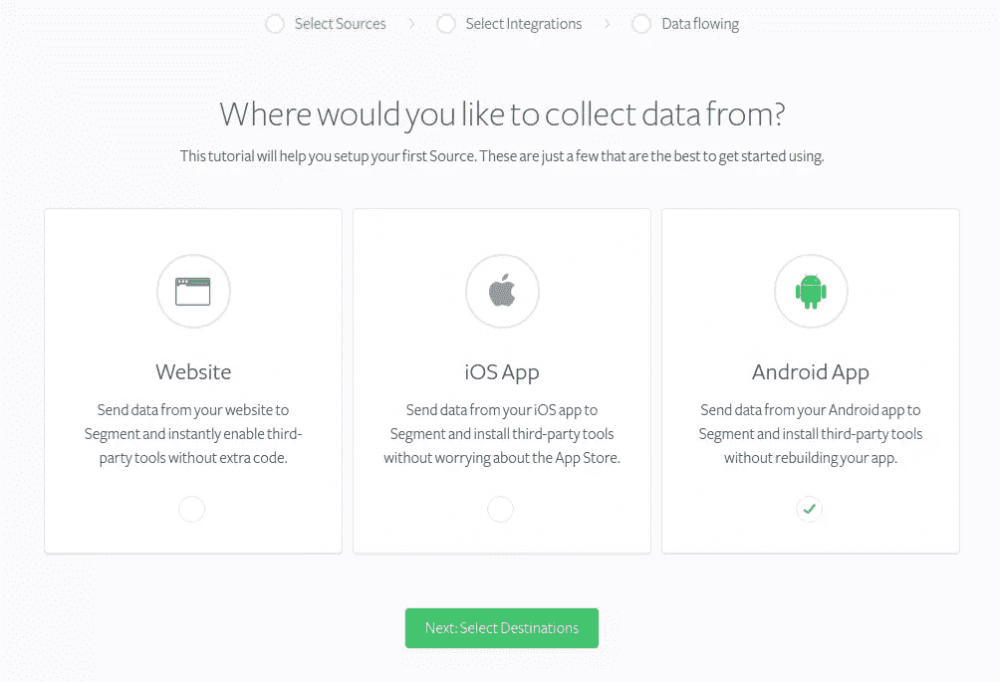

现在跳过这一步，因为您想用 segment 设置 Keen.io。在顶部导航栏上，点击*源*。您应该看到以下内容，因为您尚未添加任何源:

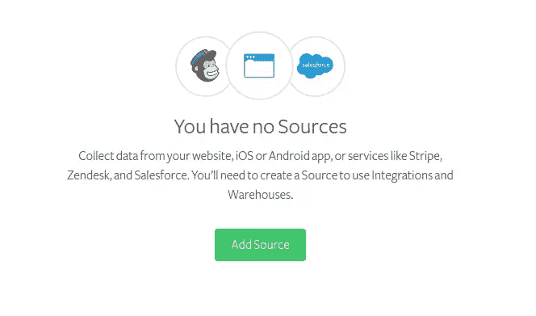

点击*添加信号源*，从列出的不同信号源中，点击*安卓*，然后*连接*。

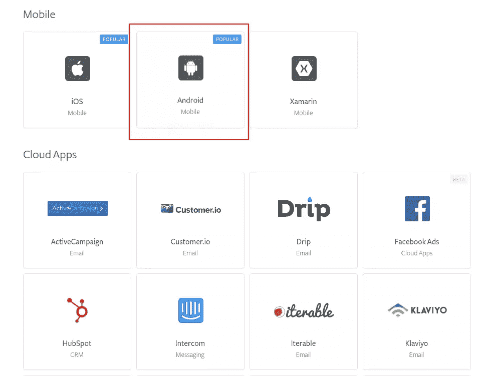

输入连接数据仓库时要使用的数据库的昵称和名称。如果您愿意，可以保留默认值。您不会使用数据仓库功能，因为数据将存储在 Keen.io 的服务器上:

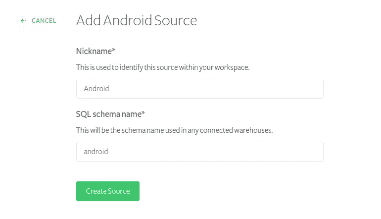

点击*添加信号源*完成信号源的添加。

当您访问源页面时，您会看到新的源现在已经列出。点击它，然后记下*写入键*。点击*集成*，你会看到一组可以与 Segment.io 集成的服务。点击 *KeenIO* ，在显示的窗口中，点击*设置*选项卡。您可以在这里输入 Keen.io 项目的项目 ID 和 write key。切换选项卡，从 Keen.io 网站复制项目 ID 和 write key。点击*显示 API 键*按钮可以看到写入键。


切换回 Segment.io 网站，粘贴已有的数据，点击*保存更改*。你现在应该可以点击*启用集成*按钮来启用 Keen.io

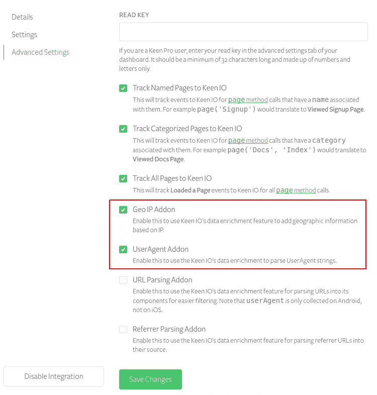

再次点击 Keen.io 启用几个高级设置，*地理 IP 插件*和*用户代理插件*。*地理 IP 插件*允许你根据用户的 IP 地址收集地理数据，而*用户代理插件*允许我们获得用户设备的详细信息。例如他们正在使用什么 Android 设备和操作系统版本。检查完毕后，点击*保存更改*。如果您对*读取键*有疑问，您可以在需要从 Keen.io 读取数据时使用它。您将要创建的示例应用程序不需要这样做，您将使用 Keen.io 的仪表板来处理通过应用程序获取的数据。

## 应用简介

对于本文，我创建了一个简单的图库应用程序，我将使用它来展示如何使用 React Native 实现分析。它有两个屏幕，收藏和查看收藏屏幕。以下是“收藏”屏幕的外观:

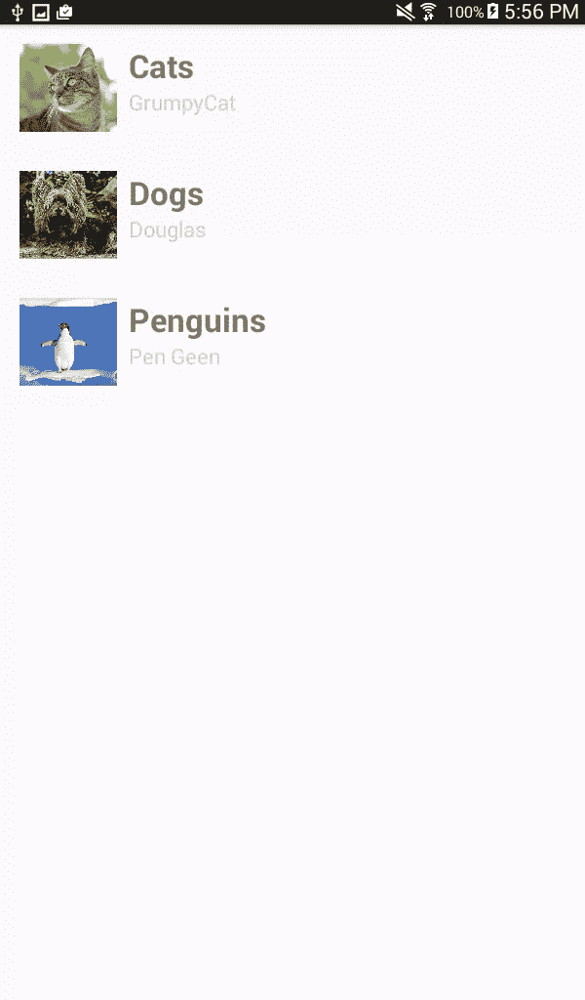

和“查看集合”页面:

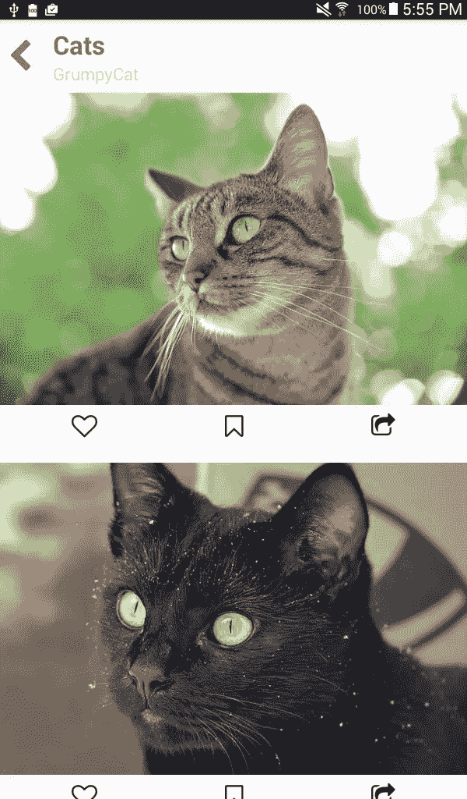

“收藏”页面显示假想用户添加的收藏列表。注意“想象”这个词，这个应用是一个简单的应用。这意味着它使用的所有数据都直接嵌入到代码中。也没有登录功能来识别使用该应用程序的每个用户。这意味着您需要使用设备中可用的唯一标识符来识别每个用户。

对于每张照片,“查看收藏”页面有三个按钮。根据图标，你可能已经猜出了每一个是做什么的，但是要清楚。从左到右分别是*收藏*、*书签*、*分享*。这三个按钮不会像它们的图标所说的那样。他们的目的纯粹是为了记录分析数据，因此所有用户都会看到一个确认操作已执行的警报。

## 设置应用程序

在撰写本文时，React Native 的版本为 0.29。如果你在以后读到这篇文章，并且你想确保演示成功，你可以克隆 [Github 库](https://github.com/sitepoint-editors/RN_KeenIO_Segment_Analytics)，用 Segment.io 中的 write 键更新 *config.js* ，然后运行应用程序。

如果你想自己尝试，你可以安装 [rninint](https://www.npmjs.com/package/rninit) ，用它初始化一个新的 React 原生项目(版本 0.29)，然后从 [Github repo](https://github.com/sitepoint-editors/RN_KeenIO_Segment_Analytics) 中复制以下文件和文件夹:

*   *index.android.js*
*   *config.js*
*   *data.js*
*   *页*
*   *package.json*

一旦完成，通过在你的终端上执行`npm install`来安装依赖项，用来自 Segment.io 的 write 密钥更新 *config.js* ，并更新 Android 源文件，以便安装的包可以工作。

### 链接包

如果你打开 *package.json* ，除了 React 和 React Native 之外，你还会看到下面的包:

*   [反应本机设备信息](https://github.com/rebeccahughes/react-native-device-info)
*   [React 原生分析](https://github.com/tonyxiao/react-native-analytics)
*   [反应原生矢量图标](https://github.com/oblador/react-native-vector-icons)

你必须将这些包链接到 Android 项目，这样它们才能工作。打开 *android/settings.gradle* 文件，添加以下内容:

```
include ':react-native-device-info'
project(':react-native-device-info').projectDir = new File(rootProject.projectDir, '../node_modules/react-native-device-info/android')

include ':react-native-analytics'
project(':react-native-analytics').projectDir = new File(rootProject.projectDir, '../node_modules/react-native-analytics/android')

include ':react-native-vector-icons'
project(':react-native-vector-icons').projectDir = new File(rootProject.projectDir, '../node_modules/react-native-vector-icons/android') 
```

该文件指出了不同第三方软件包的安装路径。可以查看 [settings.gradle](https://github.com/sitepoint-editors/RN_KeenIO_Segment_Analytics/blob/master/android/settings.gradle) 文件以供参考。

打开 *android/app/build.gradle* 文件，在`apply plugin: "com.android.application"`后添加以下内容:

```
project.ext.vectoricons = [
    iconFontNames: [ 'FontAwesome.ttf' ] // Name of the font files you want to copy
]
apply from: "../../node_modules/react-native-vector-icons/fonts.gradle" 
```

这将把你想要使用的字体文件与 React 本地矢量图标包链接起来。在这种情况下，它只使用了 [FontAwesome](http://fontawesome.io/) ，所以这是唯一添加到`iconFontNames`数组中的项目。

仍然在同一个文件中，查找`dependencies`对象，并确保它包含以下内容:

```
compile project(':react-native-device-info')
compile project(':react-native-analytics')
compile fileTree(dir: "libs", include: ["*.jar"])
compile "com.android.support:appcompat-v7:23.0.1"
compile "com.facebook.react:react-native:+"  // From node_modules
compile project(':react-native-vector-icons') 
```

这允许您在编译应用程序时添加所有的包。可以查看 [build.gradle](https://github.com/sitepoint-editors/RN_KeenIO_Segment_Analytics/blob/master/android/app/build.gradle) 文件以供参考。

打开*Android/app/src/main/Java/com/NAME-OF-YOUR-REACT-NATIVE-PROJECT/main application . Java*并在导入 Java List 实用程序后添加以下内容:

```
import com.oblador.vectoricons.VectorIconsPackage;
import com.smore.RNSegmentIOAnalytics.RNSegmentIOAnalyticsPackage;
import com.learnium.RNDeviceInfo.RNDeviceInfo; 
```

然后是主 React 包之后的以下内容:

```
new RNSegmentIOAnalyticsPackage(),
new VectorIconsPackage(),
new RNDeviceInfo() 
```

这将初始化 React 本地分析包、矢量图标包和设备信息包。

您可以查看[MainApplication.java](https://github.com/sitepoint-editors/RN_KeenIO_Segment_Analytics/blob/master/android/app/src/main/java/com/rnanalytics/MainApplication.java)文件以供参考。

## 解释代码

既然您已经知道了如何设置应用程序的工作演示，那么是时候浏览代码并查看如何收集数据了。

首先打开 *index.android.js* ，前几行导入你需要的包。您使用`DeviceInfo`来获取关于用户使用的设备的信息。比如唯一的设备 ID、制造商、型号、版本号和内部版本号。

```
import DeviceInfo from 'react-native-device-info';

import config from './config';

import Analytics from 'react-native-analytics'; 
```

您将专门使用唯一的设备 ID 来识别每个用户，因为该应用程序没有登录系统。如果你查看`componentWillMount`函数，你会看到来自`Analytics`包的两个方法调用，`setup`和`identify`。`setup`设置保存分析数据的项目。将 Segment.io write 键和 flush 设置作为参数传递给该函数。Flush 是设置何时发送事件。将其设置为`1`会在它们到来时发送，例如当用户创建帐户时。

如果您调用来记录这个特定的动作，相应的数据会自动发送到服务器。为了更快的测试，我在 *config.js* 中将这个设置为`1`。在生产中，您可能希望将此设置为`20`或更高，这样每个动作都会排队，并且只有在记录了特定数量的事件后才会发送到服务器。

```
componentWillMount() {
    Analytics.setup(config.segmentIOWriteKey, config.flushSetting);
    Analytics.identify(DeviceInfo.getUniqueID(), {
        device_manufacturer: DeviceInfo.getManufacturer(),
        device_model: DeviceInfo.getModel(),
        system_name: DeviceInfo.getSystemName(),
        system_version: DeviceInfo.getSystemVersion()
    });
} 
```

另一个函数是`identify`，用于识别每个用户，使用`DeviceInfo`包中的`getUniqueID`方法。除此之外，您还记录了正在使用的设备的信息，在第二个参数中作为对象传递。如果您想了解用户正在使用哪些设备访问应用程序，这很有用。

**注意**:由于应用程序使用设备 ID 来识别用户，这将无法识别特定用户正在使用的特定设备。即使实际上是同一个用户，他们也会被归类为新用户，因为他们使用的是不同的设备。

接下来看看 *pages/CollectionList.js* 。此页面显示收藏列表，在本例中是动物列表。您正在显示的数据来自于 [*data.js*](https://github.com/sitepoint-editors/RN_KeenIO_Segment_Analytics/blob/master/data.js) 文件。在组件挂载之前，调用`screen`方法。这记录了用户访问的页面或屏幕。这里您提供了一个硬编码的值，因为您只有一个版本的集合页面。

例如，如果您有一个列出更一般的动物分类“有机体”的屏幕，您可以从传递到路线中的数据中获得页面信息，而不是像下面这样的硬编码值。`screen`方法接受页面名称作为第一个参数，并接受一个可选对象，该对象包含您想要发送的任何附加数据。

```
componentWillMount() {
    //...
    Analytics.screen("Animals", {"description": "A list containing different animals"});
} 
```

当用户点击收藏页面中的任何项目时，他们可以看到添加到该项目的照片。这些照片通过 *pages/Item.js* 文件显示。如前所述，每张照片下面都有三个按钮，记录用户对特定照片执行的特定操作。让我们首先来看一下用于记录用户访问这个特定屏幕的代码。从集合页面中作为[道具传递的`item`对象中获取屏幕名称:](https://github.com/sitepoint-editors/RN_KeenIO_Segment_Analytics/blob/master/pages/CollectionList.js#L76)

```
componentWillMount() {
    //...
    Analytics.screen(this.props.item.title);
} 
```

接下来是每当用户点击收藏夹、书签或分享按钮时调用的功能。对于诸如此类的动作，使用`track`功能。它接受动作的名称和一个可选对象，该对象包含您想要传入的附加数据。在这种情况下，还会传递照片所属收藏集的名称、标题和照片的 URL。为了给动作命名，最好使用一个过去时态的动词和一个名词来命名(例如，**生成的报告**，**结帐的购物车**，**观看的视频**)。

```
_favorite(photo) {
    Analytics.track("Favorited Photo", {
        gallery: this.props.item.title,
        caption: photo.caption,
        url: photo.url
    });
    alert('favorited!');
}

_bookmark(photo) {
    Analytics.track("Bookmarked Photo", {
        gallery: this.props.item.title,
        caption: photo.caption,
        url: photo.url
    });
    alert('bookmarked!');
}

_share(photo) {
    Analytics.track("Shared Photo", {
        gallery: this.props.item.title,
        caption: photo.caption,
        url: photo.url
    });
    alert('shared!');
} 
```

## 检查分析数据

如果您还没有这样做，请在您的设备或模拟器上运行该应用程序，访问不同的页面并对每张照片执行操作。这样你就有数据可以处理了。

打开 Keen.io 网站，单击您之前创建的项目。

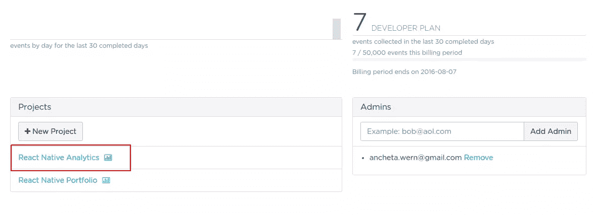

一旦进入该页面，点击*浏览器*选项卡，您将看到以下屏幕:

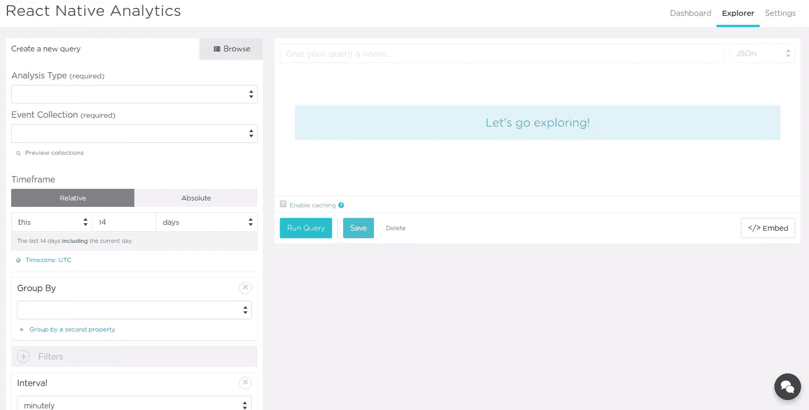

这是 Keen.io explorer，您可以在其中执行不同的查询来提取您想要的数据。例如，如果您想知道收藏照片的用户总数，选择*计数*作为分析类型，选择*收藏照片*作为事件集合，并点击*运行查询*按钮执行查询:


如果您想使用特定字段对计数进行分组，请在*分组依据*部分选择一个字段，然后运行您的查询。在下面的例子中，我选择了*图库*来按收藏对结果进行分组。

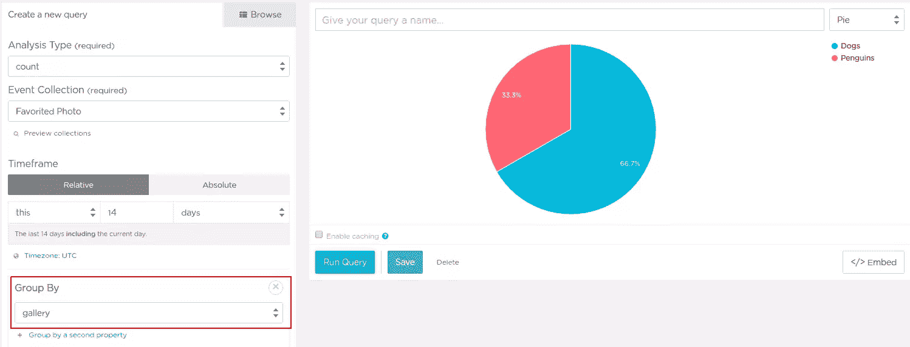

您还可以运行一个*提取查询*:

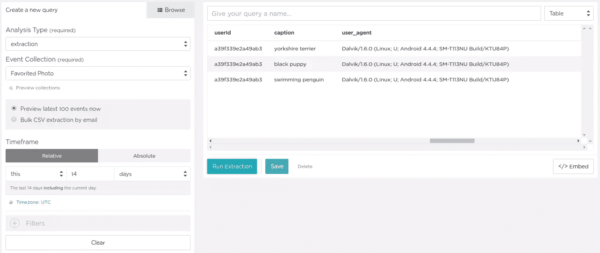

这相当于关系数据库系统上的`SELECT *`。如果您想将数据导出到 CSV 文件中，可以使用这个选项。

还有*选择唯一值*，它允许你选择特定字段的唯一值。以下示例选择了*收藏的照片*事件的所有唯一标题。


您可以使用筛选器来筛选使用特定字段的数据。要使用过滤器，首先点击*过滤器*部分并选择您想要过滤的字段。下面的例子选择了值为*猫*的*画廊*字段。


之后，选择*标题*字段作为分组字段。这使您可以看到有多少用户将卡特彼勒收藏中的每张照片加入了书签。

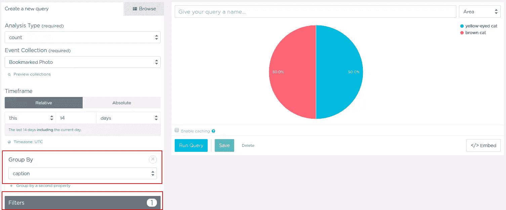

最后，您可以点击*预览集合*链接，查看从不同设备发送的原始数据:

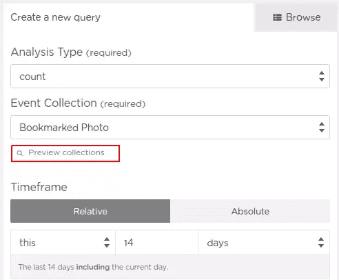

这是你得到的数据的一个例子:

```
[
  {
    "parsed_user_agent": {
      "device": {
        "family": "Samsung SM-T113NU"
      },
      "os": {
        "major": "4",
        "patch_minor": null,
        "minor": "4",
        "family": "Android",
        "patch": "4"
      },
      "browser": {
        "major": "4",
        "minor": "4",
        "family": "Android",
        "patch": "4"
      }
    },
    "keen": {
      "timestamp": "2016-07-15T06:00:18.986Z",
      "created_at": "2016-07-15T06:00:19.236Z",
      "id": "xxx"
    },
    "url": "https://pixabay.com/static/uploads/photo/2016/05/31/16/04/humboldt-penguin-1427228_640.jpg",
    "userId": "xxx",
    "caption": "swimming penguin",
    "user_agent": "Dalvik/1.6.0 (Linux; U; Android 4.4.4; SM-T113NU Build/KTU84P)",
    "ip_geo_info": {
      "province": null,
      "city": null,
      "postal_code": null,
      "continent": "Asia",
      "country": "Philippines"
    },
    "ip_address": "112.xxx.xx.xx",
    "gallery": "Penguins",
    "page_url": "https://pixabay.com/static/uploads/photo/2016/05/31/16/04/humboldt-penguin-1427228_640.jpg"
  }
] 
```

如您所见，它拥有您要求它存储的所有数据，以及更多数据，如设备信息、IP 地址、地理信息和用户数据，如`keen.id`和`userId`。`keen.id`是 Keen.io 为该特定事件生成的唯一 ID。`userId`是我们提供的唯一设备 ID。

## 分析这个

就是这样！在本文中，您将 Segment.io 和 Keen.io 视为在 React 原生应用中实现分析的一种方式。希望这篇文章已经为你提供了开始在你的应用中实现分析的知识。

您使用哪些服务在移动应用中实施分析？是否也涉及 Segment.io？还是使用完全自定义的堆栈？请在评论中告诉我。

## 分享这篇文章