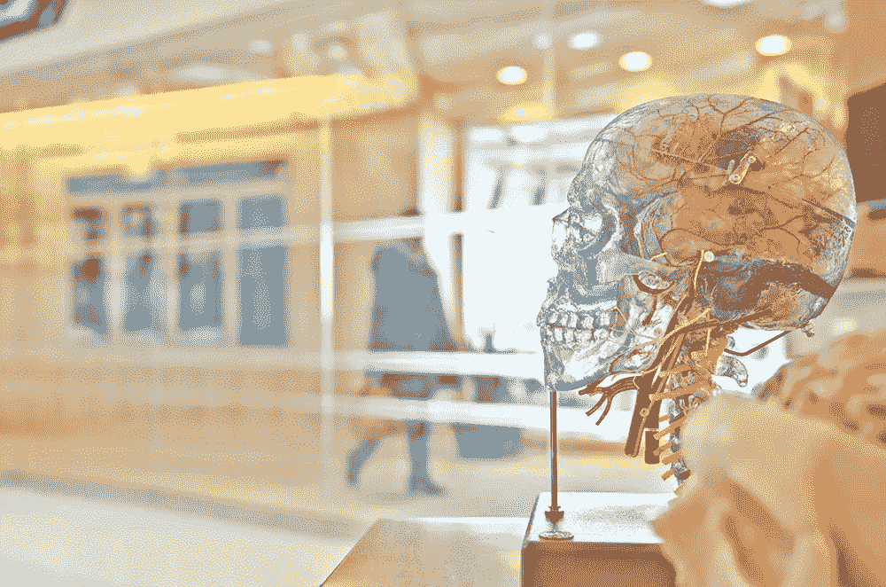

# 什么是远程医疗&你需要了解什么？

> 原文：<https://www.sitepoint.com/what-is-telemedicine-and-what-do-you-need-to-know-about-it/>

如果发生紧急医疗情况，你是愿意凌晨 3 点开车去最近的医院，在急诊室里不舒服地等待，只是为了在其他更紧急的紧急情况之间得到粗暴的对待，还是愿意在自己家里得到帮助？后者岂不是很好？

值得庆幸的是，随着远程医疗的发展，你不再需要一个家庭医生来让第二种情况成为现实。

如果你不知道我在说什么，那么你并不孤单。2016 年 3 月的一项调查发现，只有 [39%](http://www.prnewswire.com/news-releases/39-of-tech-savvy-consumers-have-not-heard-of-telemedicine-healthmine-survey-300241737.html) 的精通技术的消费者听说过远程医疗，或使用技术消除医疗保健访问的距离障碍。根据 [Technavio](http://www.technavio.com/?utm_source=T3&utm_medium=BW&utm_campaign=Media) 最近的一份报告，这种情况有望迅速改变，该报告预测，到 2019 年，全球远程医疗市场的收入将达到近[481 亿美元](http://www.businesswire.com/news/home/20160325005031/en/Growing-Demand-Remote-Monitoring-Significantly-Augment-Demand)。未来四年的增长率为 14.3%。那么，在这个快速增长但仍不为人所知的行业，到底发生了什么呢？

## 远程医疗如何惠及消费者

很长一段时间以来，健康一直是科技领域最热门的话题之一。多年来，我们看到像卡路里计数器、Map My Run 和 MyFitnessPal 这样的应用程序在 app store 中名列最受欢迎的下载，即使数百万其他应用程序已经挤满了市场。健康也是可穿戴技术产业的前沿，Fitbit 和 Under Armor 等公司承诺帮助消费者利用可穿戴健康技术优化锻炼体验。此外，自从 iOS9 更新以来，苹果已经有了自己的健康应用程序——恰如其分地命名为 Health——用户可以不用动一根手指就可以跟踪他们所有的健康和健身数据。苹果现在甚至推出了 Apple Health Kit，这样开发者就可以在一个地方让你所有的健康应用程序无缝协作。

远程医疗将所有这些发展向前推进了一步，现在用户不仅可以通过智能手机监控自己的健康状况，还可以通过智能手机获得专业的医疗见解。远程医疗背后的概念并不新鲜:40 年前，病人和医生开始通过电话通信，这样偏远地区的病人就可以快速获得帮助，但现在是远程医疗赶上当今技术的时候了。

如今，技术创新正在将远程医患互动的可及性和质量推向新的高度。借助可靠的宽带、Wi-Fi 和视频协作技术，患者能够全天候访问实时虚拟体检。Aeris 最近进行的一项调查发现，绝大多数医疗保健专业人士(84%的受访者)认为，技术创新最终已经发展到足以产生远程医疗设备，为通过虚拟方式接受治疗指导的患者和亲自接受治疗的患者提供类似的结果。

事实证明，远程医疗对医疗保健的各个方面都有好处。从病人到医生到保险公司，每个人都是赢家。医生可以将他们的精力严格集中在需要亲自检查的病人身上，而不需要亲自检查的病人可以在任何时间、任何地点找到他们需要知道的一切。远程医疗还削减了医疗保健网络、医院和支付病人住院费用的保险公司的管理费用。

远程患者监护需求的增加、偏远和农村地区医疗保健专业人员的短缺以及移动医疗的日益普及都是远程医疗强劲增长的驱动力。随着高质量远程办公技术的进步，Technavio 研究人员预测，到 2019 年，将有超过 300 万人受益于远程监控。

## 实践中的远程医疗

远程医疗正在使整个医疗保健体验更加高效、更具成本效益，并且即使在世界上最偏远的农村社区，患者也可以获得。对你来说，远程医疗的进步可能意味着年度体检不再那么痛苦了。但是对于一些病人来说，特别是需要每周或每两周治疗一次的老年门诊病人，或者独自生活在远离诊所的农村地区的 T2 病人，远程医疗有可能改变他们的生活。

以来自 [Disrupt London 2015 黑客马拉松](http://techcrunch.com/2015/12/06/disrupt-london-2015-hackathon-winners/)的一组开发人员为例，他们展示了远程医疗对于发展中国家寻求医疗援助的人们来说是多么具有变革性。他们的应用程序 [MedicSMS](http://techcrunch.com/2015/12/06/medicsms-helps-diagnose-medical-emergencies-via-sms-in-developing-countries/) 是黑客马拉松的第二名，它让任何一个拥有普通手机的人都可以发送他们的症状，然后从应用程序接收可能的诊断。然后，MedicSMS 会推荐一个行动方案，并询问位置信息，以便帮助跟踪疾病的传播。随着远程医疗的预计增长，像这样的应用程序可能会成为现实，而不是科幻小说。

谈到远程医疗的进一步创新，智能手机应用只是冰山一角。事实上，对于企业家来说，可穿戴技术甚至比一个简单的应用程序更有令人兴奋的潜力。智能手机只能读取一个人的健康信息，而可穿戴健康技术最有可能填补这些空白，并为医生提供关键信息，无论是血压、血糖水平还是体温。虽然许多可穿戴应用程序都是在考虑医疗保健的情况下开发的，但 [VirtuMedix](http://www.healthcareitnews.com/news/telemedicine-vendor-aims-integrate-connected-devices-wearables) 是少数几个通过集成可穿戴设备而更进一步的远程医疗平台之一，这意味着这些可穿戴设备可以在患者与他们通话时直接向医生发送信息，并且还有更多公司可以这样做。

此外，[远程医疗站](http://www.duluthnewstribune.com/news/health/4071757-your-doctor-will-see-you-telemedicine-kiosk)，本质上是具有不同医疗工具和通信设置的站，用于使患者与医生联系，在远程医疗领域越来越受欢迎。乍一看，与智能手机提供的速度和便利相比，这似乎是一种过时的方法，特别是考虑到安装信息亭需要 15，000 至 16，000 美元，但关键在于它们的位置。远程医疗亭不是个人的，而是共享的。想象一下，在一个商业办公室里，每个员工都可以获得远程医疗的好处，并且在他们有问题的任何时候都可以在信息亭前停下来。

## 挑战

唯一阻碍企业建立这种医疗保健体系的是缺乏标准化的服务亭、高效的交付和安装系统，以及保险问题。前两个问题已经成熟，可以由致力于 kiosk 技术的单一企业来解决，然而远程医疗中的保险问题(医疗保险不包括的问题)可能需要法律的改变或愿意接受挑战的保险公司。如果这些问题得到解决，远程医疗亭和集成远程医疗的可穿戴设备等发展可能会改变整个医疗保健行业。

远程医疗背后的想法很简单:帮助人们获得更好、更快的医疗保健。然而，这一结果有可能颠覆医疗保健行业，改善全球无数人的生活。虽然仍有一些问题需要解决，从建立信任到确保健康等敏感话题的安全，远程医疗是最令人兴奋的技术发展之一，并且肯定会给全球医疗保健带来所需的变革，以更好地服务于不断增长的人口。

## 分享这篇文章