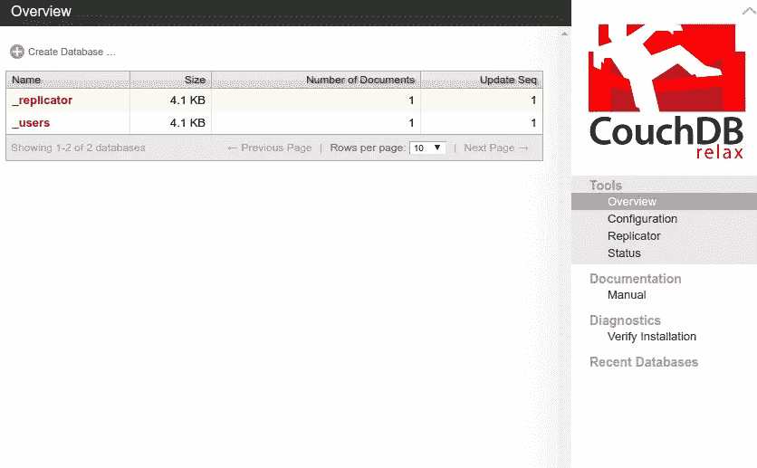
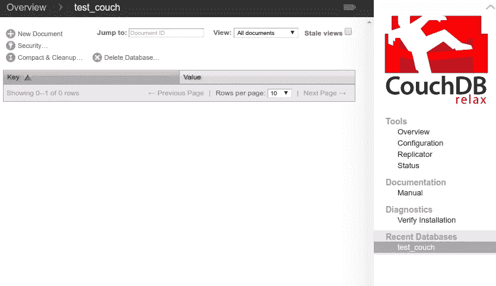
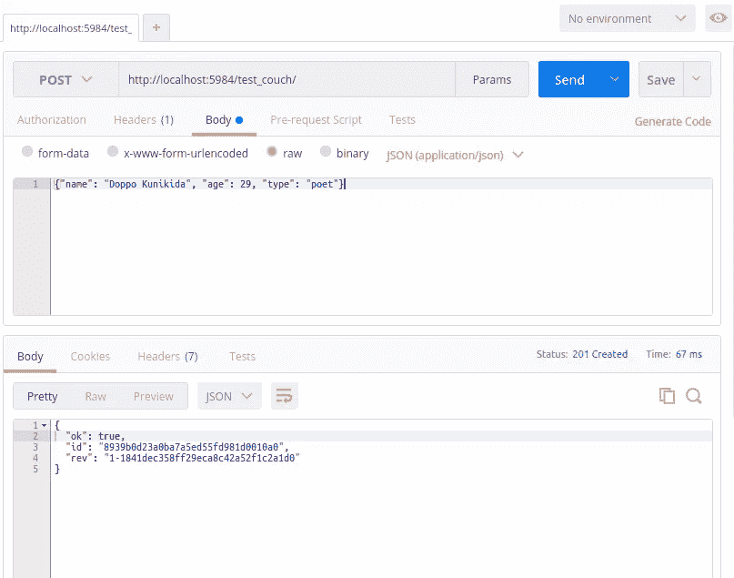
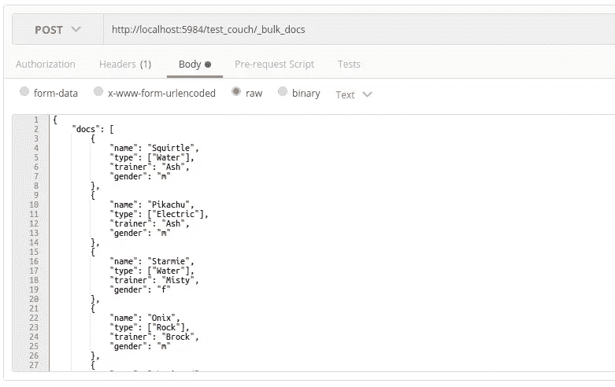
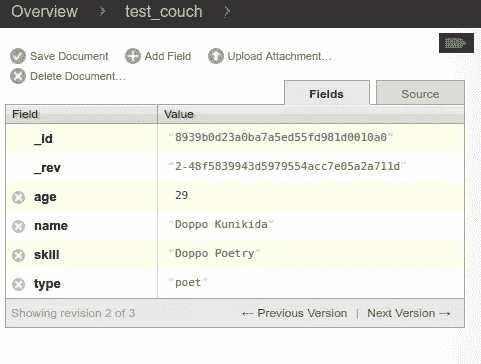
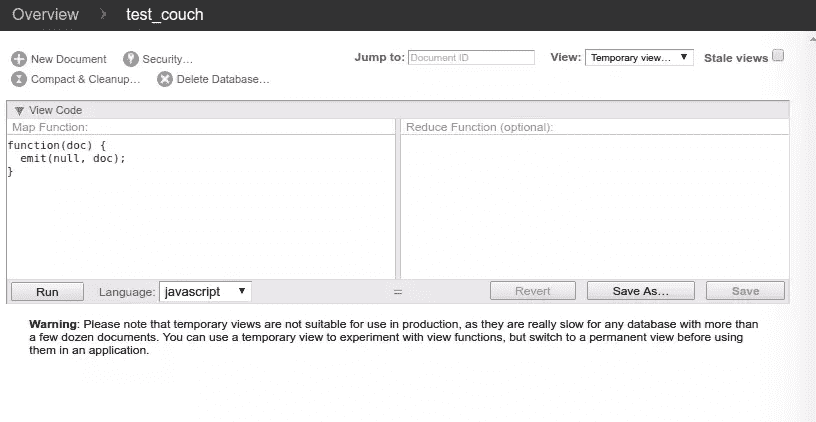
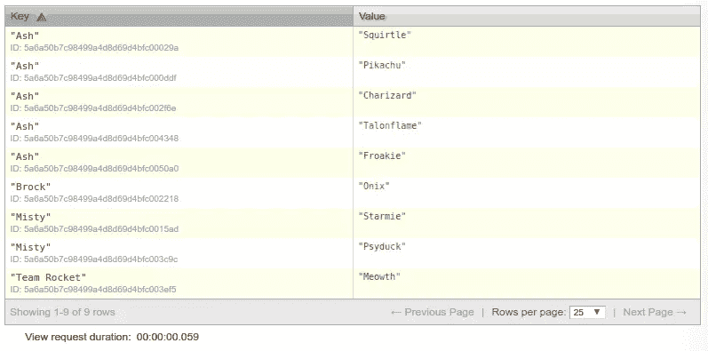
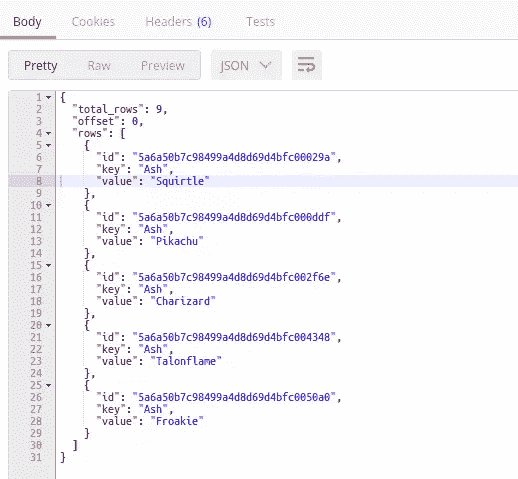
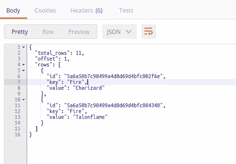

# CouchDB 上的口袋妖怪速成班

> 原文：<https://www.sitepoint.com/a-pokemon-crash-course-on-couchdb/>

在本教程中，我们将介绍如何使用来自 Apache 的 NoSQL 数据库 [CouchDB](http://couchdb.apache.org/) 。本教程将更侧重于实用方面，所以我们不会涉及 CouchDB 有什么好处，如何安装，[为什么使用它](http://guide.couchdb.org/draft/why.html)等。我们将关注如何通过 CouchDB 的 HTTP API 执行数据库操作，以及如何在 PHP 中使用它，为将来更复杂的帖子打下基础。

我们假设您已经在您的机器上[设置了 CouchDB 和 Futon (CouchDB 的基于 web 的管理控制台)。如果你想跟随我们，我们推荐你使用我们的](https://wiki.apache.org/couchdb/Installation) [HI box](https://www.sitepoint.com/quick-tip-get-homestead-vagrant-vm-running/) 。


*注意:为了简单起见，我们在这里用`localhost`来指代我们的本地机器，但是如果你正在使用一个完全配置的 VM，你可能已经设置了一个定制的 vhost 和本地域，以及转发端口。随着 [Homestead 的改进](https://www.sitepoint.com/quick-tip-get-homestead-vagrant-vm-running/),只需在配置虚拟机箱之前，在`Homestead.yaml`配置文件中列出您想要转发的端口。*

## 创建数据库

要创建新的 CouchDB 数据库，请访问位于`http://localhost:5984/_utils/`的 Futon。您将看到以下界面:



点击**创建数据库**，输入数据库名称，点击**创建**创建数据库。

创建完成后，您将看到以下屏幕:



注意，只有一个创建新文档的选项。在 CouchDB 中，文档相当于关系数据库中的一个表行。那么，我们如何创建表格呢？

如果您来自 MongoDB 之类的 NoSQL 数据库，您首先需要知道的是，CouchDB 中没有集合或表这样的东西。只有文件。然而，这并不意味着每个数据库只能存储一种类型的数据。因为在 CouchDB 中创建的每个文档都不属于任何表，所以每种类型的数据都可以有不同的结构。例如，如果要存储用户数据，可以使用类似于以下的结构:

```
{
    "id": 123,
    "fname": "doppo",
    "lname": "kunikida",
    "pw": "secret",
    "hobbies": ["reading", "sleeping"]
} 
```

另一方面，如果您想要存储博客文章信息，您可以使用以下结构:

```
{
    "title": "The big brown fox",
    "author": "fox",
    "text": "Lorem ipsum dolor sit amet, consectetur adipisicing elit. Earum, quasi in id voluptates. Natus qui iure corporis ea voluptatem eius, possimus optio modi facere blanditiis quo, sequi suscipit eos nostrum.",
    "publish_date": "2016-07-07"
} 
```

为了便于查询特定类型的文档(如用户、博客文章)，您可以添加一个字段来存储文档类型:

```
{
    "id": "123",
    "fname": "doppo",
    "lname": "kunikida",
    "pw": "secret",
    "hobbies": ["reading", "sleeping"],
    "type": "users"
} 
```

注意`type`不是一个特殊类型的字段。这只是为了方便使用。

## 与 HTTP API 对话

由于 CouchDB 公开了一个 HTTP API，我们也可以使用`curl`来创建一个数据库:

```
curl -X PUT http://localhost:5984/<database name> 
```

执行上述命令应该会返回以下内容:

```
{"ok":true} 
```

CouchDB 返回 JSON 字符串作为响应。这使得它在浏览器和服务器端都很容易使用。

我们推荐 [Postman](https://www.getpostman.com/) 在本教程中进行实验，因为它允许与 CouchDB 的 HTTP API 轻松通信。如果你是 Postman 的新手，这篇介绍可能会有帮助:[用 Postman](https://www.sitepoint.com/api-building-and-testing-made-easier-with-postman/) 使 API 构建和测试变得更容易。

## 创建新文档

要创建新文档，我们需要向我们创建的数据库发送一个`POST`请求:

```
http://localhost:5984/test_couch 
```

向 CouchDB 发送请求时，应该始终记住以下几点:

*   通过`POST`、`PUT`或`DELETE`传入一些数据时，在头中指定`application/json`的`Content-Type`。
*   用双引号将字符串括起来。

下面是一个创建新文档的请求示例:



## 批量插入

要在单个请求中插入多行数据:



我们还将在以后检索文档时使用这些数据。如果您想跟进，这里有要插入的数据: [couchdb-bulk.json](https://gist.github.com/anchetaWern/294a2ad374b59eee7eae491a25330e5e)

## 检索文档

让我们尝试检索当前存储在数据库中的所有文档:


默认情况下，CouchDB 只返回惟一 ID、一个键(与惟一 ID 相同)和一个值，缺省情况下，该值是一个包含最新修订号的对象(表示文档特定版本的惟一字符串)。稍后我们将更多地讨论修改。

为了检索我们之前保存的数据，我们必须将`include_docs`指定为查询参数，并将其设置为`true`:

```
http://localhost:5984/test_couch/_all_docs?include_docs=true 
```

### 检索特定文档

在 CouchDB 中，您可以通过使用文档 ID 来检索特定的文档:

```
http://localhost:5984/test_couch/8939b0d23a0ba7a5ed55fd981d0010a0?include_docs=true 
```

您还可以通过查询参数`rev`指定修订号来检索文档的特定版本:

```
http://localhost:5984/test_couch/8939b0d23a0ba7a5ed55fd981d0010a0?rev=1-1841dec358ff29eca8c42a52f1c2a1d0&include_docs=true 
```

每次创建新文档或更新现有文档时，CouchDB 都会生成一个惟一的修订号。然后将它分配给文档的那个状态。例如，如果您添加一个名为`skill`的新字段，然后保存文档，CouchDB 仍然会在添加`skill`字段之前保存文档的副本。每次您对文档进行更改(例如，更新特定字段的值、删除字段、重命名字段、添加新字段)时，它都会执行此操作。如果需要保存历史数据，这真的很有用。

如果您在 Futon 中访问特定文档，您还可以浏览其以前的版本:



### 视图

视图允许我们从数据库中提取特定的数据，并以特定的方式对它们进行排序。

要创建一个视图，在 Futon 上访问您的数据库，并在右上角的下拉菜单中选择**临时视图**。这将向您显示以下界面:



在本教程的剩余部分，我们将使用之前插入的[数据](https://gist.github.com/anchetaWern/294a2ad374b59eee7eae491a25330e5e)。

首先，我们来看一个他们的训练师过滤口袋妖怪的函数:

```
function(doc) {
  emit(doc.trainer, doc.name);
} 
```

添加此功能作为**地图功能**的值。这个函数使用内置的`emit`方法，该方法接受两个参数:键和值。键是用于过滤文档的键，而值是我们希望为每行返回的值。

这是我们执行函数时得到的响应:



如您所见，它返回所有内容。这是因为我们还没有真正指定任何值用作过滤器。为了实际查看这个功能，我们需要通过点击**另存为**按钮来保存视图。


这将要求我们输入设计文档的名称和视图的名称。您可以将设计文档视为相关视图的集合。我们将把它命名为**口袋妖怪**，因为我们正在处理的文档主要处理口袋妖怪数据。至于视图，我们将根据它所做的事情来命名:`filter_by_trainer`。

现在，让我们向刚刚创建的视图发出请求:

```
http://localhost:5984/test_couch/_design/pokemon/_view/filter_by_trainer?key="Ash" 
```

这将返回以下结果:



您作为查询参数`key`的值传入的内容将用于过滤结果。

### 按数组字段过滤

如果我们需要通过一个数组字段进行过滤，比如`type`字段，该怎么办？
为此，我们需要遍历所有数组项，并从循环内部发出文档，如下所示:

```
function(doc) {
  for(var x = 0; x < doc.type.length; x++){
     emit(doc.type[x], doc.name); 
  }
} 
```

将此视图另存为`filter_by_type`，然后向以下 URL 发送`GET`请求:

```
http://localhost:5984/test_couch/_design/pokemon/_view/filter_by_type?key="Fire" 
```

这将返回所有以“火”作为其类型之一的口袋妖怪:



### 排序和限制结果

要对结果进行排序，您所要做的就是发出您想要排序的字段。在这种情况下，我们将发出`owned`字段作为键，这样我们就可以根据口袋妖怪被拥有或捕获的日期进行排序。

```
function(doc){
   emit(doc.owned, doc.name);  
} 
```

将此视图另存为`order_by_owned`，然后向以下 URL 发送请求:

```
http://localhost:5984/test_couch/_design/pokemon/_view/sort_by_owned 
```

默认情况下，CouchDB 按升序返回文档，所以拥有时间最长的 Pokemon 排在最前面。要按降序对文档进行排序，请指定`descending=true`作为查询参数:

```
http://localhost:5984/test_couch/_design/pokemon/_view/sort_by_owned?descending=true 
```

要限制返回的文档数量，请将`limit`设置为等于要返回的文档数量:

```
http://localhost:5984/test_couch/_design/pokemon/_view/sort_by_owned?limit=5 
```

### 分组结果

如果要返回每个唯一训练者拥有的口袋妖怪数量，我们需要使用 reduce 函数。reduce 函数允许我们对 map 函数返回的结果执行分组和聚合操作。CouchDB 自带三个内置的 reduce 函数:`_count`、`_sum`和`_stats`。本节我们只看`_count`函数。

我们可以使用`_count`函数得到每个训练者拥有的口袋妖怪数量。首先添加以下映射函数:

```
function(doc) {
   emit(doc.trainer, doc.name); 
} 
```

对于减少功能，输入`_count`。然后用名称`group_by_trainer`保存视图。

向以下 URL 发出请求:

```
http://localhost:5984/test_couch/_design/pokemon/_view/group_by_trainer?group=true 
```

设置`group=true`很重要，因为默认情况下，我们将从 reduce 函数获得以下结果:

```
{
  "rows": [
    {
      "key": null,
      "value": 9
    }
  ]
} 
```

上面的结果只显示了当前数据库中的文档总数。这意味着 reduce 函数将 map 函数返回的整个结果集视为一个组。

设置`group=true`告诉 CouchDB 按照指定的键(`doc.trainer`)对文档进行分组，然后返回以下结果:

```
{
  "rows": [
    {
      "key": "Ash",
      "value": 5
    },
    {
      "key": "Brock",
      "value": 1
    },
    {
      "key": "Misty",
      "value": 2
    },
    {
      "key": "Team Rocket",
      "value": 1
    }
  ]
} 
```

## 更新文档

为了更新文档，我们向用于检索特定文档的同一个 URL 发送一个`PUT`请求，并传递最新的修订号和更新的数据:


根据上面的截图，您可以看到 CouchDB 不支持特定字段的更新:您必须获取现有数据，进行更新，然后将更新后的数据发送回数据库。

## 删除文档

要删除文档，请对以下 URL 执行`DELETE`请求:

```
http://localhost:5984/test_couch/<Document ID>?rev=<Revision ID> 
```

它与用于检索文档的 URL 具有相同的格式，并且因为我们传入了修订 ID，这意味着我们也可以删除文档的特定修订(有人有撤销功能吗？).

## 使用 PHP

在 PHP 中使用 CouchDB 有两种方法。第一种是通过 [Guzzle](http://docs.guzzlephp.org/en/latest/index.html) ，另一种是通过专门为使用 CouchDB 而创建的库，比如来自 Doctrine 的 [CouchDB 客户端](https://github.com/doctrine/couchdb-client)。在这一节中，我们将看看如何使用这些库。

### 狂饮

当检索数据时，我们必须使用一个`GET`请求，然后传入一个`query`来指定选项。

```
<?php
require 'vendor/autoload.php';

use GuzzleHttp\Client;

$client = new GuzzleHttp\Client(['base_uri' => 'http://localhost:5984']);

$response = $client->request('GET', '/test_couch/_all_docs', [
    'query' => [
        'include_docs' => 'true'
    ]
]);

$json = $response->getBody()->getContents();
$data = json_decode($json, true); 
```

接下来，让我们进行批量插入:

```
$docs = [
    'docs' => [
        [
            "name" => "Tangela",
            "type" => ["Grass"],
            "trainer" => "Erika",
            "gender" => "f",
            "owned" => "1999-07-27"
        ],
        [
            "name" => "Wobbuffet",
            "type" => ["Psychic"],
            "trainer" => "Elesa",
            "gender" => "m",
            "owned" => "2014-09-09"
        ],
        [
            "name" => "Gogoat",
            "type" => ["Grass"],
            "trainer" => "Ramos",
            "gender" => "m",
            "owned" => "2015-10-17"
        ]
    ]
];

$client->request('POST', '/test_couch/_bulk_docs', [
    'headers' => [
        'Content-Type' => 'application/json'
    ],
    'body' => json_encode($docs)
]); 
```

从上面的代码中，您可以看到同样的规则仍然适用。

要更新一个文档，使用一个`PUT`请求，将文档的 ID 作为路径传递到数据库名称之后。然后将修改后的文档传入`body`:

```
$doc = [
    '_rev' => '2-ff235602e45c46aed0f8834c32817546',
    'name' => 'Blastoise',
    'type' => ['Water'],
    'gender' => 'm',
    'trainer' => 'Ash',
    'owned' => '1999-05-21'
];

$client->request('PUT', '/test_couch/5a6a50b7c98499a4d8d69d4bfc00029a', [
    'headers' => [
        'Content-Type' => 'application/json'
    ],
    'body' => json_encode($doc)
]); 
```

要删除一个文档，使用一个`DELETE`请求，在数据库名称后传入文档 ID 作为路径，然后在`query`中传入最新的修订号:

```
$client->request('DELETE', '/test_couch/7c7f800ee10a39f512a456339e0019f3', [
    'query' => [
        'rev' => '1-967a00dff5e02add41819138abb3284d'
    ]
]); 
```

### 教条 CouchDB 客户端

接下来，让我们看看如何使用 CouchDB 客户端使用 CouchDB 数据库。

首先，我们必须创建一个新的`CouchDBClient`实例，并传入一个包含我们想要使用的数据库名称的数组。

```
<?php
require 'vendor/autoload.php';

$client = \Doctrine\CouchDB\CouchDBClient::create(['dbname' => 'test_couch']); 
```

然后，我们传入希望创建为数组的文档。在后台，这将被转换成一个被 CouchDB 接受的 JSON 字符串。

```
$client->postDocument([
    "name" => "Lucario",
    "type" => ["Fighting", "Steel"],
    "trainer" => "Korrina",
    "gender" => "f",
    "owned" => "2015-02-13"
]); 
```

为了使用特定的视图检索文档，我们将设计文档的名称和视图的名称作为参数传递给`createViewQuery`函数。然后，我们可以使用`setKey`方法设置密钥。为了得到响应，我们调用了`execute`方法。

```
$query = $client->createViewQuery('pokemon', 'filter_by_trainer');
$query->setKey('Ash');
$result = $query->execute();
echo "Pokemon trained by Ash: <br>";
foreach($result as $row){
    echo $row['value'] . "<br>";
} 
```

这将产生以下结果:

```
Pokemon trained by Ash: 
Blastoise
Pikachu
Charizard
Talonflame
Froakie 
```

如果您已经向视图添加了一个 reduce 函数，那么您必须调用`setGroup`方法并将其设置为`true`，这样 reduce 函数就不会将整个结果集视为一个组。将`setGroup`设置为`true`意味着每个唯一键(`trainer`字段)被认为是一个组。

```
$query = $client->createViewQuery('pokemon', 'group_by_trainer');
$query->setReduce('true');
$query->setGroup('true');
$result = $query->execute();
foreach($result as $row){
    echo $row['key'] . "<br>";
    echo "Pokemon count: " . $row['value'] . "<br>";
    echo "<br>";
} 
```

这将为我们提供以下结果:

```
Ash
Pokemon count: 5

Brock
Pokemon count: 1

Elesa
Pokemon count: 1

Erika
Pokemon count: 1

Korrina
Pokemon count: 1

Misty
Pokemon count: 3

Ramos
Pokemon count: 1

Team Rocket
Pokemon count: 1 
```

要更新文档，首先我们必须找到它的最新版本。这是因为 CouchDB 客户端不提供让我们只传递想要更新的字段的功能。CouchDB 是一个只附加的数据库，所以我们总是需要获得文档的当前版本，更新或添加我们想要的字段，然后进行实际的更新。

```
$doc_id = '5a6a50b7c98499a4d8d69d4bfc003c9c';
$doc = $client->findDocument($doc_id);

$updated_doc = $doc->body;
$updated_doc['name'] = 'Golduck';
$updated_doc['owned'] = '1999-07-29';

$client->putDocument($updated_doc, $doc->body['_id'], $doc->body['_rev']); 
```

就像更新文档一样，我们需要向数据库发出一个`GET`请求，这样我们就可以获得最新的修订号。然后，我们调用`deleteDocument`函数并传入文档 ID 和最新的修订号作为它的参数。

```
$doc_id = '7c7f800ee10a39f512a456339e0027fe';
$doc = $client->findDocument($doc_id);
$client->deleteDocument($doc_id, $doc->body['_rev']); 
```

## 结论

CouchDB 是一个非常用户友好且易于使用的文档数据库，强调性能和版本控制。

现在，您已经学会了如何使用它，并通过使用 Postman 和两个 PHP 客户机来执行不同的数据库操作。如果你想了解更多，我建议你查看权威指南，它包含了你需要了解的关于 CouchDB 的一切。在以后的文章中，我们将会更深入，并使用我们目前所看到的一切来构建一个合适的多平台应用程序。

在那之前，一定要像他们的口号所说的那样——放松！

## 分享这篇文章