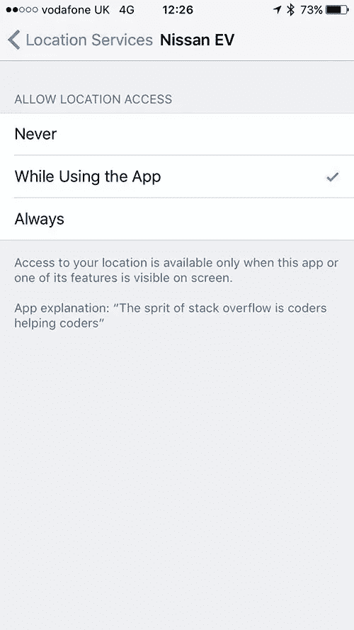

# 让开发人员被解雇的 8 个常见错误

> 原文：<https://www.sitepoint.com/8-common-mistakes-that-get-developers-fired/>

他在工作，他在看毛片。

一名技术员工，我称他为艾伦，在工作时看动漫色情片。他不满足于简单地观看，他决定是时候开始打印他的色情作品了——至少是在彩色激光打印机上。

他把它打印在透明胶片上，而事实证明，透明胶片与激光打印机不兼容。

它们在打印机里融化了。

艾伦刚刚弄坏了一台非常昂贵的新打印机。更糟糕的是，他把打印机拆开，错误地试图自己修理。他取消了保修。

在他被明确告知不要之后。

## 很自然，他因为自己的错误被解雇了

但不是因为我刚才提到的任何一个错误。他肯定把事情搞得一团糟；他吓坏了他的同事，毁坏了公司财产，让他的雇主损失了很多钱。

他被解雇了，因为他向 T2 撒谎了。

不要误解我的意思:你绝对会因为犯这些错误而被解雇。当它发生时，大多数人不会质疑它。你不能指望做我们的朋友“艾伦”在这里做的事，还指望保住你的工作。

但事情就是这样。艾伦有。

如果你因为犯了这些错误而被解雇，这通常是为了其他事情的烟幕。那个*别的东西*是导致我们犯第一个错误的问题。

## 错误 1:使用糟糕的判断

达斯汀·柯蒂斯[写了一篇关于美国航空公司网站的博文](https://www.techdirt.com/articles/20091106/0337536829.shtml)，抱怨糟糕的用户界面设计。

达斯汀最不期待的就是回应。

但这就是他得到的。他收到了一封来自美国航空公司设计师的邮件。前端设计师*承认*有一些问题需要解决。

他解释了为什么在大公司创造好的设计是一个棘手的考验。

很神奇，对吧？

**错了。**又一个判断失误的案例。事实证明，美国航空公司不希望他们的设计师对顾客开放。

他们解雇了他们的设计师。

设计师的意图是高尚的，可敬的，令人钦佩的。假设美国航空公司有过错。他有资格授权或提供赔偿吗？他真的能确定故障吗？

他需要问更多的问题:这是由于用户的错误吗？浏览器错误？这里有软件冲突吗？

*   这是否让美国航空公司面临诉讼？
*   这会影响任何正在进行的法律纠纷吗？
*   是什么导致了这些问题？
*   这是认罪吗？

这位设计师在掌握所有事实之前做了一个评估。

使用“糟糕的判断”并不是简单地做出糟糕的决定。把你工作的公司当成你的公司是失败的。而你的同事是你的人*。*

当开发人员以这种方式进行工作时，他们的决策就会改变。这不仅仅是一个错误的决定。这个决定会影响他们同事养活和照顾家人的能力。

糟糕的判断有多种形式。

*   将公司机密拼写给错误的人
*   滥用公司财产
*   羞辱你的同事或老板
*   超越你的界限

这位设计师本可以问达斯汀更多关于他的经历的问题。他可能会同情达斯汀。相反，他越界了。

## 错误 2:使用不诚实和诡计

你可能听过这个故事。一名日产应用程序开发人员被发现从 Stack Overflow 复制代码。逐字堆栈溢出出现在最近的更新中。

呀。

大多数开发人员都是诚实、勤奋的人。我们非常努力地工作以产生伟大的代码。但是我们的行业有一个肮脏的秘密。

我们从互联网上复制并粘贴代码。

我们都做过。

我们有一个最后期限要满足，我们真的很紧张。我们需要一种快速简单的方法来完成工作。因此，在花了几个小时研究 Stack Overflow 或 CodePen 之后，我们找到了我们要找的东西。快速复制粘贴，我们就上路了。

没人知道，对吧？

事实上，不。作为一个网络专业人士，你知道隐私是死的。我们的行业竞争异常激烈。记者、博主，甚至你的同事都在寻找一个故事，一个获得成功的方法。

这个角度可能是你犯的一个错误，一时的判断失误。一个无辜的，但不诚实的错误可能是…

*   复制粘贴或窃取代码(抄袭)
*   关于人、工作或协议的善意谎言
*   访问或共享您无权访问的材料。
*   以误导的方式将公司资源用于自己的目的。

或者其他完全不同的东西。错误也不一定要大。一个小小的错误足以毁掉你的职业生涯。当这种情况发生时，开发人员会面临另一个错误…

## 错误三:用防御性来缓解压力

一家广告公司的三名开发人员要在一个重要的截止日期前完成工作。他们需要及时推出客户的网站，进行大规模营销推广。

他们没有在最后期限前完成。

项目的范围继续扩大，在已经很紧的期限内增加了越来越多的功能。这根本不是他们的错。

他们的错是他们什么也没说就接受了这些改变，导致错过了最后期限。

作为人类，我们都经历过。出了问题，我们会受到指责。我们觉得受到了攻击，所以我们挺身而出。

只是事实并非如此。

实际上*发生的是我们看到一个问题正在发展。我们什么都不做。问题变得更糟。我们什么都不做。只有当我们受到巨大的情感压力时，我们才会决定采取行动。这通常意味着我们用责备和借口来减轻压力，比如说:*

*   “是的，但是……”
*   “那当你……”
*   “至少我不是…”
*   “你是一个说话！”

主动进攻是防御性的明显表现。一旦发生这种情况，我们就越界了。我们让别人更难对我们负责，更难有健康的冲突。

起初大多数人都忍了。他们要么容忍，要么无视。一种防御性的模式在关系中制造了距离，当所有的耐心消失时，开发人员失去了他们的工作。

## 错误 4:阻碍和封锁

想象一下。

你的公司刚刚赢得了一个新客户。你的老板让你领导这个项目。客户想要一些具体的东西，如使用 Bootstrap 开发一个网站。你的同事无视他。他们什么也没说。

然后，没有和你的老板或客户商量，他们就直接用粉底代替了。

你的老板、客户——他们只是被阻挠了。我在这里过于简单化，但你得到了要点。

**韦伯斯特将拖延症定义为:**

> 拒绝或未能回答问题，做被要求做的事等。尤其是为了拖延或阻止某事。

这种做法在我们的行业中非常普遍。

web 开发社区中有一小部分人以这种方式处理工作。老板要 A，开发商给他 b，求教，得到的回答是干瞪眼。

这是一种消极攻击的方式来欺负别人。这可能简单到忽视你的同事或老板，也可能微妙到把你排除在会议和活动之外。

假设一个同事这样对你。那会是什么样子？

*   他们和每个人都有眼神交流，除了你
*   和除你之外的所有人握手
*   不让你参加活动、聚会和聚会
*   让你置身于交流圈之外

排除非工程师很容易，几乎是自然的。但是拖延的模式会慢慢侵蚀关系。如果你被发现是原因，你是第一个被解雇的。

## 错误 5:批评和蔑视

Linux 的创造者 Linus Torvalds，[想要给你一个手指头](http://arstechnica.com/information-technology/2013/07/linus-torvalds-defends-his-right-to-shame-linux-kernel-developers/)。如果你不同意他的观点，他提倡身体恐吓和[言语辱骂。他捍卫这一权利。](http://marc.info/?l=linux-kernel&m=135628421403144&w=2)

英特尔软件工程师 Sarah Sharp 写道:

> 说真的伙计们。这就是我们需要的，为了得到改善稳定？Linus Torvalds 提倡人身恐吓和暴力。Ingo Molnar 和 Linus 提倡辱骂。
> 
> 一点都不酷。暴力，无论是身体恐吓、口头威胁还是口头辱骂都是不可接受的。在邮件列表中保持专业性。

开发人员非常聪明。作为一名开发人员，你被训练从上到下、从头到尾地抽象思考问题。这是一项非常有价值的技能，需要相当高的智商。但是这种技能也有一些缺点。

其中之一就是精英主义。

精英主义基于一个简单的事实，即你通常是房间里最聪明的人。这能让刻薄的批评或蔑视变得合理吗？绝对不行。

开发人员以粗鲁、无礼或居高临下而闻名。我们[嘲笑我们客户的愚蠢](http://clientsfromhell.net/post/117170153153/im-a-net-developer-and-i-make-it-my-policy)，[居高临下地对待其他开发商](http://programmers.stackexchange.com/questions/40981/why-are-a-seemingly-disproportionate-amount-of-programmers-just-well-not-nice)，[总体上对人不好](https://simpleprogrammer.com/2013/09/09/dark-side-software-development-one-talks/)。

这类开发人员*喜欢*看到他们的同事失败。证明别人是错的，显示他们比别人更聪明或更优秀。

他们经常以野蛮、残忍或羞辱的方式做这件事。这些开发商没有意识到这一点。

这种态度打击了士气。

雇主需要一段时间，但一旦发现违规者，他们很快就会把他们赶走。

## 错误 6:害怕后果

Codingo 是一个 StackExchange 用户，是一个新的开发者。事实上，他在大学毕业后的第一份工作。他刚刚没通过第一次绩效评估。

他因为问了太多问题而受到惩罚。

还列出了一些其他问题，例如低代码质量。但这毫无意义，因为事实上他是特意问问题*以变得更好*。

这就是如何让开发人员变得顺从和顺从的。

我哪里知道？他已经被恐惧感染了。他在问题中指出:

> “所以，在我大学毕业后的第一份工作中，我参加了一个绩效改进计划(PIP)。我知道这意味着时间到了我会被解雇，但在此之前，我需要一些关于如何改善未来的建议。”

好像他的努力根本不重要。

开发人员经常超负荷工作。他们被期望在几乎没有预先通知的情况下创造奇迹。更糟糕的是，他们被雇主要求顺从。

这些开发者努力成为全明星。

他们如此害怕犯错，害怕被解雇，以至于他们做了最起码的事情来维持生活。他们努力发挥创造力，采取主动；他们告诉他们的老板他们认为他想听的任何事情。

最终导致他们失业。

## 错误 7:辱骂、八卦和诽谤

喜剧演员兼“非洲鸭之声”的配音员吉尔伯特·戈特弗里德决定开些玩笑。

一些日本海啸笑话。就在 2011 年日本海啸之后。

他增加了整个国家的痛苦。他的“喜剧时机”糟透了。

Aflac 立即解雇了他。

这与开发社区中发生的事情是一样的。我们拿客户、老板和同事开玩笑。我们谈论其他人有多愚蠢。

我们没有讨论这些问题，而是变得尖酸刻薄。

我们把它私人化了。

如果有人提出了一个想法，我们会粉碎他们的想法(当然是用逻辑和理性)。我们在社交媒体上批评他人。我们彻底摧毁他们，让他们知道他们错了。

更糟糕的是，批评通常没有解决方案。

## 错误 8:社会正义失礼

Playhaven 解雇了他们的开发者，因为他们被指控开性玩笑。当时 SendGrid 的开发者联络员 Adria Richards 坐在他们面前。她觉得受到了冒犯，决定发布这条推文:

> 不酷。笑话分叉回购的性方式和“大”狗。就在我身后[#皮肯](https://twitter.com/hashtag/pycon?src=hash)【pic.twitter.com/Hv1bkeOsYP】T2
> 
> —阿德里亚·理查兹(@阿德里亚·理查兹)[2013 年 3 月 17 日](https://twitter.com/adriarichards/status/313417655879102464)