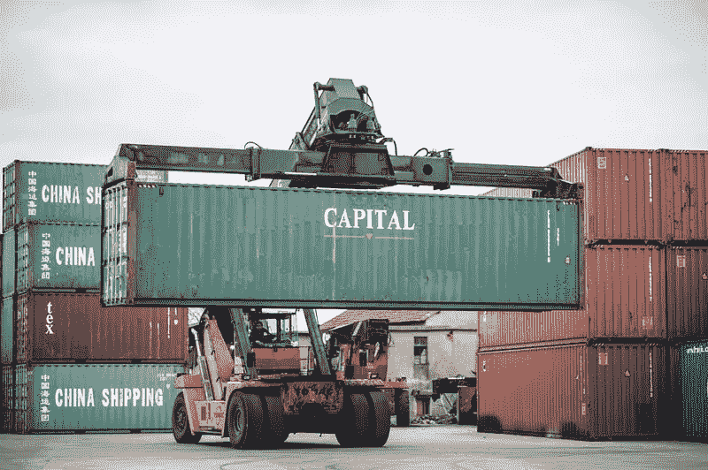
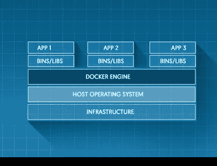

# 了解 Docker、容器和更安全的软件交付

> 原文：<https://www.sitepoint.com/docker-containers-software-delivery/>

数据库、依赖项、cron 作业…如今的应用程序有如此多的层，以至于移动东西要花很多时间也不足为奇。但不一定非要这样。今天，您可以将软件运送到几乎任何环境，并在几秒钟内启动和运行。输入[码头工人](https://www.docker.com/)。


## 软件交付

交付软件过去很容易。最难的部分是编程，但是一旦你完成了，你只需要处理产品，也许修复一些 bug，仅此而已。

后来，有了“LAMP stack”(Linux、Apache、MySQL、PHP)——它得到了托管公司的广泛支持——事情变得稍微复杂了一些，但仍然是可管理的。你可以提供链接到数据库的动态网站，并通过控制面板设置一切。

但在最近，随着新技术的出现，这种情况变得更加多样化，要求也更高。NoSQL 数据库和 Node.js，像 Python 和 Ruby 这样的编程语言，变得越来越突出。所有这些和更多的已经打开了许多可能性，但是现在交付软件不再那么容易了。

### 履行

**应用变得难以实现**。即使你有了一台专用的服务器，你仍然需要处理安装和设置工作，甚至是一些维护工作，以便让一切正常运行。然而，尽管一切正常，但现在你处在一个复杂的、紧密耦合的系统中，有不同的服务和编程语言，总有可能突然出问题。

### 码头工人来救援了

Docker 让软件交付再次变得简单。Docker 允许你设置*一切*——你开发的软件，它将运行的操作系统，它需要的服务，模块和后端工具，如 cron jobs。所有这些都可以设置为在几分钟内运行，并保证它可以在目标系统上运行，也可以在您的开发环境中运行。

## Docker 解决的问题

这些是您在交付软件时会遇到的一些问题:

*   你用自己喜欢的语言(Python、Ruby、PHP、C) **精心开发的应用程序，在目标系统**上似乎无法工作，你也不太能想出原因。
*   一切都很好……直到**有人在服务器**上更新了一些东西，现在它不再工作了。
*   当您的客户使用该软件时，一个其他方面的次要依赖(例如，一个只是偶尔使用的模块，或者一个 cron 作业)会导致问题…但是**当您测试该软件时，它在您的计算机上运行得很好**！
*   你的产品所依赖的服务，如数据库或网络服务器，有一些问题(如网站的高流量，或一些有问题的 SQL 代码),并成为降低整个系统速度的瓶颈。
*   安全漏洞危及系统的某个组件，结果是一切都瘫痪了。

这些问题属于“DevOps”的模糊领域，其中一些涉及维护问题(服务器更新)，一些测试问题(检查模块版本)，以及一些部署问题(在不同的位置安装和设置一切)。当**已经在工作的东西的部署**不顺利时，反而变得有问题和耗时，这是一种真正的痛苦。

## 软件容器

您可能熟悉那些大型、标准化的海运集装箱，它们的存在是为了简化世界各地的运输——多式联运集装箱:



你可以把几乎任何东西放在一个箱子里，运到任何地方，在另一端卸下里面的东西——一辆汽车，一些家具，一架钢琴——保持完全相同的原始状态。

在软件开发中，我们可能会花几天时间试图让事情在一个不同的环境中工作——结果几天后就失败了。与交付可靠运行的软件相比，将一辆可运行的汽车运送到另一个大陆更容易、更快捷。那不是有点尴尬吗？

因此，人们开始考虑一种类似于运送软件的容器的东西——一种可以用来以可靠的方式运送软件的东西，这种东西实际上会像预期的那样工作:**软件容器**。

这可能会让你想到软件安装程序，比如那些用来轻松发布桌面应用程序的软件。使用安装程序，您可以分发的只是一个可执行文件和一些运行时库(主应用程序运行所需的小程序)——只要这些程序不与系统已经安装的程序冲突。相比之下，软件容器使我们能够运送几乎所有的东西，就像物理容器一样。

可以放入软件容器的示例包括:

*   一个 Python、Ruby 或 PHP 解释器，包含所有需要的模块
*   *任何*运行时库
*   某些模块的特定版本(因为你永远不知道新版本什么时候会引起一些问题)
*   您的应用程序需要的服务，如 web 服务器或数据库
*   系统的一些特殊调整
*   维护后端工具，如 cron 作业和其他自动化。

### 简化操作

**集装箱大大简化了操作**。它们非常实用，易于创建和操作，因此没有必要将所有内容都放在一个单独的模块中。

您可以将应用程序的核心和库放在一个容器中，并从不同的容器中调用 Apache、MySQL 或 MongoDB 等服务。这听起来可能很奇怪，甚至很复杂，但是请耐心听我说，你会发现这样做不仅很有意义，而且听起来简单多了。

## 何时使用软件容器

在我们进入机制和它如何工作的一些细节之前，我们将回顾一些**用例**。以下是一些使用软件容器会大大受益的场景:

*   依赖后端技术的 web 应用程序
*   需要根据需求进行伸缩的服务(如 web 或数据库)
*   具有特定设置(操作系统、工具、环境变量等)的应用程序(web 或其他)。)
*   易于在同事之间分发的开发环境(也就是说，共享某个设置的快捷方式)
*   一个沙盒环境(为了安全地测试事物),可以根据需要快速创建和处理多次
*   一个具有有效的[关注点分离](https://en.wikipedia.org/wiki/Separation_of_concerns)的设置，具有可以独立处理的[松散耦合的](https://en.wikipedia.org/wiki/Loose_coupling)组件(从服务到操作系统的应用程序)。

## 何时不使用软件容器

同样，在我们开始大肆宣传之前，还有其他的**情况，在这些情况下，容器几乎不能提供什么**，例如:

*   仅使用 HTML、CSS 和 JavaScript 等客户端技术的网站
*   一个简单的桌面应用程序，可以通过软件安装程序分发
*   基于 Windows 的开发环境(例如。NET 框架，或 VisualBasic 运行时)，这些都不能在 Linux 上实现。

## Docker 是什么？

对于那些容器发光的情况，你可能想知道这种技术在实践中是如何实现的。让我们看看 Docker 是如何兑现所有这些承诺的。


Docker:“构建、发布和运行任何应用程序。任何地方。”

Docker 是一个开源项目——以及一家总部位于旧金山的支持该项目的公司。它在 2013 年刚刚诞生，然而在如此短的时间内，而且部分仍处于测试阶段，[它正在被大量行业采用](https://www.datadoghq.com/docker-adoption/)。

但这是什么呢？Docker 是从命令行运行的软件，它允许您在软件容器中自动部署应用程序。来自 [Docker 网站](https://www.docker.com/what-docker):

> Docker 容器将一个软件包装在一个完整的文件系统中，该文件系统包含运行所需的一切:代码、运行时、系统工具、系统库——任何可以安装在服务器上的东西。这保证了软件将总是相同地运行，而不管其环境如何。

因为这可能还是有点太抽象，所以让我们看看运行容器是什么样子的。

### 坞站演示

这是如何运行“hello-world”容器的:

```
$ docker run hello-world 
```

下面是从容器内部生成的输出，对 Docker 内部做了一些描述:

```
Hello from Docker.
This message shows that your installation appears to be working correctly.

To generate this message, Docker took the following steps:
1\. The Docker Engine CLI client contacted the Docker Engine daemon.
2\. The Docker Engine daemon pulled the "hello-world" image from the Docker Hub.
3\. The Docker Engine daemon created a new container from that image which runs the
   executable that produces the output you are currently reading.
4\. The Docker Engine daemon streamed that output to the Docker Engine CLI client, which sent it
   to your terminal.

To try something more ambitious, you can run an Ubuntu container with:
$ docker run -it ubuntu bash

Share images, automate workflows, and more with a free Docker Hub account:
https://hub.docker.com

For more examples and ideas, visit:
https://docs.docker.com/userguide/ 
```

希望这足够简单，但是我们对“hello-world”容器已经无能为力了，所以让我们更进一步，在 Ubuntu Linux 中运行一个交互式 shell:

```
$ docker run -i -t ubuntu bash

# cat /etc/issue
Ubuntu 16.04 LTS \n \l 
```

第一个命令使用`bash` shell 启动`ubuntu`容器中的交互式(`-i` ) TTY 或控制台(`-t`)。第二个命令(`cat /etc/issue`)已经在容器中了(当然，我们可以继续运行命令)。需要明确的是:不管你是在 Windows、Mac 还是 Debian box 上，对于这个容器来说，你是在 Ubuntu 机器上。根据记录，那个控制台在一秒钟内就**启动并运行了**！

此外，由于容器是完全隔离的一次性环境，您可以在其中做一些疯狂的事情，例如:

```
# rm -rf /etc
# cat /etc/issue
cat: /etc/issue: No such file or directory 
```

当您退出或终止该容器时，您所要做的就是重新启动它，您将获得一个与初始状态完全相同的新容器:

```
# exit
$ docker run -i -t ubuntu bash
# cat /etc/issue
Ubuntu 16.04 LTS \n \l 
```

就这么简单！

## Docker 如何工作

### 建筑

如果你熟悉**虚拟机** (VM)比如管理程序，你可能已经开始注意到一些不同。虽然它们允许您运行不同的操作系统(OS ),但虚拟机在主机上有大量的[内存占用](https://www.wikiwand.com/en/Memory_footprint),因为每个新的操作系统都是从零开始加载到主内存中的。由于每个操作系统都需要自己的二进制文件和库来支持整个系统，这通常会占用额外的几千兆字节的磁盘空间。最后但同样重要的是，就像启动一个实际的操作系统一样，系统需要几分钟的时间来加载，然后才能运行。


[Docker 公司的虚拟机图表](https://www.docker.com/sites/default/files/WhatIsDocker_2_VMs_0.png)

另一方面，软件容器极大地减少了这种开销，因为它们直接使用来自主机操作系统的资源，这些资源由 Docker 引擎处理，允许更直接和有效地管理资源。这就是为什么，在大约 100MB 的内存中，你可以拥有一个最小但完全可用的 Linux 发行版，比如 Ubuntu，你可以在 1 秒钟内启动它。



[Docker 公司的软件容器图](https://www.docker.com/sites/default/files/WhatIsDocker_3_Containers_1.png)

### 图像和容器

在使用 Docker 时，你会听到很多关于“图像”和“容器”的说法，所以让我们来澄清一下它们是什么。

一个**映像**(有时被称为“构建”)是一个文件，一个你下载或创建的只读资源，打包了运行环境所需的一切。构建映像非常容易，因为您可以使用已经可用的映像作为基础(例如，Debian 发行版)，并告诉 Docker 您在它上面想要什么，比如某些开发工具、库，甚至可以将您自己的应用程序放入其中。

另一方面，**容器**是运行映像时得到的隔离环境，它被读取*和*写入，所以你可以在其中做任何你想做的事情。该环境将处于构建映像时定义的精确状态。因为图像是只读的，所以当你运行一个新的容器时，无论你在其他容器中做了什么，你都有一个完美的新环境。只要系统能够处理，您就可以同时运行多个容器。

所以你从图像运行容器*。如果您使用 C 或 Java 等面向对象编程，一个有用的类比是图像就像一个类，而容器是该类的一个实例。*

### 坞站工作流

由于这是一篇介绍性文章，我们现在不会详细讨论，但是为了让你对 Docker 的典型工作流程有个概念，这里有三个主要步骤:

1.  **使用 Dockerfile 构建一个映像**，docker file 是一个纯文本文件，您可以在其中为要捆绑到构建中的内容设置指令，例如基本操作系统、库、应用程序、环境变量和本地文件。(详见[文档参考](https://docs.docker.com/reference/builder/)。)
2.  **通过 Docker Hub 或您的私人存储库发送图像**。现在，您可以使用 Docker 非常轻松地分发这个应用程序或开发环境——事实上，软件开发人员提供了许多官方的预构建映像，随时可以使用。(探索[码头枢纽](https://hub.docker.com/explore/)了解更多信息。)
3.  在主机上运行一个容器。您所需要的只是安装 Docker，以便能够运行容器、部署微服务(即启动运行不同服务的不同容器)，并拥有开发或部署所需的环境。

## 下一步做什么

软件容器的可能性是巨大的，在许多情况下，它们为开发和运营领域(DevOps)中的开放性问题提供了明确的解决方案。我们会在这里给你一个资源列表，帮助你开始使用 Docker 和软件容器。

安装 Docker 的**要求**有些高:

*   **Windows** : 64 位操作系统，Windows 7 以上。
*   **Mac**:OS X 10.8“Mountain Lion”或更新版本，具有英特尔对内存管理单元(MMU)虚拟化的硬件支持，以及至少 4GB 的 RAM。
*   **Linux** : 64 位安装(不考虑你的 Linux 发行版和版本)，3.10 内核或更高版本。(旧的内核缺少运行 Docker 容器所需的一些特性。)

因为 Docker 是一种基于 Linux 的技术，对于 Windows 和 Mac，你首先需要安装 T2 Docker 工具箱，这将很容易在你的计算机上建立 Docker 环境，包括运行 Linux 的虚拟机和 Docker 引擎。有关安装和设置的说明，您可以参考特定于操作系统的指南:

*   [Windows Docker 入门](https://docs.docker.com/docker-for-windows/)。
*   [Mac 版 Docker 入门](https://docs.docker.com/docker-for-mac/)。

对于不同的 **Linux 发行版**，您只需安装 Docker 引擎:

*   [在 Linux 上安装 Docker 引擎](https://docs.docker.com/engine/installation/linux/)。

一旦安装了 Docker，您就可以按照这个**一步一步的演练**来运行和构建您自己的映像，在 Docker Hub 上创建一个存储库，等等:

*   [Docker](https://docs.docker.com/engine/getstarted/)入门。

更进一步，你会在 SitePoint 上找到许多**技术特定 Docker 教程**，比如针对 [Ruby](https://www.sitepoint.com/?s=docker%20ruby) 、 [WordPress](https://www.sitepoint.com/?s=docker%20wordpress) 和 [Node.js](https://www.sitepoint.com/?s=docker%20node.js) 。(您还可以探索 SitePoint 的所有 Docker 产品[。)](https://www.sitepoint.com/?s=docker)

最后，记住这项技术不仅仅是运行容器的命令工具。Docker 是一个由产品和服务组成的生态系统,旨在集中你可以用容器做的一切事情——从创建到分发，从在单台机器上运行到跨数百甚至数千台服务器的编排。

## 分享这篇文章