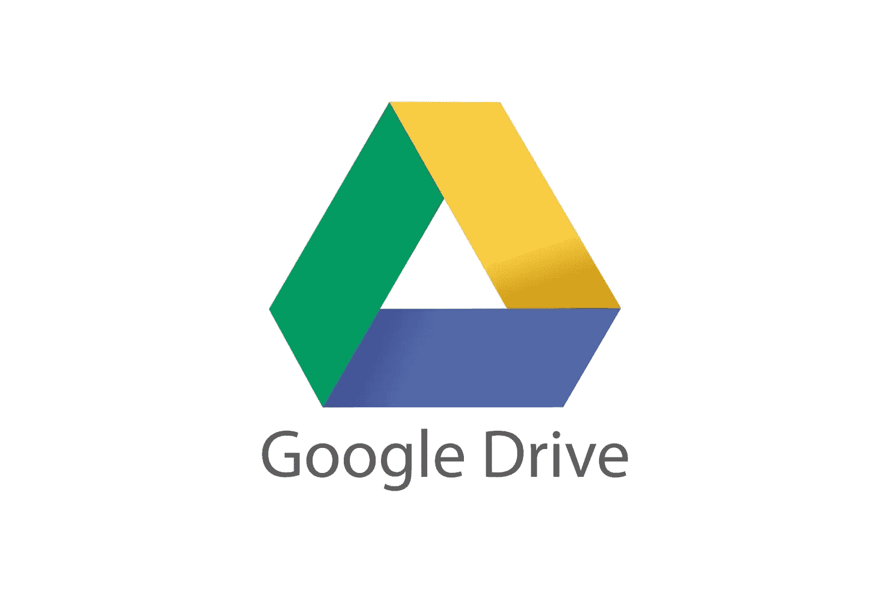
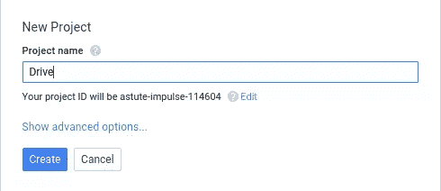
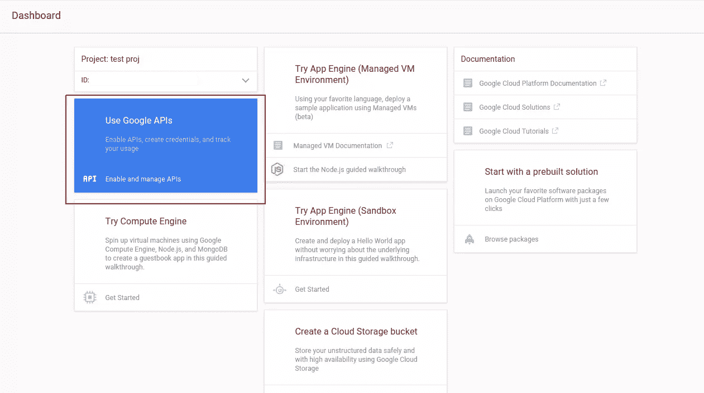
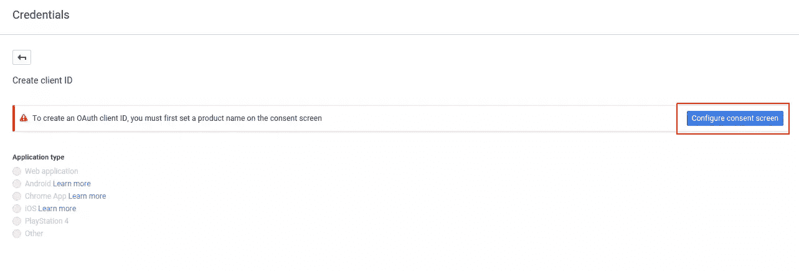
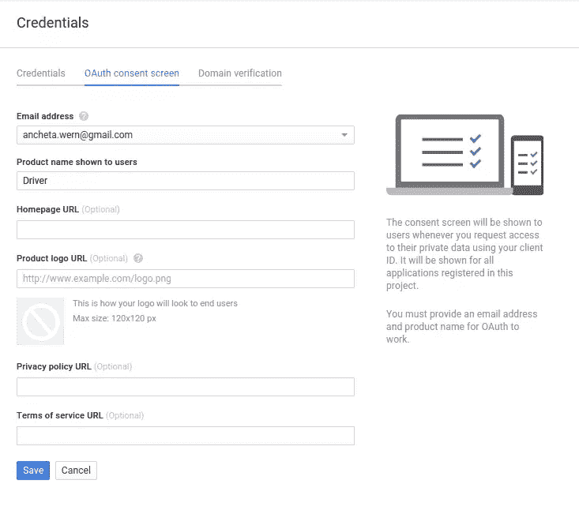
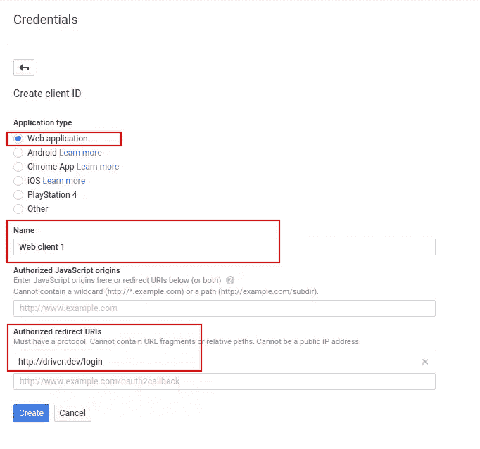

# 我们可以使用 Laravel 来构建自定义的 Google Drive UI 吗？

> 原文：<https://www.sitepoint.com/is-laravel-good-enough-to-power-a-custom-google-drive-ui/>

在本教程中，我们将构建一个与 [Google Drive](https://drive.google.com/) API 对话的应用程序。它将有文件搜索，上传，下载和删除功能。如果你想跟进，你可以[克隆 Github](https://github.com/sitepoint-editors/driver) 的回购协议。



## 创建新的 Google 项目

当使用任何 Google API 时，我们需要做的第一件事是在 Google 控制台中创建新项目。



然后，我们需要启用 Google+ API 和 Google Drive API。我们需要 G+来获取用户信息。



在*凭证*菜单中，我们选择*添加凭证*，选择 *OAuth 2.0 客户端 ID* 。



接下来是*配置同意屏幕*按钮。这允许我们输入项目的详细信息，例如名称、主页 URL 和其他对用户有帮助的详细信息。现在我们只需要输入项目的名称。



接下来，我们创建一个客户端 ID。我们需要 *web 应用程序*作为应用程序类型，然后我们需要为*授权重定向 URIs* 输入一个值。这是用户授予应用程序权限后，谷歌将重定向到的 URL。



## 构建项目

对于这个项目，我们将使用 [Laravel 框架](https://laravel.com)。

```
composer create-project --prefer-dist laravel/laravel driver 
```

### 安装依赖项

我们需要官方的 PHP 谷歌 API 客户端，以及 Carbon 库。更新`composer.json`以添加这些:

```
composer require nesbot/carbon google/apiclient 
```

### 配置项目

我们需要为我们的项目指定一些全局设置。在 Laravel 中，这是通过`.env`文件完成的。让我们编辑文件，并在默认配置下添加应用程序标题、时区和 Google 配置:

```
APP_ENV=local
APP_DEBUG=true
APP_KEY=base64:iZ9uWJVHemk5wa8disC8JZ8YRVWeGNyDiUygtmHGXp0=
APP_URL=http://localhost

SESSION_DRIVER=file

#add these:
APP_TITLE=Driver
APP_TIMEZONE="Asia/Manila"
GOOGLE_CLIENT_ID="YOUR GOOGLE CLIENT ID"
GOOGLE_CLIENT_SECRET="YOUR GOOGLE CLIENT SECRET"
GOOGLE_REDIRECT_URL="YOUR GOOGLE LOGIN REDIRECT URL"
GOOGLE_SCOPES="email,profile,https://www.googleapis.com/auth/drive"
GOOGLE_APPROVAL_PROMPT="force"
GOOGLE_ACCESS_TYPE="offline" 
```

分解一下，我们有:

*   `GOOGLE_CLIENT_ID`和`GOOGLE_CLIENT_SECRET`——我们之前从 Google 控制台获得的客户端 ID 和密码。
*   `GOOGLE_REDIRECT_URL`–用户允许我们的应用程序后，Google 将重定向到的 URL。这应该与之前在 Google 控制台中添加的相同。也应该是 app 里的有效路线。如果我们使用 artisan 来服务项目，重定向 URL 将类似于`http://localhost:8000/login`。
*   `GOOGLE_SCOPES`–我们需要从用户那里获得的权限。`email`允许我们的应用程序访问用户的电子邮件。`profile`给我们基本的用户信息，如名字和姓氏。`https://www.googleapis.com/auth/drive`允许我们管理用户 Google Drive 上的文件。

### 谷歌

`Googl`类(`app\Googl.php`)用于初始化 Google 和 Google Drive 客户端库。它有两种方法:`client`和`drive`。

在`client`方法中，我们初始化 Google API 客户端，然后设置我们之前在`.env`文件中添加的不同选项。一旦设置了所有不同的选项，我们只需返回新创建的客户机。

`drive`方法用于初始化 Google Drive 服务。它接受客户端作为它的参数。

```
<?php
namespace App;

class Googl
{
    public function client()
    {
        $client = new \Google_Client();
        $client->setClientId(env('GOOGLE_CLIENT_ID'));
        $client->setClientSecret(env('GOOGLE_CLIENT_SECRET'));
        $client->setRedirectUri(env('GOOGLE_REDIRECT_URL'));
        $client->setScopes(explode(',', env('GOOGLE_SCOPES')));
        $client->setApprovalPrompt(env('GOOGLE_APPROVAL_PROMPT'));
        $client->setAccessType(env('GOOGLE_ACCESS_TYPE'));

        return $client;
    }

    public function drive($client)
    {
        $drive = new \Google_Service_Drive($client);
        return $drive;
    }
} 
```

### 路线

应用程序中的不同页面在`app/Http/routes.php`文件中定义:

```
// This is where the user can see a login button for logging into Google
Route::get('/', 'HomeController@index');

// This is where the user gets redirected upon clicking the login button on the home page
Route::get('/login', 'HomeController@login');

// Shows a list of things that the user can do in the app
Route::get('/dashboard', 'AdminController@index');

// Shows a list of files in the users' Google drive
Route::get('/files', 'AdminController@files');

// Allows the user to search for a file in the Google drive
Route::get('/search', 'AdminController@search');

// Allows the user to upload new files
Route::get('/upload', 'AdminController@upload');
Route::post('/upload', 'AdminController@doUpload');

// Allows the user to delete a file
Route::get('/delete/{id}', 'AdminController@delete');

Route::get('/logout', 'AdminController@logout'); 
```

### 家庭控制器

Home Controller ( `app/Http/Controller/HomeController.php`)负责服务主页和处理用户登录。

```
<?php
namespace App\Http\Controllers;

use Illuminate\Http\Request;
use App\Googl;

class HomeController extends Controller
{
    public function index()
    {
        return view('login');
    }

    public function login(Googl $googl, Request $request)
    {
        $client = $googl->client();

        if ($request->has('code')) {

            $client->authenticate($request->input('code'));
            $token = $client->getAccessToken();

            $plus = new \Google_Service_Plus($client);

            $google_user = $plus->people->get('me');
            $id = $google_user['id'];

            $email = $google_user['emails'][0]['value'];
            $first_name = $google_user['name']['givenName'];
            $last_name = $google_user['name']['familyName'];

            session([
                'user' => [
                    'email' => $email,
                    'first_name' => $first_name,
                    'last_name' => $last_name,
                    'token' => $token
                ]
            ]);

            return redirect('/dashboard')
                ->with('message', ['type' => 'success', 'text' => 'You are now logged in.']);

        } else {
            $auth_url = $client->createAuthUrl();
            return redirect($auth_url);
        }
   }
} 
```

分解上面的代码，首先我们返回登录视图:

```
public function index()
{
    return view('login');
} 
```

登录视图存储在`resources/views/login.blade.php`中，包含以下代码:

```
@extends('layouts.default')

@section('content')
<form method="GET" action="/login">
    <button class="button-primary">Login with Google</button>
</form>
@stop 
```

登录视图继承自`resources/views/layouts/default.blade.php`文件:

```
<!DOCTYPE html>
<html lang="en">
<head>
    <meta charset="UTF-8">
    <title>{{ env('APP_TITLE') }}</title>
    <link rel="stylesheet" href="{{ url('assets/css/skeleton.min.css') }}">
    <link rel="stylesheet" href="{{ url('assets/css/style.css') }}">
</head>
<body>
    <div class="container">
        <header>
            <h1>{{ env('APP_TITLE') }}</h1>
        </header>
        @include('partials.alert')
        @yield('content')
    </div>
</body>
</html> 
```

我们为这个应用程序使用了[框架 CSS](http://getskeleton.com)。因为 Skeleton 已经让我们做得很好，所以我们只需要最少的 CSS 代码(`public/assets/css/style.css`):

```
.file-title {
    font-size: 18px;
}

ul#files li {
    list-style: none;
}

.file {
    padding-bottom: 20px;
}

.file-modified {
    color: #5F5F5F;
}

.file-links a {
    margin-right: 10px;
}

.alert {
    padding: 20px;
}

.alert-success {
    background-color: #61ec58;
}

.alert-danger {
    background-color: #ff5858;
} 
```

回到主控制器，我们有一个`login`方法，在这里我们检查是否有一个`code`作为查询参数传入。如果没有，我们创建身份验证 URL 并重定向用户:

```
if ($request->has('code')) {
    ...
} else {
    $auth_url = $client->createAuthUrl();
    return redirect($auth_url);
} 
```

身份验证 URL 基本上是一个 Google 登录页面，用户可以使用它来授予应用程序权限。在用户给出许可后，Google 重定向回我们指定的重定向 URL。一个`code`被传递给这个 URL，我们用它来获取一个访问令牌。

```
$client->authenticate($request->input('code'));
$token = $client->getAccessToken(); 
```

从那里，我们获得基本的用户信息，然后将这些信息与访问令牌一起保存到会话中:

```
$plus = new \Google_Service_Plus($client);

$google_user = $plus->people->get('me');
$id = $google_user['id'];

$email = $google_user['emails'][0]['value'];
$first_name = $google_user['name']['givenName'];
$last_name = $google_user['name']['familyName'];

session([
    'user' => [
        'email' => $email,
        'first_name' => $first_name,
        'last_name' => $last_name,
        'token' => $token
    ]
]); 
```

最后，我们将用户重定向到仪表板页面:

```
return redirect('/dashboard')
                ->with('message', ['type' => 'success', 'text' => 'You are now logged in.']); 
```

### 管理控制器

管理员控制器(`app/Http/Controllers/AdminController.php`)处理只有登录用户才能执行的操作。这是列出、搜索、上传和删除文件的代码所在的地方。

```
<?php
namespace App\Http\Controllers;

use Illuminate\Http\Request;
use App\Googl;
use Carbon\Carbon;

class AdminController extends Controller
{
    private $client;
    private $drive;

    public function __construct(Googl $googl)
    {
        $this->client = $googl->client();
        $this->client->setAccessToken(session('user.token'));
        $this->drive = $googl->drive($this->client);
    }

    public function index()
    {
        return view('admin.dashboard');
    }

    public function files()
    {
        $result = [];
        $pageToken = NULL;

        $three_months_ago = Carbon::now()->subMonths(3)->toRfc3339String();

        do {
            try {
                $parameters = [
                    'q' => "viewedByMeTime >= '$three_months_ago' or modifiedTime >= '$three_months_ago'",
                    'orderBy' => 'modifiedTime',
                    'fields' => 'nextPageToken, files(id, name, modifiedTime, iconLink, webViewLink, webContentLink)',
                ];

                if ($pageToken) {
                    $parameters['pageToken'] = $pageToken;
                }

                $result = $this->drive->files->listFiles($parameters);
                $files = $result->files;

                $pageToken = $result->getNextPageToken();

            } catch (Exception $e) {
                return redirect('/files')->with('message',
                    [
                        'type' => 'error',
                        'text' => 'Something went wrong while trying to list the files'
                    ]
                );
              $pageToken = NULL;
            }
        } while ($pageToken);

        $page_data = [
            'files' => $files
        ];

        return view('admin.files', $page_data);
   }

    public function search(Request $request)
    {
        $query = '';
        $files = [];

        if ($request->has('query')) {
            $query = $request->input('query');

            $parameters = [
                'q' => "name contains '$query'",
                'fields' => 'files(id, name, modifiedTime, iconLink, webViewLink, webContentLink)',
            ];

            $result = $this->drive->files->listFiles($parameters);
            if($result){
                $files = $result->files;
            }
        }

        $page_data = [
            'query' => $query,
            'files' => $files
        ];

        return view('admin.search', $page_data);
   }

    public function delete($id)
    {
        try {
            $this->drive->files->delete($id);
        } catch (Exception $e) {
            return redirect('/search')
                ->with('message', [
                    'type' => 'error',
                    'text' => 'Something went wrong while trying to delete the file'
                ]);
        }

        return redirect('/search')
            ->with('message', [
                'type' => 'success',
                'text' => 'File was deleted'
            ]);
    }

    public function upload()
    {
        return view('admin.upload');
    }

    public function doUpload(Request $request)
    {
        if ($request->hasFile('file')) {

            $file = $request->file('file');

            $mime_type = $file->getMimeType();
            $title = $file->getClientOriginalName();
            $description = $request->input('description');

            $drive_file = new \Google_Service_Drive_DriveFile();
            $drive_file->setName($title);
            $drive_file->setDescription($description);
            $drive_file->setMimeType($mime_type);

            try {
                $createdFile = $this->drive->files->create($drive_file, [
                    'data' => $file,
                    'mimeType' => $mime_type,
                    'uploadType' => 'multipart'
                ]);

                $file_id = $createdFile->getId();

                return redirect('/upload')
                    ->with('message', [
                        'type' => 'success',
                        'text' => "File was uploaded with the following ID: {$file_id}"
                ]);

            } catch (Exception $e) {

                return redirect('/upload')
                    ->with('message', [
                        'type' => 'error',
                        'text' => 'An error occurred while trying to upload the file'
                    ]);

            }
        }

    }

    public function logout(Request $request)
    {
        $request->session()->flush();
        return redirect('/')->with('message', ['type' => 'success', 'text' => 'You are now logged out']);
    }

} 
```

分解上面的代码，首先我们为 Google client 和 Google Drive 服务创建两个私有变量，并在构造函数中初始化它们。

```
private $client;
private $drive;

public function __construct(Googl $googl)
{
    $this->client = $googl->client();
    $this->client->setAccessToken(session('user.token'));
    $this->drive = $googl->drive($this->client);
} 
```

### 仪表盘

为了构建仪表板，我们添加了服务于仪表板页面的`index`方法:

```
public function index()
{
    return view('admin.dashboard');
} 
```

仪表板页面包含应用程序中不同页面的链接:

```
@extends('layouts.default')

@section('content')
<h3>What do you like to do?</h3>
<ul>
    <li><a href="/files">List Files</a></li>
    <li><a href="/search">Search File</a></li>
    <li><a href="/upload">Upload File</a></li>
    <li><a href="/logout">Logout</a></li>
</ul>
@stop 
```

### 列出文件

接下来是`files`方法，它负责列出最近修改或查看过的文件。在本例中，我们过滤了过去三个月中修改或查看过的文件。我们通过用一些参数提供列出文件的请求来做到这一点。

```
$three_months_ago = Carbon::now()->subMonths(3)->toRfc3339String();

$parameters = [
    'q' => "viewedByMeTime >= '$three_months_ago' or modifiedTime >= '$three_months_ago'",
    'orderBy' => 'modifiedTime',
    'fields' => 'nextPageToken, files(id, name, modifiedTime, iconLink, webViewLink, webContentLink)',
]; 
```

大多数过滤可以通过使用`q`参数来完成。在这里，我们使用`viewedByMeTime`来指定当前用户在过去三个月中应该查看过的文件。我们使用`modifiedTime`来指定该文件应该已经被在同一时期访问该文档的任何用户修改过。这两个条件通过使用`or`关键字联系在一起。

然后可以通过指定`orderBy`参数对结果进行排序。在本例中，我们使用`modifiedTime`字段对文件进行降序排序。这意味着首先返回最近修改过的文件。还要注意，我们传入了一个`fields`参数，该参数用于指定我们想要返回的字段。

可用作`q`参数的值的完整列表在[文档](https://developers.google.com/drive/web/search-parameters)中。

我们还指定了一个名为`pageToken`的附加参数。这允许我们在一个大的结果集中分页。因此，在返回页面令牌的同时，我们继续从 API 获取结果。

```
if ($pageToken) {
    $parameters['pageToken'] = $pageToken;
} 
```

为了执行请求，我们使用 Google Drive 服务来获取符合我们之前指定的标准的文件列表。页面令牌也可以从结果中获取。

```
$result = $this->drive->files->listFiles($parameters);
$files = $result->files;

$pageToken = $result->getNextPageToken(); 
```

注意，这都是在一个`do..while`循环中完成的。因此，当页面令牌不是`null`时，它继续执行。

```
do {
    ...
} while ($pageToken); 
```

以下(`resources/views/admin/files.blade.php`)是用于列出文件的视图:

```
@extends('layouts.default')

@section('content')
<h3>List Files</h3>
<ul id="files">
    @foreach($files as $file)
    <li>
        <div class="file">

            <div class="file-title">
                iconLink }}">
                {{ $file->name }}
            </div>
            <div class="file-modified">
                last modified: {{ Date::format($file->modifiedTime) }}
            </div>
            <div class="file-links">
                <a href="{{ $file->webViewLink }}">view</a>
                @if(!empty($file->webContentLink))
                <a href="{{ $file->webContentLink }}">download</a>
                @endif
            </div>
        </div>
    </li>
    @endforeach
</ul>
@stop 
```

这里我们循环遍历文件，然后将它们输出到一个列表中。每个列表项都包含与文件相关联的 Google drive 图标、标题、修改日期和几个用于查看和下载文件的链接。请注意，我们使用了一个名为`Date`的自定义助手类。我们将在*约会助手*部分来看看。

### 搜索文件

`search`方法负责返回搜索页面。在内部，我们检查`query`是否作为请求参数传入。然后我们用它作为要搜索的文件名的值。注意，这次我们没有将`nextPageToken`和`orderBy`作为参数传入，因为我们假设结果集中只有几个条目。

```
if ($request->has('query')) {
    $query = $request->input('query');

    $parameters = [
        'q' => "name contains '$query'",
        'fields' => 'files(id, name, modifiedTime, iconLink, webViewLink, webContentLink)',
    ];

    $result = $this->drive->files->listFiles($parameters);
    if($result){
        $files = $result->files;
    }
} 
```

以下(`resources/views/admin/search.blade.php`)是对应的观点:

```
@extends('layouts.default')

@section('content')
<h3>Search Files</h3>
<form method="GET">
    <div class="row">
        <label for="query">Query</label>
        <input type="text" name="query" id="query" value="{{ $query }}">
    </div>
    <button class="button-primary">Search</button>
</form>
@if(!empty($files))
<ul id="files">
    <h4>Search results for: {{ $query }}</h4>
    @foreach($files as $file)
    <li>
        <div class="file">

            <div class="file-title">
                iconLink }}">
                {{ $file->name }}
            </div>
            <div class="file-modified">
                last modified: {{ Date::format($file->modifiedTime) }}
            </div>
            <div class="file-links">
                <a href="{{ $file->webViewLink }}">view</a>
                @if(!empty($webContentLink))
                <a href="{{ $file->webContentLink }}">download</a>
                @endif
                <a href="/delete/{{ $file->id }}">delete</a>
            </div>
        </div>
    </li>
    @endforeach
</ul>
@else
No results for your query: {{ $query }}
@endif
@stop 
```

### 删除文件

当点击*删除*链接时，执行`delete`方法。它接受 ID 作为参数。这是 Google Drive 中文件的 ID。

```
public function delete($id)
{
    try {
        $this->drive->files->delete($id);
    } catch (Exception $e) {
        return redirect('/search')
            ->with('message', [
                'type' => 'error',
                'text' => 'Something went wrong while trying to delete the file'
            ]);
    }

    return redirect('/search')
        ->with('message', [
            'type' => 'success',
            'text' => 'File was deleted'
        ]);
} 
```

### 上传文件

上传文件需要不同的方法来显示视图和实际上传文件。这是因为我们需要使用`POST`方法上传文件，使用`GET`方法显示视图。

上传视图(`resources/views/admin/upload.blade.php`)包含上传单个文件的表单:

```
@extends('layouts.default')

@section('content')
<h3>Upload Files</h3>
<form method="POST" enctype="multipart/form-data">
    <input type="hidden" name="_token" value="{{ csrf_token() }}">
    <div class="row">
        <label for="file">File</label>
        <input type="file" name="file" id="file">
    </div>
    <div class="row">
        <label for="description">Description</label>
        <input type="text" name="description" id="description">
    </div>
    <button class="button-primary">Upload</button>
</form>
@stop 
```

一旦提交了表单，就会执行`doUpload`方法。这将检查文件是否已上传。然后我们得到文件和它的信息(mime 类型，文件名)。这些信息将被用来创建一个新的 Google Drive 文件。

```
if ($request->hasFile('file')) {

    $file = $request->file('file');

    $mime_type = $file->getMimeType();
    $title = $file->getClientOriginalName();
    $description = $request->input('description');

    $drive_file = new \Google_Service_Drive_DriveFile();
    $drive_file->setName($title);
    $drive_file->setDescription($description);
    $drive_file->setMimeType($mime_type);
} 
```

接下来，我们使用`files->create`方法将文件上传到 Google drive。它接受驱动器文件作为第一个参数，接受包含文件实际内容、mime 类型和上传类型的数组作为第二个参数。上传类型的值可以是`media`、`multipart`或`resumable`。如果你想探索这些上传类型，你可以查看[文档。对于我们的例子，我们将只使用`multipart`,因为我们通过提交一个表单直接将文件上传到 Google Drive。如果上传成功，`create`方法返回文件的 ID。](https://developers.google.com/drive/web/manage-uploads)

```
try {
    $createdFile = $this->drive->files->create($drive_file, [
        'data' => $file,
        'mimeType' => $mime_type,
        'uploadType' => 'multipart'
    ]);

    $file_id = $createdFile->getId();

    return redirect('/upload')
        ->with('message', [
            'type' => 'success',
            'text' => "File was uploaded with the following ID: {$file_id}"
    ]);

} catch (Exception $e) {

    return redirect('/upload')
        ->with('message', [
            'type' => 'error',
            'text' => 'An error occured while trying to upload the file'
        ]);

} 
```

### 约会助手

`Date`助手用于格式化 Google Drive API 返回的日期。这里我们只有一个名为`format`的静态方法，它接受两个参数:日期和格式。日期是必需的，我们为格式指定了一个默认值:`M j`，它以如下格式输出日期: *Feb 28* 。碳是用来格式化的。

```
<?php

use Carbon\Carbon;

class Date {

    public static function format($date, $format = 'M j'){

        return Carbon::parse($date)->format($format);
    }
} 
```

为了自动加载助手，我们需要将路径`app/Helpers`添加到`composer.json`文件中的`classmap`数组。一旦完成，执行`composer dump-autoload`将应用更改。

```
"autoload": {
    "psr-4": {
        "App\\": "app/"
    },
    "classmap": [
        "database/",
        "app/Helpers"
    ]
}, 
```

## 结论

就是这样！在本教程中，我们已经看到了如何使用 PHP 来处理 Google Drive API。具体来说，我们研究了如何从用户的 Google drive 中列出、搜索、上传和删除文件。

在本教程中，我们仅仅触及了皮毛。你还可以做更多的事情:有[文件修改](https://developers.google.com/drive/v2/reference/revisions)和[实时功能](https://developers.google.com/drive/v2/reference/realtime)，仅举几例。如果你想了解更多，请务必查看[文档](https://developers.google.com/drive/)。

有问题吗？评论？请在下面留下您的反馈！

## 分享这篇文章