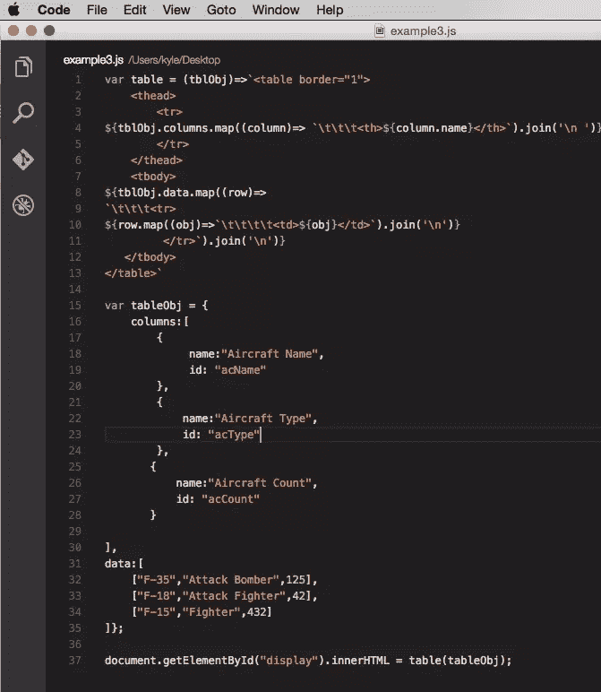

# ES6 模板文字:技术和工具

> 原文：<https://www.sitepoint.com/es6-template-literals-techniques-and-tools/>

本文是微软网站开发系列的一部分。感谢您对使 SitePoint 成为可能的合作伙伴的支持。

ES6 新增的 JavaScript 模板文字，提供了一个强大的新工具，可以做任何事情，从跨行扩展字符串到构建强大的 HTML 和 XML 生成器。本文将介绍模板文字给 JavaScript 带来的巨大变化，包括反勾字符、模板中的表达式、模板函数以及构建更复杂的 XML/HTML 模板。

## 反斜杠字符

毫无疑问，您遇到过这种情况:您有一行文本，可能是 HTML，它跨越了几行。如何在 HTML 中放置那些多行？可以使用+操作符连接跨多行的字符串(前提是用引号将它们括起来),甚至可以在该行后面加上反斜杠字符(`"\"`)。这些工作。它们也很笨拙，容易出错，而且很难看。

ES6 引入了另一种跨单行扩展字符串的方法，使用反勾字符(`` ` ``)。最简单地说，这通过一次抛出解决了两个问题——前面提到的让您拥有一个嵌入回车符的字符串，以及不可忽视的在字符串中包含单引号和双引号而不必转义它们的能力。

考虑下面的代码，观察它会生成什么:

```
 `"This isn't just another quote," Ada said. "It's a magical quote.";

"I'm not quite sure what you mean." 

Clive settled onto the couch, one foot over the armchair rest, eyeing her dubiously.

"Consider this - if I have to write a quote in code normally, say something like 'This is a weird quote.' \
then I have to spend a lot of time using escape characters like \\" and \\', and they can make for real \
legibility problems. With a magic quote, though, they just go away!"

"Really?"

"You do have to double escape your escape characters, however. \\n will still get interpreted as an hard \
carriage return, but \\\\n will give you the slash followed by the letter 'n'."
`
console.log(quote) 
```

这将生成输出:

*“这不仅仅是另一个引用，”阿达说。“这是一句神奇的名言。”“我不太明白你的意思。”
克莱夫坐在沙发上，一只脚搭在扶手椅上，怀疑地看着她。
“考虑一下这个——如果我必须正常地用代码写一段引语，就说‘这是一段奇怪的引语’然后我不得不花很多时间使用像`\"`和`\'`这样的转义字符，它们会造成真正的易读性问题。然而，有了一句神奇的话，它们就消失了！
“真的吗？”*

“然而，你必须加倍逃脱你的逃脱角色。`\n`仍然会被解释为硬回车，但是`\\n`会给你斜线后跟字母`'n'`

这里的效果是即时的——实际上，反勾号(或者更准确地说，*模板文字*操作符)执行回车、制表符和引号到它们各自的正常字符串表示的转换。这不仅解决了在对话文本中处理省略号的问题(如上所示)，还使得相应的代码更容易阅读。

还要注意，终止退格字符仍然可以在模板中识别，这在文本长度超过可用屏幕宽度时非常有用。常规字符串和模板字符串的区别在于，前者需要对每一行进行转义，而后者只需要对过长的字符串进行转义。

如果您的字符串包含大量转义字符(如换行符或制表符)，并且您不想被计数斜杠所困扰，您也可以使用[string . raw ' literal form](http://exploringjs.com/es6/ch_template-literals.html)。

```
String.raw`The sequence \t puts a tab into a template literal`
```

"序列\t 将制表符放入模板文字中."

## 评估模板字符串中的表达式

模板文字还解决了另一个问题:它们可以计算字符串中的变量。当在模板文字中使用时,`${expr}`构造将计算表达式，并将其合并到字符串本身中。

```
 var name = "Ada";
var vocation = "steampunk programmer";
varpcAssert = `${name} is a ${vocation}.`;
console.log(pcAssert)
// "Ada is a steampunk programmer." 
```

## 使用模板文字作为…模板

在下面的例子中，变量名和职业都是预定义的，然后`${}`表达式用它们的相关值替换变量。同样，您既可以计算内容，也可以在这些表达式中使用对象引用:


## 模板功能

在这个阶段，模板文字开始变得有趣起来。您可以创建一个复杂的模板文字来减少将这些内容嵌入到字符串中的时间。然而，当与产生相同输出的函数结合时，模板文字开始发挥作用。


注意，这也可以通过使用 [ES6 箭头符号](https://www.sitepoint.com/es6-arrow-functions-new-fat-concise-syntax-javascript/)来简化:

```
 var pounds = (amount) => (
	amount.toLocaleString("en-UK", {
		style:'currency',
		currency:'GBP'
	})
);

varpronounUCase = (gender) => (gender == 'female') ? 'She' : 'He';

var describe = (obj) => (
	`${obj.name} is a ${obj.vocation}.\
	${pronounUCase(obj.gender)} has ${pounds(obj.wealth)} \ in the bank.`
);

var person = {
	name: "Ada",
	vocation: "steampunk programmer",
	gender: "female",
	wealth: 24025
};

console.log(describe(person))

// "Ada is a steampunk programmer. She has £24,025.00  in the bank." 
```

如果目标是在`person`上创建一个方法，你最好使用更传统的函数符号，因为*这个*关键字没有在箭头函数中定义:

```
 var person = {
	name: "Ada",
	vocation: "steampunk programmer",
	gender: "female",
	wealth: 24025,
	pounds: (amount) => (amount.toLocaleString("en-UK", {
		style: 'currency',
		currency:'GBP'
		})
	),
	pronoun: (gender) => (gender === "female") ? "She" : "He",
	toString: function(){
		varself = this;
		return (`${self.name} is a ${self.vocation}.\
			${self.pronoun(self.gender)} has ${self.pounds(self.wealth)} \
			in the bank.`
		)
	}
};

console.log(""+ person)

// "Ada is a steampunk programmer.She has £24,025.00 in the bank." 
```

## 使用模板创建 toString()方法

需要注意的是使用了 [toString()](https://developer.mozilla.org/en-US/docs/Web/JavaScript/Reference/Global_Objects/Object/toString) 方法，因为每当一个对象被转换成一个字符串时`toString()`就会被自动调用，而不需要显式调用。这意味着当`person`本身总是给出对象时，`"" + person`将返回模板化的字符串作为输出，这使得`toString()`对于定义类和原型化的对象非常有用。

## 构建 HTML 和 XML 模板

这种模板函数对构建 HTML 和 XML 结构有明显的影响。例如，您可以通过将一个数组传递给一个模板函数来生成一个 HTML 字符串，然后将它插入到另一个元素中，从而在 HTML 中构造一个链接列表:

```
var li = (obj) => `<li><a href="${obj.url}" target="_new">${obj.label}</a></li>`; 
var ul = (arr) => `<ul>${arr.map((obj) => li(obj)).join('\n')}</ul>`;
var arr = [
  {url: "http://www.twitter.com", label: "Twitter"},
  {url: "http://www.linkedin.com", label: "Linked In"}, 
  {url: "http://www.facebook.com", label: "Facebook"} 
];

document.getElementById('displayList').innerHTML = ul(arr); 
```

### 使用模板创建链接列表。

这将生成以下输出:

```
<ul>
<li><a href="http://www.twitter.com" target="_new">Twitter</a></li>
<li><a href="http://www.linkedin.com" target="_new">LinkedLinked Linked In</a></li>
<li><a href="http://www.facebook.com" target="_new">Facebook</a></li>
</ul> 
```

然后将呈现为一个无序的链接列表。


表格可以用类似的方式构建:



这将生成如下表格:

<colgroup><col style="text-align: left;"> <col style="text-align: left;"> <col style="text-align: left;"></colgroup> 
| 飞机名称 | 飞机类型 | 飞机数量 |
| --- | --- | --- |
| f35 | 歼击轰炸机 | One hundred and twenty-five |
| f18 | 攻击型战斗机 | forty-two |
| f15 | 战士 | Four hundred and thirty-two |

当然，更复杂的结构也是可能的，但是这里要说明的思想是，模板文字对于构建复杂的(更不用说潜在的动态)脚本和组件大有帮助。

模板文字是对 JavaScript 工具集的一个强大补充，实际上，它为这种语言带来了一种可能是 XML 世界中最接近于 XSLT 的能力——一种构建模板集的方法，这些模板集可以通过转换构建各种丰富的输出结构。

这篇文章是微软技术传道者和 [DevelopIntelligence](http://www.developintelligence.com/) 关于实用 JavaScript 学习、开源项目和互操作性最佳实践的 web 开发系列的一部分，包括[微软 Edge](http://blogs.windows.com/msedgedev/2015/05/06/a-break-from-the-past-part-2-saying-goodbye-to-activex-vbscript-attachevent/?wt.mc_id=DX_838520) 浏览器和新的 [EdgeHTML 渲染引擎](http://blogs.windows.com/msedgedev/2015/02/26/a-break-from-the-past-the-birth-of-microsofts-new-web-rendering-engine/?wt.mc_id=DX_838520)。DevelopIntelligence 通过他们的前端博客和课程网站 [appendTo](http://appendto.com/) 提供 [JavaScript 培训](http://appendto.com/courses/javascript/)和 [React 培训](http://appendto.com/courses/react-training/)课程。

我们鼓励您在包括微软 Edge(Windows 10 的默认浏览器)在内的各种浏览器和设备上进行测试，在[dev.microsoftedge.com](https://dev.windows.com/en-us/?wt.mc_id=DX_838520)上使用免费工具，包括 [EdgeHTML 问题跟踪器](https://developer.microsoft.com/en-us/microsoft-edge/platform/issues/?wt.mc_id=DX_838520)，您可以在那里报告或搜索 EdgeHTML 问题，如网站渲染或标准合规性问题。此外，[访问 Edge 博客](https://blogs.windows.com/msedgedev/?wt.mc_id=DX_838520)，从微软开发者和专家那里获得最新信息。

## 分享这篇文章