# 利用留白:空白如何能给设计带来如此多的东西

> 原文：<https://www.sitepoint.com/using-white-space-how-emptiness-can-give-so-much-to-design/>

[https://www.youtube.com/embed/Ut116mBuPpg](https://www.youtube.com/embed/Ut116mBuPpg)

*罗温·艾金森:欢迎来到地狱*

在我们开始之前，看一下上面一分钟左右的视频。

你注意到了什么？最有可能的是，罗温·艾金森不可思议的智慧，但是你注意到他利用沉默让人们发笑的方式了吗？这就是所谓的[喜剧时机](https://en.wikipedia.org/wiki/Comic_timing)，这是一个成功的喜剧演员能够拥有的最重要的技能之一。

试着想象一下没有这些停顿的罗文的表演。现在不好笑了，因为沉默是每个笑话成功的关键。这就是沉默与*的重要目的。*

 *同样的情况也存在于音乐中——尽管它可能是在一个响亮的渐强之前的一个间歇，而不是完全的沉默。

[https://www.youtube.com/embed/FXfUt1GEiWw](https://www.youtube.com/embed/FXfUt1GEiWw)

在上面的例子中，注意到心跳是如何在 0.45 秒下降，然后又在 1.29 秒下降的吗？这种安静为接下来将要发生的事情搭建了舞台。我选择了一首舞曲，但我也可以轻松地选择贝多芬的第五交响曲。

因此，在上面的两个例子中，我们可以看到，当你想集中某人的注意力时，“安静”是一个关键因素。这正是“空白”的意义所在。

就*网页设计*而言，白色空间通常指没有文字或图像的区域。我们可以认为这是“视觉沉默”。为了让我们的设计正常运行，我们需要在我们使用的空间中使用好节奏的空白空间

虽然谷歌并不总是以其纯粹的设计技巧而闻名，但他们肯定一直是留白的伟大倡导者，正如他们著名的主页所证明的那样。推出之时，雅虎等竞争对手。当我们把天气、新闻和电子邮件紧密地打包在页面上时，谷歌的低杂波界面让用户专注于手头的主要任务——搜索网页——而不会把他们的注意力吸引到他们不感兴趣的地方。

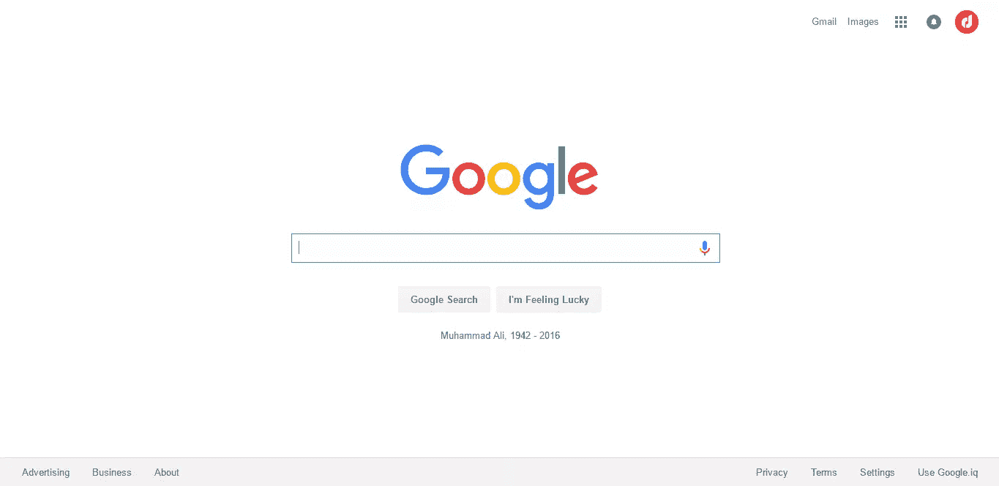

近 20 年后，我们很难完全理解这个设计决定有多么激进，但我们知道它把他们带到了哪里。

## 空白有两种类型

**活动留白:**这是设计中元素之间的空间，通常是为了强调和构建而添加的。这种类型是非对称的，使设计看起来更加动态和活跃。

**被动空白:**这是一行上个单词之间的空间*，或是围绕一个标志或其他图形元素的空间。*

看看 500px 的主页，看看主动和被动空白是如何使用的。

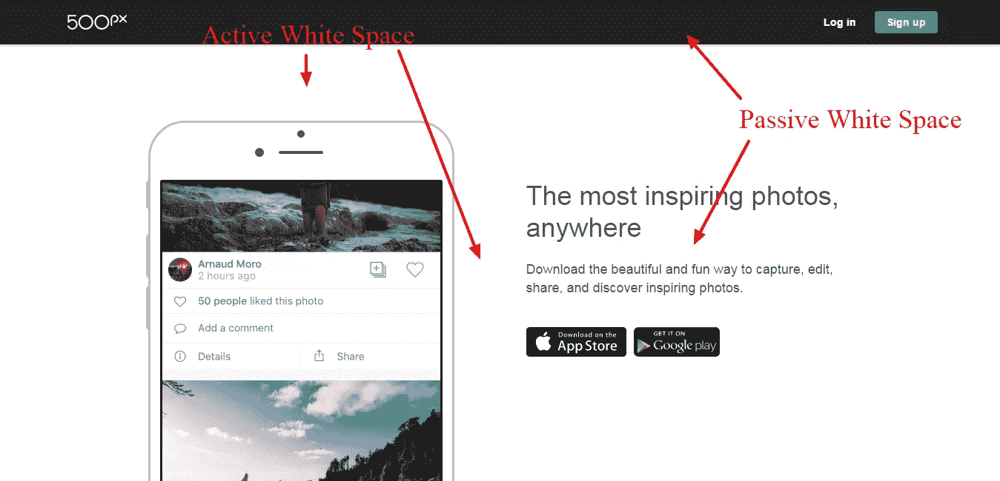

在处理空白空间时，我们最关心的是*主动空白空间*，但是我们仍然需要密切关注被动空白空间以及它如何与我们的总体设计一起工作。

## 空白有两种尺寸*:* 

 ***微空白:**是字母和单词之间以及相邻图形元素之间的较小空白区域的术语。调整设计中的微空白通常会调整设计的整体基调，而不会改变其“核心”——类似于在舞曲中调低 BPM。这是同一首歌，但更困。

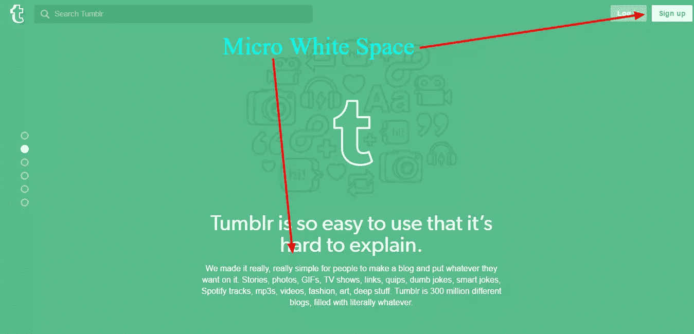

如上图所示，你可以看到“*登录*”和“*注册*”按钮之间的空白，以及标题和段落之间的微小空白。

**宏空白:**是指大量的空白，如栏或段落之间的空白。优化你的“宏空白”通常会彻底改变你的设计，有可能改善你的用户在整个网页上的流动和节奏。

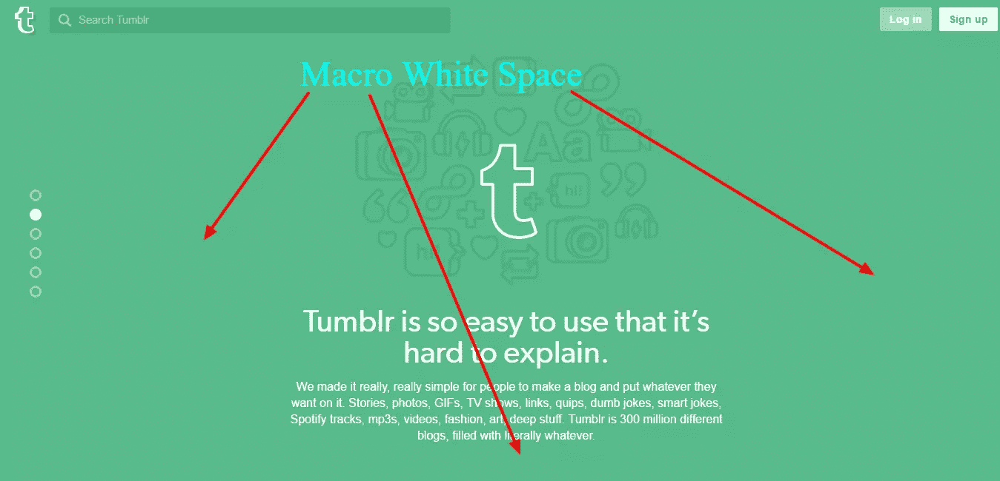

侧边和空页脚清楚地代表了 Tumblr 设计中的“宏观空白”。

## 留白*真的是*白吗？

虽然“空白”一词似乎暗示着缺乏色彩或色调，但这可能会有点误导。白色空间实际上可以是*任何一种在你的设计中代表消极或空白空间的*颜色——黄色、蓝色、绿色，甚至是纹理或照片(如下面的 Todoist 示例所示)。

尽管你选择什么颜色并不重要，但请记住，颜色和纹理通常比纯白更有趣。即使你选择不同的颜色或质地，这些原则仍然适用。

## 在哪里以及如何使用空白:

### CTA(行动号召)使用空白

总是假设用户不知道下一步去哪里，并相应地设计你的留白。这个想法本身很简单，如果页面中的按钮附近没有任何东西，这意味着下一个按钮应该被点击。

另一方面，如果页面在按钮附近塞满了元素，用户甚至会因为混乱而看不到按钮。

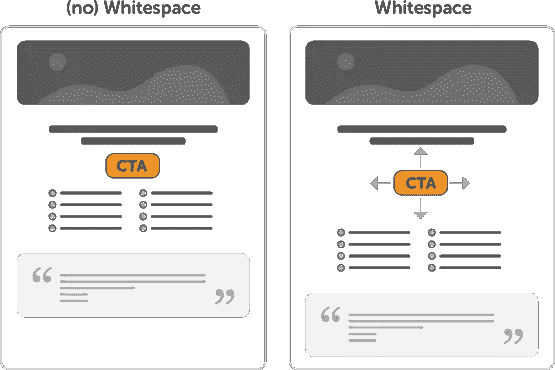

正如您在上面看到的，第二个 CTA 比第一个更容易交互，因为它没有被所有元素覆盖。

### 将空白用于情感反应

在设计中有很多方法可以唤起情感，包括字体、颜色和意象。虽然所有这些都有助于增加戏剧性，但可以说空白可以以最低的设计成本为页面添加最多的戏剧性和情感——有些人可能会称之为“物超所值”。

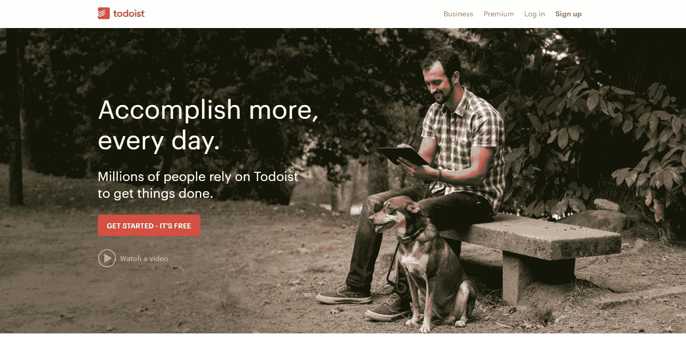

正如你所看到的， *Todoist* 在主标题周围使用空白，这反过来让背景图像发光，从而传达一些积极的情绪。他们使用了一个快乐的人的图像，而不是应用程序本身，这也是一个很大的优势。

### 抵制填空的冲动

作为设计师——以及一般的人类——我们有一种自然的倾向，想要用“东西”填充我们找到的空间。如果我们买一个更大的壁橱，或者车库或房子，我们很快就能填满这个新空间。

这种习惯也经常渗透到我们的设计中。每当我们看到设计中的空白区域，我们就开始思考"*我能在那里添加什么？*”。这种心态对设计师来说可能是个问题。

因此，与其在你的设计中填充元素，不如尝试在页面中间放置一个 [CTA](https://en.wikipedia.org/wiki/Call_to_action_(marketing)) 按钮，并在它周围创建一个“安全区”(空白区域)。永远记住**空的空间不是浪费的空间**。

## 谁能很好地利用空白？

纵观历史，大众一直是杂志广告中空白空间的大师。从一开始，在杂志广告主要是繁忙和静态的时候，他们简单而动态的布局就像一盏明灯一样引人注目。

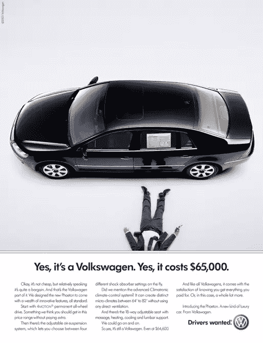

你可以清楚地看到汽车上方和下方的宏观空间，这使得汽车本身成为读者关注的焦点。白色空间的不对称形状让我们的眼睛在车内四处游走，沿着文本上下来回移动，永不停歇。

如果我们有点厚脸皮，重新配置这个大众广告，去掉这些额外的空白，会发生什么？

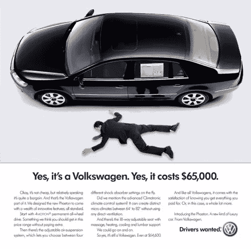

所有的主要组成部分似乎仍然存在，但广告的功能远不如现在有效

*   这辆车似乎没那么令人印象深刻
*   我们的眼睛不再自由流动
*   晕倒男子的故事更难梳理出来

我们打破了它。可以肯定地说，不要带着这件作品去参加你在大众的设计面试。

正如你在下面看到的，从 20 世纪 60 年代到今天，大众一直在继续使用留白来达到很好的效果。

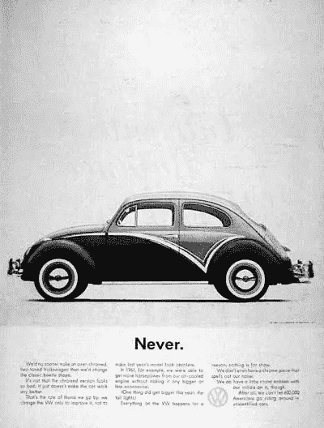

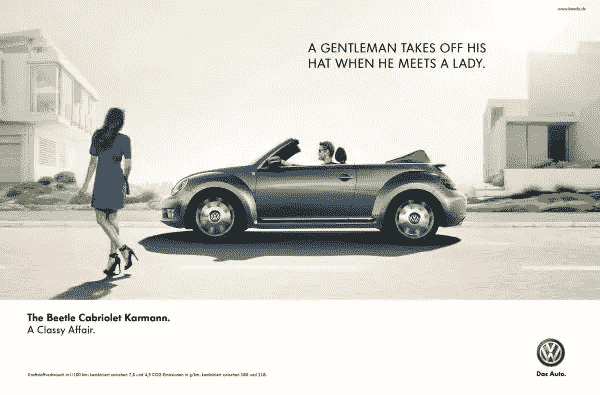

虽然与大众相比，苹果是一个相对较新的公司，但它也一直是白色空间设计的主要倡导者——从他们的网站到他们的硬件，再到他们著名的苹果商店的内部设计和建筑。

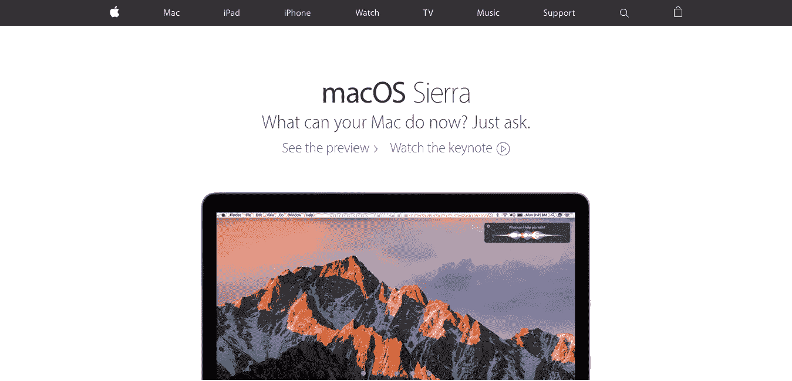

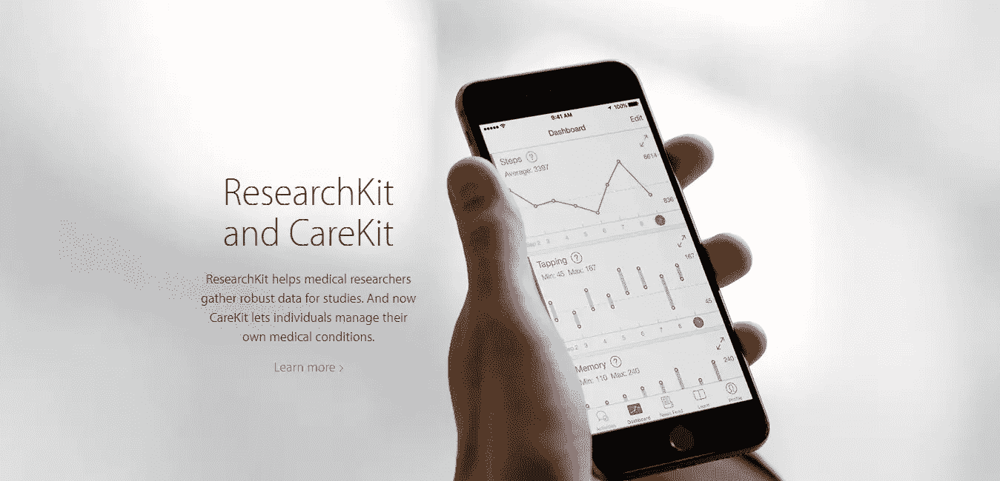

## 结论

因此，我们了解到白色空间是**而不是**白色，它是我们设计中什么也没有发生的部分。这是一个任何设计师都不应该忽视的基本设计原则，因为它决定了一个页面是否可用，以及某个特定元素是否得到了应有的关注。

我们了解到空白有两种不同的类型(主动与被动)，以及两种不同的大小(微与宏)。我们看到了在喜剧(喜剧计时)中如何使用空白的例子，以及它如何让人们笑得更多，还有音乐中的例子。

最后，我想补充一点，作为一名设计师，你应该记住少即是多，并相应地工作。空白要么成就你的设计，要么破坏它。

我希望这些想法对你的下一个设计有所帮助。

## 分享这篇文章**