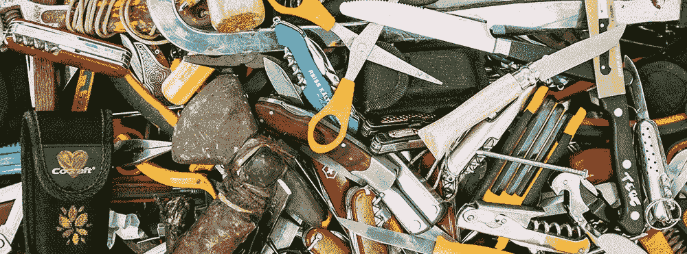

# 想要帮助构建物联网吗？从这里开始

> 原文：<https://www.sitepoint.com/want-to-help-build-the-internet-of-things-start-here/>

SitePoint 的第 10 周！整个星期，我们都在发布关于互联网和物理世界的交集的文章，所以请继续查看[物联网标签](https://www.sitepoint.com/blog/)以获取最新更新。

物联网即将到来。设备之间的联系越来越紧密——企业和消费者可以随时随地访问有用的信息。变化就在这里，我们正在适应。

围绕物联网能为消费者做些什么，人们兴奋不已。可穿戴设备、健康设备、智能家居和智能城市吸引了所有媒体的关注。它们明亮、浮华，公众会立刻联想到它。

那里当然有很多机会，但对于开发者、设计师和前瞻性思考者来说，物联网还有另一个同样迷人的部分:整个事物背后的想法、技术、信息和基础设施。正是这些创新帮助我们开发更好的互联系统，并为所有以消费者为中心的亮丽物联网应用提供支持。

我们将深入探讨物联网基础设施的关键部分，听取专家的意见，提供简要概述，然后分享一些商业想法和灵感，作为建立一家令人兴奋的初创公司的起点。

## 大数据和物联网

> “许多 IT、商业智能和分析经理已经不再问‘什么是物联网？’相反，他们开始问，“物联网产生的数据的商业价值是什么？为了实现这一价值，我们需要做些什么？"–[TechTarget](http://searchbusinessanalytics.techtarget.com/essentialguide/IoT-analytics-guide-Understanding-Internet-of-Things-data)

物联网设备不断地发送和接收信息。这些数据对企业非常有帮助。数据挖掘和分析所有这些信息可以提供非常有用的见解，使他们变得更有效率。能够利用这些信息并使其可访问和相关的企业将会非常受欢迎。

### 想法和灵感

*   为其他企业创建门户、仪表盘和交互式报告，以实时和历史地跟踪物联网数据。
*   开发智能分析技术，将数据转化为有用的、有洞察力的信息，以推动业务决策。
*   将物联网数据与客户行为相结合，预测客户未来的行为。
*   个人物联网——根据客户过去与物联网设备的交互方式来个性化客户体验。

## 物联网安全和保护

> “将需要安全技术来保护物联网设备和平台免受信息攻击和物理篡改，加密它们的通信，并应对新的挑战。”——[尼克·琼斯，高德纳](http://www.gartner.com/newsroom/id/3221818)。

我们需要看到大量改进的主要领域之一是保护物联网设备。有许多不同的系统、协议和技术控制着物联网设备之间的数据流动。这总是意味着安全性存在漏洞，我们需要保护自己免受恶意软件、黑客和其他问题的攻击。随着越来越多的设备上线，专注于物联网技术的安全企业应该会快速增长。

### 想法和灵感

*   一家提供物联网设备安全建议的专业咨询公司。
*   创建新的算法、加密和标准来保护物联网数据。
*   如果消费者和企业的物联网设备遭到黑客攻击，构建能够向消费者和企业发出警报的设备。
*   识别物联网系统中可能被黑客入侵的漏洞。
*   创建可更新的硬件和软件，轻松修补物联网设备以应对漏洞。

## 部署和管理物联网设备

> “物联网设备对网络的影响才刚刚开始被感受到，因为尽管设备的数量一直在快速增长，但它们还没有给现有的容量带来压力。”–[Eric Hanselman，451 Research](https://451research.com/biography?eid=500)

随着物联网呈指数级增长，我们的网络和流程的容量将受到考验。随着每年数十亿设备的增加，容量和网络需要小心管理。目前，我们的网络是为交换大量数据的较少连接而设计的。我们的网络需要转型，因为物联网需要更多低数据量的连接。物联网部署和网络管理初创公司可以极大地影响物联网的未来方向。

### 想法和灵感

*   智能部署系统，了解哪里需要物联网设备(基于测量/分析),并将物联网设备部署到正确的位置。
*   集成容量管理咨询，帮助企业了解其网络需要经历的变化。
*   能够提供物联网网络端到端升级以实现更高性能的专业工程师。
*   创建更高效的方式来利用物联网设备中的数据，降低带宽负载。

## 为物联网设备供电和维修

> “物联网设备应该部署在‘任何地方’，并且可以从‘任何地方’在‘任何时间’访问……[这]意味着对物联网设备的能量存储和电源管理有严格的要求，以确保它们的‘永久’运行。”–[IEEE 物联网](http://iot.ieee.org/newsletter/november-2015/powering-iot-devices-technologies-and-opportunities.html)

物联网设备的部分吸引力在于它们的尺寸以及在任何位置安装它们的能力。因为它们通常被设计成无需电缆和维护，所以确保它们有足够的电力并能持续工作是一个挑战。企业将寻求专家来帮助他们保持正常运行，并确保他们的物联网设备以最高效率工作。

### 想法和灵感

*   实时提供物联网设备“适用性”和“可靠性”的操作概述。
*   在物联网设备中内置可靠性传感器，以便它们能够在电量不足或遇到问题时进行自我报告。
*   创建允许物联网设备从环境中获取能量的技术(例如，太阳能、无线充电、辐射充电和热电充电)。
*   设计模块化物联网技术，允许零件轻松换入或换出。

## 创建物联网操作系统和软件

> “无论是当前运行在互联网主机上的传统操作系统，还是用于传感器网络的典型操作系统，都无法同时满足如此广泛的[物联网]设备的各种需求。”–[研究之门](https://www.researchgate.net/publication/236883971_Operating_Systems_for_the_IoT_-_Goals_Challenges_and_Solutions)

Android、iOS 和 Windows 等传统操作系统并不适合物联网设备。因为这些设备被设计为仅执行少数特定任务，所以它们的操作系统和软件通常需要针对每个设备进行定制。固件需要考虑处理能力、功率、通信、传感和许多其他要求。就像硬件一样，对专业软件和操作系统开发的需求也会很大。

### 想法和灵感

*   针对特定需求调整和创建物联网操作系统、软件和固件。
*   将合适的物联网软件和硬件配对，考虑功能需求和硬件占用空间。
*   为物联网开发者提供故障排除服务。

## 开发物联网硬件

> “[物联网]已经从高水平的宣传转向具体的想法和产品，越来越多的企业开发人员社区正在急切地寻找适合快速原型开发的硬件或部署其想法的设备。”–[见](https://thingsee.com/blog/quality-hardware-list-for-your-iot-projects)

有数百种不同的方法来原型化、测试和构建物联网硬件。物联网的硬件开发仍处于“蛮荒西部”地区，每个制造商都使用不同的方法和技术。物联网设备有非常具体的技术需求——低功耗、良好的加密、正确的固件、适当的数据交换等等。寻找一种低成本的方法来快速原型化和构建物联网设备对于组织来说至关重要。

### 想法和灵感

*   基于对客户特定需求的最佳物联网硬件类型的理解、审查和建议的咨询服务。
*   为独特的应用、环境和行业打造定制的物联网硬件。
*   构建模块化物联网设计，以便以更低的成本添加或删除不同的功能。
*   了解物联网设备的确切要求并快速创建原型。
*   管理创建物联网硬件的端到端流程的项目。

## 让物联网设备更加精确、可靠和反应灵敏

> “当处理精密机器时，如果时间相差一毫秒，就可能发生故障，遵守严格的要求对机器操作员、机器和企业的健康和安全至关重要。”–[首席信息官](http://www.cio.com/article/2872574/it-industry/5-key-challenges-facing-the-industrial-internet-of-things.html)

物联网设备，尤其是工业中的物联网设备，是为精确、高通量的任务而设计的。重要的是，这些设备非常可靠，能够立即做出反应，并且准确无误。随着物联网变得越来越普遍，这些设备的质量需要提高，因为有时故障不是一个选项。一家致力于开发极其精确、快速反应的物联网设备的初创公司可能会看到工业应用的大量需求。

### 想法和灵感

*   测试物联网构建和材料的可靠性和准确性。
*   创建超灵敏、超快速的软件和操作系统。
*   就部署物联网设备的最佳方式提供工程和 IT 专业知识。

## 允许物联网设备感知其环境

> “传感器技术的时代已经来临。如今，体验不使用传感器为用户创造新体验的电子消费产品是不寻常的。”–[Mouser 科技公司](http://www.mouser.com/applications/sensor-fusion-iot/)

物联网设备的主要目的是感知周围的世界，处理这些数据，并将其发送到其他系统，以进行人工或自动响应。因为传感器是物联网不可或缺的一部分，所以出现了大量的设计和创新，但仍有一段路要走。构建可靠、集成、复杂的传感器是整个物联网最强大的使能因素之一。

### 想法和灵感

*   开发能在恶劣和极端环境下工作的传感器。
*   基于许多不同的“感觉”创造传感器——视觉、听觉、嗅觉、触觉、距离、时间、速度、移动性、无线电频率、光和运动。
*   为医疗、科学、研究和其他目的制造专业传感器。
*   增加现有传感器的耐用性。

## 了解物联网生态系统

> “[物联网]标准及其相关的 API 将是必不可少的，因为物联网设备将需要互操作和通信，许多物联网商业模式将依赖于在多个设备和组织之间共享数据。”–[Gartner](http://www.gartner.com/newsroom/id/3221818)

由于物联网硬件、软件、操作系统和协议的种类繁多，物联网设备的集合各自都有自己的生态系统。这意味着在这些封闭网络之外的交流变得更加困难。尽管随着时间的推移，这些系统可能会变得更加标准化，但仍然需要做大量的工作。任何为物联网开发和部署提供更多一致性和开放标准的企业都将能够利用这一点。

### 想法和灵感

*   创建允许不同物联网系统相互通信的接口。
*   将物联网系统升级到通用框架，实现更好的互操作性。
*   帮助企业了解其物联网生态系统在可扩展性、可靠性、资金价值和业务成果方面的意义。

有很多机会可以为物联网基础设施和生态系统打造出色的业务。这些想法只是种子——你可以用来建立并成长为有影响力的初创公司的起点，帮助推动我们的下一次技术革命。

请在评论中分享你自己关于物联网的想法和经验。

## 分享这篇文章