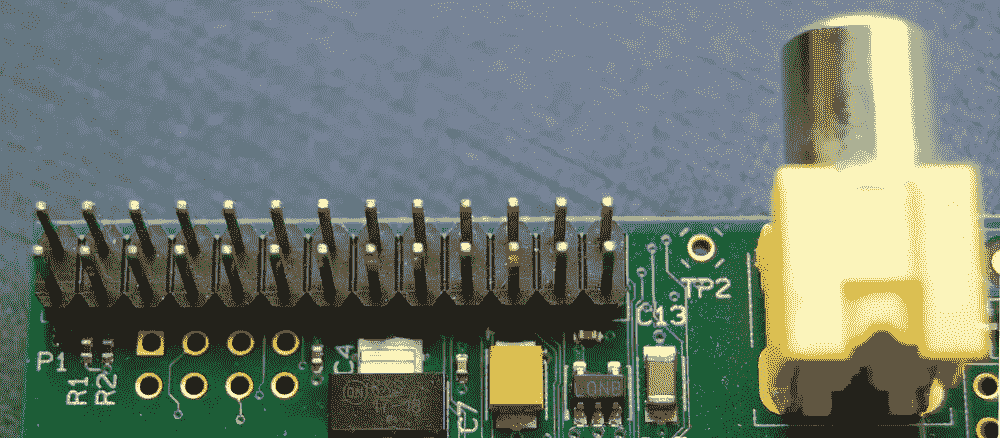
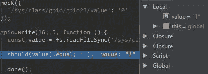

# Node.js 中的 Raspberry Pi GPIO 引脚入门

> 原文：<https://www.sitepoint.com/getting-started-with-the-raspberry-pi-gpio-pins-in-node-js/>


SitePoint 的第 10 周！整个星期，我们都在发布关于互联网和物理世界的交集的文章，所以请继续查看[物联网标签](https://www.sitepoint.com/blog/)以获取最新更新。

物联网现在风靡一时。在物理计算领域，我们有如此多的想法可以付诸实践，很容易被吸引到对我们生活的世界进行编程的想法中去！一旦你有了树莓派和面包板，下一步是什么？

在本文中，我们将探讨如何使用 Node.js 访问 Raspberry Pi 上的 GPIO 引脚。通过 GPIO 引脚，您可以直接对硬件进行编程。JavaScript APIs 实现了无缝连接。API 是通用技术的抽象，它们可以从任何地方获得。Node.js 解释器在单个进程中运行，这为以可测试的方式编写代码开辟了道路。最让我兴奋的是，你可以像任何其他 JavaScript 程序一样编写单元测试、命中断点和检查代码，所有这些都可以在你的计算机上完成。

让我们开始吧。

## 什么是 GPIO？

GPIO 代表[通用输入/输出](https://www.raspberrypi.org/documentation/hardware/raspberrypi/gpio/README.md)。它们是在树莓派的侧面找到的引脚，紧挨着黄色视频输出插座。下面是它们的样子。



来源:树莓派

把它们想象成你从 Pi 连接到外部世界的方式。这使你能够编写不在计算机屏幕上运行的程序。每个引脚就像一个开关，你可以打开或关闭。你可以从现实世界接收输入，或者发送输出。基本板有 26 个引脚，其中 9 个是电源或接地引脚。接地引脚位于电流必须流经的每个电路的末端。最近的 Raspberry Pi 板带有一组额外的 14 个引脚。

如果您对 GPIO 引脚的更多细节感兴趣，[这个在线图表](http://pinout.xyz/)为您提供了了解每个引脚用途所需的一切。有无数的引脚用于输入/输出和接地。这些引脚是物理计算的基础。根据您的目标，您可以根据需要使用任意多个。

## 嘲笑一下`fs`！

我知道你在想什么，到底是什么，我为什么要在乎？在类 Unix 操作系统中，[设备文件](https://en.wikipedia.org/wiki/Device_file)是一个看起来像文件的驱动程序。用 laymen 的话来说，设备驱动程序就是一个文件！你猜怎么着？GPIO APIs 是读写设备文件的包装器。文件系统 API 是您可能已经熟悉的概念。如果您从未使用过 Node.js 中的文件，我建议您浏览一下 Node.js 中的 [`fs`模块和文件系统](https://www.sitepoint.com/accessing-the-file-system-in-node-js/)。`fs`是“文件系统”的简写，使你能够读写普通的旧文件。这里没有什么花哨的，我们所做的就是比如`writeFile()`，而让 GPIO 处理剩下的。诀窍是知道在哪个文件上写什么。

有一个方便的小 npm 包叫做 [mock-fs](https://www.npmjs.com/package/mock-fs) ，它将帮助我们进行单元测试。有了这个库，人们可以在文件系统中想象出任何文件，并在内存中模仿它。最根本的是我们只处理文件，这就是我们需要做的。在类似 Unix 的系统中，GPIO 的行为就像任何其他普通的旧文件一样。这给了我们如何实现这个解决方案的自由。

`mock-fs`库的关键是`mock({})`函数。它接受一个 JavaScript 对象的参数。在这个参数中，你可以设计出任何你想要的文件。这里的美妙之处在于这些都在内存中运行，所以你可以疯狂地进行单元测试。解释器在单个进程中运行，这意味着可以在运行时覆盖`fs`模块。JavaScript 是一种动态语言，所以我们可以随意模仿当前进程中可用的任何模块。

一旦你在 GPIO 接口上编写了好的单元测试，它就更有意义了。我喜欢的是你可以得到自动化的测试覆盖和一个干净的解决方案。单元测试提高了代码的可读性，因为它清楚地向您展示了 API 的用途。

所以让我们把手弄脏吧。

## 单元测试所有的东西

因此，让我们打开一个带有“out”的引脚，并对此进行测试:

```
it('opens a pin with out', function (done) {
  mock({
    '/sys/class/gpio/gpio23/direction': ''
  });

  gpio.open(16, 'out', function () {
    const direction = fs.readFileSync('/sys/class/gpio/gpio23/direction').toString();

    should(direction).equal('out');

    done();
  });
}); 
```

该测试的实现应该将物理引脚 16 映射到 GPIO 中的 BCM 引脚 23。BCM 号是内核将在设备驱动程序中看到的 Broadcom pin 号。 [GPIO 设备驱动](http://raspberrypi.znix.com/hipidocs/topic_gpiodev.htm)给你一个设备文件所在位置的概览。如图所示，要打开一个 pin，您将字符串“out”写入`/direction`。这告诉 GPIO 我们希望写入此引脚。完成后，检查文件是否有它需要的内容。`mock`来自`mock-fs`库，`fs`是 Node.js 中的标准文件系统，内核说路径在哪里——3.18 . x 及以上版本在`/sys/class/gpio`。

要写入电路板上的一个引脚并进行测试，可以这样做:

```
it('writes to a pin with a high value', function (done) {
    mock({
      '/sys/class/gpio/gpio23/value': '0'
    });

    gpio.write(16, 5, function () {
      const value = fs.readFileSync('/sys/class/gpio/gpio23/value').toString();

      should(value).equal('1');

      done();
    });
  }); 
```

`gpio.open()`和`gpio.write()`有相似之处。通过写操作，这将写入一个`/value`文件。为了进行健全性检查，我写了一个超高的值 5，但是我们期望在测试中只有 1。GPIO 只接受高值或低值，就像二进制一样。

我从 [pi-gpio](https://github.com/rakeshpai/pi-gpio) 中提取了实现细节。这个库给你一个很好的概述，每个引脚去哪里。您还可以在内核中查找设备文件。不管是哪种方式，我的目标都是让你很好地掌握基本面，这样你就能有一个清晰的画面。

让我们疯狂一下，在我的单元测试中点击一个断点怎么样？我用 WebStorm 来做到这一点，同样，用你觉得舒服的任何东西:



对于合理的编程，关键是要缩短发现 bug 的反馈循环。单元测试是收紧循环并获得即时反馈的好方法。

为简单起见，我只写给一根针。GPIO 的其余部分以同样的方式总结。打开一枚别针，告诉它你想用它做什么。读取或写入 pin，无论你需要做什么。低级 API 是器件文件，因此您可以选择如何对每个引脚进行编程。

## 眨眼演示

为了充实每个单元测试，让我们看看一些常见的变量:

```
var sysFsPath = '/sys/class/gpio/gpio';
var pinMapping = {
  '16': 23
}; 
```

上面，我已经定义了 GPIO 中的管脚映射和设备驱动的路径。下面的代码查看打开并写入 pin 的代码:

```
function open(pinNumber, direction, callback) {
  const path = sysFsPath + pinMapping[pinNumber] + '/direction';

  fs.writeFile(path, direction, (callback || noOp));
}

function write(pinNumber, value, callback) {
  const path = sysFsPath + pinMapping[pinNumber] + '/value';
  value = !!value ? '1' : '0';

  fs.writeFile(path, value, 'utf8', callback);
}

function noOp() {} 
```

如图所示，我们所做的就是`writeFile()`到一个设备文件。在没有回调的情况下，`noOp`是一个虚拟回调。有了这个实现细节，我就可以通过测试，并确信它会工作。写操作上的`value`确保它将被设置为高或低(`'0'`或`'1'`)。

最后，是一个使用上述 API 的工作指示灯演示:

```
gpio.open(16, 'out', function () {
  var on = 0;

  var blinker = setInterval(function () {
    gpio.write(16, on, function () {
      on = (on + 1) % 2;

      console.log('ON = ' + on);
    });
  }, 1000);

  setTimeout(function () {
    clearInterval(blinker);
  }, 12000);
}); 
```

每秒钟调用一次`setInterval()`,在回调中，我告诉它用一个模数切换 pin。`blinker`有间隔，`setTimeout()`用它在 12 秒后清零。`setTimeOut()`中的回调完成作业并结束程序。

要运行示例代码，请键入:

```
sudo npm start
```

(您需要管理员权限才能访问 Raspberry Pi 上的 GPIO)

我希望从这个演示中 GPIO 看起来更直观。它需要一个有方向的开针。然后，写入一个引脚，让 GPIO 处理剩下的细节。

## 结论

测试驱动的方法非常适合物联网。在物联网中，你的想象力是极限。Raspberry Pi 可以部署在世界上的任何地方——对于物理计算，您不希望将硬件运送到世界的另一端来调试代码。有了测试驱动的方法，就有了工作解决方案的即时反馈和保证。你的工作效率更高，并且可以收紧反馈回路。

我喜欢 GPIO APIs 的一点是，它可以简化为一个封装在`fs`模块周围的包装器。这让您可以完全自由地编写干净且可测试的代码。

示例演示的其余部分在 [GitHub](https://github.com/sitepoint-editors/TddWithGpio) 上。

## 分享这篇文章