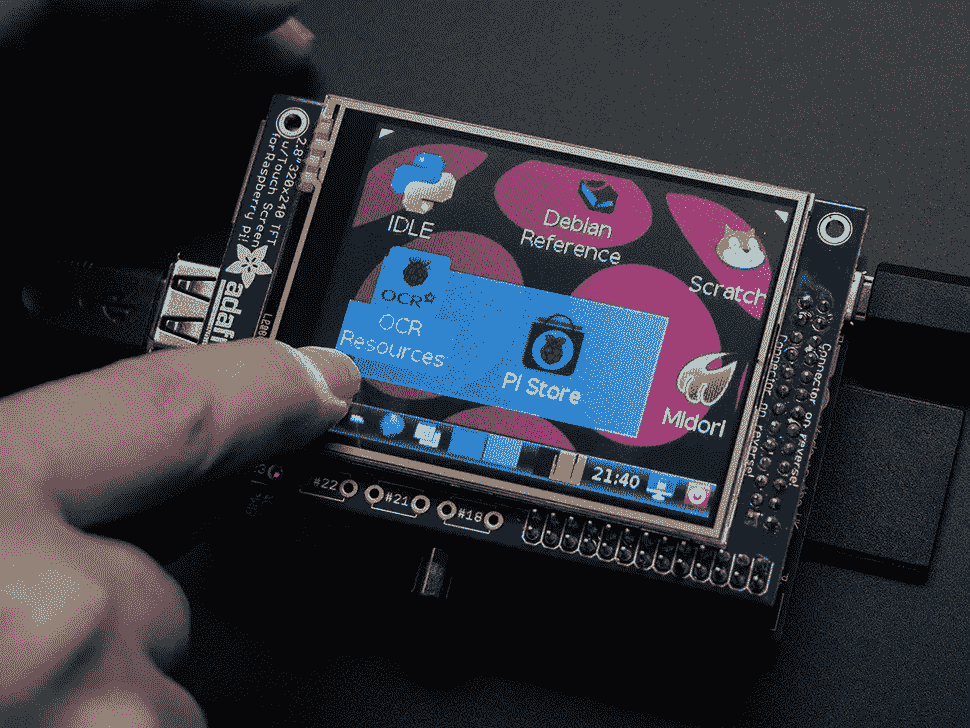
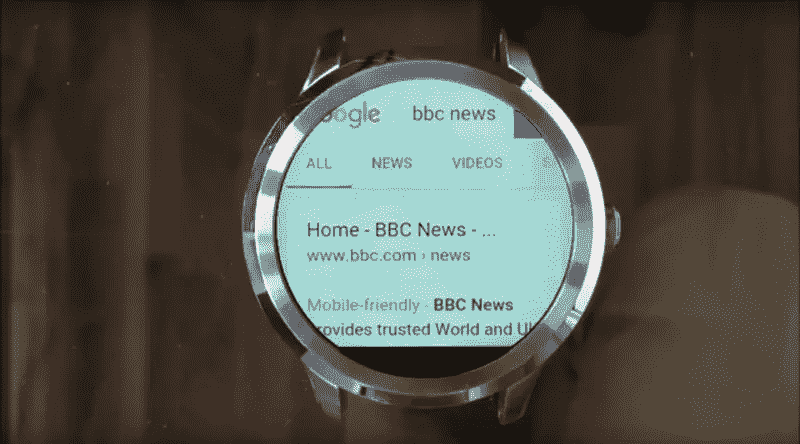
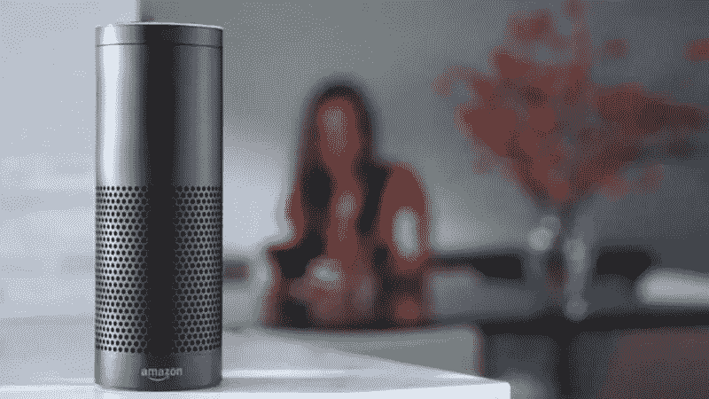
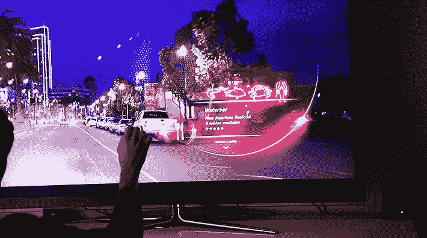
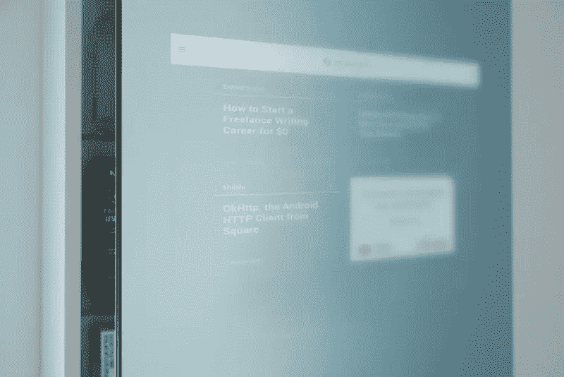

# 物联网世界中的前端开发

> 原文：<https://www.sitepoint.com/the-future-of-the-web-in-an-internet-of-things-world/>

SitePoint 的第 10 周！整个星期，我们都在发布关于互联网和物理世界的交集的文章，所以请继续查看[物联网标签](https://www.sitepoint.com/blog/)以获取最新更新。

万维网在其 27 年的历史中不断发展和演变。在这段时间里，我们如何显示和设计内容经历了不同的阶段，最近的一个阶段是出现了一个*响应式 web*——一个适应多种浏览器和设备大小的 web。当涉及到一个拥有越来越多“物联网”(IoT)设备的网络时，如 Raspberry Pis、智能手表、仅通过语音工作的个人助理等等，响应式网络的潜力将受到考验。

物联网意味着更多种类的设备可能会尝试从网上下载内容。如果我们要避免像早期移动设备和桌面设备之争中那样的大分割，我们需要确保这些设备仍然可以访问和使用网络。我们最不想要的是一个为物联网设计的网站，一个为移动和桌面网站设计的网站。

## 哪些物联网设备可能会显示网络？

许多开发者并没有意识到未来可能会有大量的设备试图向人们展示网络内容。

### 具有小显示器的计算设备

Adafruit 公司的 2.8 英寸触摸屏

像 [Raspberry Pis 这样的设备配有 2.4 英寸及更高尺寸的小屏幕](https://www.adafruit.com/categories/804)，有 Wi-Fi、以太网甚至 3G/4G 连接，这给了它们显示网络内容的巨大潜力。该内容可以以来自万维网的网页的形式出现，或者可以以嵌入式设备手册的本地网页、基于网络的设备控制页面和本地仪表板风格网页显示的形式出现。

### 智能手表

appfour 的 [Android Wear 网页浏览器](https://play.google.com/store/apps/details?id=com.appfour.wearbrowser&hl=en)

智能手表可以有更小的显示屏，有各种不同的颜色范围和屏幕分辨率。虽然 Apple Watch 还没有网络浏览器，但 Android 已经有了 Appfour 的 Android Wear 网络浏览器，随着时间的推移，更多的智能手表网络浏览器很可能会出现(假设有人破解了如何以易于使用的方式设计应用程序！).最起码，如果网络真的能随时随地响应和访问，我们应该为这种可能性做好准备。如果将来有人在智能手表上阅读电子邮件并点击一个网络链接，会发生什么？在功能强大的智能手表上安装一个简单的网络浏览器客户端并不太牵强。

### 语音个人助理

亚马逊回声(图片来源:[亚马逊](https://www.youtube.com/watch?v=FQn6aFQwBQU)

计算领域的一个新趋势是智能语音助手，如苹果的 Siri、亚马逊 Echo 的 Alexa、Google Now 和微软的 Cortana。这些助手在家里的作用将是开灯和关灯、设置闹钟、调节恒温器的温度等等。这些服务还会用从网上不同地方获取的数据来回应语音命令和问题——通常这需要将每个公司的信息数据库与它可以获得的使用该服务的人的详细信息进行配对。对于那些对该领域感兴趣的人，我过去曾在 SitePoint 上报道过如何开始构建自己的简单人工智能助手，包括一篇关于 2016 年构建人工智能的五种简单方法的文章[和一系列关于](https://www.sitepoint.com/five-simple-ways-to-build-artificial-intelligence-in-2016/)[如何使用 Api.ai](https://www.sitepoint.com/how-to-build-your-own-ai-assistant-using-api-ai/) 构建自己的人工智能助手的文章。

随着时间的推移，随着人工智能和机器学习的进步，这些助手可能会在网络上搜索信息，然后读给我们听。

为了让这成为可能，网络需要能够被机器人访问，机器人将计划读出信息，而不是可视化地显示它。理想情况下，网页的结构应该已经适合屏幕阅读器，然而，采用可访问标记通常是事后的想法。个人助理人工智能服务的出现可能会有助于改变这种情况。

### 全新的展示

当谈到物联网时，未来的计算机显示器可能包括一系列新的和非常奇妙的可能性。想想像智能镜子、智能窗户、智能汽车仪表盘这样的设备——它们会在我们的生活中不经意地出现，但是网络在它们上面的显示会有多好呢？一系列新的设计决策出现了——为了在镜子/窗户上显示内容，你可能需要更多的颜色对比。镜像/窗口显示可能有一个有限的颜色范围，这是 web 开发人员需要考虑的。这将是一个全新的(令人兴奋的)世界。

奔驰仪表盘原型(图片来源:[奔驰](https://www.mercedes-benz.com/en/mercedes-benz/design/the-car-as-a-medium/))

## 面向未来的 CSS 和标记

如果我们要有一个与新技术配合良好的网站，我认为有几个关键领域是网站开发者在未来需要密切关注的。

### 真正响应的 CSS

网页需要适应并在小显示器上具有相对的可读性。从 CSS 的角度来看，检测极小的显示分辨率可能是关键。微型显示器的 CSS 方法会类似于移动网站吗？或者我们是否需要创建新的规则和标准来帮助以更大的字体显示文本？使用 flexbox 等技术重组小屏幕布局的新标准？微型显示器上菜单样式的新标准？只有时间能告诉我们，但一些精选的 web 开发人员可能最终会成为这项工作的先锋，看看社区会做出什么将是令人着迷的。

### `<picture>`元素

picture 元素允许我们根据分辨率和设备类型指定要显示的多个图像。该规范的最终版本将是确保在连接速度较慢的低功耗设备上加载页面时，以及在分辨率非常低、无法显示大图像的设备上加载页面时，网站能够平稳运行的关键。

### JavaScript 依赖是危险的

当查看将读取网页内容的低功率设备和个人助理设备时，它们可能不一定运行 JavaScript 或能够像智能手机或桌面平板电脑一样处理它。如果你的网站依靠 JavaScript 来获取数据而没有任何回退，新的物联网设备可能很难访问它。确保 web 在没有 JavaScript 的情况下也能正常工作仍然是一件值得努力的事情！

### WAI-ARIA 和其他无障碍技术

已经到位的使残疾人能够访问网络的技术也将使人工智能、个人助理和其他基于语音的技术能够访问网络。今天从一开始就考虑到 WAI-ARIA 和其他可访问性技术来构建网站，这将有助于减少未来的重复工作。这对今天的残疾人来说也非常有用，尽管如此，这仍然是一个很好的实践。我们已经在[如何在 HTML5](https://www.sitepoint.com/how-to-use-aria-effectively-with-html5/) 和[中有效地使用 ARIA，以及](https://www.sitepoint.com/avoiding-redundancy-wai-aria-html-pages/)如何在 HTML 页面中避免 WAI-ARIA 冗余中详细介绍了这一点。

### 颜色和设计选择

基于镜子和窗户的显示器在你的设计中可能需要高对比度的颜色，以确保在浴室场景、天空或其他房间等更多样的背景下清晰可见。

智能镜子等显示器可能会显示类似于当前操作系统上的“高对比度模式”的内容，该模式会反转屏幕颜色并提高对比度。为了在这种不同风格的显示器上显示，智能镜子可能需要采用类似的技术。如果你的网页设计在高对比度模式下显示良好，并且在你的主题中有强烈的颜色对比，这应该不是太大的问题。

我的艺术家对高对比度现场的印象指向 [Max Braun 的概念智能镜](https://medium.com/@maxbraun/my-bathroom-mirror-is-smarter-than-yours-94b21c6671ba#.lnf3gdctt)

## DOM 复杂性

虽然台式电脑和智能手表能够处理具有大量嵌套元素和 CSS 过渡的复杂 DOM 结构，但物联网设备和可穿戴设备完全有可能在这些方面遇到困难。对于新设备的性能来说，保持 DOM 元素的结构整洁可能比以往任何时候都更重要。

## 测试将变得越来越困难

在智能手机、平板电脑、智能电视和桌面操作系统上测试你的网站已经非常困难了——随着物联网和其他技术的不断进步(虚拟和增强现实也将到来！)，对所有东西进行彻底测试将变得越来越困难。采用网页标准、可访问性标准和上面提到的想法应该有助于使网页设计尽可能地具有可访问性。

在未来的十年里，一定程度的预见将是专业网页开发人员的必要技能，因为他们需要设想网页设计将如何在一系列设备上调整和显示，而无需实际接触来测试每一个设备。希望模拟器和自动化测试也能有所帮助。

## 无处不在的 API

响应式网络不会是物联网唯一基于网络的信息来源。响应式网络将有一个同样重要的伙伴，也是我之前讨论过的东西——无所不在的 API。这将是 web 的服务器端等价物，应该能够在 web 浏览器本身无法到达的领域快速迭代和适应新兴技术。无所不在的 API 是一种以平台无关的方式从应用程序/服务提供对功能和数据的访问的 API。缺乏无处不在的 API，再加上反应灵敏的 web 不能足够快地适应，将导致每一项新的新兴技术出现巨大的分割。

两者共存至关重要。我们的响应式 web 应该由来自无处不在的 API 的内容填充，这些内容可以适应各种技术。没有网络浏览器的设备应该有从无处不在的 API 填充内容的应用程序。一旦设备可以访问 web 浏览器，该内容也应该可以通过响应 web 访问。关于无所不在的 API 的更多信息，请阅读我关于无所不在的 API 时代的文章。

## 结论

web 上的前端开发实践不需要通过这些方式来适应物联网和其他技术发展。然而，我认为，如果他们不这样做，网络将被分割成只在桌面上使用，偶尔在移动设备上使用的东西，就像一个响应式网络的真正潜力被移动应用的流行所阻碍一样。如果网络不适应，我们可能会看到可穿戴应用、物联网应用、Alexa 应用等成为自己的孤岛，而不是共享网络的公共生态系统。

​

面对物联网这样的新兴技术，你如何看待前端开发和 web 的未来？请在下面的评论中告诉我，或者在 Twitter 上通过 [@thatpatrickguy](https://www.twitter.com/thatpatrickguy) 与我联系。

## 分享这篇文章