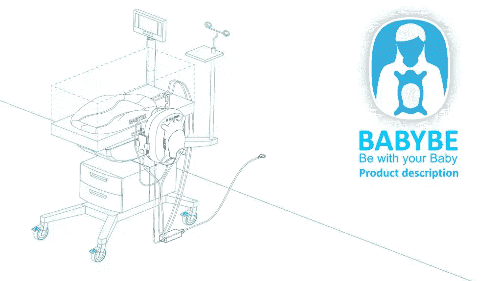
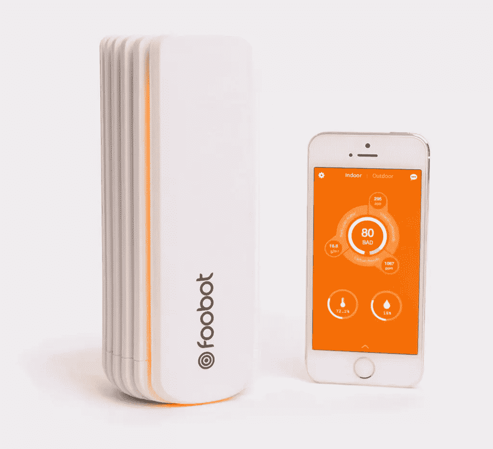
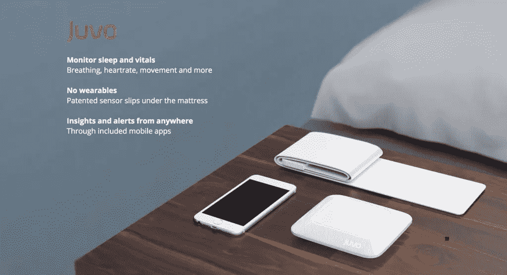

# 新兴物联网市场的 5 个成功案例

> 原文：<https://www.sitepoint.com/5-success-stories-from-the-emerging-internet-of-things-market/>

SitePoint 的第 10 周！整个星期，我们都在发布关于互联网和物理世界的交集的文章，所以请继续查看[物联网标签](https://www.sitepoint.com/blog/)以获取最新更新。

物联网(IoT)是一个描述多种物理设备通过万维网相互连接的术语，经常被当作一个流行词或一种浮华的趋势来宣传。

但截至 2016 年，物联网的重要性已不容忽视。每当烤面包机打开时，可以用来冲洗厕所的技术也可以用于改善产前保健，防止与运动有关的伤害，以及提高我们的室内空气质量。

以下物联网产品证明了物联网对我们的健康和福祉是多么不可或缺，从而超越了财务上的成功。

## 1.宝宝

当婴儿早产时，他们通常会被带到新生儿重症监护室，并被放入保温箱中。这降低了感染的风险，并有助于保持水合作用。这对婴儿的生存至关重要，但这是有代价的:母亲无法与孩子进行身体上的交流。

婴儿医疗公司认为有更好的方法。BabyBe 使用英特尔的 [Edison](http://www.intel.com/content/www/us/en/do-it-yourself/edison.html) 开发板，通过为婴儿复制母亲的心跳和肺部运动，帮助早产儿与母亲建立联系。

这个婴儿由三部分组成。婴儿躺在仿生床垫上，这是一种由气囊和加热元件组成的垫子，母亲将海龟抱在胸前，这是一种模仿婴儿身体感觉的设备。位于保育箱旁边的摇篮将海龟的数据转化为床垫的气动动作。

让早产儿体验母亲的动作和触摸可以加快愈合和发育时间，这意味着住院时间更少，住院费用更少，母子关系更有成就感。

## 2.[震动箱](http://www.theshockbox.com/)

虽然美国最有趣的家庭视频向我们展示了我们有多爱看孩子伤害自己，但与运动相关的脑震荡是一个严重的问题，根据国家体育教练协会的数据，8 至 13 岁儿童中，与运动相关的脑震荡占所有急诊的 58%。但是在物联网世界中，即使是鲍勃·萨吉特也不能妨碍安全。

2011 年，一位名叫斯科特·克拉克的男子看着他 10 岁的儿子在一场曲棍球比赛中受到严重打击。在怀疑他的儿子是否有脑震荡后，他决定做点什么来解决这个特殊的猜谜游戏。因此，他共同创立了 Shockbox，这是一种附着在球员头盔上的设备，使用传感器技术和蓝牙来测量头部撞击。如果电击盒记录到的撞击力度足以导致潜在的脑震荡，它就会通过智能手机通知教练。它还跟踪每次撞击的时间、日期、撞击方向和力量估计，使教练更容易决定是否以及何时让球员退出比赛。

2015 年，Shockbox 被致力于减少运动伤害的公司 i1 Biometrics 收购。有了这个额外的支持，希望 Shockbox 和其他类似的产品将成为碰撞运动的标准。

## 3.[足球机器人](http://foobot.io/)

不，Foobot 不是大卫·格鲁机器人的克隆，虽然一个人可以做梦。它实际上是第一个既能监测又能改善室内空气质量的空气监测系统。给我最好的。

由欧洲公司 [Airboxlab](https://www.crunchbase.com/organization/airboxlab) 制造的 Foobot 配备了内部传感器，可以测量用户家中挥发性有机化合物、二氧化碳、一氧化碳和颗粒物的水平。当水平达到临界阈值时，Foobot 会将数据直接发送到你的智能手机，并通过与亚马逊的 Echo、Alphabet 的 Nest 和[If This Then than](https://ifttt.com/)(If TTT)等产品集成，Foobot 可以通过调整空气净化器、过滤器和其他连接设备，将你的家变成智能家居。

Foobot 于 2015 年推出，通过在三个月后实现 90%的保留率，迅速赢得了消费者的青睐。这可能是因为 Foobot 是目前最智能的空气监测系统，任何关心空气质量、日常健康或过敏的人都应该考虑让 Foobot 进入他们的家。

## 4.[天使](http://www.meetangee.com/)

虽然家庭安全的未来显然是个性化的控制论战士部队在我们的模块化大厦的前院巡逻，同时，自主安全系统 Angee 是一个很好的占位符。

Angee 背后的团队筹集了超过两倍于他们的 [Kickstarter](https://www.kickstarter.com/projects/tomtu/angee-the-first-truly-autonomous-home-security-sys) 目标的资金来建立这个语音控制系统，该系统利用地理围栏、动作感应和面部识别技术来保护你的安全。通过充分利用这些物联网技术，Angee 可以跟踪未知的个人，并根据各种提示武装自己。例如，当没有人在家时，如果摄像头检测到运动，它可以提醒用户。它还可以通知你某些朋友或家人何时到达或离开。如果你感觉不那么邪恶，安吉可以通过网络访问你的日历，提醒你重要的事件。

本质上，Angee 是[没有神情结的智能屋](http://www.imdb.com/title/tt0192618/)。它是你自己的物联网看门狗，积极保护你和你家的安全。对于一首拼错的石头的歌来说相当漂亮。

## 5.朱沃

睡眠追踪器并不新鲜，但 Juvo 不仅仅追踪睡眠，它还可以代表你的整个卧室作为睡眠辅助设备。

在一次成功的 Indiegogo 活动之后，Juvo 现在已经上市几个月了，并且已经成为各地失眠消费者的福音。

它是这样工作的。Juvo 传感器垫可以放在你的床垫下，实时跟踪你的生命体征和睡眠模式。与此同时，连接 WiFi 的床头装置接收这些数据，并将其转化为您卧室可以采取的行动。是啊，没错。Juvo 可以与你的家整合，根据你的睡眠需求调节照明和温度。

通过跟踪和分析你的快速眼动和深度睡眠，它可以为你提供洞察力和建议，以获得更好的夜间休息。现在，要是它能让你的枕头永远保持凉爽就好了。

有没有什么进入市场的物联网产品让你印象特别深刻？请在下面的评论中让我们了解他们。

## 分享这篇文章