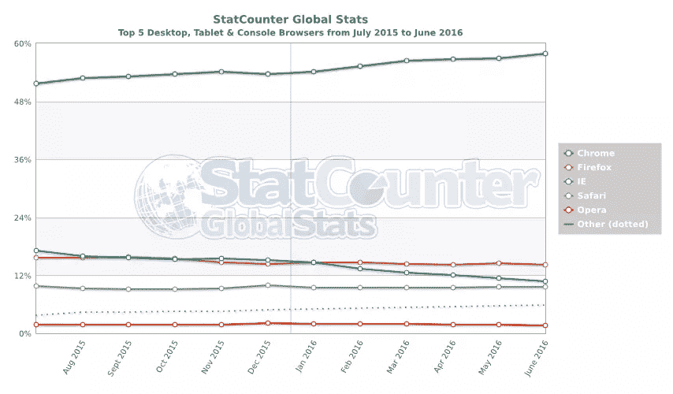

# 浏览器趋势 2016 年 7 月:Chrome 单一文化无害吗？

> 原文：<https://www.sitepoint.com/browser-trends-july-2016-chrome-monoculture-harmless/>

五月份微软的不幸遭遇让 IE 和 Edge 进一步落后于竞争对手。在[最新的 StatCounter 浏览器统计数据](https://gs.statcounter.com/#browser-ww-monthly-201507-201606)中，6 月份是否提供了更乐观的前景？*呃，没有…*

## 2016 年 5 月至 6 月全球台式机和平板电脑浏览器统计

下表显示了过去一个月中浏览器的使用情况。

| 浏览器 | 五月 | 六月 | 变化 | 亲戚 |
| 铬 | 57.07% | 57.99% | +0.92% | +1.60% |
| 火狐浏览器 | 14.50% | 14.14% | -0.36% | -2.50% |
| IE11 | 8.65% | 8.18% | -0.47% | -5.40% |
| 老人 | 2.73% | 2.59% | -0.14% | -5.10% |
| 边缘 | 2.29% | 2.55% | +0.26% | +11.40% |
| 旅行队 | 4.32% | 4.28% | -0.04% | -0.90% |
| iPad 野生动物园 | 5.35% | 5.33% | -0.02% | -0.40% |
| 歌剧 | 1.80% | 1.68% | -0.12% | -6.70% |
| 其他人 | 3.29% | 3.26% | -0.03% | -0.90% |

## 2015 年 6 月至 2016 年 6 月全球台式机和平板电脑浏览器统计

下表显示了过去 12 个月中浏览器的使用情况:

| 浏览器 | 2015 年 6 月 | 2016 年 6 月 | 变化 | 亲戚 |
| 铬 | 49.77% | 57.99% | +8.22% | +16.50% |
| 火狐浏览器 | 16.09% | 14.14% | -1.95% | -12.10% |
| IE11 | 11.33% | 8.18% | -3.15% | -27.80% |
| 老人 | 7.16% | 2.59% | -4.57% | -63.80% |
| 旅行队 | 10.55% | 9.61% | -0.94% | -8.90% |
| 歌剧 | 1.62% | 1.68% | +0.06% | +3.70% |
| 其他人 | 3.48% | 5.81% | +2.33% | +67.00% |

(这些表格显示了桌面浏览器的市场份额估计值。“变化”栏是市场份额的绝对增加或减少。“相对”栏显示了比例变化，即 Edge 的用户群上个月增长了 11.4%。有几个警告，所以我建议你阅读[如何计算浏览器市场份额](https://www.sitepoint.com/how-browser-market-share-is-calculated)和[StatCounter vs net Market Share](https://www.sitepoint.com/browser-trends-june-2016-microsoft-misfortune/)。)

除了 Edge 的小幅上涨，Chrome 是 2016 年 6 月唯一一个上涨的浏览器。12 个月的图表说明了 Chrome 与其竞争对手之间形成的鸿沟:

你还应该注意到 Opera，Vivaldi，Brave 和一系列较少使用的浏览器都是基于同一个为 Chrome 和 Chrome 开发的 Blink 渲染引擎。我们是否正不受控制地走向另一种单一文化？

我一直是对浏览器单一文化 *直言不讳的批评者(注意，这篇文章指的是 WebKit，因为它是在谷歌将引擎分成 Blink 之前写的。像其他在 IE6 统治的黑暗日子里开发网站和应用程序的人一样，我仍然担心任何浏览器垄断的兴起:*

1.  垄断厂商没有太多的创新动力。
2.  供应商变得太强大，可以支配网络标准。他们对实现的拒绝或冷漠会扼杀一项技术。
3.  单一文化使其他人更难竞争。那些厂商可能会放弃自己的努力，或者倒闭。

然而，IE6 天是不同的。

早期的网络威胁到了微软的收缩包装软件模式，特别是自从网景公司声称要建立一个基于网络的操作系统*(现实是十多年后)*。微软加入了浏览器大战，用一款明显优于其他浏览器的免费浏览器扼杀了竞争。结果是:IE6 获得了 95%的市场份额。微软停止了进一步的开发，退回到网络版的 Windows 和 Office 软件。

如今，谷歌的主要收入来源是基于网络的服务。该公司没有理由放弃浏览器开发，因为他们依赖于网络。更好的浏览器允许更好的网络应用程序，从而更好地与苹果和微软的产品竞争。谷歌有动力与其他供应商合作并支持标准，因为它允许他们的服务在任何地方工作，不管是什么浏览器或设备。然后，Web 开发人员可以从增强的跨浏览器兼容性中获益。

那么铬单养无害吗？我还没被说服。竞争是好事，谷歌的影响力可能会被认为过于强大。幸运的是，有各种各样的浏览器可用，新的供应商没有被劝阻进入市场。

也就是说，我敦促你超越 Chrome，考虑替代产品。主流浏览器都很优秀。不要相信 Chrome 永远领先，也不要接受单一文化，因为它让你的生活变得轻松了一些。

所以，想知道你可以切换到什么？[也许 Blisk 是你的下一个 web 开发浏览器](https://www.sitepoint.com/blisk-your-next-web-development-browser/)？或者也许是[维瓦尔第](https://www.sitepoint.com/vivaldi-1-0-release-your-new-default-browser/)？

## 2016 年 5 月至 6 月全球移动浏览器统计

继上个月移动流量猛增 2.25%之后，6 月使用量下降了 1.95%，现在占所有网络活动的 43.86%。

本月最受欢迎的移动浏览应用是:

| 移动浏览器 | 五月 | 六月 | 变化 | 亲戚 |
| 铬 | 34.44% | 38.23% | +3.79% | +11.00% |
| 苹果手机 | 17.36% | 18.95% | +1.59% | +9.20% |
| UC 浏览器 | 20.49% | 14.24% | -6.25% | -30.50% |
| Opera Mini/Mobile | 10.98% | 10.77% | -0.21% | -1.90% |
| 机器人 | 7.68% | 7.83% | +0.15% | +2.00% |
| 三星互联网 | 5.46% | 6.30% | +0.84% | +15.40% |
| 不变的 | 1.52% | 1.61% | +0.09% | +5.90% |
| 其他人 | 2.07% | 2.07% | +0.00% | +0.00% |

UC 浏览器似乎史无前例的下降了 6.25%。有一个解释:一些版本的浏览器错误地为每个有效请求发送了一个额外的页面视图。StatCounter 对重复计算进行了调整，这解释了为什么 Chrome 和 iPhone 的数量增加了，而移动/桌面比例却下降了。这就是整理浏览器统计数据时需要处理的那种废话！

尽管三星互联网继续保持良好的增长，但图表的其余部分几乎没有显著变化。下个月见。

## 分享这篇文章