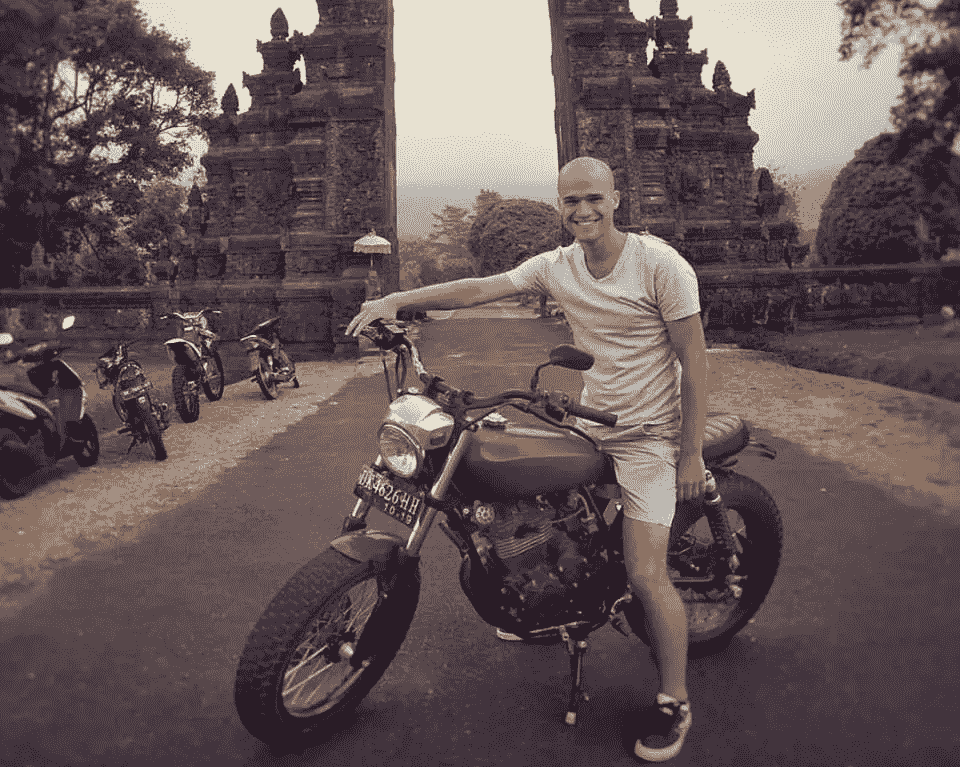
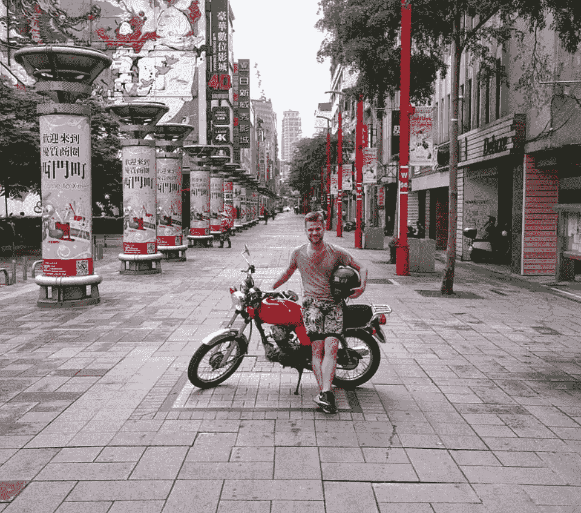
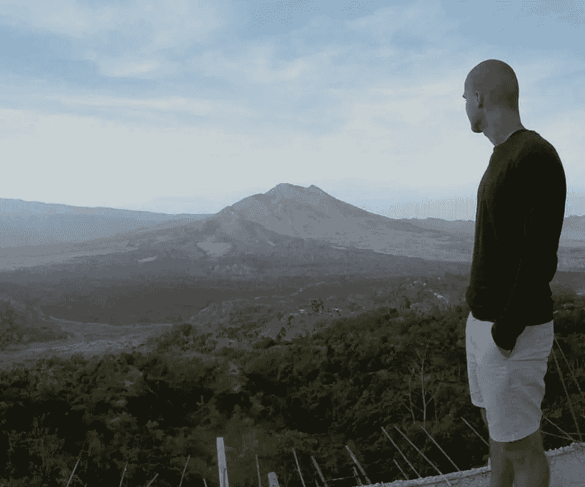
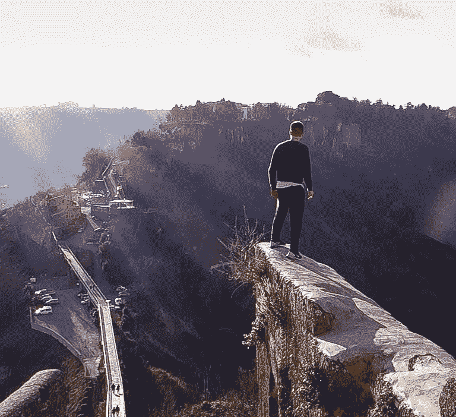

# 雅各布·劳凯蒂斯的 5 堂数字游牧课

> 原文：<https://www.sitepoint.com/5-digital-nomad-lessons-from-jacob-laukaitis/>

就在几十年前，工作的意义远不止是收入来源。由于没有人在工作场所，很少有工作能有效地完成，有一份工作就意味着住在附近。由于办公室通常有工作时间表(“朝八晚五”)，这项工作也用来定义一个人的时间表。我们的朋友大多是我们的同事，只是因为我们和他们在一个房间里度过了太多的时间。

但是后来互联网革命发生了。文书工作不再在纸上，而是在云服务器上。绘画不再诞生于画布上——它们是用 Photoshop 制作的。我们开始通过 Skype 电话召开团队会议，并开始通过 Trello 管理我们的项目。

怀旧、抗拒改变的人会告诉你，他们怀念纸张的好味道，但你真的不应该听他们的，因为他们没有抓住重点。重点是:你牺牲了办公桌的气味，换来了台湾某处雨林的气味，你自发地决定在那里呆上几个星期，工作几个星期。

是的，我说的是数字游民。很难想象还有哪一群人能更好地利用当今世界所提供的一切。数字游牧民拥有一切:随时随地想去哪里就去哪里的自由；良好稳定的收入；灵活的工作时间表。当然，设置好一切是需要工作的，但是对几乎任何人来说都是可能的。

今天，我有幸与一位纯种的数字游牧者 Jacob Laukaitis 交谈。年仅 22 岁的他是在美国运营的快速增长的在线优惠券网站[ChameleonJohn.com](http://www.chameleonjohn.com/)的联合创始人，在过去的三年里，他在经营网上业务的同时去过 45 个以上的国家。

我们讨论了旅行和工作，雅各布分享了他在旅行中的一些主要感悟。他们在这里:

### 1.这个世界比人们描绘的要安全、文明得多。

在电影中，任何不在美国或西欧的地方都可能被描绘成负面的。如果是在亚洲，主要的口音可能是对传统的痴迷，缺乏技术，和不卫生的食物。

如果行动发生在南美或东欧，这个地方可能会看起来贫穷，被犯罪活动、战争和/或压迫摧毁。

在全球化的现实中，世界上大部分地区的人们生活都非常相似。当然，有文化差异，像笑话，礼仪和服装。这些建筑可能看起来不同。但是，即使在地球上最远的角落，你也会发现熟悉的品牌或类似的产品。你会在全球各大城市找到预付费电话、旅馆、出租车、超市、药店、Wi-Fi 和西联汇款站。

### 2.亲身经历事情会非常有成就感和有用。

没看到别人做，没听说过，没看过评论。自己做所有的事情。

以骑摩托车为例。由于天气原因，不方便、危险、昂贵、不实用——这些是人们不买摩托车的主要原因。

但在亚洲，你可以以 5 美元/天的低价租一辆自行车，进行一次为期两周的穿越群山的史诗般的旅行，回来时会更开心。

或者还有冲浪。我们都知道这应该感觉很棒，但你有没有试过在木板上看日出，仍然屏住呼吸，在寒冷的海洋中，风轻抚着你的背和腿？这味道，这声音…

但这不仅仅是为了娱乐。在旅行中，你会遇到人们，你会看到他们是如何生活的，你会了解他们是如何思考的。这些经历提供了你无法从其他途径获得的宝贵经验。

### 3.旅行不一定要花很多钱。

旅行一定很贵，这是一种过时的观念。当然，如果你以游客的身份旅行，也就是说你去旅行社，预订他们提供的五星级酒店，为飞机上的高级座位多付一美元，在旅游餐馆吃饭，从有经验的供应商那里购买纪念品，你最终会支付一大笔钱。

这种旅行非常适合度假，当你只想舒服地放松几个星期，并且不介意为此支付额外费用时。但是，如果你打算生活和旅行一个月以上，你需要采取一种更可持续的心态——这通常意味着远离旅游景点，那里的价格要高得多。

就实际价格而言，在像泰国这样的国家(但不是曼谷)，你每月只需 1000 美元就可以过得很舒适。这意味着住三星级酒店，在餐馆吃饭，有钱休闲。

最后要考虑的是机票，但是只要有点创意和灵活性，你也可以买到非常便宜的机票。唯一重要的是远程工作的能力。

### 4.孤独只是错误态度的产物。

一旦经济需求得到满足，人们往往会对不断旅行的社交元素感到害怕——或者更确切地说，是缺乏社交元素。

有抱负的旅行者害怕失去现在的朋友，害怕交不到新朋友。从雅各布的第一手经验来看，一切都取决于你。建立新的联系是长期旅行中非常重要的一部分。我们不仅需要社交(不仅仅是日常的闲聊)，如果你一路上没有结交当地的朋友，你就错过了一大块旅行经历。

当你和来自不同文化的人接触时，你会了解他们的生活方式，他们的问题，他们对这些问题的看法。在社交方面积极主动也很重要:开始对话，在脸书旅游团上发帖，问问题，否则你很快就会非常悲伤和孤独。

雅各布说，至于老朋友，没什么好担心的。他真正的朋友为他感到高兴，非常支持他，他们找到了一种方法来保持他们之间的联系。

### 5.旅行不仅仅是为了自由。

这也是关于寻找合适的机会来承诺。在一个地方呆上几个星期，你实际上是在评估你有多喜欢住在那里。

雅各布在东欧的后苏联环境中长大，他爱上了多个亚洲城市。他喜欢巴厘岛的生活方式、东京的公园和台北人。当被问及如果他不得不永久定居，他会选择哪个城市时，雅各布回答说，肯定会是这三个城市之一。

当我们不断旅行时，我们就不再害怕生活在家乡以外的地方。你可能会得出结论，你的家乡是你想要定居的地方，但这将是一个理性的决定，不会受到对未知的恐惧的影响。

吸引我们的不一定是地点本身。你可能会遇到某个人，并和他们一起搬到另一个国家。你可能会在一个不同的国家获得一个商业机会或一份工作，然后不假思索地搬家。

再说一次，这不仅仅是自由的问题。这也是关于发现有价值的定居机会的自由。

这个世界正在慢慢抛弃办公室工作模式。每天，数百万数字游牧民过着我们的父母做梦也想不到的生活。而且，从雅各布的想法中我们可以得出结论，同时旅行和工作并不难实现，但绝对值得。

## 分享这篇文章