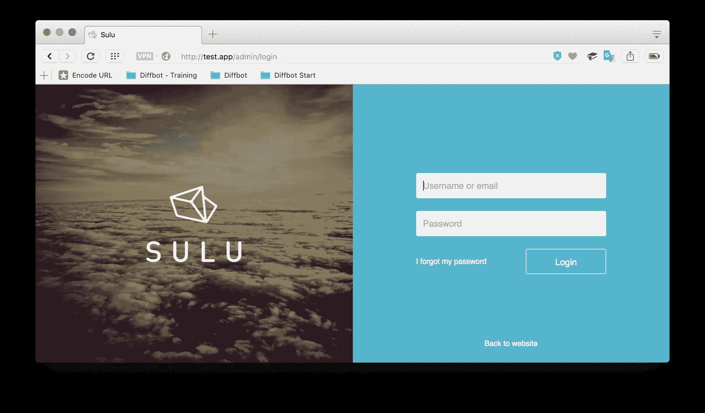
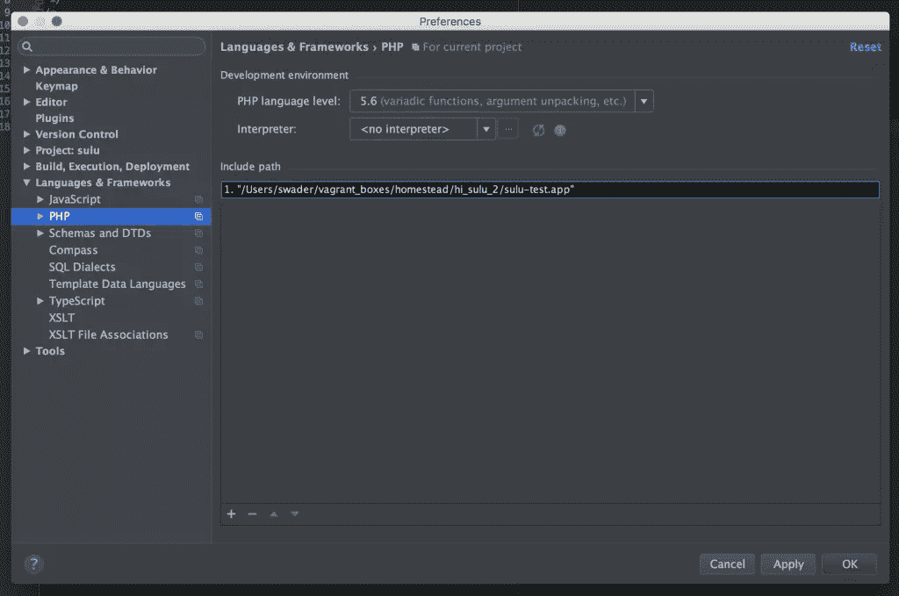

# Symfony 应用在流浪者上能快吗？让我们和 SuluCMS 确认一下！

> 原文：<https://www.sitepoint.com/symfony-on-vagrant-performance-hacks-sulucms-case-study/>

在这个简短的教程中，我们将设置一个新的基于 Symfony 的 CMS[Sulu](https://sulu.io)，并在一个[流浪者](https://www.sitepoint.com/re-introducing-vagrant-right-way-start-php/)环境中对其进行优化。为什么有专门的教程来处理这个问题？除了 Sulu 有一个相当复杂的初始化过程，它是基于 Symfony 的，在有共享文件系统的虚拟机上非常慢，因此在安装后需要额外的优化。这篇文章中的性能技巧，虽然是针对 Sulu 的，但可以应用于**任何** Symfony 应用程序，使其在流浪者上运行得更快。

* * *

*您想了解更多关于 Symfony 和/或 SuluCMS 的信息吗？来参加我们的[网络夏令营](https://2016.websummercamp.com)——这是唯一一个充满了长时间实践研讨会的会议。节目出来了[太牛了](https://www.netgenlabs.com/Blog/Web-Summer-Camp-2016-full-program-and-schedule)！超级早鸟[门票](https://www.salsa-adria.hr/our_events/next_events/web_summer_camp_2016#Tickets)截止 6 月底！*

* * *


像往常一样，我们将使用我们的 [Homestead 改进的](https://www.sitepoint.com/quick-tip-get-homestead-vagrant-vm-running/)盒子作为基础，但是下面的步骤解释得足够详细，让你可以在任何环境下遵循它们。

## 新框和文件夹共享

我们从下载一个新的盒子并设置文件夹共享开始。

```
git clone https://github.com/swader/homestead_improved hi_sulu
cd hi_sulu; bin/folderfix.sh 
```

完成后，建议将文件共享类型设置为`nfs`，由于[这个已知问题](https://forum.symfony-project.org/forum/32/topic/52241.html)，这里也描述了。

## 应用程序类型和流浪启动

[家园改进](https://www.sitepoint.com/quick-tip-get-homestead-vagrant-vm-running/)自带`symfony-sulu`应用类型，专门为苏鲁配置 Nginx。我们在`Homestead.yaml`中添加一个新站点:

```
 - map: test.app
      to: /home/vagrant/Code/sulu/web
      type: symfony-sulu 
```

* * *

*生成的 Nginx 如下。如果你使用的不是 Homestead Improved，鼓励你从这里复制:*

```
server {
    listen 80;
    listen 443 ssl;
    server_name test.app;
    root "/home/vagrant/Code/sulu/web";

    charset utf-8;

    location = /favicon.ico { access_log off; log_not_found off; }
    location = /robots.txt  { access_log off; log_not_found off; }

    access_log off;
    error_log  /var/log/nginx/test.app-ssl-error.log error;

    sendfile off;

    client_max_body_size 100m;

    # PROD
    location ~ ^/(website|admin|app)\.php(/|$) {
        fastcgi_split_path_info ^(.+\.php)(/.+)$;
        fastcgi_pass unix:/var/run/php/php7.0-fpm.sock;
        include fastcgi_params;
        fastcgi_param SCRIPT_FILENAME $document_root$fastcgi_script_name;
        fastcgi_intercept_errors off;
        fastcgi_buffer_size 16k;
        fastcgi_buffers 4 16k;
        # Prevents URIs that include the front controller. This will 404:
        # https://domain.tld/app.php/some-path
        # Remove the internal directive to allow URIs like this
        internal;
    }

    # strip app.php/ prefix if it is present
    rewrite ^/app\.php/?(.*)$ /test.app permanent;

    location /admin {
        index admin.php;
        try_files $uri @rewriteadmin;
    }

    location @rewriteadmin {
        rewrite ^(.*)$ /admin.php/test.app last;
    }

    location / {
      index website.php;
      try_files $uri @rewritewebsite;
    }

    # expire
    location ~* \.(?:ico|css|js|gif|jpe?g|png)$ {
        try_files $uri /website.php/test.app;
        access_log off;
        expires 30d;
        add_header Pragma public;
        add_header Cache-Control public;
    }

    location @rewritewebsite {
        rewrite ^(.*)$ /website.php/test.app last;
    }

    location ~ /\.ht {
        deny all;
    }

    ssl_certificate     /etc/nginx/ssl/test.app.crt;
    ssl_certificate_key /etc/nginx/ssl/test.app.key;
} 
```

如果您不使用 HTTPS，请删除底部的 SSL 线路。

* * *

然后，让我们启动虚拟机并在其中使用 SSH。

```
vagrant up; vagrant ssh 
```

将`test.app`(或者另一个 URL，如果您选择了它)添加到您的主机操作系统的`etc/hosts`文件中。如果这句话没有意义，请阅读[宅基地改良快速启动](https://www.sitepoint.com/quick-tip-get-homestead-vagrant-vm-running/)。

## 安装 Sulu

以下所有步骤都发生在虚拟机内部。

```
cd Code
git clone https://github.com/sulu-io/sulu-standard sulu; cd sulu
git checkout master
composer install 
```

这需要一段时间，并且可能需要 Github 认证令牌。

*注意，根据您安装的 PHP 版本，该命令可能会失败。例如，在撰写本文时，zend-code 需要任何不是 7.0.5 版本的 PHP。，顺便说一句，这是安装在 Homestead 改进 0.4.4 的确切版本。这很容易通过运行`sudo apt-get upgrade php7.0-fpm`来修复。*

安装后脚本会要求我们提供一些参数——我们只需要填写数据库名称(`homestead`，除非您专门为 Sulu 创建一个)和凭证(`homestead` / `secret`)。其他可以暂时保留默认值，以后需要时再进行配置。

### 配置 Sulu

```
cp app/Resources/webspaces/sulu.io.xml.dist app/Resources/webspaces/sulu.io.xml
cp app/Resources/pages/default.xml.dist app/Resources/pages/default.xml
cp app/Resources/pages/overview.xml.dist app/Resources/pages/overview.xml
cp app/Resources/snippets/default.xml.dist app/Resources/snippets/default.xml
rm -rf app/cache/*
rm -rf app/logs/* 
```

上面安装了一个默认的 [webspace](https://tldrify.com/c3x) 。

在文件`app/Resources/webspaces/sulu.io.xml`中，我们用我们喜欢的值替换了`name`和`key`。

完成后，我们运行:

```
app/console sulu:build dev 
```

上面的命令将生成一个密码为`admin`的用户`admin`，并进行一些其他开发友好的初始化。建议在开发环境中运行。请注意，该命令**不应在生产**中运行。相反，在生产中，你运行`app/console sulu:build prod`。

顺便说一下:在这一点上，我们有一个带有凭证`admin/admin`的管理员用户在工作。为了在未来创造新的角色，我们执行:

```
app/console sulu:security:role:create 
```

为了创造更多的用户，我们执行:

```
app/console sulu:security:user:create 
```

`test.app/admin`的后端现在应该可以工作了，尽管非常慢。



为了使前端工作，我们使用:

```
app/console assetic:dump 
```

这将生成所需的 JS 和 CSS 文件，并让默认主题包含它们。

作为最后的准备步骤，让我们通过更改以下代码行来打开 dev 模式:

```
defined('SYMFONY_ENV') || define('SYMFONY_ENV', getenv('SYMFONY_ENV') ?: 'prod'); 
```

到

```
defined('SYMFONY_ENV') || define('SYMFONY_ENV', getenv('SYMFONY_ENV') ?: 'dev'); 
```

在`web/admin.php`和`web/website.php`中。这些将在屏幕底部为我们提供著名的 Symfony debugbar。

## 速度改进黑客

众所周知，Symfony 应用程序在流浪者上运行缓慢。以下步骤将把页面加载时间从每条路由 25 秒(包括 ajax 调用)减少到每条路由大约 400 毫秒，**而不考虑主机操作系统平台或文件共享类型**。其他指南通常侧重于 NFS 或其他已知仅在某些操作系统上有效的问题，但此过程保证在任何设置上都有奇效。

### 日志和缓存

在`app/AbstractKernel.php`中，用以下方法替换`getLogDir`和`getCacheDir`方法:

```
 /**
     * {@inheritDoc}
     */
    public function getCacheDir()
    {
        if (in_array($this->environment, array('dev', 'test'))) {
            return '/dev/shm/appname/cache/' . $this->getContext() . '/' .  $this->environment;
        }
        return $this->rootDir . '/cache/' . $this->getContext() . '/' . $this->environment;
    }

    /**
     * {@inheritDoc}
     */
    public function getLogDir()
    {
        if (in_array($this->environment, array('dev', 'test'))) {
            return '/dev/shm/appname/logs' . $this->getContext() . '/' . $this->environment;
        }
        return $this->rootDir . '/logs/' . $this->getContext() . '/' . $this->environment;
    } 
```

这迫使 Sulu 将日志和缓存写入不与主机操作系统共享的文件夹，从而避免将不重要的数据快速写入共享硬盘。

### 移动供应商

Symfony 应用程序因安装数百个软件包而臭名昭著——即使是默认框架也充斥着这些软件包，更不用说在其上构建的应用程序了。当必须在硬盘驱动器上查找如此多的类，并且硬盘驱动器从 VM 共享到主机操作系统时，加载时间会很慢，这是可以理解的。

鉴于我们几乎没有机会编辑`vendor`文件夹中的内容，我们可以将它移出同步文件夹，放入虚拟机中的某个位置，该位置仅位于机器的“磁盘”上。这意味着我们失去了*同步能力*，不得不专门从虚拟机内部运行`composer`命令(或者从主机操作系统代理，但这超出了本文的范围)，但这一切都是为了获得惊人的速度。

要自动做到这一点，在`sulu`文件夹中执行:

```
~/Code/bin/sulu/vendorfix.sh 
```

(*或者，请参见下文，了解您需要做什么的完整程序*

这将改变`composer.json`、`app/autoload.php`和`app/config/sulu.yml`中的一些路径，删除当前的`vendor`文件夹，并运行 Composer install。如果您有兴趣，可以查看 shell 脚本来了解它的功能，或者查看下一节。

为了确保在 IDE 中保留自动完成功能，请确保将`home/vagrant/vendors/sulu-test.app/`添加到 IDE 的包含路径中。您可能需要将供应商文件夹复制到主机操作系统中的某个位置，这样的命令应该会有所帮助:

```
cp -R ~/vendors/sulu-test.app ~/Code/ 
```

然后，在 IDE 中执行以下操作，例如 PhpStorm:



### 移动供应商:绕远路

作为优化的最重要部分(即产生最多结果的部分)，供应商迁移方法值得进一步澄清，以便在没有`vendorfix.sh`脚本的非 [HI](https://www.sitepoint.com/quick-tip-get-homestead-vagrant-vm-running/) 环境中易于复制。接下来是一步一步的过程(如果您使用了上面的步骤并且效果良好，请跳过它):

1.  为您的供应商文件夹选择一个仅支持虚拟机的位置。最好将它们都放在一个文件夹中，然后将每个供应商的位置放在每个项目的子文件夹中。比如:`/home/vagrant/vendors/sulu-myapp`。让我们假设这个项目将被称为`myapp`。创建该文件夹:

    ```
    mkdir -p /home/vagrant/vendors/sulu-myapp 
    ```

2.  通过修改或增加`config`值，改变`composer.json`中的配置以反映新的`vendor`位置:

    ```
     "config": {
        "vendor-dir": "/home/vagrant/vendors/sulu-sulu.io/",
        "bin-dir": "vendor/bin"
    }, 
    ```

3.  打开`app/autoload.php`，将声明`$loader`的行替换为指向我们新的自定义`vendor`位置的路径:

    ```
    // $loader = require __DIR__ . '/../vendor/autoload.php';
    $loader = require "/home/vagrant/vendors/sulu-myapp/autoload.php"; 
    ```

4.  打开`app/config/sulu.yml`，用我们新的供应商文件夹的完整路径替换`%kernel.root_dir%/../vendor/`的所有实例。这应该发生在两个位置:靠近顶部的原则配置，以及文件中间的`sulu_core.content.structure.sulu`条目。

5.  从应用程序的文件夹(`myapp`)中移除带有`rm -rf vendor`的旧文件夹。

6.  运行`composer install`和`composer update`以确保一切顺利。

7.  用`app/console cache:clear`清除缓存。

就是这样。现在应该已经配置了自定义供应商位置。如果你遇到任何困难，请在下面发帖。

请注意，虽然这个过程是特定于 Sulu 的，但它适用于任何 Symfony 应用程序(或任何应用程序)。归结起来，就是在`composer.json`中定义一个定制的供应商文件夹，并将所有对旧供应商文件夹位置的引用替换为新供应商文件夹的路径。

### APC 自动装载

通过取消`web/website.php`和`web/admin.php`中相应行的注释，允许自动装载机的 APC 缓存。我们需要安装 APC 来使用它，但是[家园改良](https://www.sitepoint.com/quick-tip-get-homestead-vagrant-vm-running/)已经装备好了。

### 多方面的

*   我们可以将`/etc/php/7.0/fpm/php.ini`中`realpath_cache_size`的值更新为更大的值，比如 4096k，将`realpath_cache_ttl`更新为 7200。

*   我们可以通过为 Twig 安装 [C 扩展来获得一些边际收益。](https://twig.sensiolabs.org/doc/installation.html)

*   我们可以使用以下命令禁用 XDebug:

    ```
    sudo phpdismod xdebug; sudo service php7.0-fpm restart 
    ```

## 解决纷争

### 优化 Symfony 调试

Symfony 应用程序由异常多的类和文件组成，通常将它们的核心文件编译成一个单独的`app/bootstrap.php.cache`文件。这使得它几乎不可能调试 Symfony 应用程序没有进一步的改变。为了便于调试，请参考[这些文件](https://symfony.com/doc/current/cookbook/debugging.html)。

### __php_incomplete_class 没有反序列化器

这通常是由于过时的缓存造成的。首先，优化调试环境(见上文)。然后:

```
app/console cache:clear
rm -rf app/cache/*
composer update 
```

此外，如果您使用 APC，请清空缓存(见下文)。

### 更改没有效果/在错误的位置查找类

这通常发生在 APC 缓存需要被破坏的时候。一种方法是将:

```
apc_clear_cache(); 
```

在`website.php`或`admin.php`的顶部，无论你在运行哪个，然后在第一次请求后移除它。或者，只使用这个命令创建一个单独的文件，这样您就可以随时调用它。

## 结论

两个`https://test.app/admin`和`https://test.app`(如果那是你使用的 vhost 域名)现在应该可以工作并且快如闪电。您应该准备好开始在 Sulu 上开发基于 CMS 的应用程序。

正如我们上面提到的，这些攻击确实是针对 Sulu 的，但可以应用于任何 Symfony 应用程序。最重要的是供应商修复和日志/缓存修复，它们将显著改善开发期间应用程序的加载时间。其他技巧也是生产友好的，可以用来在部署时加速应用程序。

如果你有任何其他的技巧和诀窍想分享，以提高 Symfony 应用程序的性能， [Vagrant-powered](https://www.sitepoint.com/re-introducing-vagrant-right-way-start-php/) 开发环境，或两者兼而有之——Symfony on Vagrant——请在下面的评论区告诉我们，我们会尽最大努力更新帖子。

* * *

*您想了解更多关于 Symfony 和/或 SuluCMS 的信息吗？来参加我们的[网络夏令营](https://2016.websummercamp.com)——这是唯一一个充满了长时间实践研讨会的会议。节目出来了[太牛了](https://www.netgenlabs.com/Blog/Web-Summer-Camp-2016-full-program-and-schedule)！超级早鸟[门票](https://www.salsa-adria.hr/our_events/next_events/web_summer_camp_2016#Tickets)截止 6 月底！*

## 分享这篇文章