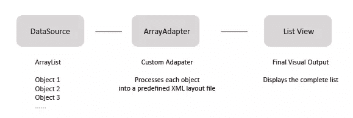
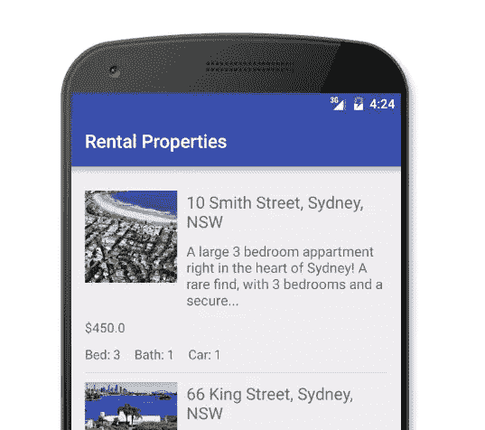
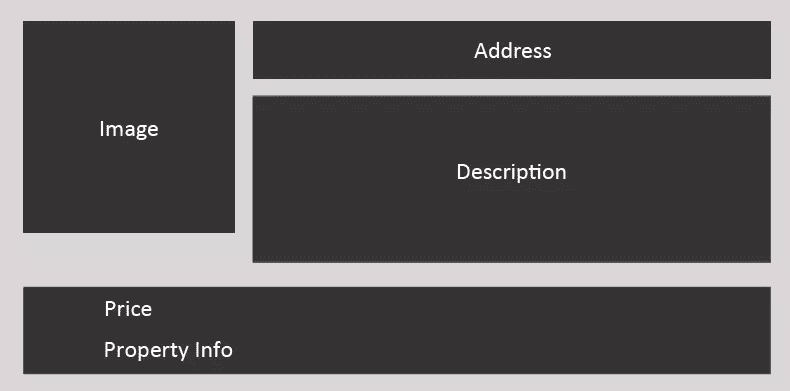
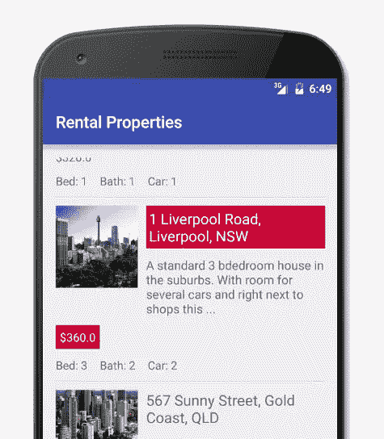

# 用你自己的 ArrayAdapter 定制 Android 布局

> 原文：<https://www.sitepoint.com/custom-data-layouts-with-your-own-android-arrayadapter/>

Android 提供了一系列不同的布局来满足你的应用需求。向用户显示信息的最快捷、最简单的方式之一是通过 [`ListView`](https://developer.android.com/guide/topics/ui/layout/listview.html) 组件。该组件创建一个简单的可滚动区域，可以显示唯一的信息集。关于`ListView` s 的伟大之处在于它们的可定制性，让您能够创建自己的数据布局。例如，为每个条目在左边显示一个图像，在右边显示一个标题。这可以通过创建和使用自定义的`ArrayAdapter`来实现

在本教程中，你将学习如何使用一个扩展的 [ArrayAdapter](https://developer.android.com/reference/android/widget/ArrayAdapter.html) 获取一个`ListView`并创建一个定制的布局。一旦你了解了这些主题，你将能够创建看起来很棒的滚动信息列表。

## Android ArrayAdapter 的组件

有几个相互联系的小部分来创建您的最终定制`ListView`。您将需要以下内容:

*   数据源，通常是对象列表
*   一个定制的`ArrayAdapter`对象，它指示如何为数据源中的每个条目处理您的信息。
*   UI 中的一个`ListView`将使用定制的`ArrayAdapter`来生成最终输出

这个过程更容易形象的想到。您需要一个数据源、一个控制布局的适配器和可视化显示结果的组件



## 自定义租赁 ListView 展示

例如，您将创建一个展示租赁物业的定制`ListView`。每个属性将显示地址、特色图片、价格和描述摘要等信息。这是你可以期待看到的结局。



这个想法是学习如何自定义布局，而不是完全复制我的布局。一旦你理解了这些原则，你就可以创建一个适合你的布局。

该项目的最终代码在 [GitHub](https://github.com/sitepoint-editors/android-rental-list-view) 上。

### 创建您的项目

在 Android Studio 中创建一个支持*Android 4 . 0 . 3*(API 15-冰激凌三明治)及以上版本的新项目，该项目将覆盖 Android 市场的很大一部分。添加一个*空活动*并将该项目称为*出租物业*。

一旦 Android Studio 完成项目设置，您应该会看到一个简单的`MainActivity`类和一个对应的 *activity_main.xml* 布局文件。这是你开始的全部需要。

### 定义源数据

在创建`ListView`之前，您需要显示数据。因为每个属性都有一组信息，所以首先创建一个类来设置和获取信息。创建一个新的`Property`类，并添加以下代码:

```
//Base class to hold information about the property
public class Property {

    //property basics
    private int streetNumber;
    private String streetName;
    private String suburb;
    private String state;
    private String description;
    private String image;
    private Double price;
    private int bedrooms;
    private int bathrooms;
    private int carspots;

    //constructor
    public Property(int streetNumber, String streetName, String suburb, String state, String description, Double price, String image, int bedrooms, int bathrooms, int carspots){

        this.streetNumber = streetNumber;
        this.streetName = streetName;
        this.suburb = suburb;
        this.state = state;
        this.description = description;
        this.price = price;
        this.image = image;
        this.bedrooms = bedrooms;
        this.bathrooms = bathrooms;
        this.carspots = carspots;
    }

    //getters
    public int getStreetNumber() { return streetNumber; }
    public String getStreetName() {return streetName; }
    public String getSuburb() {return suburb; }
    public String getState() {return state; }
    public String getDescription() {return description; }
    public Double getPrice() {return price; }
    public String getImage() { return image; }
    public int getBedrooms(){ return bedrooms; }
    public int getBathrooms(){ return bathrooms; }
    public int getCarspots(){ return carspots; }
} 
```

这通过添加私有字段来保存街道地址、州、描述等信息，从而创建了类的结构。

继续创建默认的`Property`构造函数方法，用于稍后创建新的租赁属性作为数据源。

最后，为每个属性定义`get`函数，稍后用于获取您需要的信息。

### 创建 XML 布局文件

现在您已经有了一个类，您需要定义自定义的 XML 布局文件`ArrayAdapter`来构建输出。

打开你的项目顶层 *res* 文件夹，找到*布局*子目录。创建一个名为“property_layout”的新布局文件，并添加 *RelativeLayout* 作为根标签(这是针对我的设计的)。

布局设计分为三个部分:

*   包含图像的左侧部分。
*   包含地址和描述的右边部分。
*   底部包含房产细节，如卧室、浴室、停车位的数量和价格。

渲染时，它应该看起来像下面。



将以下内容复制到新布局中。在这里，您创建了一个嵌套布局，其中每个部分/项目都有 ID，因此您可以定位和填充它们。您可以随意调整元素的边距、位置和大小。

```
<?xml version="1.0" encoding="utf-8"?>
<RelativeLayout xmlns:android="http://schemas.android.com/apk/res/android"
    android:layout_width="match_parent"
    android:layout_height="match_parent"
    android:orientation="vertical"
    android:paddingTop="10dp"
    android:paddingBottom="10dp">

    <ImageView
        android:id="@+id/image"
        android:layout_width="100dp"
        android:layout_height="100dp"
        android:layout_marginRight="10dp"
        android:contentDescription="Property Image" />

    <LinearLayout
        android:id="@+id/infoSection"
        android:layout_width="match_parent"
        android:layout_height="wrap_content"
        android:layout_toRightOf="@+id/image"
        android:orientation="vertical">

        <TextView
            android:id="@+id/address"
            android:layout_width="match_parent"
            android:layout_height="wrap_content"
            android:layout_marginBottom="10dp"
            android:text="Street Address"
            android:textSize="18sp" />

        <TextView
            android:id="@+id/description"
            android:layout_width="match_parent"
            android:layout_height="wrap_content"
            android:layout_marginBottom="10dp"
            android:text="Description"
            android:textSize="15sp" />
    </LinearLayout>

    <RelativeLayout
        android:id="@+id/pricingSection"
        android:layout_width="match_parent"
        android:layout_height="wrap_content"
        android:layout_below="@+id/infoSection"
        android:orientation="vertical">

        <TextView
            android:id="@+id/price"
            android:layout_width="match_parent"
            android:layout_height="wrap_content"
            android:layout_marginBottom="10dp"
            android:text="Price" />

        <TextView
            android:id="@+id/bedroom"
            android:layout_width="wrap_content"
            android:layout_height="wrap_content"
            android:layout_below="@id/price"
            android:layout_marginRight="15dp"
            android:text="Bed:" />

        <TextView
            android:id="@+id/bathroom"
            android:layout_width="wrap_content"
            android:layout_height="wrap_content"
            android:layout_below="@id/price"
            android:layout_marginRight="15dp"
            android:layout_toRightOf="@id/bedroom"
            android:text="Bath:" />

        <TextView
            android:id="@+id/carspot"
            android:layout_width="wrap_content"
            android:layout_height="wrap_content"
            android:layout_below="@id/price"
            android:layout_marginRight="15dp"
            android:layout_toRightOf="@id/bathroom"
            android:text="Car:" />

    </RelativeLayout>

</RelativeLayout> 
```

并将 *activity_main.xml* 中的`TextView`替换为:

```
<ListView
       android:layout_width="match_parent"
       android:layout_height="match_parent"
       android:id="@+id/customListView"></ListView> 
```

### 添加图像

大多数 UI 组件只是`TextView`元素，但是您只需要处理一个`ImageView`组件。

每个属性都有一个在视图呈现时绘制的对应图像。在这个例子中，我对显示的每个图像都使用了名称`property_image_X`。因为你将添加 4 个属性，你将需要 4 张图片，你可以在这里找到我使用的图片。

如果你以前没有在 Android Studio 项目中添加过图像，复制你想要添加到项目中的所有图像，然后在 *drawable* 文件夹中选择*粘贴*。


选择图像并将其拖动到 *drawable* 文件夹不起作用。

### 填充数据以供使用

既然您已经设置了一个基本的`Property`类并定义了一个 XML 文件，那么您可以进入下一步，创建将在列表中显示的数据。

在打开`MainActivity`类之后，添加`ArrayList`私有属性，这样这个类中的每个方法都可以访问它。

```
private ArrayList<Property> rentalProperties = new ArrayList<>(); 
```

现在跳转到位于右括号之前的`MainActivity`类中的`onCreate`方法来填充数据。如果你愿意的话，可以自定义，但是请注意，所有这些字段都是强制的，需要按照构造函数的期望来定义(例如，首先是街道号，然后是街道名，然后是郊区等)。

```
//create property elements
rentalProperties.add(
    new Property(10, "Smith Street", "Sydney", "NSW", "A large 3 bedroom apartment right in the heart of Sydney! A rare find, with 3 bedrooms and a secured car park.", 450.00, "property_image_1", 3, 1, 1));

rentalProperties.add(
    new Property(66, "King Street", "Sydney", "NSW", "A fully furnished studio apartment overlooking the harbour. Minutes from the CBD and next to transport, this is a perfect set-up for city living.", 320.00, "property_image_2", 1, 1, 1));

rentalProperties.add(
    new Property(1, "Liverpool Road", "Liverpool", "NSW", "A standard 3 bedroom house in the suburbs. With room for several cars and right next to shops this is perfect for new families.", 360.00, "property_image_3", 3, 2, 2));

rentalProperties.add(
    new Property(567, "Sunny Street", "Gold Coast", "QLD", "Come and see this amazing studio appartment in the heart of the gold coast, featuring stunning waterfront views.", 360.00, "property_image_4" , 1, 1, 1)); 
```

在现实世界的应用程序中，你可以从网络资源中获取这些数据，并动态地创建对象。对于本教程，用代码定义值更容易。

### 创建自定义 ArrayAdapter 类

标准的 Android `ArrayAdapter`将为列表中的每个条目显示单行文本。虽然这对于简单的列表可能没什么问题，但是您需要能够提供自己的布局并相应地填充它们。您可以通过创建自己的`ArrayAdapter`类来做到这一点。

为了简单起见，我在`MainActivty`类中创建了一个新类作为嵌套类。

```
//custom ArrayAdapter
class propertyArrayAdapter extends ArrayAdapter<Property>{

    private Context context;
    private List<Property> rentalProperties;

    //constructor, call on creation
    public propertyArrayAdapter(Context context, int resource, ArrayList<Property> objects) {
        super(context, resource, objects);

        this.context = context;
        this.rentalProperties = objects;
    }

    //called when rendering the list
    public View getView(int position, View convertView, ViewGroup parent) {

        //get the property we are displaying
        Property property = rentalProperties.get(position);

        //get the inflater and inflate the XML layout for each item
        LayoutInflater inflater = (LayoutInflater) context.getSystemService(Activity.LAYOUT_INFLATER_SERVICE);
        View view = inflater.inflate(R.layout.property_layout, null);

        TextView description = (TextView) view.findViewById(R.id.description);
        TextView address = (TextView) view.findViewById(R.id.address);
        TextView bedroom = (TextView) view.findViewById(R.id.bedroom);
        TextView bathroom = (TextView) view.findViewById(R.id.bathroom);
        TextView carspot = (TextView) view.findViewById(R.id.carspot);
        TextView price = (TextView) view.findViewById(R.id.price);
        ImageView image = (ImageView) view.findViewById(R.id.image);

        //set address and description
        String completeAddress = property.getStreetNumber() + " " + property.getStreetName() + ", " + property.getSuburb() + ", " + property.getState();
        address.setText(completeAddress);

        //display trimmed excerpt for description
        int descriptionLength = property.getDescription().length();
        if(descriptionLength >= 100){
            String descriptionTrim = property.getDescription().substring(0, 100) + "...";
            description.setText(descriptionTrim);
        }else{
            description.setText(property.getDescription());
        }

        //set price and rental attributes
        price.setText("$" + String.valueOf(property.getPrice()));
        bedroom.setText("Bed: " + String.valueOf(property.getBedrooms()));
        bathroom.setText("Bath: " + String.valueOf(property.getBathrooms()));
        carspot.setText("Car: " + String.valueOf(property.getCarspots()));

        //get the image associated with this property
        int imageID = context.getResources().getIdentifier(property.getImage(), "drawable", context.getPackageName());
        image.setImageResource(imageID);

        return view;
    }
} 
```

上面您创建了一个名为`PropertyArrayAdapter`的新适配器，并从标准的`ArrayAdapter`类扩展而来。

您在顶部添加了两个私有字段，因为您需要类内部的方法来访问上下文和属性列表。

```
private Context context;
private List<Property> rentalProperties; 
```

#### ArrayAdapter 构造函数

当扩展`ArrayAdapter`时，你需要声明一个传递三个属性的构造函数，即`context`、`resource`和`objects`。

```
 //constructor, call on creation
public propertyArrayAdapter(Context context, int resource, ArrayList<Property> objects) {
    super(context, resource, objects);

    this.context = context;
    this.rentalProperties = objects;
} 
```

此构造函数传递属性的整个数组列表以及上下文。两者都很重要，都被分配给类私有变量使用。

#### 使用 getView 方法呈现视图

每次`ListView`需要呈现一个项目时，它调用适配器的`getView`方法。因为您想要显示一个定制的布局，所以您需要定义这个方法。

```
//called when rendering the list
public View getView(int position, View convertView, ViewGroup parent) {
    //get the property we are displaying
    Property property = rentalProperties.get(position);

    //get the inflater and inflate the XML layout for each item
    LayoutInflater inflater = (LayoutInflater) context.getSystemService(Activity.LAYOUT_INFLATER_SERVICE);
    View view = inflater.inflate(R.layout.property_layout, null);
} 
```

因为您可以访问呈现的元素的`position`,所以您可以从租赁对象的数组列表中获取该元素。现在您有了这个对象，您可以使用类 getter 方法获取地址、描述和所有其他字段。

#### 加载我们的 XML 布局文件

下一步是使用之前保存的`context`从 Android 获取`LAYOUT_INFLATER_SERVICE`服务。创建一个新的`LayoutInflater`对象，使用这个对象加载将呈现视图的`detail_layout` XML 文件。

```
//get the inflater and inflate the XML layout for each item
LayoutInflater inflater = (LayoutInflater) context.getSystemService(Activity.LAYOUT_INFLATER_SERVICE);
View view = inflater.inflate(R.layout.property_layout, null); 
```

#### 填充布局文件并返回它

因为您现在可以访问 XML 文件，所以您可以通过它们的 ID 找到元素。

获取所有元素，然后填充它们的内容。您可以通过将`streetNumber`、`streetName`和`state`字段连接在一起来创建地址字段。其他元素如`description`要么按原样显示，要么被修剪以保持布局整洁。

图像资源以不同的方式处理。创建时，每个属性都有一个对应的图像名称，如`property_image_1`。您使用`getResources`方法和`getIdentifier`从 *drawable* 目录中获取图像名称。这将给出填充`ImageView`的资源 ID。

```
TextView description = (TextView) view.findViewById(R.id.description);
TextView address = (TextView) view.findViewById(R.id.address);
TextView bedroom = (TextView) view.findViewById(R.id.bedroom);
TextView bathroom = (TextView) view.findViewById(R.id.bathroom);
TextView carspot = (TextView) view.findViewById(R.id.carspot);
TextView price = (TextView) view.findViewById(R.id.price);
ImageView image = (ImageView) view.findViewById(R.id.image);

//set address and description
String completeAddress = property.getStreetNumber() + " " + property.getStreetName() + ", " + property.getSuburb() + ", " + property.getState();
address.setText(completeAddress);

//display trimmed excerpt for description
int descriptionLength = property.getDescription().length();
if(descriptionLength >= 100){
    String descriptionTrim = property.getDescription().substring(0, 100) + "...";
    description.setText(descriptionTrim);
}else{
    description.setText(property.getDescription());
}

//set price and rental attributes
price.setText("$" + String.valueOf(property.getPrice()));
bedroom.setText("Bed: " + String.valueOf(property.getBedrooms()));
bathroom.setText("Bath: " + String.valueOf(property.getBathrooms()));
carspot.setText("Car: " + String.valueOf(property.getCarspots()));

//get the image associated with this property
int imageID = context.getResources().getIdentifier(property.getImage(), "drawable", context.getPackageName());
image.setImageResource(imageID);

//return the view, very important
return view; 
```

这个过程可以是简单的，也可以是复杂的。在我们的例子中，我们显示了相当多的信息，并确保对最终用户来说是漂亮的。您可以将其缩减以显示几个句子，或者将其扩展以提供更多功能。

### 使用自定义数组适配器

现在你有了一个新的定制的`ArrayAdapter`类，返回到`MainActivity`类中的`onCreate`方法。

在添加租赁物业数据的下方，创建新的适配器:

```
//create our new array adapter
ArrayAdapter<Property> adapter = new propertyArrayAdapter(this, 0, rentalProperties); 
```

传递给该适配器的三个属性是:

*   当前的`context`(其中`this`引用了`MainActivity`类)
*   资源 ID 的值`0`。`0`因为您不需要自定义布局 ID，自定义适配器已经处理了它。
*   要显示的租赁物业对象的`ArrayList`

下一步是将这个新的适配器连接到`ListView`上。通过找到`ListView`并调用`setAdapter`方法，传递适配器来实现。

```
//Find list view and bind it with the custom adapter
ListView listView = (ListView) findViewById(R.id.customListView);
listView.setAdapter(adapter); 
```

**就这样！**

当您运行该应用程序时，您应该会看到在 XML 文件中定义并在`ArrayAdapter`中配置的新的定制布局。

### 奖励–动态加载布局

在本例中，您使用 *property_layout.xml* 显示了所有属性。这是为了简单起见，因为通常您希望所有的列表项看起来都一样。

当每个视图在`ListView`中呈现时，您可以通过指定不同的布局名称来选择想要展开的布局。您可以为选定的项目(例如某个特色元素)加载新的布局，也可以为简单起见加载调整后的版本。

返回到示例并对其进行更改，使特色属性具有不同的布局。

更改`Property`类以添加新的`featured`字段:

```
private Boolean featured; 
```

添加 getter 函数:

```
public Boolean getFeatured(){return featured; } 
```

您还需要将它添加到构造函数中，以确保传入的数据包含这些额外的信息。

```
this.featured = featured; 
```

例如，将属性 id 1 设置为 featured，并保持其他属性不变。

复制 *property_layout.xml* 文件，重命名为 *property_layout_alt.xml* 。你想怎么改就怎么改，我用红色背景突出显示了地址和价格。

在`MainActivity`类中，跳转到`getView`方法并改变 XML 文件的膨胀方式。

```
//conditionally inflate either standard or special template
View view;
if(property.getFeatured() == true){
    view = inflater.inflate(R.layout.property_layout_alt, null);
}else{
    view = inflater.inflate(R.layout.property_layout, null);
} 
```

检查它是否有特色，如果有，加载新的 *property_layout_alt.xml* 文件(包含新的视觉变化)

运行时，您应该会看到类似这样的内容，特色属性使用了替代布局



### 奖励–为您的 ArrayAdapter 处理点击事件

现在，您的内容已经显示在一个非常漂亮的列表中，您可能希望观察点击事件，以便触发操作，比如跳转到一个新的活动。

返回到`MainActivity`类中的`onCreate`方法，并在右括号前添加以下代码。

```
//add event listener so we can handle clicks
AdapterView.OnItemClickListener adapterViewListener = new AdapterView.OnItemClickListener() {

    //on click
    public void onItemClick(AdapterView<?> parent, View view, int position, long id) {

        Property property = rentalProperties.get(position);

        Intent intent = new Intent(MainActivity.this, DetailActivity.class);
        intent.putExtra("streetNumber", property.getStreetNumber());
        intent.putExtra("streetName", property.getStreetName());
        intent.putExtra("suburb", property.getSuburb());
        intent.putExtra("state", property.getState());
        intent.putExtra("image", property.getImage());
        intent.putExtra("bedrooms", property.getBedrooms());
        intent.putExtra("bathrooms", property.getBathrooms());
        intent.putExtra("carspots", property.getCarspots());
        intent.putExtra("description", property.getDescription());

        startActivity(intent);
    }
};
//set the listener to the list view
listView.setOnItemClickListener(adapterViewListener); 
```

您创建了一个新的`onItemClickListener`对象，并实现了它的`onItemClick`方法，当用户与视图列表中的元素进行交互时会触发该方法。

在本例中，您从租赁房产列表中获取房产，然后通过`Intent`对象设置额外意向。一旦您设置了附加活动，您就可以开始下一个活动，即详细活动。

当用户单击一个项目时，它将进入详细活动。将活动添加到项目清单文件中:

```
<activity
  android:name=".DetailActivity"                      
  android:name=".DetailActivity"
  android:parentActivityName=".MainActivity"                  android:label="Rental Detail">
</activity> 
```

在下一个活动中，您可以提取在意图阶段传递的[意图附加内容](https://developer.android.com/reference/android/content/Intent.html)，创建您的详细活动。

下面是`DetailActivity`类:

```
public class DetailActivity extends AppCompatActivity {
    @Override
    public void onCreate(Bundle savedInstanceState) {
        super.onCreate(savedInstanceState);
        setContentView(R.layout.detail_layout);

        //set the back (up) button
        getSupportActionBar().setDisplayHomeAsUpEnabled(true);

        //find all our view components
        ImageView imageView = (ImageView) findViewById(R.id.image);
        TextView addressTV = (TextView) findViewById(R.id.address);
        TextView descriptionTV = (TextView) findViewById(R.id.description);
        TextView priceTV = (TextView) findViewById(R.id.price);
        TextView bedroomsTV = (TextView) findViewById(R.id.bedrooms);
        TextView bathroomsTV = (TextView) findViewById(R.id.bathrooms);
        TextView carspotsTV = (TextView) findViewById(R.id.carspots);

        //collect our intent and populate our layout
        Intent intent = getIntent();

        Integer streetNumber = intent.getIntExtra("streetNumber", 0);
        String streetName = intent.getStringExtra("streetName");
        String suburb = intent.getStringExtra("suburb");
        String state = intent.getStringExtra("state");
        String description = intent.getStringExtra("description");
        Double price = intent.getDoubleExtra("price", 0.0);
        Integer bedrooms = intent.getIntExtra("bedrooms", 0);
        Integer bathrooms = intent.getIntExtra("bathrooms", 0);
        Integer carspots = intent.getIntExtra("carspots", 0);
        String image = intent.getStringExtra("image");
        Integer imageID = this.getResources().getIdentifier(image, "drawable", this.getPackageName());
        String address = streetNumber + " " + streetName + ", " + suburb + ", " + state;

        //set elements
        imageView.setImageResource(imageID);
        addressTV.setText(address);
        descriptionTV.setText(description);
        priceTV.setText('$' + Double.toString(price));
        bathroomsTV.setText("Bathrooms: " + bathrooms);
        bedroomsTV.setText("Bedrooms: " + bedrooms);
        carspotsTV.setText("Car Spots: " + carspots);

        //set the title of this activity to be the street name
        getSupportActionBar().setTitle(address);
    }
} 
```

以及相关的活动布局:

```
<?xml version="1.0" encoding="utf-8"?>
<LinearLayout xmlns:android="http://schemas.android.com/apk/res/android"
    android:layout_width="match_parent"
    android:layout_height="match_parent"
    android:orientation="vertical"
    android:padding="10dp">

    <ScrollView
        android:id="@+id/scrollView"
        android:layout_width="match_parent"
        android:layout_height="match_parent">

        <LinearLayout
            android:layout_width="match_parent"
            android:orientation="vertical"
            android:layout_height="wrap_content">

            <ImageView
                android:id="@+id/image"
                android:layout_width="match_parent"
                android:contentDescription="Property Image"
                android:layout_height="wrap_content"
                android:adjustViewBounds="true"
                android:layout_marginBottom="10dp"
                android:background="#cc0033"/>

            <TextView
                android:id="@+id/address"
                android:layout_width="match_parent"
                android:layout_height="wrap_content"
                android:text="Address goes here"
                android:layout_marginBottom="10dp"
                android:textSize="18sp"/>

            <TextView
                android:id="@+id/description"
                android:layout_width="match_parent"
                android:layout_height="wrap_content"
                android:textSize="15sp"
                android:text="Description here"
                android:layout_marginBottom="15dp"/>

            <TextView
                android:id="@+id/price"
                android:layout_width="match_parent"
                android:layout_height="wrap_content"
                android:layout_marginBottom="10dp"
                android:text="price"/>

            <TextView
                android:id="@+id/bedrooms"
                android:layout_width="match_parent"
                android:layout_height="wrap_content"
                android:text="Bedrooms"
                android:layout_marginBottom="5dp"/>
            <TextView
                android:id="@+id/bathrooms"
                android:layout_width="match_parent"
                android:layout_height="wrap_content"
                android:text="Bathrooms"
                android:layout_marginBottom="5dp"/>
            <TextView
                android:id="@+id/carspots"
                android:layout_width="match_parent"
                android:layout_height="wrap_content"
                android:text="Car Spots"
                android:layout_marginBottom="5dp"/>

        </LinearLayout>

    </ScrollView>

</LinearLayout> 
```

## 从这里去哪里？

现在您已经知道了如何定制 ArrayAdapter 类的基本知识，您可以为您的列表构建令人惊叹的接口了。ArrayAdapter 不仅限于 ListView 组件，还可以与 GridView 或 Spinner 组件一起使用。

创建丰富的、视觉上令人印象深刻的列表是保持用户兴趣的好方法。您可以通过添加滚动动画或在每个项目上执行不同的功能来扩展这些想法(例如注册一个点击时触发的动作和另一个滑动时触发的动作)。

任何意见或问题，请在下面的评论中告诉我。

## 分享这篇文章