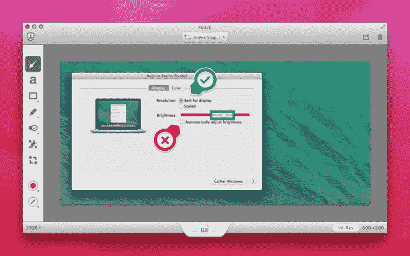
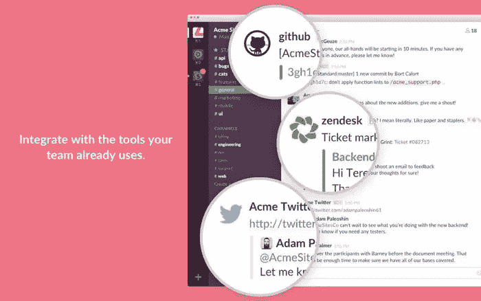

# 7 个优秀的远程团队协作工具

> 原文：<https://www.sitepoint.com/7-excellent-collaboration-tools-remote-teams/>

远程工作时，工具可以成就团队，也可以毁灭团队。选择不适合你们所有人的工具会导致摩擦，最终会让那些看不到工具价值的人孤立无援。远程团队已经被隔离*物理*；通过阻碍他们的协作努力在精神上孤立他们是远程团队的终极杀手。

让我们来看看对于远程团队来说非常优秀的七个工具。

## 1.同意召开富有成效的会议

会议非常耗时，而且往往毫无结果，因为团队通常会忘记事先设定一个明确的议程，并在事后跟踪决策。[同意](https://www.agreedo.com)解决了这两个问题。想法被转化为议程，然后在网上会议后转化为会议记录。

会议期间做出的任何决策都将转换为可跟踪的任务，并分配给与会者；任何没有完成的都要留到下一次会议上，这样就不会遗漏任何东西。与会者可以通过 Mac、Windows、iOS 或 Android 参加会议，非常适合远程团队。

## 2.任务管理的 Wunderlist

神童列表非常简单，这就是为什么我认为它对于远程团队来说非常棒。如果你想维持一个健康的团队，跟踪任务是非常重要的，但是它不应该占用你太多的时间。Wunderlist 让你花更少的时间管理任务，花更多的时间完成任务。这里有一些功能可以帮助你很好地利用这个应用程序:

1.  当你无法前进时，开始执行任务
2.  按照重要性列出重要任务的优先顺序
3.  将任务分解成子任务——小步骤
4.  如果没有真正的截止日期，不要强迫自己设定截止日期
5.  通过指派团队成员来委派任务
6.  关注“今天”和“分配给我”列表
7.  将 Wunderlist 与 Slack 集成，以实现更好的协作

### 神童替代方案:Todoist

微软已经收购了 Wunderlist，现在正在关闭它。Todoist 是一个很好的替代品。

## 3.注释的 Skitch

当你不与某人面对面站着时，很难准确地表达你的意思。Skitch 帮助您以想象中最简单的方式进行视觉交流:使用箭头、文本、形状、突出显示和图章(批准、拒绝等)等注释。

我最喜欢 Skitch 的一点是，除了交流想法和观点有多容易之外，它还有多快可以制作截图( **command+shift+6** )、通过电子邮件发送注释( **command+shift+m** )或导出到图像文件( **command+e** )。

## 4.文档协作草稿

[Draft](https://draftin.com/) 就像一个简化版的 GitHub，用于 Markdown 文件，使团队能够一起协作处理文档，并合并个人所做的具体更改。它对于撰写文章或制作法律文档(用于网络或其他方面)特别有用，然后可以导出为 Markdown、DOCX、HTML 或 PDF。

## 5.用于文件共享的 Dropbox

[Dropbox](https://www.dropbox.com/) 是一个用于维护和共享文件的虚拟存储系统，*但是你可能已经知道了*。让它对远程合作者特别有用的是 Dropbox API，它允许无数应用程序(包括广受好评的原型开发应用程序 [InVision](https://www.invisionapp.com/) )使用 Dropbox 作为基础。

以下是一些可以使用 Dropbox 实现自动化的事情:

*   将[类型表单](https://www.typeform.com/)结果保存在一个文本文件中
*   用 Markdown 和 [Blot.im](https://blot.im/) 为你的博客提供动力
*   将 [Basecamp](https://basecamp.com/) 文件储存在一个文件夹中
*   用[视觉](https://www.invisionapp.com/)做同样的事情
*   查看松散团队中的新文件
*   在脸书上自动分享 Dropbox 图片
*   从 Dropbox 文件创建 [Trello](https://trello.com/) 卡片

## 6.团队沟通松弛

每个人都喜欢这个消息应用，[Slack](https://slack.com/)——它是*的乐趣*。它对团队交流也有奇效，尤其是当那个团队是远程的时候，但是一些团队说[它扼杀了生产力](https://medium.com/better-people/slack-i-m-breaking-up-with-you-54600ace03ea#.1xuxiajtl)。我觉得这是因为懈怠有正确的方式和错误的方式。

当你一整天都在来回发送信息时，那些宝贵的时间就积累起来了。相反，你应该设置与你的团队使用的其他应用程序的集成，以增加你的协作努力，并为你的消息添加有价值的上下文。

以下是一些可以从 Slack 内部控制的应用程序:

*   与[神童](https://slack.com/apps/A0F7VRHTN-wunderlist)、[特雷罗](https://slack.com/apps/A0F814C4R-trello)、[阿萨纳](https://slack.com/apps/A0F81FK1C-asana)或(对于敏捷团队) [JIRA](https://slack.com/apps/A0F7YS3MZ-jira) 一起管理任务
*   用或[狮子座懒汉机器人](https://slack.com/apps/A0GU27WR1-leo-officevibe-bot)表扬和奖励员工
*   共享屏幕并与 [Screenhero](https://slack.com/apps/A0F7XDVHB-screenhero) 协作
*   与 [InVision](https://slack.com/apps/A08N434LS-invision-app) 、 [Zeplin](https://slack.com/apps/A08MGBLJV-zeplin) 或 [UXPin](https://slack.com/apps/A0J8PT0T0-uxpin) 合作设计
*   与 [Dribbble](https://slack.com/apps/A0CGVC7K7-dribbble) 团队一起寻找设计灵感
*   使用[画板](https://slack.com/apps/A02NEMM42-sketchboard)在虚拟白板上集思广益
*   [更更](https://slack.com/apps)！

### 松弛替代方案:扭转

一些团队发现懈怠太分散注意力，并认为它会让谈话变得太轻松，从而影响工作效率。 [Twist](https://twistapp.com/) 是一个更平静的选择，它培养了一种类似留言板的文化，团队可以更加清楚他们需要的帮助，或者他们需要说的事情。仅仅是更少的通知对于那些感觉有太多消息到处乱飞的团队来说就是一个巨大的胜利。

## 7.用于自动化工作流程的 Zapier

本文中提到的一些集成是由 [Zapier](https://zapier.com) 完成的。Zapier 通过连接您最喜爱的应用程序来帮助您自动化工作流程，让您保持负责任，同时让同事了解情况——这是为讨厌在各种应用程序之间切换的忙碌员工准备的。

你只需要告诉 Zapier 你的团队用的是哪些 app，Zapier 就会把它们连接起来；如果您的团队发现很难就使用哪种工具达成一致，这将非常有用。举个例子:你的团队分为 Dropbox 和 Google Drive。你可以创建一个“Zap”(如果还没有的话)，将 Dropbox 文件发送到 Google Drive，并在事情发生时提醒 Slack 中的团队。

没有人会错过，每个人都使用他们喜欢的工具。

## 结论

远程协作很难。一开始你可能不会这样想，但是“行动胜于语言”这句话在这种情况下听起来是真的，这就是为什么一个准系统的松弛设置不一定对你有任何好处。这些工具不仅是免费的(或者有一个免费层)，它们还会帮助你剔除无用的对话，并消除通常浪费在弥合应用程序之间的差距上的时间。

## 分享这篇文章