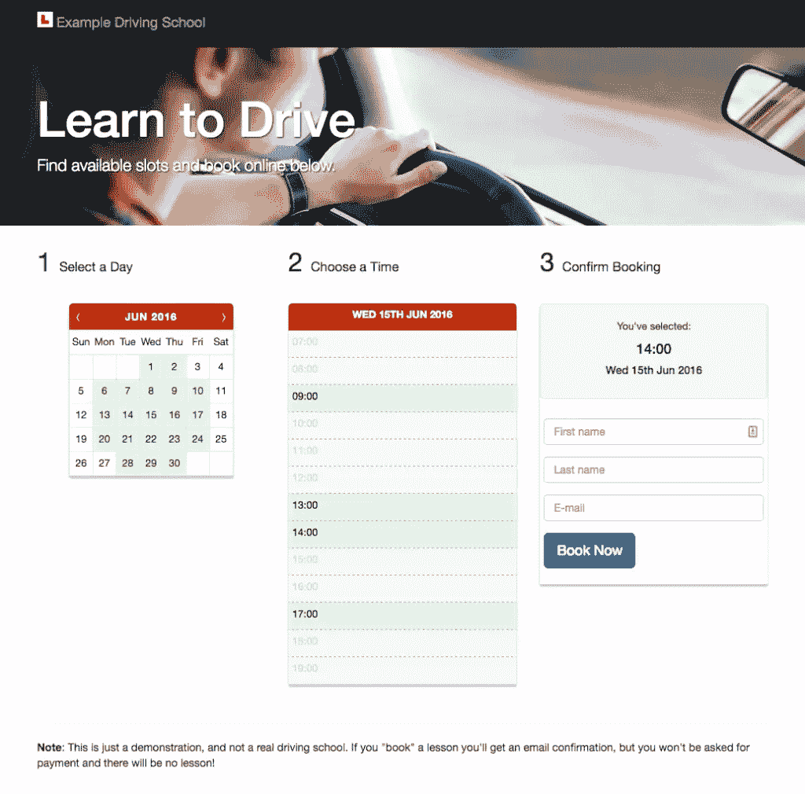
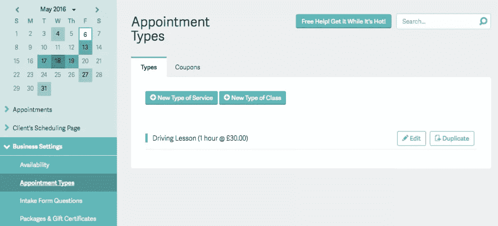
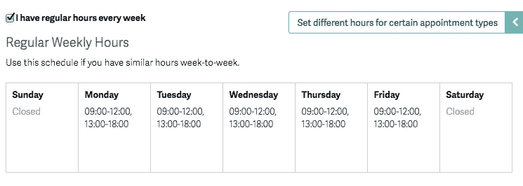
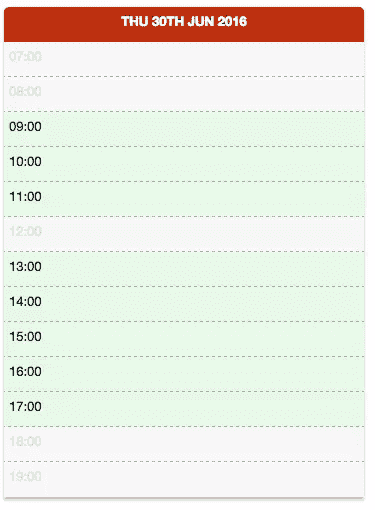
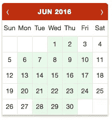
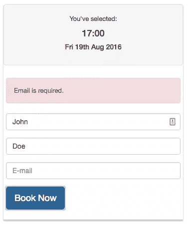
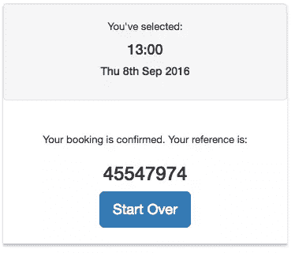

# 如何利用 Acuity Scheduling 实现预订系统的现代化

> 原文：<https://www.sitepoint.com/how-to-modernize-a-driving-instructors-booking-system-with-acuity-scheduling/>

*本文由[视敏调度](http://acuityscheduling.com/?utm_medium=content&utm_source=sitepoint&utm_campaign=devsponsorship)赞助。感谢您对使 SitePoint 成为可能的赞助商的支持。*

摊牌:我学会开车已经有一段时间了。我不太记得我是怎么找到我的导师的，但我很确定不是通过网站。我只知道预约课程需要打电话。由于我的教练整天都在路上，那通电话通常不得不在工作时间之外。约会本身是在一本很好的老式日记本上手工安排的。

我不确定现在这种方法能解决问题。我知道如果我要找的话，我会通过网络，而且像大多数人一样，我已经开始想当然地认为我可以在网上预订东西。

硬币的另一面呢？以这种方式管理课程是一种低效的方法。我只能猜测有多少次我的老师出现在课堂上，发现学生在家里的答录机上留下了取消留言。

那么，在本教程中，我们要做的是通过提供一个基于 web 的小部件来查看可用性和安排课程，将我们的驾驶教练带入 21 世纪。此外，我们将利用 [Acuity Scheduling](https://acuityscheduling.com/?utm_medium=content&utm_source=sitepoint&utm_campaign=devsponsorship) 来帮助他们管理他们的日记，而不用求助于笔和纸。

在继续之前，您可能想看看我们将通过[在线演示](http://driving-school.demos.lukaswhite.com/)或下面的截图构建什么。



本教程的代码是 GitHub 上的[。](https://github.com/lukaswhite/driving-lesson-booking-widget)

## 查看业务

在我们深入研究实现之前，让我们更仔细地看看作为驾驶教练的业务。

当然，一个驾驶教练在某一天会有很多空闲时间。驾驶课程本质上是一对一的，这让我们的事情变得简单了一些。

为了使事情相对简单，我们将忽略某些实际问题。例如，在现实世界中，不可能在某个城市的一边下午 3 点开始上课，而在城市的另一边另一个人早几分钟就结束了。

我们的可用性小部件将显示一个给定月份的日历——默认为当前月份——它一目了然地显示哪一天有一些可用性。如果用户点击某一天，它会向下钻取并显示当天可用的时间段。

我们将使用一些最新的前端技术来做到这一点，使我们的小部件具有高响应性。

## 为什么要构建自定义小部件？

您决定构建自定义小部件的原因有很多，例如:

*   您可以设计它的样式，使其与您的网站设计无缝匹配
*   您可以使用现有的任何前端和后端技术
*   如果你更喜欢自己付款，定制小部件可能是最合适的解决方案
*   当人们完成日程安排过程时，你可以让他们留在你的网站上

## 示例代码

本教程附带的代码[可从 GitHub](https://github.com/lukaswhite/driving-lesson-booking-widget) 获得。为了简洁起见，我们不会在这里涵盖所有的代码，所以无论您是独自编写代码，还是边走边通读，您都需要获取一份副本。

该示例包括一个 PHP 后端和预订小部件；我们马上会看到为什么我们需要一个服务器端组件。

运行这个例子最简单的方法是使用 PHP 的内置 web 服务器。

只需将`cd`放入`public`目录，并输入以下命令，如果需要，替换端口号:

```
php -S localhost:8000
```

## Acuity 调度简介

[Acuity Scheduling](https://acuityscheduling.com/?utm_medium=content&utm_source=sitepoint&utm_campaign=devsponsorship) 是一项用于管理和安排约会的在线服务。对于我们的驾驶教练来说，预约是一堂驾驶课，但它的应用范围要广得多。

Acuity 的主要功能之一是提供实时可用性信息的能力。我们可以使用 API 获取这些信息，嵌入到驾驶教练的网站中，然后将这些信息作为我们调度小部件的基础。

Acuity 还提供一系列其他功能，包括在线支付、管理客户、发送电子邮件和短信提醒等等。

### Acuity 调度 API

我们将使用 Acuity 的 API 与 Acuity 集成。特别是，我们将使用三个端点:

给我们一个属于指定月份的日期列表，有一个或多个可用的时间段。

`GET /availability/times`提供指定日期的可用时间列表。

`POST /appointments`用于实际创建(换句话说，预订)约会。

前两个端点一起为最终用户提供了足够的信息，让他们一眼就能看到有什么可用，以便他们可以选择合适的插槽。一旦我们有了可用的日期和时间，我们就可以从学习者那里收集一些信息并为他们预约。

#### 证明

Acuity API 提供了两种身份验证方法:OAuth2 和基本 HTTP 身份验证。前者只有在处理多个 Acuity 用户时才真正适用。对于我们的目的来说，这可能有点过了。

然而，要使用基本的 HTTP 认证，我们需要通过后端代理 API 调用。

原因很简单。基本的 HTTP 认证需要用户名和密码，如果我们直接从 JavaScript 代码中调用 API，就会暴露出来。使用 Acuity API 时，用户名和密码分别是您的用户 ID 和 API 密钥，但原理完全相同。这带来了明显的安全风险。

用于确定可用性的服务器端代码的关键部分如下，您可以在本文附带的库[中找到:](https://github.com/lukaswhite/driving-lesson-booking-widget)

```
 $app->get( 'api/availability/{period}', function( Request $request, $period ) use ( $app ) {

    // Build the URL, incorporating the `appointmentTypeID`.
    $query = $request->query->all( ) + [ 'appointmentTypeID' => $app[ 'appointmentTypeID' ] ];  
    $url = sprintf( '/availability/%s?%s', $period, http_build_query( $query ) );

    // Make the request...
    $response = $app[ 'client' ]->request( $url );		

    // If there's an error, write it to the log
    if ( $response[ 'status_code' ] !== 200 ) {
        $app[ 'logger' ]->error( $response[ 'message' ] );
    }

    // ... and simply return it
    return json_encode( $response );

} )
->assert( 'period', 'dates|times'); 
```

代码使用了[官方 PHP SDK](https://packagist.org/packages/acuityscheduling/acuityscheduling/?utm_medium=content&utm_source=sitepoint&utm_campaign=devsponsorship) 。查看[库](https://github.com/lukaswhite/driving-lesson-booking-widget/?utm_medium=content&utm_source=sitepoint&utm_campaign=devsponsorship)以了解客户端是如何构建的，或者查看 [SDK 文档](https://github.com/AcuityScheduling/acuity-php/?utm_medium=content&utm_source=sitepoint&utm_campaign=devsponsorship)和[开发者文档](https://developers.acuityscheduling.com/?utm_medium=content&utm_source=sitepoint&utm_campaign=devsponsorship)。

尽管这段代码有所简化，但对于本演示来说，它应该可以完成这个任务。实际上，它所做的只是将对`/availability/dates`或`/availability/times`的调用(包括查询参数)代理给 Acuity Scheduling API，并以 JSON 格式返回结果。它还融入了约会类型 ID，这基本上告诉 Acuity 我们试图找到的可用性是什么。

这样，我们可以在服务器上安全地保存我们的 API 密钥——它充当密码，而不会在我们的客户端代码中暴露它。

如果你不想用 PHP，那就不用。Node.js 有一个[官方 SDK，或者如果你正在使用其他东西，那么从你选择的编程语言调用 API 应该很简单。更多信息请参考](https://www.npmjs.com/package/acuityscheduling)[文档](https://developers.acuityscheduling.com/docs/quick-start/?utm_medium=content&utm_source=sitepoint&utm_campaign=devsponsorship)。

事不宜迟，我们开始吧。

## 正在设置

为了完成本教程，你需要一个帐户与敏锐调度。前往[网站](https://acuityscheduling.com/?utm_medium=content&utm_source=sitepoint&utm_campaign=devsponsorship)注册，只需几分钟。

14 天的免费试用对于本教程来说已经足够了，所以不需要花费您一分钱。

拥有帐户后，您需要设置新的约会类型。本教程的目的很简单——我们只有一种约会，那就是驾驶课。

登录 Acuity，进入*业务设置>预约类型*，点击*新增服务类型*，填写所需信息。最简单的方法可能是将持续时间保持在一个小时，这可能是你对驾驶课的期望。

如果你需要的话，还有额外的帮助。

如果您点击您的新约会类型并查看 URL，您会看到它包含一个唯一的 ID。请记下这一点，因为您需要马上将它添加到配置文件中。



你的下一步应该是设置你的可用性。这基本上是你定义工作时间的地方，是正常的周一到周五 9-6 点，还是稍微不规律一点的。您可以通过选择*业务设置*下的*可用性*来完成此操作。

对于我们正在构建的示例小部件来说，如果您将工作时间设置为 9-6 点，留出午餐休息时间，这可能是最简单的。

下面的屏幕截图显示了一个工作时间设置为晚上 9-6 点的例子，中午 12 点有一个小时的午餐时间。



Acuity 将确保约会安排在工作时间内，因此如果您将这些时间指定为上午 9 点到下午 6 点，则一小时课程的最后可用时段将是下午 5 点。对于所有插槽都可用的一天，我们的小部件将看起来像下面的截图。



下一步是找出您的 API 凭证。进入*业务设置→集成*，滚动到页面底部，点击*“查看您的 API 证书”*。

现在您已经有了三条必需的信息——您的用户 ID、API 键和一个新的约会类型 ID——是时候将它们放入配置文件中了。

在存储库中，您会发现一个名为`config/__COPY_ME__.json`的文件。复制一份，命名为`config/dev.json`。

dev 部分表明我们正在开发环境中工作。在生产中，你可能会叫它`production.json`或类似的名字。

填写这个新的配置文件，替换相应的条目:

```
 {  
  "debug": true,
  "userId": "YOUR-USER-ID",
  "apiKey": "YOUR-API-KEY",
  "appointmentTypeID": "APPOINTMENT-TYPE-ID"
} 
```

通过这种配置，我们简单的后端将能够与 Acuity API 进行通信，以找到可用性并安排约会。

注意，本文附带的 PHP 代码包括非常简单的日志记录；如果它从 Acuity API 得到错误响应，那么它将在`logs/error.log`中记录相应的消息。

## 从实现开始

我们将使用 [Vue.js](http://vuejs.org/) 来构建小部件本身。在许多方面，它就像是 Angular 的精简版，专门用于构建电抗组件。如果你更愿意使用其他的东西，比如 Angular，那么一般原则应该没有什么不同。

我们还将使用 [Moment.js](http://momentjs.com/) 来简化日期和时间的处理，使用 [Vue Resource](https://github.com/vuejs/vue-resource) 与我们的后端通信，使用 [Vue Form](https://github.com/fergaldoyle/vue-form) 进行简单的表单验证。
安装依赖项:

```
bower install vue moment vue-resource vue-form --save
```

如果您愿意，可以使用 npm。只要相应地改变路径。

现在让我们构建基本的页面结构。示例使用 Twig，HTML 可以在`views/index.twig.html`中找到。

```
 <!DOCTYPE html>
<html lang="en">
  <head>
    <meta charset="utf-8">
    <meta http-equiv="X-UA-Compatible" content="IE=edge">
    <meta name="viewport" content="width=device-width, initial-scale=1">

    <title>Book a Driving Lesson</title>

    <link rel="stylesheet" href="https://maxcdn.bootstrapcdn.com/bootstrap/3.3.6/css/bootstrap.min.css">
    <link rel="stylesheet" href="/assets/styles.css">

  </head>

  <body>

    <script src="/bower_components/moment/moment.js"></script>
    <script src="/bower_components/vue/dist/vue.js"></script>
    <script src="bower_components/vue-resource/dist/vue-resource.js"></script>
    <script src="/bower_components/vue-form/vue-form.js"></script>
    <script src="/assets/scripts.js"></script>

  </body>
</html> 
```

文件`public/assets/scripts.js`将保存我们的小部件定义，所以让我们创建它的基本结构以及几个过滤器，我们将使用它们来格式化日期和时间。

```
 Vue.http.options.root = '/api';

Vue.filter('time', function ( hour ) {
	if ( hour < 10 ) {
		return '0' + hour + ':00';  
	}
	return hour + ':00';
});

Vue.filter('formatDateTime', function( day, format ) {
    if ( ! day ) {
        return '';
    }
    return day.format( format )
});

var widget = new Vue({
    el : '#availability-widget',
    data : {
    	// . . .
    },
    ready : function() {        
      	// . . .
    },
    methods : {
      	// . . .
    }
}); 
```

我们将一边进行，一边填充小部件的以下三个部分:

*   data 属性用于初始化我们的数据。在这里指定属性可以确保 Vue.js 在初始化期间执行 getter/setter 进程。
*   `ready()`方法将执行一些初始化。
*   如你所料，是方法的杂凑；我们将定义许多这样的服务，帮助用户从选择日期到完成预订。
*   您可以从[库](https://raw.githubusercontent.com/lukaswhite/driving-lesson-booking-widget/master/public/assets/styles.css)中获取一份样式表，或者构建自己的样式表来匹配您网站的外观。

## 一步一步来

我们的小部件将包含三个“阶段”:

1.  用户在迷你日历上选择一个有空的日期。
2.  选定日期后，他们从那些可用的时间段中选择一个“时间段”。
3.  一旦选择了日期和时间，我们将显示给用户确认，并获取一些基本信息。一旦他们提供了这些信息，我们就可以调用 API 来实际安排课程。

让我们从构建三个步骤的 HTML 开始:

```
 <div id="availability-widget">
    <ol class="steps">
        <li class="col-md-4 active">
            <header>Select a Day</header>
        </li>
        <li class="col-md-4" v-bind:class="{ 'active' : day }">
            <header>Choose a Time</header>
        </li>
        <li class="col-md-4" v-bind:class="{ 'active' : time }">
            <header>Confirm Booking</header>
        </li>
    </ol>
</div> 
```

注意，我们已经用 ID 为`availability-widget`的`<div>`包装了这些步骤。这与我们的小部件代码中的 el 属性相匹配，这意味着 Vue 将自己绑定到它，以便实现我们的小部件。

我们将很快为每个步骤添加标记，但是现在请注意，我们使用一个类`active`来指示进度；使用`v-bind`我们可以在用户选择了`day`时“激活”第二步，在用户选择了`time`时“激活”第三步。

## 初始化数据

我们将维护三个独立的数据属性，以帮助跟踪“深入”到特定日期和时间的过程:

*   `month`
*   `day`
*   `time`

您可能想知道为什么我们要维护三个独立的日期属性，因为一个 Moment 实例可以封装所有三个部分。我们这样做是为了跟踪用户具体选择了什么。

让我们初始化我们的数据:

```
 data : {
    today : moment(),
    weekdays : moment.weekdaysShort(),      
    calendar : [],
    month : moment(),
    day : null,
    time : null,
    hours : [],
    bookingForm : {},
    learner : {
        firstName : null,
        lastName : null,
        email : null
    },
    bookingStatus : 'pending'
} 
```

通过从 Moment 获取一周中各天的名称，我们可以使小部件的国际化变得更加简单。

在这里，我们还初始化属性来保存日历定义、工作时间集、学员数据、预订表单和流程预订部分的状态。

## 寻找空闲的一天

然后，第一部分是调用 Acuity API 来查找特定月份的可用性，并呈现一个迷你日历。当组件被初始化时，我们将为当前月份调用它，但我们也需要允许用户使用日历标题中的箭头在月份之间导航。下面的截图说明了这一点。



让我们从 HTML 开始:

```
 <li class="col-md-4 active">
    <header>Select a Day</header>
    <div class="cal">
        <div class="header">
            <span class="left button" id="prev" v-on:click="previousMonth" v-if="!month.isSame(today, 'month')"> ⟨ </span>                     
            <span class="month-year" id="label"> {{ month | formatDateTime 'MMM YYYY' }} </span>                        
            <span class="right button" id="next" v-on:click="nextMonth"> ⟩ </span>
        </div>
        <table id="days">
            <tr>
                <td v-for="weekday in weekdays">{{ weekday }}</td>
            </tr>
        </table>
        <div class="cal-frame" v-if="calendar.length">                                  
            <table class="curr">
                <tr v-for="row in calendar">
                    <td v-for="day in row" v-bind:class="{ 'nil' : !day.d, 'today' : day.today, 'past' : day.past, 'available' : day.available }" v-on:click="selectDay(day.d)">{{ day.d }}</td>
                </tr>                                       
            </table>
        </div>
	    <div class="loading" v-if="!calendar.length">
			<p></p>
			<p>Loading dates...</p>
	    </div>
    </div>
</li> 
```

这里有些东西一文不值。

日历标题包含用于在月份之间导航的按钮。后退按钮的可见性取决于日历是否显示当前月份。

日历上的每个单元格(例如，日)都分配有一个或多个 CSS 类。组成日历的单元格可以具有以下一种或多种“状态”:

*   一个空单元格，用于填充到表格结构中。
*   一天过去了。
*   当前日期。
*   有空的一天。
*   没有空闲的一天。

最后，注意我们给 day 分配了一个点击处理程序，它将调用方法`selectDay()`。我们将在下一节中实现它；但是首先，我们需要填充并构建日历。

因此，我们需要获得给定月份的可用性。下面是`/availability/dates`的输出:

```
 [
  {
    "date": "2016-06-02"
  },
  {
    "date": "2016-06-06"
  },
  ...
} 
```

记住这一点，让我们创建第一个小部件方法，它负责获取给定月份的可用性。请记住，这放在小部件的`methods`部分:

```
 methods : {

    /**
     * Fetch the availability data for a given month
     */
    getAvailabilityForMonth : function( ) {

        this.calendar = [];

        this.$http.get( 'availability/dates', { month : this.month.format( 'YYYY-MM' ) } ).then( function( response ) {          

            this.days = [];

            var available = response.data.map( function( item ) {
                return moment( item.date ).date( );
            });             

            var temp = moment( this.month ).date( 1 );              
            var m = temp.month();
            var now = moment();

            do {                    
                this.days.push({
                    d : temp.date(),
                    past : temp.isBefore( now, 'day' ),
                    today : temp.isSame( now, 'day' ),
                    available : ( available.indexOf( temp.date() ) > -1 ),
                });                 
                temp.add( 1, 'day' );
            } while ( temp.month() == m );

            this.buildCalendar();

        });
    },

    // . . .
} 
```

一个月中的一系列日子不足以构建一个日历。根据一个月的第一天是星期几，我们需要一些可选的填充。然后，我们需要将它分成行，在末尾添加额外的单元格，以确保每行正好有七个单元格。

构建日历表的代码有点冗长，不能在这里详细讨论，但本质上它所做的是将一个月中的日子分成行，然后在每一侧添加“填充”，以便将一个月的第一天设置为适当的日子，每行包含七个单元格。问题中的方法是`buildCalendar()`。

记住，我们希望在组件初始化时加载当月的可用性。我们可以在`ready`部分做到这一点:

```
 var widget = new Vue({
    // . . .
    ready: function() {        
      this.getAvailabilityForMonth();
    },
    // . . .
 }); 
```

同样在 methods 部分，我们需要以下内容来实现小日历上的前进和后退箭头:

```
 previousMonth : function() {            
    var current = this.month;
    this.$set( 'month', null )
    this.$set( 'month', current.subtract( 1, 'months' ) );      
    this.getAvailabilityForMonth(); 
},

nextMonth : function() {            
    var current = this.month;
    this.$set( 'month', null )
    this.$set( 'month', current.add( 1, 'months' ) );           
    this.getAvailabilityForMonth();
}, 
```

我们现在有了一个迷你日历，突出显示有一些空闲的日子，使用户能够进一步深入，选择他们上课的时间。

## 寻找空闲时间

此时，我们知道某一天至少有一个可用的时间段。然后，下一步是列出这些插槽，并允许学习者选择一个。

下面的截图显示了小部件的这个部分的外观。


您还记得，单击日历上的某一天会调用`selectDay()`方法，该方法会依次找出该特定日期的可用性。

在我们实现之前，下面是来自`/availability/times`的输出:

```
 [
  {
    "time": "2016-06-02T13:00:00-0800"
  },
  {
    "time": "2016-06-04T14:00:00-0800"
  },
  ...
} 
```

让我们从提取小时开始，将其转换为可用时间的数组:

```
 var available = response.data.map( function( item ) {
    return moment( item.time ).hour( );
}); 
```

现在，我们可以创建一个循环，遍历一天中的几个小时，并设置一个标志来指示该时间段是否可用:

```
 for ( var h = 7; h  -1 )
    });
} 
```

下面是完整的`selectDay()`方法:

```
 selectDay : function( d ) {
    if ( d ) {
        // Create am instance
        var day = moment( this.month ).date ( d );

        // If it's in the past, exit
        if ( day.isBefore( moment(), 'day' ) ) {
            return;
        }

        this.day = day;
        this.hours = [];

        this.$http.get( 'availability/times', { date : this.day.format( 'YYYY-MM-DD' ) } ).then( function( response ) {          

            var available = response.data.map( function( item ) {
                return moment( item.time ).hour( );
            });

            for ( var h = 7; h  -1 )
                });
            }

        });

        this.time = null;
    }
}, 
```

现在让我们把注意力转向 HTML:

```
 <li class="col-md-4" v-bind:class="{ 'active' : day }">
	<header>Choose a Time</header>
	<ol class="times" v-if="day">
		<li class="header">
			{{ day | formatDateTime 'ddd Do MMM YYYY' }}
		</li>
		<li v-for="hour in hours" v-bind:class="{ 'available' : hour.available }" v-on:click="selectTime( hour )">
			<div class="hour">{{ hour.h | time }}</div>
		</li>
	</ol>
	<div class="loading" v-if="day && !hours.length">
		<p></p>
		<p>Loading times...</p>
	</div>
</li> 
```

我们在这里做的是创建一个一天中小时的有序列表，根据该时间段是否可用来设置 CSS 类。我们附加了一个点击处理程序，它调用了`selectTime()`方法，我们将用它来进入预订阶段。

最后，我们需要实现`selectTime()`方法，这实际上非常简单:

```
 selectTime : function( hour ) {
    if ( hour.available ) {
        this.time = moment( this.day ).hours( hour.h ).minutes( 0 ).seconds( 0 );      
    }
} 
```

我们在这里所做的只是复制当天并设置时间。将“激活”最后一步的设置，显示时间表。

## 预订

我们现在有一个特定的时间段，所以是时候实施预订流程了。

学员将被要求提供一些个人信息。默认情况下，需要以下三个字段:

1.  学习者的名字
2.  学习者的姓氏
3.  他们的电子邮件地址

结合选定的日期和时间，这将足以安排一堂课。

如果您愿意，您也可以收集电话号码，您可以在 Acuity management 面板中将其设置为“必填”。

Acuity 还提供了创建自定义字段的能力。例如，您可能想要创建一个字段来收集课程的接送位置，以指示这是否是客户的第一堂课，或者接受您的条款和条件。为了使事情相对简单，我们在这里不做，但是你可以在文档的相关章节找到更多信息。

下面的截图显示了预订表单的外观:



让我们构建 HTML:

```
 <li class="col-md-4" v-bind:class="{ 'active' : time }">
	<header>Confirm Booking</header>
	<div v-if="time" class="book">            
		<header class="well">
			<p>You've selected:</p>
			<h4>{{ time | formatDateTime 'HH:mm' }}</h4>
			<h5>{{ time | formatDateTime 'ddd Do MMM YYYY' }}</h5>
		</header>
		<form v-form name="bookingForm" v-on:submit.prevent="confirm" v-if="bookingStatus == 'pending'">
			<fieldset>
				<div class="alert alert-danger" v-if="bookingForm.$submitted && !bookingForm.$valid">
					<p v-if="bookingForm.firstName.$error.required">First name is required.</p>
					<p v-if="bookingForm.lastName.$error.required">Last name is required.</p>
					<p v-if="bookingForm.email.$error.required">Email is required.</p>
					<p v-if="bookingForm.email.$error.email">Email is not valid.</p>
				</div>
				<div class="form-group">
					<input type="text" name="firstName" placeholder="First name" class="form-control" v-model="learner.firstName" v-form-ctrl required>
				</div>
				<div class="form-group">
					<input type="text" name="lastName" placeholder="Last name" class="form-control" v-model="learner.lastName" v-form-ctrl required>
				</div>
				<div class="form-group">
					<input type="email" name="email" placeholder="E-mail" class="form-control" v-model="learner.email" v-form-ctrl required>
				</div>
				<div class="form-group">
					<button type="submit" class="btn btn-lg btn-primary">Book Now</button>
				</div>      
			</fieldset>
		</form>
		<div class="loading" v-if="bookingStatus == 'sending'">
			<p></p>                  
			<p>Making booking...</p>
		</div>
		<div class="confirmed" v-if="bookingStatus == 'confirmed'">
			<p>Your booking is confirmed. Your reference is:</p>
			<h3>{{ booking.id }}</h3>
			<footer>
				<button class="btn btn-lg btn-primary" v-on:click="reset">Start Over</button>
			</footer>
		</div>
	</div>
</li> 
```

这可能看起来有点冗长，但相对来说很简单。本质上，它是将表单控件映射到`learner`属性的相应属性。

一大块标记负责验证。在这个例子中，我使用 [Vue 表单](https://github.com/fergaldoyle/vue-form)来验证表单。我不会详细介绍它们是如何组合在一起的，但是您可能想参考代码或文档以获得更多信息。

当进行预订时，将显示带有类别`confirmed`的`<div>`，并且将简单地显示我们从 Acuity 返回的预订 ID。

以下是预订的代码:

```
 confirm : function() {
    if ( this.bookingForm.$valid ) {
        this.bookingStatus = 'sending';

        var data = this.learner;
        data.datetime = this.time.format();

        this.$http.post( 'appointments', data ).then( function( response ) {
            this.booking = response.data;
            this.bookingStatus = 'confirmed';
        });
    }
} 
```

相当简单；我们正在构建一个数据散列，它将我们的学习者信息与选定的日期和时间结合起来，然后将它发布到我们的后端。我们使用了`bookingStatus`属性，这样小部件就可以让用户了解正在发生的事情。当预订属性被设置时，它将触发确认部分显示预订 ID。

作为参考，下面是预约的 PHP 代码:

```
 /**
 * Acts as a proxy to `/appointments`
 * We can use this to actually make an appointment
 */
$app->post( 'api/appointments', function( Request $request ) use ( $app ) {

    // Build the data by decoding the JSON and then injecting the `appointmentTypeID`.
    $data = json_decode( $request->getContent(), true ) + [ 'appointmentTypeID' => $app[ 'appointmentTypeID' ] ];   

    // Make the request...
    $response = $app[ 'client' ]->request( 
        '/appointments',
        [
            'method'    =>  'POST',
            'data'      =>  $data,
        ]
    );    

    // If there's an error, write it to the log
    if ( $response[ 'status_code' ] !== 200 ) {
        $app[ 'logger' ]->error( $response[ 'message' ] );
    }

    // ...and return it
    return json_encode( $response );

}); 
```

正如您所看到的，我们在这里所做的基本上是将来自我们的小部件的数据与约会类型 ID 结合起来，并对 Acuity API 进行认证调用。

总结一下，确认信息如下:



就这样，我们结束了！

## 下一步是什么？

好了，现在您有了一个预订小部件，使用 Acuity Scheduling 来管理预订和日程安排。你还能用它做什么？让我们简单看一下几个额外的(完全可选的)功能，它们可以进一步增强学习者和教师的体验。

### 接受付款

我们允许任何人在当天付费的前提下安排课程，但 Acuity 也提供在线提前付费的功能。查看文档了解更多信息。

### 第三方集成

有许多与其他服务集成的选项，无论是出于会计目的(Quickbooks，Freshbooks)，CRM (Salesforce，Zoho)，还是批量电子邮件(AWeber，Mailchimp)。它还与 Zapier 很好地集成在一起，提供了大量的可能性。您也可以使用现有的日历解决方案(Google Calendar、Outlook ),或者使用`.ics`文件格式简单地导入或导出。

### Webhooks

Acuity 还提供了 [webhooks](https://developers.acuityscheduling.com/docs/webhooks/?utm_medium=content&utm_source=sitepoint&utm_campaign=devsponsorship) ，这样当预约被安排、取消或重新安排时，你可以创建自己的定制动作。

## 舍入

我们已经涉及了很多领域，但在本教程中，我们不仅更新了驾驶教练的网站，还潜在地革新了他们管理预订的方式。大家都赢了！

想了解更多？了解如何使用 Acuity Scheduling、PHP 和 Lumen 构建一个[烹饪课预订系统](https://www.sitepoint.com/booking-cookery-classes-with-acuity-scheduling-and-lumen/)。

## 分享这篇文章