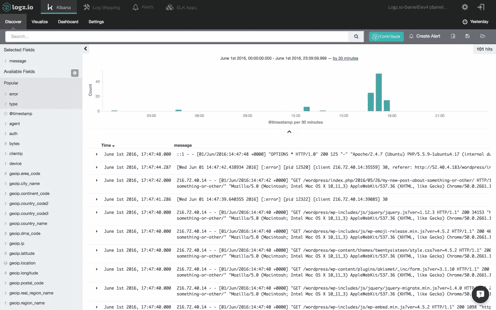
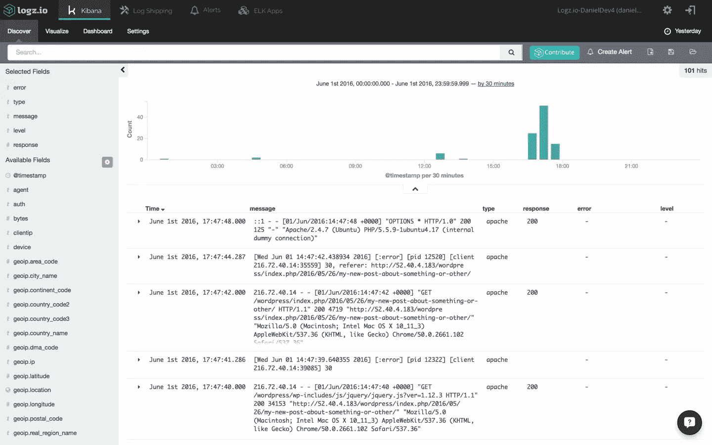
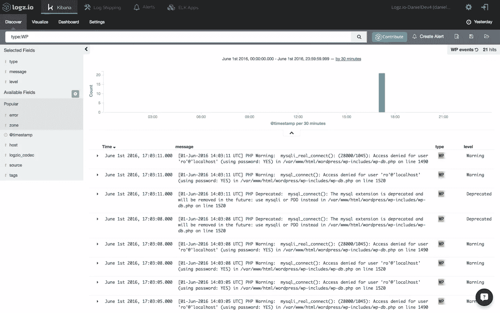
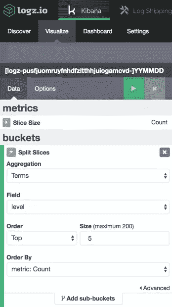
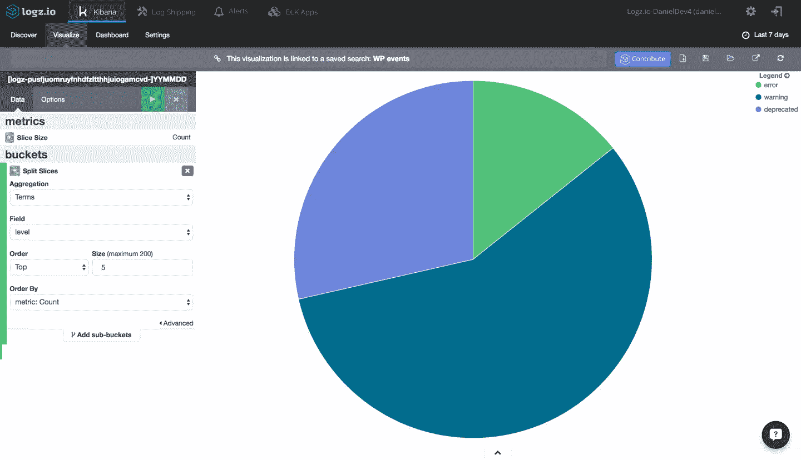

# 用 ELK 栈监控 WordPress 应用程序

> 原文：<https://www.sitepoint.com/monitoring-wordpress-apps-with-the-elk-stack/>

WordPress 是一个了不起的工程。难怪超过四分之一的基于 CMS 的网站都在使用它。然而在现实中，WordPress 网站和其他网站一样会崩溃。糟糕的插件或主题导致了“WordPress 死亡之屏”，或者 WordPress 更新失败，这是经常发生的事情。


当出现问题时，首先要查看的是日志文件。不是因为你喜欢它——日志文件不容易破译——而是因为它们包含有价值的信息，可以揭示到底发生了什么。

然而，在现代环境中，这项任务是一项挑战。虽然 WordPress 的管理员可能从来不需要听到“日志”这个词，但是运行网站的 web 开发人员和 DevOps 工作人员经常需要一行又一行地查看日志文件，以了解哪里出错了。

“那么，有什么新鲜事？”你可能会问。毕竟，有很多 WordPress 插件，比如 WP 日志查看器，可以让你从 WordPress 管理面板轻松查看这些日志。

虽然这是真的，但是仅仅分析 WordPress 和 PHP 日志是不够的。还有 web 服务器和数据库日志需要筛选。为了成功地查询来自不同来源的大量日志消息并确定相关性，需要一个更可靠的解决方案。

进入[麋鹿栈](https://www.sitepoint.com/how-can-the-elk-stack-be-used-to-monitor-php-apps/)。ELK 是最受欢迎和发展最快的开源日志分析平台，它允许您构建一个集中式日志记录系统，可以从您定义的任意多个来源获取日志，然后分析和可视化这些数据。

为了展示一个使用 ELK 的例子，本文将介绍从你的 WordPress 应用程序到 [Logz.io ELK 栈](http://logz.io)建立日志管道的步骤。如果愿意，您可以使用堆栈的任何实例来执行完全相同的过程。

## 为 WordPress 应用程序启用日志记录

第一步是配置 WordPress 来写日志。为此，我们将在我们的`wp-config`文件中输入一些定义。

首先，我们将 WP_DEBUG 值改为`true`:

```
define( 'WP_DEBUG', true ); 
```

现在你将开始在你的应用页面上看到 PHP 错误、通知和警告，以及 WordPress 调试信息。

接下来，我们将启用 WordPress 日志功能:

```
define( 'WP_DEBUG_LOG', true ); 
```

这将把所有错误信息保存到位于应用程序的`/wp-content/`目录中的`debug.log`文件中。

如果你不希望错误消息显示在你的应用页面上，使用 WP_DEBUG _ DISPLAY——这是另一个常量，它允许你控制 WP _ DEBUG 消息是否显示在你的站点的 HTML 中。要更改在屏幕上显示错误的默认行为，将值更改为`false`以隐藏所有消息:

```
define( 'WP_DEBUG_DISPLAY', false ); 
```

另一个有用的选项是 SAVEQUERIES 定义，它将数据库查询保存到一个数组中。然后，您可以使用此数组来帮助分析问题:

```
define( 'SAVEQUERIES', true ); 
```

每个查询都将与关于查询执行时间以及调用它的函数的信息一起保存。

保存您的配置。

你都准备好了！要验证`debug.log`文件的创建，模拟一个错误(您可以使用`error_log()`函数)，然后定位并打开该文件。如果文件不在那里，您还没有触发错误。

当然，不建议在生产中使用 WP_DEBUG，所以要注意如何使用它以及使用什么定义(例如，SAVEQUERIES 定义会大大降低站点的速度)。

## 把原木运到埃尔克

既然我们已经为 WordPress 应用程序启用了日志记录，下一步就是获取新的日志文件，并将其与 Apache 日志一起发送到 ELK 堆栈进行分析。要做到这一点，我们将使用 Filebeat，一个由 Elastic 提供的跟踪日志文件的日志发送器，并将跟踪的数据发送到 Logstash 或 Elasticsearch。

### 安装 Filebeat

我运行的是 [Ubuntu 14.04](https://www.sitepoint.com/quick-tip-get-homestead-vagrant-vm-running/) ，我将从资源库安装 Filebeat(如果你使用的是不同的 OS，这里有额外的[安装说明](https://www.elastic.co/guide/en/beats/filebeat/current/filebeat-installation.html))。

首先，我将下载并安装公共签名密钥:

```
curl https://packages.elasticsearch.org/GPG-KEY-elasticsearch | sudo apt-key add - 
```

接下来，我将存储库定义保存到`/etc/apt/sources.list.d/beats.list`:

```
echo "deb https://packages.elastic.co/beats/apt stable main" |  sudo tee -a /etc/apt/sources.list.d/beats.list 
```

最后，我将运行`apt-get update`并安装 Filebeat:

```
sudo apt-get update && sudo apt-get install filebeat 
```

Logz.io 使用 TLS 作为附加的安全层，因此在配置数据管道之前，我们的下一步是下载一个证书并将其移动到正确的位置:

```
wget http://raw.githubusercontent.com/cloudflare/cfssl_trust/master/intermediate_ca/COMODORSADomainValidationSecureServerCA.crt
sudo mkdir -p /etc/pki/tls/certs
sudo cp COMODORSADomainValidationSecureServerCA.crt /etc/pki/tls/certs/ 
```

### 配置 Filebeat

我们的下一步是在`/etc/filebeat/filebeat.yml`打开 Filebeat 配置文件，并将 Filebeat 配置为跟踪特定的日志文件，并将它们输出到 Logz.io Logstash 实例。

在 Prospectors 部分，我们将定义希望 Filebeat 结尾的文件:在本例中，我们的 Apache 日志文件(`/var/log/apache2/*.log`)以及 WordPress 调试文件(`/var/www/html/wordpress/wp-content/debug.log`)。如果你使用 Nginx，做相应的修改。

对于每个探矿者，我们将定义一个日志类型(Apache，WP) —这有助于区分各种日志消息，因为它们开始在我们的 ELK 系统中堆积起来，并允许我们更容易地分析它们。

我们还将为每个 prospector 添加一些额外的特定于 Logz.io 的字段(编解码器和用户令牌)。

配置如下所示:

```
################### Filebeat Configuration Example #########################
############################# Filebeat #####################################
filebeat:
  # List of prospectors to fetch data.
  prospectors:
    # This is a text lines files harvesting definition 
    -
     paths:
       - /var/www/html/wordpress/wp-content/debug.log
     fields:
       logzio_codec: plain
       token: tWMKrePSAcfaBSTPKLZeEXGCeiVMpuHb
     fields_under_root: true
     ignore_older: 24h
     document_type: WP
    -
    paths:
       - /var/log/apache2/*.log
    fields:
      logzio_codec: plain
      token: tWMKrePSAcfaBSTPKLZeEXGCeiVMpuHb
    fields_under_root: true
    ignore_older: 24h
    document_type: apache
    registry_file: /var/lib/filebeat/registry 
```

接下来，在配置文件的输出部分，我们将定义 Logz.io Logstash host ( `listener.logz.io:5015`)作为日志的输出目的地，以及用于身份验证的 TLS 证书的位置。

```
############################# Output ########################################
# Configure what outputs to use when sending the data collected by the beat.
output:
  logstash:
    # The Logstash hosts
    hosts: ["listener.logz.io:5015"]
    tls:
      # List of root certificates for HTTPS server verifications
      Certificate_authorities: ['/etc/pki/tls/certs/COMODORSADomainValidationSecureServerCA.crt'] 
```

现在，如果你使用的是开源的 ELK 栈，你可以直接发布到 Elasticsearch 或者使用 Logstash。这种情况下，这些输出的配置非常简单:

```
Output:
  logstash:
    hosts: ["localhost:5044"]
  elasticsearch:
    hosts: ["localhost:9200"] 
```

保存您的 Filebeat 配置。

### 配置日志存储

Logstash 是堆栈中负责在将日志转发到 Elasticsearch 之前解析日志的组件，可以配置它来操作数据，使日志更具可读性和易于分析。

在我们的例子中，我们将使用 grok 插件来解析我们的 WordPress 日志。现在，如果我们使用 Logz.io，grokking 会为我们处理好。但是如果您使用的是开源的 ELK，只需将下面的配置直接应用到您的 Logstash 配置文件(`/etc/logstash/conf.d/xxxx.conf`)中:

```
if [type] == "WP" {
    grok {
        match => [
            "message", "\[%{MONTHDAY:day}-%{MONTH:month}-%{YEAR:year} %{TIME:time} %{WORD:zone}\] PHP %{DATA:level}\:  %{GREEDYDATA:error}"
            ]
    }
    mutate {
        add_field => [ "timestamp", "%{year}-%{month}-%{day} %{time}" ]
        remove_field => [ "zone", "month", "day", "time" ,"year"]
    }
    date {
        match => [ "timestamp" , "yyyy-MMM-dd HH:mm:ss" ]
        remove_field => [ "timestamp" ]
    }
  } 
```

## 验证管道

是时候确保进入 ELK 的日志管道按预期工作了。

首先，确保 Filebeat 正在运行:

```
cd /etc/init.d
./filebeat status 
```

如果没有，请输入:

```
sudo ./filebeat start 
```

接下来，打开 Kibana(集成到 Logz.io 用户界面中)。Apache 日志和 WordPress 错误将开始出现在主显示区域。



## 分析日志

ELK 是为大数据设计的。因此，该平台允许您通过查询堆栈的存储组件(Elasticsearch)来筛选大量的信息。

要开始理解这些数据，请在主显示区域选择一条消息，这将让您了解哪些信息是可用的。还记得我们为 Filebeat 探矿者定义的不同类型吗？为了使该信息列表更容易理解，从左侧的映射字段列表中选择`type`、`response`、`level`和`error`字段。



现在，假设你想过滤结果，只看到来自 WordPress `debug.log`文件的消息。有许多方法可以做到这一点，最简单的方法是在页面顶部的 Kibana 查询字段中输入以下字段级查询:

```
type:WP 
```



再次打开其中一条消息，查看已经发送到系统中的信息。这里有一个例子，PHP 将一个数据库错误记录到`debug.log`文件中，并转发到 ELK 堆栈中:

`[01-Jun-2016 14:03:11 UTC] PHP Warning: mysqli_real_connect(): (28000/1045): Access denied for user 'ro'@'localhost' (using password: YES) in /var/www/html/wordpress/wp-includes/wp-db.php on line 1490`

保存搜索。我们将在下一步使用它来创建一个可视化。

## 可视化日志

我们的下一步是尝试通过创建新的 Kibana 可视化来创建数据的图形描述。作为一个例子，我们将创建一个饼状图，给出不同 PHP 和 WordPress 错误记录的明细。

在 Kibana 中选择 Visualize 选项卡，并从可用可视化选项中选择饼图可视化类型。

接下来，选择基于上面保存的搜索创建可视化，并按如下方式配置:



我们使用一个简单的术语聚合，使用`level`字段来显示前 5 种错误类型的计数。点击绿色播放按钮，查看可视化效果的预览:



这是一个简单的例子，展示了如何在 Kibana 中可视化你的 WordPress 日志数据。这同样适用于您的 Apache 日志和您配置为与 ELK 集成的任何其他数据源，一旦您有了一系列用于监控 WordPress 应用程序的可视化工具，您就可以将它们添加起来，创建一个仪表板，为您的环境提供一个总体概述。

## 编写自定义日志

另一种选择是将您自己的日志写入日志文件。

[日志驱动开发](http://logz.io/blog/log-driven-development/) (LDD)是一种融入 DevOps 文化的开发方法，基于开发人员编写和监控日志，将其作为开发过程不可或缺的一部分。

使用`error_log()`函数，您可以将定制的消息写入 WordPress 日志文件，以便将来被 ELK 接收。使用该函数的例子可以是监视某一行代码何时被读取，甚至是某一特定页面何时被访问。

## 最后一个音符

能够集中记录您的应用程序所依赖的所有组件和服务是监控您的环境的关键，特别是如果您的应用程序运行在云基础架构上，其中多个服务在隐藏的面纱后面运行。

虽然 WordPress 支持各种日志插件，但是没有一个插件能够将日志与其他数据源相关联，比如 web 服务器、数据库或负载平衡器。ELK 的集中日志记录功能让您可以做到这一点——以及分析数据和创建监控仪表板以帮助您可视化数据的能力。

## 分享这篇文章