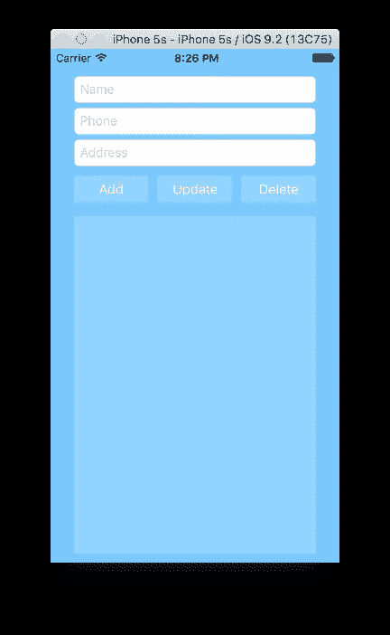
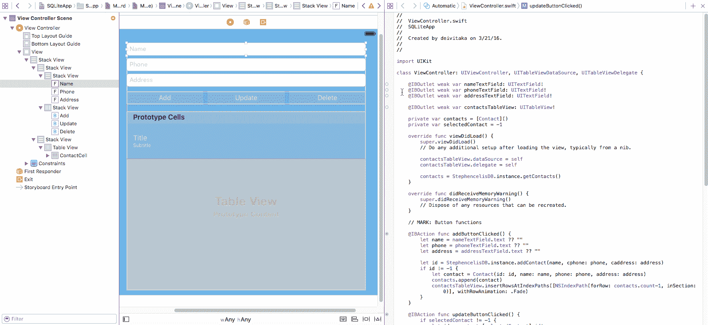
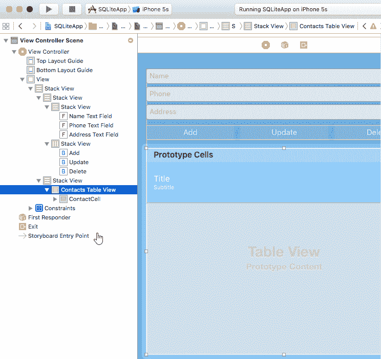
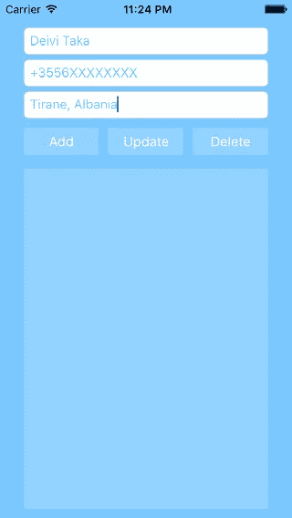
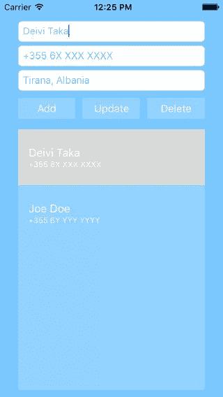

# 使用 SQLite 管理 iOS 应用程序中的数据

> 原文：<https://www.sitepoint.com/managing-data-in-ios-apps-with-sqlite/>

几乎所有的应用程序都需要存储某种形式的数据。也许你需要保存用户偏好、游戏进度或离线数据，以便你的应用程序可以在没有网络连接的情况下工作。开发人员在 iOS 应用中有很多管理数据的选项，从核心数据到基于云的存储，但一个优雅而可靠的本地存储选项是 SQLite。

在本教程中，我将向您展示如何添加 SQLite 支持到您的应用程序。你可以在 [GitHub](https://github.com/sitepoint-editors/SQLiteApp) 上找到最终的源代码。

*这篇文章由[亚历山大·科科](https://www.sitepoint.com/author/aleksanderkoko/)同行评审。感谢 SitePoint 的所有同行评审员使 SitePoint 的内容尽可能做到最好！*

## 入门指南

SQLite 库是用 C 编写的，所有的查询都是通过调用 C 函数实现的。这使得它很难使用，因为你必须知道指针和数据类型等。为此，您可以利用 Objective-C 或 Swift 包装器作为适配器层。

一个流行的选择是 [FMDB](https://github.com/ccgus/fmdb) ，一个 SQLite 的 Objective-C 包装器。它很容易使用，但我个人更喜欢不使用硬编码的 SQL(结构化查询语言)命令。对于本教程，我将使用 [SQLite.swift](https://github.com/stephencelis/SQLite.swift) 创建一个基本的联系人列表。

首先，在 Xcode 中创建新的单视图项目(SQLite.swift 需要 Swift 2 和 Xcode 7 或更高版本)。我在 *Main.storyboard* 中创建了一个`ViewController`，如下图所示。创建自己的类似布局，或者[在这里](https://github.com/sitepoint-editors/SQLiteApp/tree/master/SQLiteApp/Base.lproj)下载故事板文件。



底部有一个`TableView`用来固定触点。

## 装置

可以[安装](https://github.com/stephencelis/SQLite.swift#installation) SQLite.swift 与[迦太基](https://www.sitepoint.com/dependency-management-in-ios-with-carthage/)、 [CocoaPods](#) ，或者[手动](https://github.com/stephencelis/SQLite.swift#manual)。

## 模型

创建一个名为 *Contact.swift* 的新 Swift 文件/类，它包含三个属性和初始化器以保持简单。

```
import Foundation

class Contact {
    let id: Int64?
    var name: String
    var phone: String
    var address: String

    init(id: Int64) {
        self.id = id
        name = ""
        phone = ""
        address = ""
    }

    init(id: Int64, name: String, phone: String, address: String) {
        self.id = id
        self.name = name
        self.phone = phone
        self.address = address
    }
} 
```

当创建一个对象时，`id`需要作为一个参数，因此您可以稍后在数据库中引用它。

## 连接用户界面

在 *ViewController.swift* 中，让类实现`UITableViewDelegate`和`UITableViewSource`协议。

```
class ViewController: UIViewController, UITableViewDataSource, UITableViewDelegate {
   ...
 } 
```

通过拖动或在代码中手动添加，将以下`IOutlet`与其对应的视图连接起来。

```
@IBOutlet weak var nameTextField: UITextField!
@IBOutlet weak var phoneTextField: UITextField!
@IBOutlet weak var addressTextField: UITextField!

@IBOutlet weak var contactsTableView: UITableView! 
```



现在，您需要一个联系人列表，以及从列表中选择的联系人的索引。

```
private var contacts = [Contact]()
private var selectedContact: Int? 
```

将`UITableView`的数据源和委托与故事板中的`UIViewController`链接起来。



或者在 *ViewController.swift* 的`viewDidLoad()`方法中添加以下几行。

```
contactsTableView.dataSource = self
contactsTableView.delegate = self 
```

为了插入、更新和删除`UITableView`中的元素，你需要实现上述协议中的三个基本方法。

第一个将用所选联系人的相应联系信息填充`UITextField` s。然后，Yt 将在表中保存代表该联系人的行。

```
func tableView(tableView: UITableView, didSelectRowAtIndexPath indexPath: NSIndexPath) {
    nameTextField.text = contacts[indexPath.row].name
    phoneTextField.text = contacts[indexPath.row].phone
    addressTextField.text = contacts[indexPath.row].address

    selectedContact = indexPath.row
} 
```

下一个函数告诉`UITableViewDataSource`它应该加载多少单元格的数据。现在，它将是零，因为数组是空的。

```
func tableView(tableView: UITableView, numberOfRowsInSection section: Int) -> Int {
    return contacts.count
} 
```

最后一个函数为每一行返回一个特定的`UITableViewCell`。首先使用标识符获取单元格，然后使用标签获取其子视图。确保标识符与元素名匹配。

```
func tableView(tableView: UITableView, cellForRowAtIndexPath indexPath: NSIndexPath) -> UITableViewCell {

    let cell = tableView.dequeueReusableCellWithIdentifier("ContactCell")!
    var label: UILabel
    label = cell.viewWithTag(1) as! UILabel // Name label
    label.text = contacts[indexPath.row].name

    label = cell.viewWithTag(2) as! UILabel // Phone label
    label.text = contacts[indexPath.row].phone

    return cell
} 
```

该应用程序现在可以运行，但还不能添加或编辑联系人。为此，将以下`IBAction`与相应的按钮连接起来。

```
@IBAction func addButtonClicked() {
    let name = nameTextField.text ?? ""
    let phone = phoneTextField.text ?? ""
    let address = addressTextField.text ?? ""

    let contact = Contact(id: 0, name: name, phone: phone, address: address)
    contacts.append(contact)
    contactsTableView.insertRowsAtIndexPaths([NSIndexPath(forRow: contacts.count-1, inSection: 0)], withRowAnimation: .Fade)
} 
```

在这里，您获取`UITextField`的值，并创建一个添加到`contacts`列表中的对象。`id`被设置为 0，因为您还没有实现数据库。函数`insertRowsAtIndexPaths()`将受影响的行的索引数组和要执行的动画作为参数。

```
@IBAction func updateButtonClicked() {
    if selectedContact != nil {
        let id = contacts[selectedContact].id!
        let contact = Contact(
            id: id,
            name: nameTextField.text ?? "",
            phone: phoneTextField.text ?? "",
            address: addressTextField.text ?? "")

            contacts.removeAtIndex(selectedContact!)
                contacts.insert(contact, atIndex: selectedContact!)

        contactsTableView.reloadData()
    } else {
    print("No item selected")
    }
} 
```

在这个函数中，您创建一个新的`Contact`，并删除和重新插入列表的相同索引，以进行替换。该函数当前不检查数据是否已经更改。

```
@IBAction func deleteButtonClicked() {
    if selectedContact != nil {
        contacts.removeAtIndex(selectedContact)

        contactsTableView.deleteRowsAtIndexPaths([NSIndexPath(forRow: selectedContact, inSection: 0)], withRowAnimation: .Fade)
    } else {
    print("No item selected")
    }
} 
```

最后一个函数删除选定的联系人并刷新表格。

此时应用程序可以工作，但是当重新启动时会丢失所有的更改。

## 创建数据库

现在是管理数据库的时候了。创建一个名为*stephenelisdb . swift*的新 swift 文件/类，并导入 SQLite 库。

```
import SQLite

class StephencelisDB {
} 
```

首先，使用“Singleton”模式初始化该类的一个实例。然后，声明一个类型为`Connection`的对象，这是您将调用的实际数据库对象。

```
static let instance = StephencelisDB()
private let db: Connection? 
```

其他声明是联系人表及其特定类型的列。

```
private let contacts = Table("contacts")
private let id = Expression<Int64>("id")
private let name = Expression<String?>("name")
private let phone = Expression<String>("phone")
private let address = Expression<String>("address") 
```

构造函数尝试打开与具有指定名称和应用程序数据路径的数据库的连接，然后创建表。

```
private init() {
    let path = NSSearchPathForDirectoriesInDomains(
        .DocumentDirectory, .UserDomainMask, true
        ).first!

    do {
        db = try Connection("\(path)/Stephencelis.sqlite3")
    } catch {
        db = nil
        print ("Unable to open database")
    }

    createTable()
}

func createTable() {
    do {
        try db!.run(contacts.create(ifNotExists: true) { table in
        table.column(id, primaryKey: true)
        table.column(name)
        table.column(phone, unique: true)
        table.column(address)
        })
    } catch {
        print("Unable to create table")
    }
} 
```

请注意，没有创建表和列的 SQL 代码。这就是所用包装的威力。只需几行代码，数据库就准备好了。

## CRUD 操作

对于那些不熟悉这个术语的人来说，“CRUD”是创建-读取-更新-删除的缩写。接下来，将执行这些操作的四个方法添加到数据库类中。

```
func addContact(cname: String, cphone: String, caddress: String) -> Int64? {
    do {
        let insert = contacts.insert(name <- cname, phone <- cphone, address <- caddress)
        let id = try db!.run(insert)

        return id
    } catch {
        print("Insert failed")
        return -1
    }
} 
```

像在普通查询中一样，`<-`操作符将值分配给相应的列。`run`方法将执行这些查询和语句。插入的行的`id`从该方法返回。

添加`print(insert.asSQL())`来查看执行的查询本身:

```
INSERT INTO "contacts" ("name", "phone", "address") VALUES ('Deivi Taka', '+355 6X XXX XXXX', 'Tirana, Albania') 
```

如果你想进行进一步的调试，你可以使用一个方法。方法返回指定表格中所有行的列表。您遍历这些行并创建一个由列内容作为参数的`Contact`对象组成的数组。如果此操作失败，将返回一个空列表。

```
func getContacts() -> [Contact] {
    var contacts = [Contact]()

    do {
        for contact in try db!.prepare(self.contacts) {
            contacts.append(Contact(
            id: contact[id],
            name: contact[name]!,
            phone: contact[phone],
            address: contact[address]))
        }
    } catch {
        print("Select failed")
    }

    return contacts
} 
```

要删除项目，找到带有给定`id`的项目，并将其从表格中删除。

```
func deleteContact(cid: Int64) -> Bool {
    do {
        let contact = contacts.filter(id == cid)
        try db!.run(contact.delete())
        return true
    } catch {
        print("Delete failed")
    }
    return false
} 
```

通过将结果筛选到某个列值，可以一次删除多个项目。

更新也有类似的逻辑。

```
func updateContact(cid:Int64, newContact: Contact) -> Bool {
    let contact = contacts.filter(id == cid)
    do {
        let update = contact.update([
            name <- newContact.name,
            phone <- newContact.phone,
            address <- newContact.address
            ])
        if try db!.run(update) > 0 {
            return true
        }
    } catch {
        print("Update failed: \(error)")
    }

    return false
} 
```

## 最终变更

在设置了数据库管理类之后，还需要对 *Viewcontroller.swift* 进行一些修改。

首先，当加载视图时，获取以前保存的联系人。

```
contacts = StephencelisDB.instance.getContacts() 
```

您之前准备的 tableview 方法将显示保存的联系人，而不添加任何其他内容。

在`addButtonClicked`中，调用方法将联系人添加到数据库中。然后，只有当方法返回有效的`id`时，才更新 tableview。

```
if let id = StephencelisDB.instance.addContact(name, cphone: phone, caddress: address) {
    // Add contact in the tableview
    ...
} 
```

以类似的方式，在`updateButtonClicked`和`deleteButtonClicked`内部调用这些方法。

```
...
StephencelisDB.instance.updateContact(id, newContact: contact)
...
StephencelisDB.instance.deleteContact(contacts[selectedContact].id!)
... 
```

运行应用程序并尝试执行一些操作。下面是它应该是什么样子的两个截图。要更新或删除联系人，必须首先选择它。





## 有任何疑问吗？

SQLite 是处理本地数据的好选择，许多应用程序和游戏都使用它。像 SQLite.swift 这样的包装器通过避免使用硬编码的 SQL 查询使实现变得更加容易。如果你需要在应用程序中存储数据，并且不想处理更复杂的选项，那么 SQLite i 值得考虑。

*愿法典与你同在！*

## 分享这篇文章