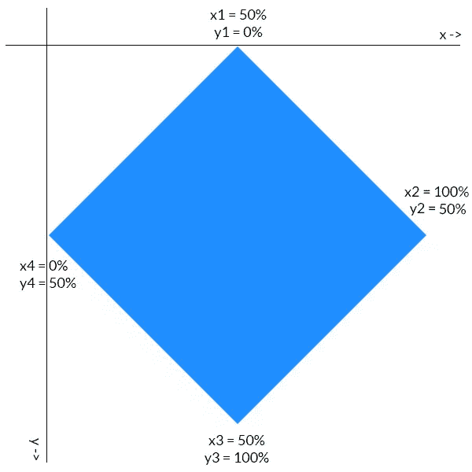
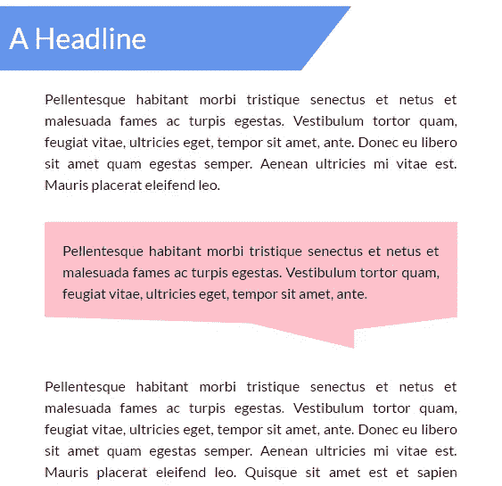

# CSS 剪辑路径属性简介

> 原文：<https://www.sitepoint.com/introducing-css-clip-path-property/>

腹板主要是矩形的。另一方面，印刷媒体往往在形状上更加多样化。造成这种差异的原因有很多，其中之一就是缺乏合适的工具来实现我们在印刷媒体中所拥有的。

本教程将向您介绍 [`clip-path`](https://www.w3.org/TR/css-masking-1/#the-clip-path) ，一个允许您阻止元素的一部分显示的属性。可见的区域由您提供的值控制。我们将从基础开始，然后讨论语法，然后转向更高级的概念。

## 基础知识

裁剪是指我们从某物上剪下一片。在我们的例子中，这是一个允许我们完全或部分隐藏网页元素的操作。我们将在本文中使用的另外两个与裁剪相关的概念是*裁剪路径*和*裁剪区域*。

裁剪路径是我们用来裁剪元素的路径，它标出了我们的裁剪区域。它可以是基本形状，也可以是复杂的多边形路径。然后，剪辑区域包括剪辑路径中包含的所有区域。

浏览器会剪辑剪辑区域之外的任何内容。这不仅包括背景和其他类似的内容，还包括边框、文本阴影等等。此外，浏览器不会捕捉元素裁剪区域之外的任何事件，如`hover`或`click`。

即使我们的特定元素现在不是矩形的，元素周围的内容也会按照元素原来的形状流动。要使周围的元素按照被裁剪元素的形状流动，您必须使用`shape-outside`属性。这一点在[本站点教程](https://www.sitepoint.com/css-shapes-breaking-rectangular-design/)中有详细介绍。

*此外，请记住，您不希望将此属性与已弃用的 [`clip`属性](https://www.w3.org/TR/css-masking-1/#clip-property)混淆，后者非常严格，仅支持矩形裁剪。*

## 语法和用法

使用该属性的正确语法是:

```
clip-path: <clip-source> | [ <basic-shape> || <geometry-box> ] | none 
```

上面的语法值包括:

*   `clip-source`将是一个引用内部或外部 SVG `<clipPath>`元素的 URL。
*   `basic-shape`接受在 [CSS 形状规范](https://www.w3.org/TR/css-shapes-1/#typedef-basic-shape)中定义的基本形状函数。
*   `geometry-box`是可选的。当你把它和`basic-shape`函数一起提供时，它就像一个参考框，用于`basic-shape`完成的剪辑。如果`geometry-box`是自己指定的，那么它使用指定框的形状，包括任何角的形状(由`border-radius`属性提供)作为剪切路径。我们将很快进一步探讨这一点。

现在，考虑以下使用基本形状函数的 CSS 代码:

```
img {
  clip-path: polygon(50% 0%, 100% 50%, 50% 100%, 0% 50%);
} 
```

它会把所有的图片剪成菱形。但是为什么图像被剪成菱形而不是梯形或平行四边形呢？这完全取决于顶点的值。下图说明了创建自己的裁剪多边形时要使用的惯例:



每个点的第一个坐标决定了它在 x 轴上的位置。类似地，第二个点指定其在 y 轴上的位置。这些点都是按顺时针方向绘制的。考虑我们菱形的最右边一点。它位于 y 轴的中间，所以它的 y 坐标是 50%。它也位于 x 轴的最右端，所以它的 x 坐标是 100%。所有其他点的值可以类似地推导出来。

### 用`geometry-box`值裁剪元素

当你剪切一个 HTML 元素时，`geometry-box`(或引用框)可以是以下任意一个:`margin-box`、`border-box`、`padding-box`或`content-box`。`geometry-box`值应按以下方式使用:

```
.clip-me {
  clip-path: polygon(10% 20%, 20% 30%, 50% 80%) margin-box;
  margin: 10%;
}
```

在上面的例子中，我们的元素的`margin-box`将被用作参考来确定剪辑点的确切位置。点`(10%, 10%)`是我们的`margin-box`的左上角，因此我们的`clip-path`将相对于该点定位。

如果是 SVG 元素，可以是`fill-box`、`stroke-box`、`view-box`。如果没有指定`view-box`，值`view-box`将使用最近的 SVG 视口作为参考框。

## `clip-path`的用途

这种特性有很多有趣的用途。首先，它可以改善我们的文本内容。看看下面的图片。标题和第二段后面的背景是使用`clip-path`属性创建的:



您可以使用渐变和其他类似技术轻松创建第一个背景。然而，如果没有`clip-path`的帮助，创建第二个会困难得多。请注意，消息状背景底部的线条不是完全水平的，它有点倾斜。为了用`clip-path`实现这个结果，你只需要一行 CSS 代码:

```
.p-msg {
  clip-path: polygon(0% 0%, 100% 0%, 100% 75%, 75% 85%, 75% 100%, 50% 80%, 0% 75%);
} 
```

背景有七个顶点，它反映在我们的多边形的`clip-path`中。你问的那些坐标我是怎么想出来的？我将把这个问题留给读者去解决——这样做将有助于您更好地理解这些概念。试着使用下面的代码笔来掌握它的窍门:

通过 [CodePen](http://codepen.io) 上的 SitePoint ( [@SitePoint](http://codepen.io/SitePoint) )查看带有 clip-path 的笔[文本。](http://codepen.io/SitePoint/pen/oxRJyg/)