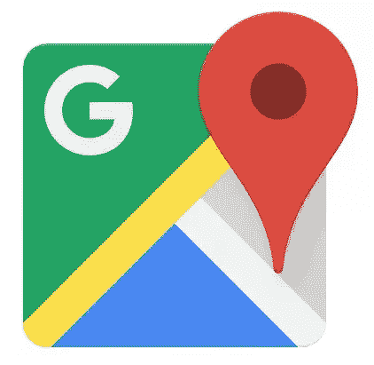
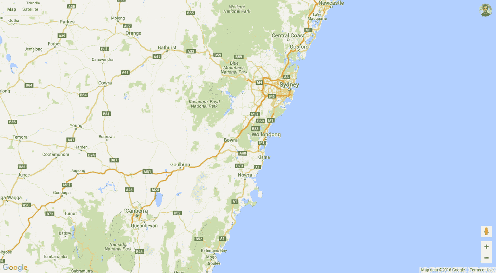

# 正确利用谷歌地图 JavaScript API

> 原文：<https://www.sitepoint.com/google-maps-javascript-api-the-right-way/>

*这篇文章由[蒂姆·塞韦里恩](https://www.sitepoint.com/author/tseverien/)、[努里娅·祖阿佐](https://twitter.com/nuriaz)和马洛里·范·阿赫特博格进行了同行评议。感谢 SitePoint 的所有同行评审员使 SitePoint 的内容尽可能做到最好！*



谷歌地图是一种在线地图服务，提供最新的道路地图、企业名录、方向、街道照片等。

谷歌地图有一些值得注意的替代品，比如 [Mapbox](https://www.mapbox.com/) 和[开放式街道地图](https://www.openstreetmap.org)。但在我看来，没有一个竞争对手能比得上谷歌地图，唯一的原因是其商业目录的完整性。谷歌能够展示一幅完整而巨大的地图，上面配有最新的商业细节，这主要归功于其搜索服务的交叉。

与地图交互的 API 有[各种各样，从简单的](https://developers.google.com/maps/get-started/)[静态 API](https://developers.google.com/maps/documentation/static-maps/) 到强大的 [JavaScript API](https://developers.google.com/maps/documentation/javascript/) ，这是本文的重点。

当然，你可以把谷歌地图放在你的网站上，而不用利用现有的各种 API。当然，这使生活变得更容易，并且仍然提供了许多有用的功能。但是出于性能和定制的目的，Maps JavaScript API 让我们可以完全控制我们的地图。

### 利用谷歌地图 JavaScript API

在本文中，我将向您展示如何充分利用 Maps JavaScript API——以正确的方式使用它。

已经有很多这方面的教程和例子，但是往往没有关注达到预期结果的最佳方式。他们很快就把事情做完了，但是没有经过深思熟虑的方法，也没有解释为什么要采取某些步骤。

本文的完整源代码可以在我们的 [GitHub repo](https://github.com/sitepoint-editors/google-maps-api-template) 上找到。

## 创建基本地图画布

我们需要做的第一件事是为构建地图应用程序建立一个简单的前端框架。

### 创建 HTML

让我们用以下标记创建一个 HTML 文件:

```
<!DOCTYPE html>
<html lang="en">
  <head>
    <meta charset="utf-8">
    <meta http-equiv="X-UA-Compatible" content="IE=edge">
    <meta name="viewport" content="width=device-width, initial-scale=1">
    <title>Google Maps API Template</title>

    <link rel="stylesheet" href="style.css" />
  </head>
  <body>
    <div id="map"></div>

    <script src="script.js" defer></script>
  </body>
</html> 
```

这为我们构建完整的地图应用程序提供了一个健壮的平台。

注意我们是如何在脚本中使用`defer`属性的。这告诉浏览器尽快下载指定的脚本，但要等到 HTML 解析完成后再执行它们。尽可能使用`defer`是很重要的，因为这将防止页面渲染在完成之前停止以执行 JavaScript 代码——为用户提供轻松的加载体验。眼尖的读者可能会注意到我们没有包括谷歌地图的 JavaScript:这是故意的，很快就会解释！

### 构建就绪回调

现在，让我们设置我们的初始 JavaScript 文件`script.js`，从调用`document.addEventListener('DOMContentLoaded', function () {})`开始:

```
document.addEventListener('DOMContentLoaded', function () {
  if (document.querySelectorAll('#map').length > 0)
  {
    if (document.querySelector('html').lang)
      lang = document.querySelector('html').lang;
    else
      lang = 'en';

    var js_file = document.createElement('script');
    js_file.type = 'text/javascript';
    js_file.src = 'https://maps.googleapis.com/maps/api/js?callback=initMap&signed_in=true&language=' + lang;
    document.getElementsByTagName('head')[0].appendChild(js_file);
  }
}); 
```

`#map`长度检查是一种快速发现当前页面上是否存在某个元素的方法。通常情况下，同一个外部 JavaScript 文件会包含在整个网站中，而且通常情况下，某些页面只需要部分代码。在这种情况下，我们只希望在向用户呈现地图画布时执行这段代码。这可以防止在不需要的页面上出现不必要的代码膨胀。(性能很重要！)

一旦我们确定页面上有了地图画布，我们可能会认为我们已经准备好继续，但是还有一个检查我们应该执行。默认情况下，Google Maps JavaScript API 以英语加载，不管请求页面是什么语言。解决这个问题的一个好方法是基于`<html>`元素中的`lang`属性设置一个`lang`变量。这将允许我们为我们的用户包含正确语言的 Google Maps JS。这对于多语言(i18n)网站尤其有用，这些网站包含所有语言的相同`script.js`文件。

### 抓取谷歌的 JavaScript 文件

现在是加载外部 Google Maps JS 文件的时候了。我们之所以将它保留到现在，而不是将其作为常规的`<script>`标签包含在 HTML 中，是为了防止没有地图画布的页面中不必要的代码膨胀。为了加载文件，我们创建了一个新的`<script>`元素，并将其注入到 DOM 的`<head>`中。由于 Google 的 API 为我们处理回调，我们不需要做任何比这更花哨的事情:

```
var js_file = document.createElement('script');
js_file.type = 'text/javascript';
js_file.src = 'https://maps.googleapis.com/maps/api/js?callback=initMap&signed_in=true&key=YOUR_API_KEY&language=' + lang;
document.getElementsByTagName('head')[0].appendChild(js_file); 
```

在传递给 API 的查询字符串参数中，有一些有趣的事情需要注意。

首先，我们传递我们的`lang`变量作为`language`参数来指示 Google 我们希望地图使用哪种语言。

其次，我们提供参数`signed_in`作为`true`。这是为了增加地图的个性化(例如，它会让你的星号位置可见，等等)。

接下来，我们用 API 键传递`key`参数(稍后会有更多介绍)。

最后，也是最重要的，我们使用`callback`参数指定回调函数。这告诉 Google 一旦文件被成功获取，它应该触发我们的哪个功能。

没有有效的`key`参数，Google Maps JS API 仍然可以工作。但是，我们会收到一条 JavaScript 错误控制台警告消息。所以我们应该确保通过遵循谷歌的指南来获得一个免费的 API 密匙。

### 初始化地图画布

现在我们已经建立了初始化函数调用，我们可以继续定义我们的回调函数`initMap()`。这是 Google Maps JS API 成功加载后将触发的功能。

```
var map;

function initMap() {
  map = new google.maps.Map(document.getElementById('map'), {
    center: {lat: -34.397, lng: 150.644},
    zoom: 8
  });
} 
```

创建新的 Google 地图时，最好在全局范围内(任何函数之外)为地图创建变量，以便以后更容易与地图交互。这就是为什么我们在`initMap()`之外定义`map`。

现在我们已经有了一个空的`map`变量，我们可以在`initMap`函数中为它分配 Google Map 对象。这正是[谷歌的简单地图示例](https://developers.google.com/maps/documentation/javascript/examples/map-simple)。需要注意的一件重要事情是，我们必须同时指定一个`center`和一个`zoom`，否则映射根本不会初始化。没有违约！

### 不要忘记 CSS

让初始的基本地图画布工作的最后一个重要步骤是在我们的`style.css`文件中提供一些 CSS:

```
html, body {
  height: 100%;
  margin: 0;
  padding: 0;
}

#map {
  height: 100%;
} 
```

我们今天要讨论的最常见的陷阱是忘记为`#canvas`元素设置一个`height`属性。不考虑本文涉及的其他内容，如果没有`height`(或`min-height` ) CSS 属性集，我们根本看不到地图。应用于`<html>`和`<body>`的样式只是为了让画布全屏显示。



## 将标记添加到地图画布

一旦我们显示了一个基本的地图画布，最常见的下一个任务是在地图上绘制标记。在大多数编程环境中，我总是给出的一个建议是尽可能将数据与逻辑分开。在这种情况下，通过将您的标记详细信息存储在一个单独的 JSON 文件中来说明这一点。

### 为标记创建一个 JSON 文件

继续创建一个名为`markers.json`的 JSON 文件:

```
[
  {
    "lat": 53.817680,
    "lng": -1.537657
  },
  {
    "lat": 53.790123,
    "lng": -1.53243
  },
  {
    "lat": 53.756745,
    "lng": -1.5309087
  },
  {
    "lat": 53.6474675,
    "lng": -1.49564554
  },
  {
    "lat": 53.69123456,
    "lng": -1.6545466
  }
] 
```

将 Google Maps 标记存储为经度和纬度值而不是地址总是一个好主意。否则，我们必须在运行时使用谷歌的[地理编码服务](https://developers.google.com/maps/documentation/geocoding/start)。这是一个单独的 API，具有严格的使用限制，还会向地图初始化过程添加另一个外部实体，从而增加延迟。

现在我们的 JSON 文件已经设置好了，我们需要在初始化地图时使用它。

### 绘制标记

首先修改`initMap()`函数，在地图初始化后获取`markers.json`文件，使用[闪亮的新获取 API](https://www.sitepoint.com/introduction-to-the-fetch-api/) ，传递一个对新函数`plotMarkers()`的回调。我们还在这里使用承诺来确保响应在被传递给回调函数之前被解析成 JSON:

```
fetch('markers.json')
  .then(function(response){return response.json()})
  .then(plotMarkers); 
```

那么让我们继续定义`plotMarkers()`:

```
var markers;
var bounds;

function plotMarkers(m)
{
  markers = [];
  bounds = new google.maps.LatLngBounds();

  m.forEach(function (marker) {
    var position = new google.maps.LatLng(marker.lat, marker.lng);

    markers.push(
      new google.maps.Marker({
        position: position,
        map: map,
        animation: google.maps.Animation.DROP
      })
    );

    bounds.extend(position);
  });

  map.fitBounds(bounds);
} 
```

与我们的`map`变量一样，我们希望在函数之外，在全局范围内定义更多的变量。在这个函数中，我们将使用`markers`和`bounds`，这两个函数稍后在其他地方可能会有用，所以在全局范围内使用它们是个好主意。

在`plotMarkers`函数中，我们需要做的第一件事是将我们的`markers`变量设置为一个空数组，将我们的`bounds`变量设置为一个空的 Google `LatLngBounds`对象。我们将使用`LatLngBounds`对象来跟踪需要在画布上显示的区域，以便放置所有的标记。

现在我们需要迭代每个标记，提供一个匿名回调函数，该函数从 JSON 文件中可用的`lat`和`lng`参数创建一个新的 Google position 对象。一旦我们得到这个，我们将创建一个新的谷歌地图标记对象，并把它放入我们的`markers`数组。最后，我们将使用新的位置来扩展我们的边界:

```
var position = new google.maps.LatLng(this.lat, this.lng);

markers.push(
  new google.maps.Marker({
    position: position,
    map: map,
    animation: google.maps.Animation.DROP
  })
);

bounds.extend(position); 
```

有一点需要注意:当创建一个新的 Google 地图标记对象时，唯一需要的参数是`position`和`map`。`position`参数可以是包含`lat`和`lng`参数的对象，也可以是 Google position 对象(如此处所示)。`map`参数就是我们想要在其上绘制标记的 Google map 对象。我们还提供了一个`animation`参数:这不是必需的，但是很容易实现——而且每个人都喜欢小动画！

### 将地图画布重新居中

现在我们已经遍历了所有的标记，将它们添加到地图中，并构建了画布边界，我们将调用`map.fitBounds()`来重新将地图画布围绕绘制的标记居中，覆盖我们在初始化地图对象时提供的初始`center`和`zoom`参数。这非常有用，因为它允许我们更新我们的`markers.json`文件，而不用担心我们的`center`或`zoom`参数。

参见 [CodePen](http://codepen.io) 上 SitePoint ( [@SitePoint](http://codepen.io/SitePoint) )的 Pen [Google Maps JS API 示例](http://codepen.io/SitePoint/pen/YWKLzv/)。