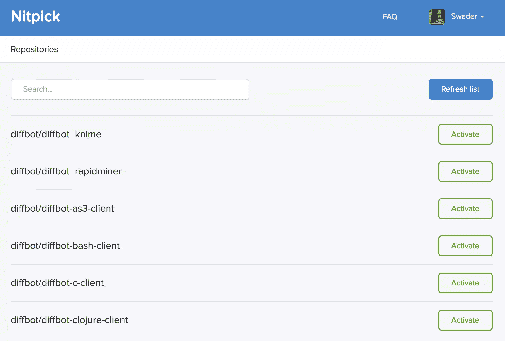
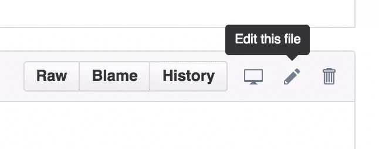
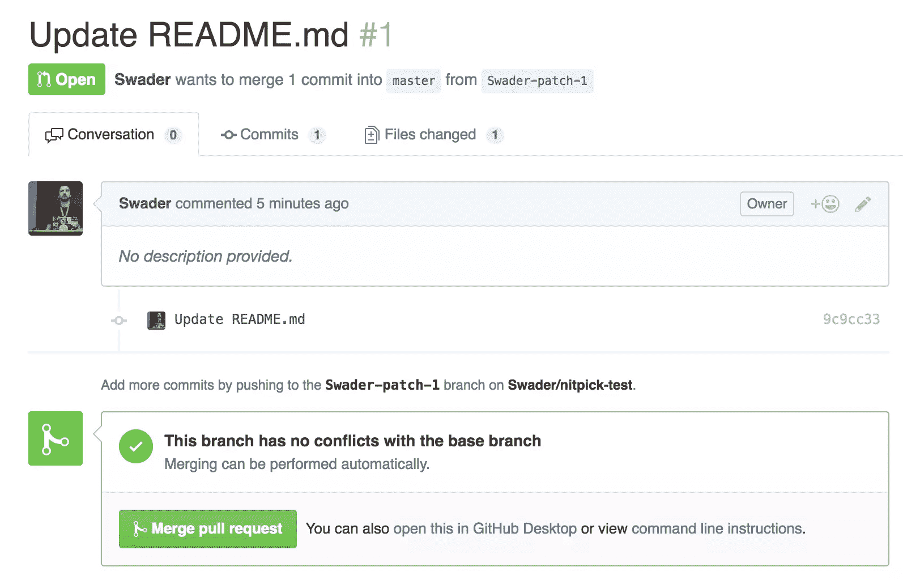
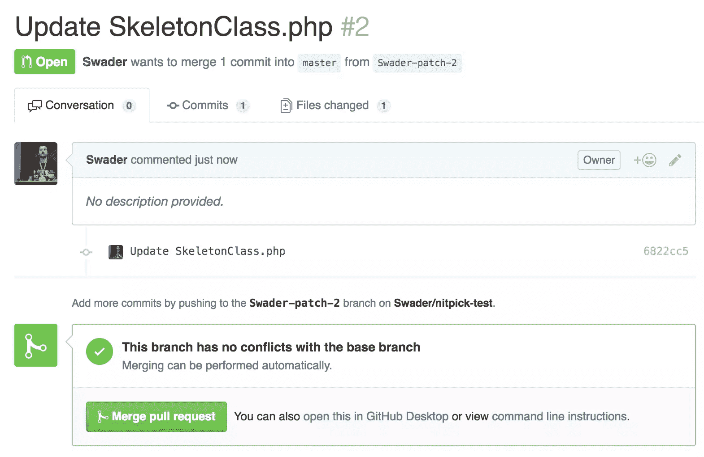
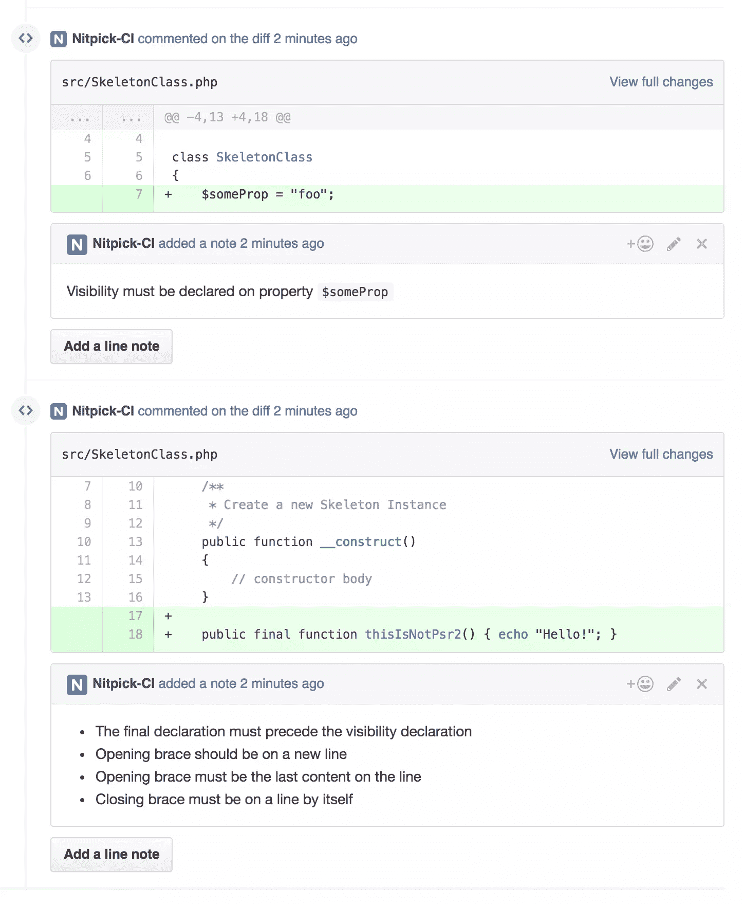
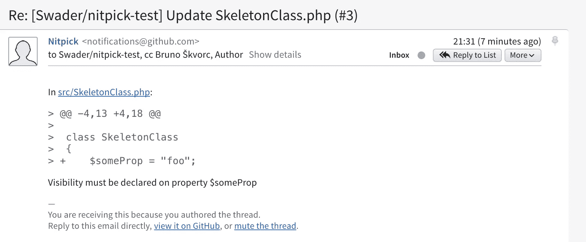
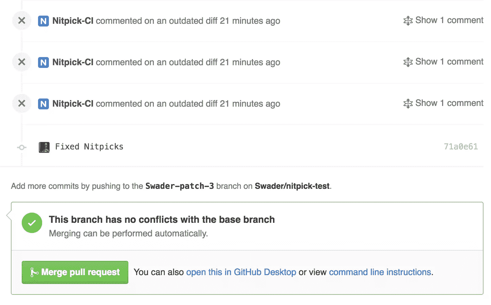

# 用挑剔的 CI 对代码标准吹毛求疵

> 原文：<https://www.sitepoint.com/nitpicking-over-code-standards-with-nitpick-ci/>

有很多方法可以确保你的代码遵守给定的代码标准——我们之前已经讨论过几个。但是在整个团队范围内强制执行一个标准，并确保每个人在错误被应用到项目之前都知道它们，这并不是一件容易的事情。Travis 和 Jenkins 都可以被配置来进行这些检查，但不像我们即将看到的解决方案那样容易相处:[吹毛求疵 CI](https://nitpick-ci.com/) 。


吹毛求疵的 CI 是一个非常简单的单击工具，用于确保提交的 Github pull 请求符合 PSR-2 标准。不幸的是，挑剔目前只与这两个特定的(但流行的)载体——只有 Github，只有 PSR-2。开源项目是免费的，我们来试试吧。

## 拔靴带

为了测试吹毛求疵，我们将基于[thephleague/skeleton](https://github.com/thephpleague/skeleton)创建一个全新的存储库，并假装我们正在构建一个新的 PHP 包。骨架已经尊重 PSR-2，所以它是一个无效公关的完美候选人。请随意跟随！

```
git clone https://github.com/thephpleague/skeleton nitpick-test
cd nitpick-test
find . -type f -print0 | xargs -0 sed -i 's/:author_name/Bruno Skvorc/g'
find . -type f -print0 | xargs -0 sed -i 's/:author_usernamename/swader/g'
find . -type f -print0 | xargs -0 sed -i 's/:author_website/http:\/\/bitfalls.com/g'
find . -type f -print0 | xargs -0 sed -i 's/:author_email/bruno@skvorc.me/g'
find . -type f -print0 | xargs -0 sed -i 's/:vendor/sitepoint/g'
find . -type f -print0 | xargs -0 sed -i 's/:package_name/nitpick-test/g'
find . -type f -print0 | xargs -0 sed -i 's/:package_description/nitpick-test package for a SitePoint tutorial/g'
rm CONDUCT.md
rm -rf .git 
```

上面的命令克隆骨架，用真实值替换占位符值，删除一些我们不需要的文件。这个项目现在已经准备好提交并推送到网上了(只要你[在 Github 上创建了一个 repo](https://guides.github.com/introduction/getting-your-project-on-github/) )。

```
git init
git remote add origin YOUR_ORIGIN
git add -A
git commit -am "Initial commit"
git push -u origin master 
```

我们现在可以告诉挑剔的人跟踪它。

## 配置挑剔

要设置 Nitpick，我们只需通过 Github 的 Oauth 注册即可:


一旦被授权查看一个账户的回购，挑剔将提供一个列表，每个列表旁边都有一个“激活”按钮。



如果你有数百个回购列表，甚至有一个方便的搜索栏来即时过滤。一次点击激活按钮，这就是所有需要的。吹毛求疵的人现在正在为 PRs 观看项目并且自动地扫描他们。让我们试一试！

## 非代码 PR

首先，让我们在非代码 PRs 上测试一下，看看挑剔的人会有什么反应。在本教程的前几个步骤中，我们删除了行为文件，但未能从自述文件中删除对它的引用。在自述文件的顶部还有一个“注释”需要删除。

我们可以通过单击自述文件中的“编辑”按钮，在在线用户界面中进行这些更改:



为了实际创建一个可检查的 PR，我们告诉 Github 创建一个新的分支和一个新的 pull 请求:


正如预期的那样，PR 保持不变——什么也没发生，我们可以合并它。该文件没有要检查的代码，因此不会发出任何通知。



## 有效的代码提取请求

现在，让我们向示例控制器添加一个更改。变化应该是最小的，只是为了看看是否吹毛求疵会做什么。为了简单起见，我们可以再次使用 web UI。

我们可以将`src/SkeletonClass.php`的内容改为:

```
< ?php

namespace League\Skeleton;

class SkeletonClass
{
    /**
     * Create a new Skeleton Instance
     */
    public function __construct()
    {
        // constructor body
    }

    /**
     * Friendly welcome
     *
     * @param string $phrase Phrase to return
     *
     * @return string Returns the phrase passed in
     */
    public function echoPhrase($phrase)
    {
        $phrase .= "- and here is a suffix!!";
        return $phrase;
    }
} 
```

同样，什么也没发生。吹毛求疵有用吗？



## 无效的代码提取请求

现在，让我们故意写一些不友好的 PSR-2 代码。PSR-2 个国家:

> 对线路长度不能有硬性限制；软限制必须为 120 个字符；行数应等于或少于 80 个字符。

和

> 必须在所有属性和方法上声明可见性；必须在可见性之前声明 abstract 和 final 必须在可见性之后声明 static。

虽然还有更多规则，但这些规则似乎很容易被打破。让我们将`src/SkeletonClass.php`的内容改为:

```
<?php

namespace League\Skeleton;

class SkeletonClass
{
    $someProp = "foo";
    public $someOtherProp = "bar";

    /**
     * Create a new Skeleton Instance
     */
    public function __construct()
    {
        // constructor body
    }

    public final function thisIsNotPsr2() { echo "Hello!"; }

    /**
     * Friendly welcome
     *
     * @param string $phrase Phrase to return
     *
     * @return string Returns the phrase passed in
     */
    public function echoPhrase($phrase)
    {
        $phrase .= "- and here is a suffix!! But it doesn't end there - we have here a very, very long line that's actually a bunch of text. Technically, it should be broken up or something I guess.";
        return $phrase;
    }
} 
```

我们添加了两个属性，其中只有一个是根据规则定义的。另一个缺少可见性声明。此外，我们添加了一个技术上有效但标准无效的方法，该方法在可见性的之后定义了它的终结性*，然后将它的整个主体与方法的声明放在同一行。最后，我们将前面添加的后缀扩展到了极限长度。*

一旦我们提交了 PR，我们可以看到事情有点不同:



吹毛求疵的人会在线显示错误，特别指出错误所在——无论是一个错误还是多个错误，就像我们添加的方法一样。

由于像用户一样直接对公关吹毛求疵，通知也通过电子邮件发送，所以几乎不可能错过:



然而，它遗漏了一件事，那就是线的长度。它对它一点反应都没有。这是因为在引擎盖下，吹毛求疵使用 PHP 代码嗅探器，它是 PSR-2 预设，无论 PHPCS 认为什么是有效的，吹毛求疵都同意。关于具体的行长度问题，PHPCS 认为这只是一个警告，如果我们在代码中手动运行它，就可以看到这一点:

```
composer global require squizlabs/php_codesniffer
~/.config/composer/vendor/bin/phpcs --standard=PSR2 src/SkeletonClass.php 
```


经过检查，并不是吹毛求疵的人会阻止合并尝试。我们仍然可以像往常一样继续合并 PR。然而，在我们修复它们之前，检查消息将留在公共记录中。让我们现在做那件事。在命令行上，我们将克隆该 PR 的分支:

```
git fetch origin
git checkout -b Swader-patch-3 origin/Swader-patch-3 
```

然后我们进行必要的编辑，将`SkeletonClass.php`的内容改为:

```
<?php

namespace League\Skeleton;

class SkeletonClass
{
    public $someProp = "foo";
    public $someOtherProp = "bar";

    /**
     * Create a new Skeleton Instance
     */
    public function __construct()
    {
        // constructor body
    }

    final public function thisIsNotPsr2()
    {
        echo "Hello!";
    }

    /**
     * Friendly welcome
     *
     * @param string $phrase Phrase to return
     *
     * @return string Returns the phrase passed in
     */
    public function echoPhrase($phrase)
    {
        $phrase .= "- and here is a suffix!! But it doesn't end there - we have here a very, very long line that's actually a bunch of text. Technically, it should be broken up or something I guess.";
        return $phrase;
    }
} 
```

提交和推动后:

```
git add -A
git commit -m "Fixed nitpicks"
git push origin Swader-patch-3 
```

…我们得到的唯一关于修复错误的反馈是，吹毛求疵者之前对公关的评论现在已经过时了:



我们的公关现在准备合并了！

## 结论

无可否认，尽管挑剔的用例非常具体，但它也非常擅长——它只做一件事，而且做得很好。只需一次点击即可完成配置，整个团队受益于先进的标准检查，这些检查现在可以从 Jenkins 和 Travis 等其他 CI 工具中省去，而是让他们专注于实际测试。开源软件是免费的，而且非常容易安装，没有理由不试一试。

当然，也有一些吹毛求疵的人:

*   由于吹毛求疵地使用 PHPCS，我们受限于该工具能做什么。不仅如此，我们还受到该工具对 PSR-2 规则的解释的约束。没有办法定制规则集，或者定义标准的不同实现(目前)。
*   当出现错误时，PR 中没有阻塞指示器。像 Travis 和 viewrator 这样的 CI 工具在这方面做得非常好，因为它们协同工作，并使用 PR 的就绪指示器来标记构建失败或通过。虽然代码标准对构建的技术实现通过或失败没有真正的影响，但在这些工具的精神中有一些更多的视觉反馈是很好的。
*   当错误得到修复时，没有明确的迹象表明问题已经得到纠正。我喜欢[审查者](https://www.sitepoint.com/inspecting-php-code-quality-scrutinizer/)的做法——在公关中明确指出，并在电子邮件中说一些问题已经解决。这将发送给整个团队，所以每个人都立即在同一页面上。

也就是说，我肯定会对我所有的开源项目吹毛求疵——没有理由不这样做。作为一个 PSR-2 的重度用户，我可以让标准检查去吹毛求疵，并在 Travis 和细看器这样的工具中忘记它，而是让这些工具专注于重要的事情——代码检查和测试。

你用什么进行代码检查？您是依赖外部工具，还是只依赖本地工具？也许两者都有？让我们知道！

## 分享这篇文章