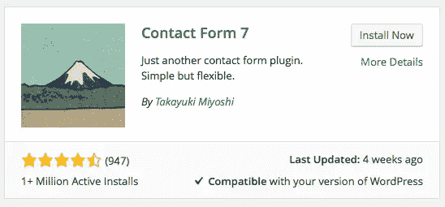
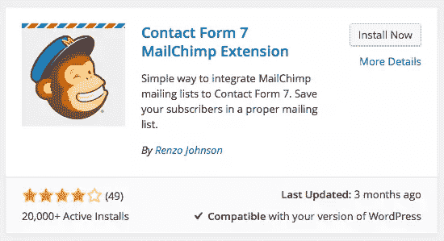
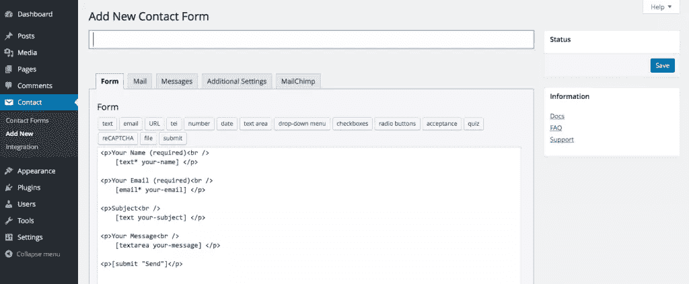
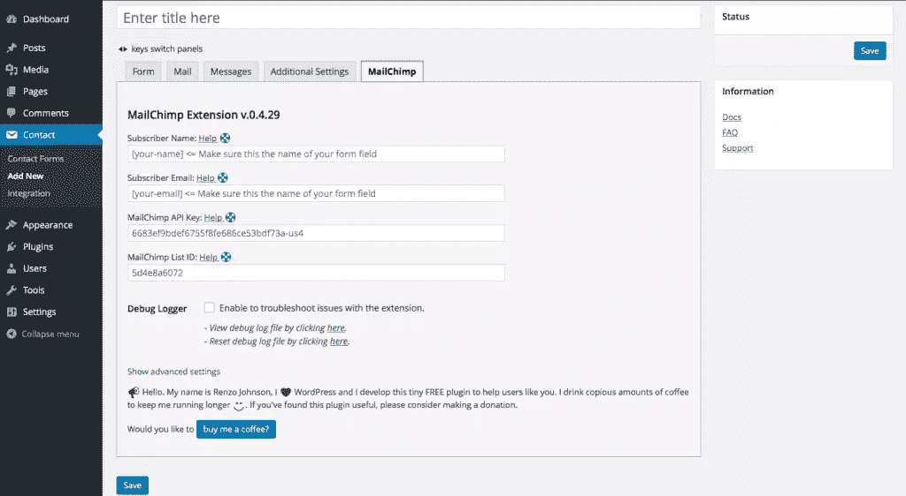

# 快速提示:使用 WordPress 的 Contact Form 7 增加选择加入

> 原文：<https://www.sitepoint.com/contact-form-7-for-wordpress/>

你可能听过这样一句话，“钱在清单里”。准确地说，是你的邮件列表。电子邮件营销被广泛认为是当今最强大的营销形式，有大量的数据支持它。

庞大的电子邮件用户群会给你很大的力量。你有一个触手可及的观众，他们喜欢你的品牌，并准备投资它。如果你有任何种类的产品或服务，电子邮件列表是无价的。

问题？很难获得电子邮件地址。有些人非常讨厌弹出窗口，不会给他们一天的时间。即使你提供了很棒的东西来换取一个电子邮件地址，有些人可能也不会感兴趣。

获得电子邮件地址的一个特别有效的方法是在你的联系表格中加入一个自动勾选框。每当有人通过表单与您联系时，会有一个预先选中的框自动为他们注册您的时事通讯。当然，如果他们愿意，他们可以取消选中它，但许多人不这样做。

在这篇文章中，我将向你展示如何使用 WordPress 的免费和高度通用的 Contact Form 7 插件来创建一个自动复选框，这将帮助你的电子邮件列表快速增长。

在实施之前，我建议你检查一下当地的垃圾邮件法律法规。我很想在下面的评论中听到更多你的想法和首选方法。

## 你需要什么:

### [联系方式 7](https://wordpress.org/plugins/contact-form-7/)



### [联系表格 7 MailChimp 分机](https://wordpress.org/plugins/contact-form-7-mailchimp-extension/)



## 如何创建自动选中的选项框

### 1.创建新的联系人表单

在您的仪表板中，导航至“联系人”>“添加新联系人”。您将看到一个文本字段，您可以在其中对您的联系人表单进行编码。该插件方便地提供了几个方便的选择。你所要做的就是点击你想要的元素(比如一个下拉菜单)，根据你的喜好修改它，然后点击“插入标签”



创建完表单后，您可以转到“邮件”、“消息”和“附加设置”选项卡来进一步定制您的表单。

### 2.将您的 MailChimp 帐户与联系表 7 整合

接下来，点击“MailChimp”标签。您将在这里看到四个字段:“订户姓名”、“订户电子邮件”、“MailChimp API 密钥”和“MailChimp 列表 ID”。



在“订户名称”字段中，输入`[your-name]`。在“订户电子邮件”字段中，输入`[your-email]`。在另外两个字段中，您只需输入您的 MailChimp API 密钥和列表 ID。([这里是如何找到你的 API 键](http://kb.mailchimp.com/accounts/management/about-api-keys)，而[这里是如何找到你的列表 ID。](http://kb.mailchimp.com/lists/managing-subscribers/find-your-list-id))

### 3.输入复选框短代码

最后，返回到“表单”选项卡。您将在希望复选框出现的任何地方插入一行简单的短代码。简短代码如下:

```
[mc4wp_checkbox "Sign up for the email list!"] 
```

你可以用你喜欢的任何信息来替换这段文字，我建议你用一个针对你的受众的有说服力的短语来替换它。

保存表单，就大功告成了！现在，只要有人联系您并且没有取消选中该框，他们就会注册到您的列表中。

注意:如果你在 MailChimp 账户上启用了 double optin，发件人仍然会收到一封电子邮件，要求他们确认订阅。

## 分享这篇文章