# 使用 libGDX 的跨平台游戏和应用程序–设置

> 原文：<https://www.sitepoint.com/cross-platform-games-and-applications-with-libgdx-setup/>

# 用 IntelliJ 设置 LibGDX

本教程将展示如何使用 IntelliJ 为桌面和 Android 应用程序设置和运行 libGDX 应用程序。libGDX 是一个带有统一 API 的 Java 应用程序开发框架，允许用户无缝编译到多个平台。

我将通过 IntelliJ 使用这个库，IntelliJ 是一个强大的 Java IDE，可以在整个项目开发过程中帮助管理项目。

下载并安装社区版的 [IntelliJ](https://www.jetbrains.com/idea/#chooseYourEdition)

接下来，[安装 Android SDK](https://www.sitepoint.com/quick-tip-installing-the-android-sdk/) 。

最后，下载并运行 [libGDX 设置应用](https://libgdx.badlogicgames.com/download.html)

## 设置 LibGDX

在 libGDX 安装应用程序中，填写生成新的 libGDX 项目所需的表单。除了*目的地*和 *Android SDK* 路径之外，其他都保留默认值。

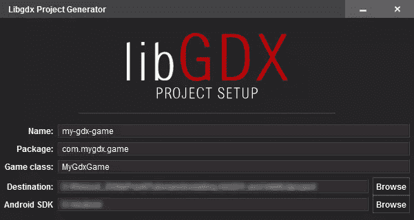

在*子项目*和*扩展*标签下，你可以指定要编译的平台和要包含在项目中的库。

这些设置**不是**永久的，您可以随时选择更改它们。

**注:**本教程旨在为桌面和 Android 开发应用。编译到桌面允许快速原型，我想尽可能避免使用任何模拟器。总是有直接编译到 android 设备的选项，但是它会比编译到桌面要慢。

在*扩展*下，有太多的扩展可供使用。将鼠标悬停在每个扩展的复选框上会显示一个工具提示，给出该扩展的描述。仅选择应用程序使用的扩展。否则，它们会不必要地增加应用程序的文件大小。

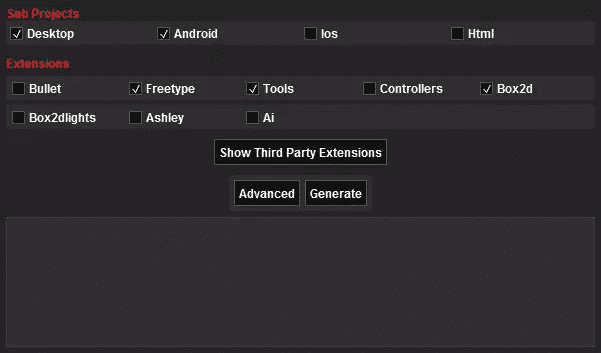

大多数应用程序(尤其是游戏)将使用:

*   **文字和字体的 Freetype** 。
*   **用于高效纹理打包的工具**
*   **物理用 Box2d** 。

生成项目前的最后一步是点击*高级*按钮，并确保选择*创意*。点击*保存*，然后*生成*。因为 libGDX 使用 Gradle 来管理所有依赖项，所以安装应用程序将下载这个项目所需的所有依赖项。一旦所有东西都下载完毕，你就可以用 IntelliJ 打开这个项目了。

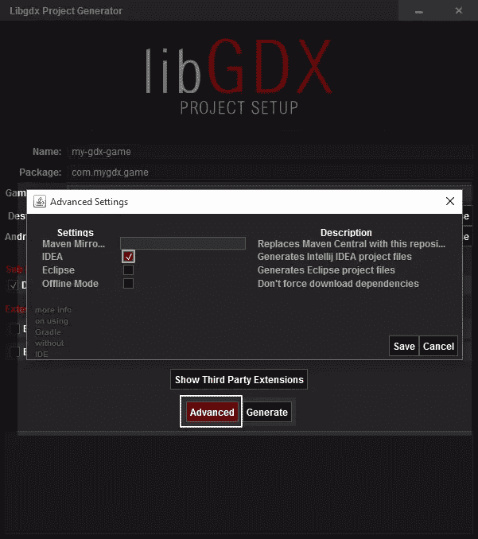

## 设置 IntelliJ

打开生成的 IntelliJ 项目文件，并在提示链接 Gradle 时打开。在*从 Gradle* 窗口导入项目，设置 JVM 的路径，当提示*打开现有项目*。

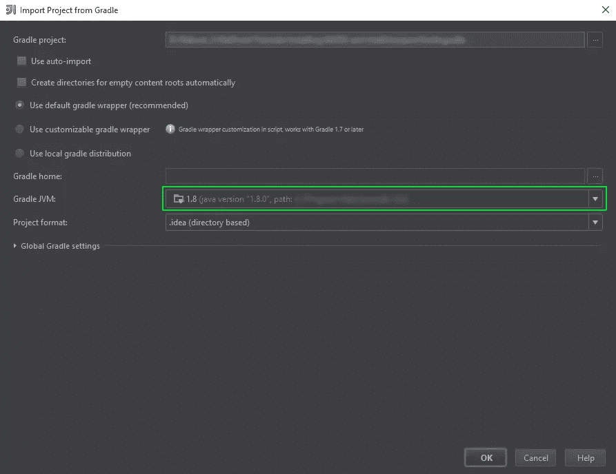

在应用程序运行之前，还需要更多的步骤。

在屏幕右上角，点击下拉箭头并选择*编辑配置…*

将出现一个新的*运行/调试配置*窗口。在屏幕左上角选择绿色的 *+* 符号，在*添加新配置*弹出框中选择*应用*。

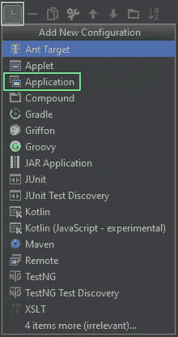

您现在有了一个新的配置，它将处理如何为桌面编译文件。

现在，你需要做三个调整。

确保选择了*配置*选项卡，并在*主类*下点击三个椭圆。将出现一个新窗口，点击*选择主类*，选择`DesktopLauncher`并点击确定。

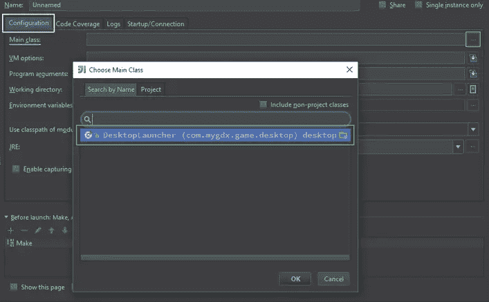

在*使用模块*的类路径下，点击下拉箭头，选择*桌面*。

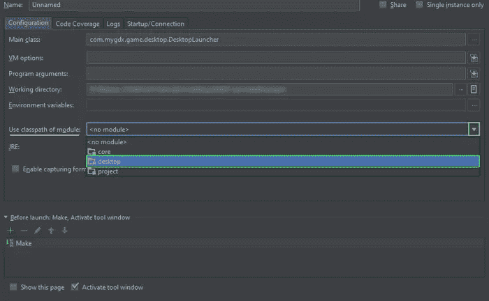

接下来设置*工作目录*来存储项目的所有资源，比如纹理、音频、JSON 文件等等。

在*工作目录下*点击三个省略号，选择*项目/安卓/资产*文件夹，点击确定。

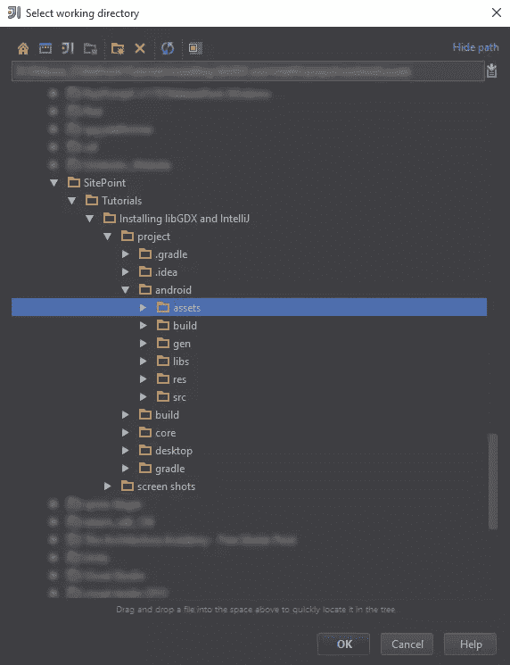

现在一切都在*运行/调试配置*中设置好了，所以点击*应用*，然后点击*确定*。点击绿色的*播放*按钮，应用程序就可以运行了。

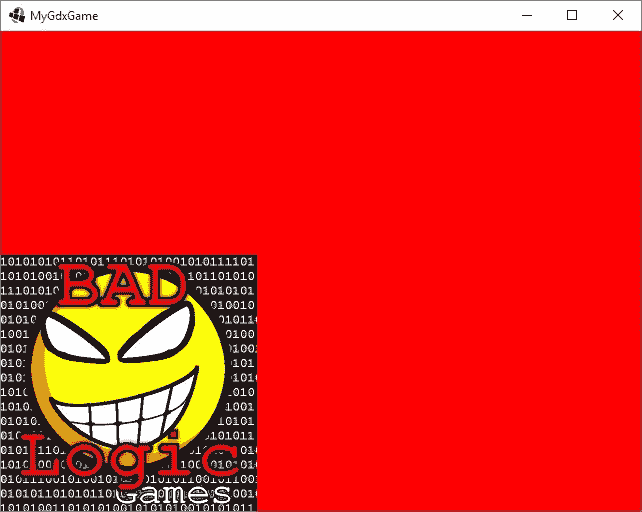

现在您已经准备好开始使用 libGDX 开发应用程序了！

## 将应用程序部署到 Android

要在 Android 上部署应用程序，你需要创建一个“签名 APK”。打开*构建- >生成签名的 APK…* 菜单项，一个新的*生成签名的 APK* 窗口将会出现。

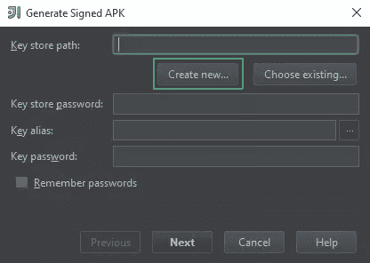

如果您以前从未创建过签名 APK，那么您需要添加一些详细信息。

*   **密钥存储路径**:密钥存储位置的路径。
*   **密码**:密钥库的密码。
*   **别名**:钥匙的别名。
*   **密码**:钥匙的密码。
*   **有效期**:密钥有效期多少年。
*   **证书**:根据需要输入任意值。

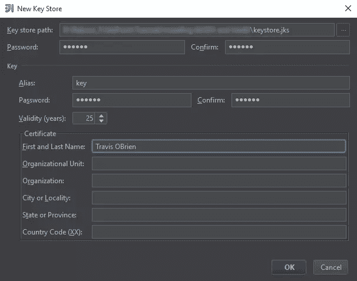

**注意:**此信息应保密，因为这是您的*个人* APK 签名。不要忘记细节或者你把钥匙放在哪里。

点击*确定*后，将回到*生成签名 APK* 并可以选择类型。

**重要提示:**在部署应用程序的最终版本时，确保选择*版本*。发布用 *debug* 签名的应用程序可能会导致不必要的性能损失。

生成签名的 APK 后，将其复制到并从 Android 手机上启动。

**注意:**您可能需要启用对未知 APK 文件的访问。

## 调试 APK 文件

您可以直接从 IntelliJ 运行应用程序，并让它在您的手机上运行，而不是生成一个 APK 文件并将其发送到 Android 手机。

创建一个新的*运行/调试配置*设置，并将*模块*设置为项目的 android 模块。现在，您可以在 Android 设备或模拟器上启动应用程序。

## 在桌面和 Android 之间交换以进行调试

现在，您有两个*运行/调试配置*选项，每个选项都准备好针对其特定平台。在两种设置之间切换，以选择运行应用程序的平台。

## 结论

libGDX 是开发跨平台应用和游戏的强大工具。在本教程中，我向您展示了如何设置一个 IDE 来开始使用该框架进行开发，在下一期中，我将开始编写一些实际的代码。

*在此期间，有任何问题或意见，请在下面*告诉我。

## 分享这篇文章