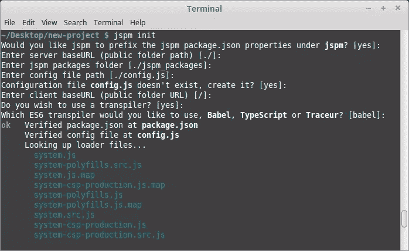

# 模块化 JavaScript:system js & jspm 初学者指南

> 原文：<https://www.sitepoint.com/modular-javascript-systemjs-jspm/>

这篇文章由[阿德里安·三都](https://www.sitepoint.com/author/asandu)和[马克·布朗](https://www.sitepoint.com/author/mbrown/)进行了同行评审。感谢 SitePoint 的所有同行评审员使 SitePoint 的内容尽可能做到最好！

在过去的几年里，JavaScript 编程语言已经流行起来。它已经成为开发富 web 应用程序和混合移动应用程序的首选语言。随着 JavaScript 项目变得越来越复杂，开发人员正在经历对该语言的新需求。其中之一是模块化。

就我所见，有两个方面需要实现模块化:

*   我们创作的模块
*   作为依赖项安装的外部模块

ES6 为 JavaScript 带来了一个标准模块语法和一个[加载器规范](https://github.com/whatwg/loader/)。这是一个很好的进步，然而在撰写本文的时候，[还没有浏览器可以本地加载 ES6 模块](https://www.nczonline.net/blog/2016/04/es6-module-loading-more-complicated-than-you-think/)。这意味着如果你现在想使用模块，你需要使用模块捆绑器。

*对当前形势的概述见:[理解 JavaScript 模块:捆绑&传输](https://www.sitepoint.com/javascript-modules-bundling-transpiling/)*

更重要的是，我们没有一个包管理器允许我们下载一个包并把它包含在我们的应用程序中。包管理器(如 Bower 和 npm)帮助我们下载前端依赖项，而不必访问项目的网站，但也仅此而已。

在本文中，我们将看到如何使用 [jspm](http://jspm.io/) 和 [SystemJS](https://github.com/systemjs/systemjs) 来克服这些问题。

## jspm 和 SystemJS 是什么？

JavaScript 包管理器(又名 jspm)是一个包管理器，它工作在 SystemJS 通用模块加载器之上。它不是一个全新的包管理器，有自己的一套规则，而是在现有的包源代码之上工作。开箱即用，它可以与 GitHub 和 npm 一起工作。因为大多数基于 Bower 的包都是基于 GitHub 的，所以我们也可以使用 jspm 来安装这些包。它有一个[注册表](http://kasperlewau.github.io/registry/#/)，列出了大多数常用的前端包，便于安装。像 npm 一样，它可以用于在安装过程中将包区分为开发包和生产包。

SystemJS 是一个模块加载器，它可以在运行时以目前使用的任何流行格式(CommonJS、UMD、AMD、ES6)导入模块。它建立在 [ES6 模块加载器 polyfill](https://github.com/ModuleLoader/es6-module-loader) 的顶部，足够智能以检测正在使用的格式并适当处理它。SystemJS 还可以使用插件来 transpile ES6 代码(用 [Babel](http://www.babeljs.io) 或 [Traceur](https://github.com/google/traceur-compiler) )或其他语言如 [TypeScript](http://www.typescriptlang.org) 和 [CoffeeScript](http://coffeescript.org) 。在导入模块之前，您可以在`System.config({ ... })`中配置这些东西。

jspm 使用 SystemJS 来管理包和它们的依赖项，所以我们不需要担心如何按照正确的顺序加载包。

现在我们知道了 jspm 和 SystemJS 是什么，让我们看看如何使用它们。

## 设置我们的环境

如果你还没有，你需要安装 [Node.js](https://nodejs.org/en/) 。一个特别简单的方法是使用版本管理器(比如 nvm)，在[快速提示](https://www.sitepoint.com/quick-tip-multiple-versions-node-nvm/)中有详细介绍。一旦启动并运行了 Node，就可以通过从命令行运行以下命令来全局安装 jspm:

```
npm install -g jspm 
```

现在我们可以使用 [jspm 命令行接口](https://github.com/jspm/jspm-cli)。让我们建立一个项目:

```
mkdir new-project && cd new-project
npm init -y
npm install jspm --save-dev 
```

这会创建一个名为`new-project`的目录，初始化一个 npm 项目并在本地安装 jspm。这是[推荐的做事方式](http://jspm.io/docs/getting-started.html)，因为它锁定了项目的 jspm 版本，并确保对全局 jspm 的升级不会改变应用程序的行为。

这种方法的另一个优点是，如果您的项目是通过持续集成构建部署的，那么您可以将构建过程配置为使用本地 jspm 包，而不必在服务器上全局安装 jspm。

可以用`jspm -v`确认本地版本。

```
$ jspm -v
0.16.34
Running against local jspm install. 
```

要在项目中使用 jspm，请运行以下命令:

```
jspm init 
```

系统将提示您输入一些设置，按 enter 键接受默认值或键入不同的值来更改它们。以下屏幕截图显示了使用默认设置执行命令时的一个实例:



## 目录结构和配置

这将在项目的根目录下创建一个名为`config.js`的文件，以及一个名为`jspm_packages`的文件夹。如果你偷看一下`jspm_packages`文件夹，你会看到:

*   `github`子目录
*   一个`npm`子目录
*   SystemJS 模块加载程序的主要文件

jspm 创建`github`和`npm`目录的原因是它依附于这些注册表之上，简单地别名化所请求的 npm 或 GitHub 包。此外，`github`目录包含一个 SystemJS 插件，用于从 GitHub 加载 JSON 文件，`npm`目录包含与 Babel 相关的包，我们将需要这些包来传输我们的 ES6 代码

`config.js`文件主要是针对 SystemJS 的。如果你打开它，你会看到它为不同来源的包的路径设置了配置选项，为 Babel 设置了选项，为包设置了名称映射，以便于引用它们。当使用 jspm 安装一个新的包时，这个文件会自动更新。

该命令还更新 package.json 文件，并为 jspm 添加一个部分。用`init`命令安装的 Babel 包被添加到项目的`devDependencies`部分。

```
"jspm": {
  "devDependencies": {
    "babel": "npm:babel-core@^5.8.24",
    "babel-runtime": "npm:babel-runtime@^5.8.24",
    "core-js": "npm:core-js@^1.1.4"
  }
} 
```

使用 jspm 命令安装的任何新包，不管有没有`--save`选项，都会被添加到`dependencies`部分，因此它成为一个生产依赖项。用`--save-dev`选项安装会使依赖项成为开发时依赖项，并将其保存到`devDependencies`部分。

最后，jspm 为使用`jspm`命令安装的每个包在`config.js`文件的`map`部分添加一个条目。映射的名称可用于在整个项目中加载任何 JavaScript 文件中的库。任何包依赖项也被添加到 map 部分。下面是来自`config.js`文件的 map 部分的一个片段，它展示了 jquery 和 jquery-ui 的包是如何映射的，以及依赖性是如何定义的:

```
"jquery": "npm:jquery@2.2.0",
"jquery-ui": "github:components/jqueryui@1.11.4",
"github:components/jqueryui@1.11.4": {
  "jquery": "npm:jquery@2.2.0"
} 
```

有趣的是，您也可以在安装模块时自动生成这些映射:

```
jspm install jq=jquery 
```

这将允许您在应用程序的其他地方编写以下内容:

```
var $ = require('jq'); 
```

## jspm 和 SystemJS 在运行

为了配合这篇文章，我制作了一个简单的维基百科搜索示例。你可以在这里找到 [GitHub 回购](https://github.com/sitepoint-editors/JSPM-SystemJS-Demos)。它使用`jspm init`命令的默认选项进行设置，因此它使用 Babel 作为 ES6 transpiler。它还使用通过 jspm 安装的 jQuery 和 Bootstrap 库。由于 bootstrap 需要 jQuery，jspm 在加载 bootstrap 之前在`config.js`文件中创建一个映射来加载 jQuery:

```
"github:twbs/bootstrap@3.3.6": {
  "jquery": "github:components/jquery@2.2.0"
} 
```

正如 repo 的名称所示，它查询 Wikipedia 搜索 API，并在视图中显示接收到的数据。它使用 jQuery 的`$.ajax()`调用 API，在页面上显示结果，并有一个链接在一个模态弹出窗口中显示文章的片段。该示例在`scripts`文件夹下有三个 JavaScript 文件:

*   `search.js`:这个文件使用了 AMD 风格的模块。它将 jQuery 作为依赖项加载，并对 Wikipedia 搜索 API 进行 Ajax 调用。该模块返回一个函数，任何其他使用模块都可以用参数调用该函数。
*   `summaryModal.js`:这个文件使用了一个 ES6 风格的模块。它加载 Bootstrap 的 JavaScript 库。然后，它导出一个函数，该函数接受一段转义的 HTML，并在将 HTML 文本显示在模式弹出窗口中之前对其进行非转义处理。
*   `display.js`:这个文件使用了一个 CommonJS 样式的模块。它加载 jQuery 和上述两个文件作为依赖项。它调用由`search.js`公开的方法来获得结果，然后在 UI 上的 HTML 表格中呈现这些数据。此外，它利用了由`summaryModal.js`公开的方法，在点击表格上的链接按钮时显示一个模态。

如前所述，SystemJS 理解 JavaScript 中的所有模块系统。我们可以使用 SystemJS 加载上述所有三个文件。

为了运行这些脚本，我们需要在 HTML 页面上加载`system.js`和`config.js`。之后，我们将使用 SystemJS 模块加载器加载`display.js`文件。因为这个文件引用了 repo 中的其他文件，并且这些文件加载了所需的库，所以我们不需要加载任何其他文件。

```
<script src="jspm_packages/system.js"></script>
<script src="config.js"></script>
<script> System.import("scripts/display.js"); </script> 
```

<pid>SystemJS transpiles the ES6 file on the fly using Babel and runs it in the browser. Here’s a (slightly simplified) demo of what this looks like:

[https://embed.plnkr.co/QANOUZ/?show=preview](https://embed.plnkr.co/QANOUZ/?show=preview)

然而，即时传输对性能不利，不应该在生产应用程序中使用。别忘了 jspm 是一个模块捆绑器，所以我们来捆绑一下。

## 集束

我们可以使用以下命令为整个应用程序创建一个包:

```
jspm bundle scripts/display.js build.js 
```

该命令执行以下操作:

*   将所有文件和库合并到一个名为`build.js`的文件中
*   将文件使用的模块系统转换为 SystemJS 样式的模块
*   创建在调试过程中加载的源映射文件

现在我们需要将`build.js`文件加载到`index.html`文件中。以下是更新后的参考资料:

```
<script src="jspm_packages/system.js"></script>
<script src="config.js"></script>
<script src="build.js"></script>
<script> System.import("scripts/display.js"); </script> 
```

请注意，我们没有删除 import 语句来加载模块`display.js`。该语句不再加载文件，而是加载一个已经存在于`build.js`文件中的 SystemJS 模块。

您可以按照项目的自述文件中的说明来运行它。您可以在开发人员工具中浏览各个文件中的代码，并通过它们进行调试。

## 结论

jspm 和 SystemJS 的结合提供了安装和加载依赖项的统一方式。这个工具不仅使管理依赖项的工作变得更加容易，而且为在今天的浏览器上使用未来的模块系统打开了大门。正如我所展示的，jspm 易于设置和使用，这是它越来越受欢迎的两个原因。

您在项目中使用 jspm 了吗？为什么？为什么不呢？请在下面的评论中告诉我。

## 分享这篇文章</pid>