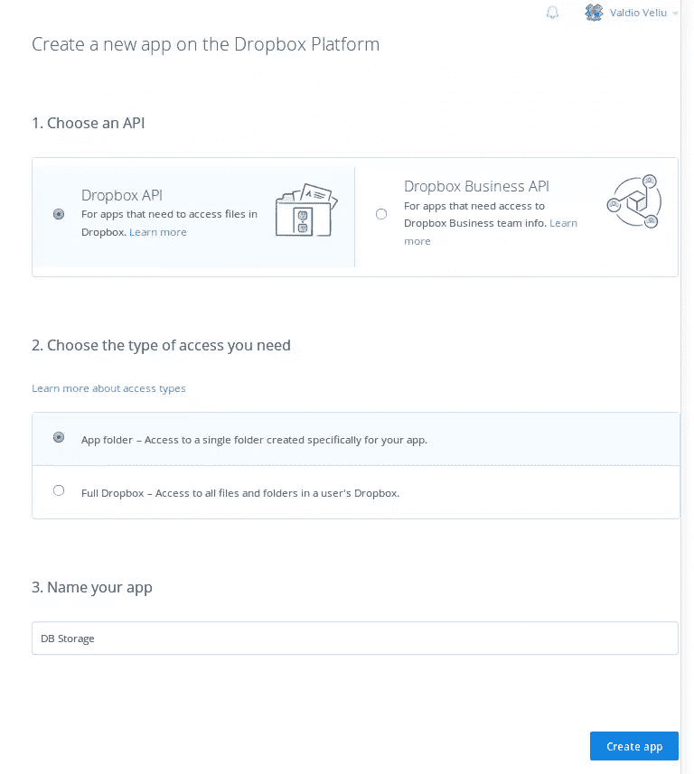
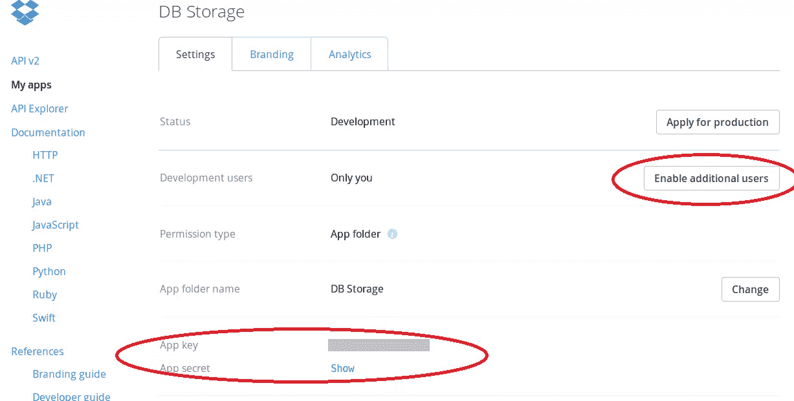
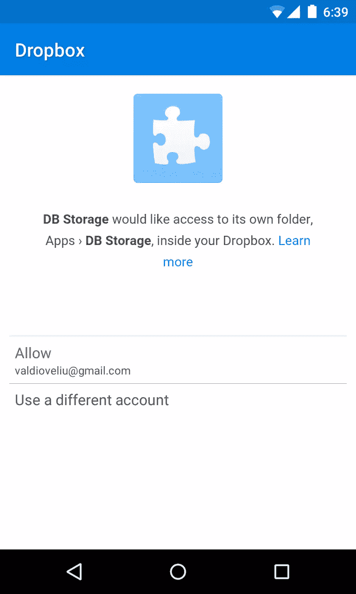

# 将 Dropbox 添加到 Android 应用程序

> 原文：<https://www.sitepoint.com/adding-the-dropbox-api-to-an-android-app/>

*这篇文章由[沃恩·安切塔](https://www.sitepoint.com/author/wancheta/)进行了同行评审。感谢 SitePoint 的所有同行评审员使 SitePoint 的内容尽可能做到最好！*

自从计算设备出现以来，文档和文件存储对于它们来说一直是必不可少的。传统上，存储是本地的，但在过去几年中，越来越多的人开始向云存储转移。云存储有它的问题，但提供了近乎无限的容量和低成本。

在本教程中，我将解释如何使用 Dropbox Core SDK for Java 6+在 Android 中存储 Android 应用程序中的文件。根据 [SDK 描述](https://github.com/dropbox/dropbox-sdk-java/blob/master/ReadMe.md)这个核心 SDK 是用来访问 [Dropbox 的基于 HTTP 的核心 API v2](https://www.dropbox.com/developers/documentation/http/documentation) 的 Java 库。这个 SDK 也支持旧的[核心 API v1](https://www.dropbox.com/developers-v1/core/docs) ，但是这种支持将在某个时候被移除。

你可以在 GitHub 上找到这个项目的最终代码。

要连接 dropbox，您需要有一个 Dropbox 帐户并使用 Dropbox API。在[应用控制台](https://www.dropbox.com/developers/apps)中创建一个新的应用。



创建新应用程序后，它将被设置为开发状态。在这种状态下，该应用程序只能由测试用户使用，如果您*启用其他用户*，这些用户可以达到 100。当应用程序准备就绪，你必须申请生产状态。

应用程序控制台包含应用程序信息，您将需要 Android 项目的*应用程序密钥*。



## 添加权限

在 Android Studio 中创建一个项目(带有一个*登录活动*)并在 *AndroidManifest.xml* 中为互联网和存储权限添加以下内容。您可以通过`LoginActivity`删除 *AndroidManifest.xml* 中自动生成的权限。本项目中不需要它们。

```
<uses-permission android:name="android.permission.INTERNET" />
<uses-permission android:name="android.permission.WRITE_EXTERNAL_STORAGE" />
<uses-permission android:name="android.permission.READ_EXTERNAL_STORAGE" /> 
```

## 添加依赖关系

在 *build.gradle(Module: app)* 中添加以下内容:

```
dependencies {
    //...
    compile 'com.dropbox.core:dropbox-core-sdk:2.0.1'
    compile 'com.squareup.picasso:picasso:2.5.2'
} 
```

**注意**:第一个依赖是针对 Dropbox 核心 API 的。Picasso 库不是强制性的，但对于加载图像很有用。

## 添加 Dropbox 活动

打开 *AndroidManifest.xml* ，在`<application></application>`部分添加`AuthActivity`。

```
<application>
...
    <!-- Dropbox AuthActivity -->
    <activity
        android:name="com.dropbox.core.android.AuthActivity"
        android:configChanges="orientation|keyboard"
        android:launchMode="singleTask">
        <intent-filter>

            <!-- Insert your app key after “db-  ...” -->
            <data android:scheme="db-APP_KEY" />

            <action android:name="android.intent.action.VIEW" />

            <category android:name="android.intent.category.BROWSABLE" />
            <category android:name="android.intent.category.DEFAULT" />
        </intent-filter>
    </activity>
</application> 
```

## 重复文件错误

在测试应用程序时，我遇到了一个错误，在阅读了这个 [Stackoverflow 答案](http://stackoverflow.com/questions/31912459/duplicate-lib-file-copied-in-apk-meta-inf-license-txt-error-in-andorid-studio#31912566)后，是由于多个 *License.txt* 或 *Notice.txt* 文件在构建时发生冲突。为了避免这种冲突，在 *build.gradle(Module: app)* 中，在 *android{…}* 部分，排除这些文件。

```
android {
...

  packagingOptions {
      exclude 'META-INF/LICENSE'
      exclude 'META-INF/LICENSE.txt'
      exclude 'META-INF/NOTICE'
      exclude 'META-INF/NOTICE.txt'
  }
} 
```

## appkey

将您的应用密钥添加到 *strings.xml* :

```
<!-- Change this to your app key -->
<string name="APP_KEY">APP_KEY_HERE</string> 
```

现在 Android 项目配置为使用 Dropbox API，在项目中添加一个新的活动，带有*文件- >新建- >活动- >基本活动*菜单项。称它为 MainActivity.java 的*。*

 *## 项目描述

示例应用程序将包括登录用户的 dropbox 帐户，获取详细信息，并将图像上传到应用程序的 Dropbox 文件夹。该项目将有两个活动，`LoginActivity`和`MainActivity`。

## 使用 Dropbox 登录

`LoginActivity`的任务很简单。单击一个按钮，它执行一个登录任务，为 Dropbox 应用程序生成一个访问令牌，这个令牌由字符串 resources 中的`APP_KEY`标识。

`startOAuth2Authentication()`方法将打开 Dropbox `AuthActivity`，这是添加到清单文件中的活动。在`AuthActivity`中，用户必须确认他们的 Dropbox 账户。在用户确认他们的 Dropbox 账户后，将他们重定向到`LoginActivity`。

`startOAuth2Authentication()`方法不返回任何访问令牌，它只打开内部用于认证的`AuthActivity`。现在用户通过了身份验证，他们需要一个访问令牌。

### 认证活动



在`LoginActivity`中，用以下代码替换除项目包名称之外的所有自动生成的代码:

```
public class LoginActivity extends AppCompatActivity {
    @Override
    protected void onCreate(Bundle savedInstanceState) {
        super.onCreate(savedInstanceState);
        setContentView(R.layout.activity_login);

        Button SignInButton = (Button) findViewById(R.id.sign_in_button);
        SignInButton.setOnClickListener(new OnClickListener() {
            @Override
            public void onClick(View view) {
                Auth.startOAuth2Authentication(getApplicationContext(), getString(R.string.APP_KEY));
            }
        });
    }

    @Override
    protected void onResume() {
        super.onResume();
        getAccessToken();
    }

    public void getAccessToken() {
        String accessToken = Auth.getOAuth2Token(); //generate Access Token
        if (accessToken != null) {
            //Store accessToken in SharedPreferences
            SharedPreferences prefs = getSharedPreferences("com.example.valdio.dropboxintegration", Context.MODE_PRIVATE);
            prefs.edit().putString("access-token", accessToken).apply();

            //Proceed to MainActivity
            Intent intent = new Intent(LoginActivity.this, MainActivity.class);
            startActivity(intent);
        }
    }
} 
```

对于此活动的布局，请将 *activity_login.xml* 更新为:

```
<RelativeLayout xmlns:android="http://schemas.android.com/apk/res/android"
    xmlns:tools="http://schemas.android.com/tools"
    android:layout_width="match_parent"
    android:layout_height="match_parent"
    tools:context="com.example.valdio.dropboxintegration.LoginActivity">
    <!-- Update package name -->

    <Button
        android:id="@+id/sign_in_button"
        android:layout_width="wrap_content"
        android:layout_height="wrap_content"
        android:text="@string/sign_in"
        android:layout_centerVertical="true"
        android:layout_centerHorizontal="true" />
</RelativeLayout> 
```

将以下内容添加到 *strings.xml* 中作为登录按钮文本:

```
...
<string name="sign_in">Sign in</string> 
```

`LoginActivity`的`onResume()`生命周期方法通过调用`getOAuth2Token()`方法来请求令牌。令牌存储在应用程序的`SharedPreferences`数据中以备后用，然后`MainActivity`打开。

之前第一次打开应用程序时调用了`onResume()`生命周期方法。那你为什么不买代币呢？

这是因为用户以前没有经过身份验证。当从认证成功的`AuthActivity`重定向时，`onResume()`方法将被再次调用并生成访问令牌。

### Dropbox 客户端现已登录

在`MainActivity`中声明以下变量:

```
public class MainActivity extends AppCompatActivity {

    private static final int IMAGE_REQUEST_CODE = 101;
    private String ACCESS_TOKEN;
    ...
} 
```

在`MainActivity`的 *content_main.xml* 布局文件中，用以下内容替换内容:

```
<?xml version="1.0" encoding="utf-8"?>
<RelativeLayout xmlns:android="http://schemas.android.com/apk/res/android"
    xmlns:app="http://schemas.android.com/apk/res-auto"
    xmlns:tools="http://schemas.android.com/tools"
    android:layout_width="match_parent"
    android:layout_height="match_parent"
    android:paddingBottom="@dimen/activity_vertical_margin"
    android:paddingLeft="@dimen/activity_horizontal_margin"
    android:paddingRight="@dimen/activity_horizontal_margin"
    android:paddingTop="@dimen/activity_vertical_margin"
    app:layout_behavior="@string/appbar_scrolling_view_behavior"
    tools:context="valdioveliu.valdio.com.dropboxintegration.MainActivity"
    tools:showIn="@layout/activity_main">

    <LinearLayout xmlns:android="http://schemas.android.com/apk/res/android"
        android:layout_width="match_parent"
        android:layout_height="wrap_content"
        android:orientation="vertical"
        android:id="@+id/accountData">

        <ImageView
            android:id="@+id/imageView"
            android:layout_width="match_parent"
            android:layout_height="wrap_content"
            android:layout_alignParentTop="true"
            android:layout_centerHorizontal="true" />

        <TextView
            android:id="@+id/textView3"
            android:layout_width="wrap_content"
            android:layout_height="wrap_content"
            android:layout_alignParentLeft="true"
            android:layout_alignParentStart="true"
            android:layout_below="@+id/imageView"
            android:layout_marginLeft="15dp"
            android:layout_marginTop="50dp"
            android:text="Name"
            android:textAppearance="?android:attr/textAppearanceLarge" />

        <TextView
            android:id="@+id/name_textView"
            android:layout_width="match_parent"
            android:layout_height="wrap_content"
            android:layout_alignParentLeft="true"
            android:layout_alignParentStart="true"
            android:gravity="center_horizontal"
            android:text=""
            android:textAppearance="?android:attr/textAppearanceLarge" />

        <TextView
            android:id="@+id/textView"
            android:layout_width="wrap_content"
            android:layout_height="wrap_content"
            android:layout_alignParentLeft="true"
            android:layout_alignParentStart="true"
            android:layout_below="@+id/textView3"
            android:layout_marginLeft="15dp"
            android:layout_marginTop="58dp"
            android:text="Email"
            android:textAppearance="?android:attr/textAppearanceLarge" />

        <TextView
            android:id="@+id/email_textView"
            android:layout_width="match_parent"
            android:layout_height="wrap_content"
            android:layout_alignParentLeft="true"
            android:layout_alignParentStart="true"
            android:layout_below="@+id/textView"
            android:gravity="center_horizontal"
            android:text=""
            android:textAppearance="?android:attr/textAppearanceLarge" />
    </LinearLayout>
</RelativeLayout> 
```

## 账户信息

以任何方式获取用户帐户信息或访问 Dropbox 都是网络请求，而在 Android 中，网络请求是异步处理的。这些网络请求都需要一个 Dropbox 客户端。

创建*DropboxClient.java*并添加以下代码:

```
public class DropboxClient {

    public static DbxClientV2 getClient(String ACCESS_TOKEN) {
        // Create Dropbox client
        DbxRequestConfig config = new DbxRequestConfig("dropbox/sample-app", "en_US");
        DbxClientV2 client = new DbxClientV2(config, ACCESS_TOKEN);
        return client;
    }
} 
```

`getClient()`方法中的`ACCESS_TOKEN`字符串是用户登录时收到的令牌。

下一个任务是获取用户的帐户详细信息。`UserAccountTask`类表示账户细节请求。这个异步类的构造函数有一个接口参数`TaskDelegate`,用于将账户信息返回给执行任务的活动。

创建*UserAccountTask.java*并添加以下代码:

```
public class UserAccountTask extends AsyncTask<Void, Void, FullAccount>  {

    private DbxClientV2 dbxClient;
    private TaskDelegate  delegate;
    private Exception error;

    public interface TaskDelegate {
        void onAccountReceived(FullAccount account);
        void onError(Exception error);
    }

    UserAccountTask(DbxClientV2 dbxClient, TaskDelegate delegate){
        this.dbxClient =dbxClient;
        this.delegate = delegate;
    }

    @Override
    protected FullAccount doInBackground(Void... params) {
        try {
            //get the users FullAccount
            return dbxClient.users().getCurrentAccount();
        } catch (DbxException e) {
            e.printStackTrace();
            error = e;
        }
        return null;
    }

    @Override
    protected void onPostExecute(FullAccount account) {
        super.onPostExecute(account);

        if (account != null && error == null){
            //User Account received successfully
            delegate.onAccountReceived(account);
        }
        else {
            // Something went wrong
            delegate.onError(error);
        }
    }
} 
```

`getUserAccount`方法是如何在`MainActivity`类中执行`UserAcountTask`类的一个例子。

将下面的方法添加到`MainActivity`类中，稍后您会用到它:

```
protected void getUserAccount() {
    if (ACCESS_TOKEN == null)return;
    new UserAccountTask(DropboxClient.getClient(ACCESS_TOKEN), new UserAccountTask.TaskDelegate() {
        @Override
        public void onAccountReceived(FullAccount account) {
            //Print account's info
            Log.d("User", account.getEmail());
            Log.d("User", account.getName().getDisplayName());
            Log.d("User", account.getAccountType().name());
            updateUI(account);
        }
        @Override
        public void onError(Exception error) {
            Log.d("User", "Error receiving account details.");
        }
    }).execute();
} 
```

为了在 UI 上显示用户的帐户详细信息，向 *MainActivity* 类添加以下函数:

```
private void updateUI(FullAccount account) {
  ImageView profile = (ImageView) findViewById(R.id.imageView);
  TextView name = (TextView) findViewById(R.id.name_textView);
  TextView email = (TextView) findViewById(R.id.email_textView);

  name.setText(account.getName().getDisplayName());
  email.setText(account.getEmail());
  Picasso.with(this)
          .load(account.getProfilePhotoUrl())
          .resize(200, 200)
          .into(profile);
} 
```

## 上传到 Dropbox

上传任务在`InputStream`的帮助下发生。一个指定的文件被转换成`InputStream`，在核心 SDK 的帮助下，流被上传到 Dropbox 中的 apps 文件夹。

创建*UploadTask.java*，并向其添加以下代码:

```
public class UploadTask extends AsyncTask {

    private DbxClientV2 dbxClient;
    private File file;
    private Context context;

    UploadTask(DbxClientV2 dbxClient, File file, Context context) {
        this.dbxClient = dbxClient;
        this.file = file;
        this.context = context;
    }

    @Override
    protected Object doInBackground(Object[] params) {
        try {
            // Upload to Dropbox
            InputStream inputStream = new FileInputStream(file);
            dbxClient.files().uploadBuilder("/" + file.getName()) //Path in the user's Dropbox to save the file.
                    .withMode(WriteMode.OVERWRITE) //always overwrite existing file
                    .uploadAndFinish(inputStream);
            Log.d("Upload Status", "Success");
        } catch (DbxException e) {
            e.printStackTrace();
        } catch (IOException e) {
            e.printStackTrace();
        }
        return null;
    }

    @Override
    protected void onPostExecute(Object o) {
        super.onPostExecute(o);
        Toast.makeText(context, "Image uploaded successfully", Toast.LENGTH_SHORT).show();
    }
} 
```

**注意** : Android Studio 会提示你有冲突的导入，你需要为`File`变量导入`java.io.File`。

要执行上传，您首先需要上传一些东西，例如图像。您可以通过启动另一个接收结果的活动来获取图像。

将以下方法添加到`MainActivity`:

```
private void upload() {
  if (ACCESS_TOKEN == null)return;
  //Select image to upload
  Intent intent = new Intent();
  intent.setType("image/*");
  intent.setAction(Intent.ACTION_GET_CONTENT);
  intent.putExtra(Intent.EXTRA_LOCAL_ONLY, true);
  startActivityForResult(Intent.createChooser(intent,
          "Upload to Dropbox"), IMAGE_REQUEST_CODE);
} 
```

当调用`startActivityForResult()`时，需要实现`onActivityResult()`方法来处理`MainActivity`上的结果。当接收到有效的图像 URI 时，构建一个文件并执行`UploadTask`。

将以下方法添加到`MainActivity`:

```
@Override
protected void onActivityResult(int requestCode, int resultCode, Intent data) {
  super.onActivityResult(requestCode, resultCode, data);
  if (resultCode != RESULT_OK || data == null) return;
  // Check which request we're responding to
  if (requestCode == IMAGE_REQUEST_CODE) {
      // Make sure the request was successful
      if (resultCode == RESULT_OK) {
          //Image URI received
          File file = new File(URI_to_Path.getPath(getApplication(), data.getData()));
          if (file != null) {
              //Initialize UploadTask
              new UploadTask(DropboxClient.getClient(ACCESS_TOKEN), file, getApplicationContext()).execute();
          }
      }
  }
} 
```

在`onActivityResult()`方法中是参数`URI_to_Path.getPath(getApplication(), data.getData())`。`URI_to_Path` java 类是一个帮助器类，用于将文件 URIs 转换成绝对路径。就是基于这个 [StackOverflow 回答](http://stackoverflow.com/questions/20067508/get-real-path-from-uri-android-kitkat-new-storage-access-framework#20559175)。

这是一个很大的类，与本教程没有直接关系，所以创建*URI _ 到 _ 路径. java* 并添加代码[到其中。确保将包名更改为您自己的名称。](https://raw.githubusercontent.com/sitepoint-editors/Dropbox-integration-app/master/DropboxIntegration/app/src/main/java/com/example/valdio/dropboxintegration/URI_to_Path.java)

最后是`onCreate()`方法。将以下代码添加到`MainActivity`，替换任何已经存在的内容:

```
@Override
protected void onCreate(Bundle savedInstanceState) {
    super.onCreate(savedInstanceState);
    setContentView(R.layout.activity_main);
    Toolbar toolbar = (Toolbar) findViewById(R.id.toolbar);
    setSupportActionBar(toolbar);

    if (!tokenExists()) {
        //No token
        //Back to LoginActivity
        Intent intent = new Intent(MainActivity.this, LoginActivity.class);
        startActivity(intent);
    }

    ACCESS_TOKEN = retrieveAccessToken();
    getUserAccount();

    FloatingActionButton fab = (FloatingActionButton) findViewById(R.id.fab);
    fab.setOnClickListener(new View.OnClickListener() {
        @Override
        public void onClick(View view) {
            upload();
        }
    });
} 
```

每次应用程序打开时，你需要检查是否有一个访问令牌。如果令牌存在，从`SharedPreferences`中检索它。将这些方法添加到`MainActivity`中有助于解决这个问题:

```
private boolean tokenExists() {
    SharedPreferences prefs = getSharedPreferences("com.example.valdio.dropboxintegration", Context.MODE_PRIVATE);
    String accessToken = prefs.getString("access-token", null);
    return accessToken != null;
}

private String retrieveAccessToken() {
    //check if ACCESS_TOKEN is stored on previous app launches
    SharedPreferences prefs = getSharedPreferences("com.example.valdio.dropboxintegration", Context.MODE_PRIVATE);
    String accessToken = prefs.getString("access-token", null);
    if (accessToken == null) {
        Log.d("AccessToken Status", "No token found");
        return null;
    } else {
        //accessToken already exists
        Log.d("AccessToken Status", "Token exists");
        return accessToken;
    }
} 
```

## 结论

这就是 Dropbox 与 Android 中的 [v2 API](http://dropbox.github.io/dropbox-sdk-java/api-docs/v2.0.x/) 集成的基础。如果你想更深入地了解这个话题，请阅读 Dropbox for Java [文档](https://www.dropbox.com/developers/documentation/java#overview)，SDK [源代码](https://github.com/dropbox/dropbox-sdk-java)和[示例](https://github.com/dropbox/dropbox-sdk-java/tree/master/examples)。

## 分享这篇文章*