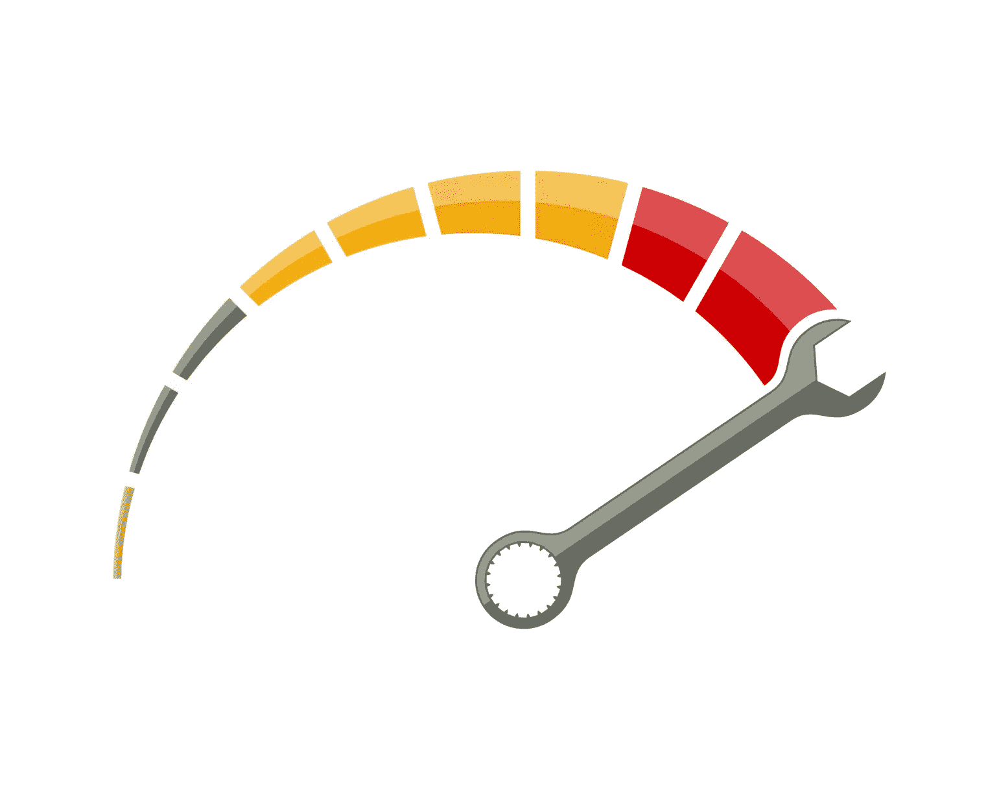

# 通过学习 Rails 中的缓存加快速度

> 原文：<https://www.sitepoint.com/speed-things-up-by-learning-about-caching-in-rails/>



作为开发人员，我们经常听到“缓存”这个词。其实在法语里是“隐藏”的意思(“cache-cache”是捉迷藏游戏)。缓存基本上意味着我们存储一些数据，以便更快地满足后续请求，而不需要再次产生这些数据。

缓存确实可以通过加速您的 web 应用程序并改善其用户体验来提供巨大的好处。今天我们将讨论 Rails 中可用的各种缓存技术:页面、动作、片段、模型和 HTTP 缓存。然后，您可以自由选择其中之一，甚至可以结合使用多种技术。

源代码可以在 [GitHub](https://github.com/bodrovis/Sitepoint-source/tree/master/Caching) 上找到。

## 打开缓存

对于这个演示，我将使用 Rails 5 beta 3，但是大多数信息也适用于 Rails 4。继续创建新应用程序:

```
$ rails new BraveCacher -T 
```

您可能知道，在开发环境中，默认情况下缓存是禁用的，所以您需要打开它。然而，在 Rails 5 中，这是以不同的方式完成的。只需运行以下命令:

```
$ rake dev:cache 
```

这个命令主要做的是在 *tmp* 目录中创建一个空的 *caching-dev.txt* 文件。在 *development.rb* 里面现在有如下代码:

*config/environments/development . Rb*

```
if Rails.root.join('tmp/caching-dev.txt').exist?
  config.action_controller.perform_caching = true
  config.action_mailer.perform_caching = false
  config.cache_store = :memory_store
  config.public_file_server.headers = {
    'Cache-Control' => 'public, max-age=172800'
  }
else
  config.action_controller.perform_caching = false
  config.action_mailer.perform_caching = false
  config.cache_store = :null_store
end 
```

该文件指示是否启用或禁用缓存——您不再需要调整`config.action_controller.perform_caching`设置。Rails 4 和 Rails 5 之间的其他差异可以在我之前的文章中的[中找到。](https://www.sitepoint.com/onwards-to-rails-5-additions-changes-and-deprecations/)

请注意，如果你使用的是 Rails 5 beta，[使用`rails s`启动服务器时会出现一个 bug](https://github.com/rails/rails/issues/24470) 。简单地说， *caching-dev.txt* 文件每次都会被删除，所以暂时用下面的命令代替:

```
$ bin\rails server -C 
```

这个 bug 已经在*主*分支修复了。

好了，现在缓存已启用，我们可以继续下一部分了。我们先来讨论一下页面缓存。

## 页面缓存

正如有人曾经说过的，感谢上帝，如果你能够使用页面缓存，因为它可以极大地提高你的应用程序的性能。这种技术背后的想法很简单:整个 HTML 页面保存在 T2 公共目录下的一个文件中。在随后的请求中，这个文件被直接发送给用户，而不需要再次呈现视图和布局。

不幸的是，这种强大的解决方案用途非常有限。如果您有许多对不同用户来说看起来不同的页面，页面缓存就不是最好的选择。此外，它不能用于只有授权用户才能访问您的网站的情况。然而，它在半静态页面上大放异彩。

从 Rails 4 开始，页面缓存被提取到一个[单独的 gem](https://github.com/rails/actionpack-page_caching) 中，所以现在添加它:

*Gemfile*

```
[...]
gem 'actionpack-page_caching'
[...] 
```

奔跑

```
$ bundle install 
```

现在，调整您的配置文件:

*配置/应用. rb*

```
[...]
config.action_controller.page_cache_directory = "#{Rails.root.to_s}/public/deploy"
[...] 
```

需要此设置来指定存储缓存页面的位置。

让我们介绍一个非常简单的控制器和一个视图来测试我们新的缓存技术。

*pages_controller.rb*

```
class PagesController < ApplicationController
  def index
  end
end 
```

*config/routes.rb*

```
[...]
root 'pages#index'
[...] 
```

*views/pages/index . html . erb*

```
<h1>Welcome to my Cached Site!</h1> 
```

页面缓存是通过使用`caches_page`方法为每个动作启用的。让我们缓存我们的主页:

*pages_controller.rb*

```
class PagesController < ApplicationController
  caches_page :index
end 
```

引导服务器并导航到根路径。您应该会在控制台中看到以下输出:

```
Write page f:/rails/my/sitepoint/sitepoint-source/BraveCacher/public/deploy/index.html (1.0ms) 
```

在 *public/deploy* 目录中，将有一个名为【index.html】的文件，其中包含页面的所有标记。在后续请求中，它将被发送而无需通过 ActionPack。

当然，您还需要使用缓存过期逻辑。要使缓存过期，请使用控制器中的`expire_page`方法:

```
expire_page action: 'index' 
```

例如，如果您的*索引*页面列出了一系列产品，您可以将`expire_page`添加到`create`方法中。或者，您可以使用这里所述的[扫地机。](https://github.com/rails/rails-observers#action-controller-sweeper)

## 动作缓存

动作缓存的工作方式非常类似于页面缓存，但是它不是立即发送存储在 *public* 目录中的页面，而是命中 Rails 堆栈。通过这样做，它可以在处理身份验证逻辑等操作之前运行。

动作缓存也被提取到一个[单独的 gem](https://github.com/rails/actionpack-action_caching) 中，所以添加它:

*Gemfile*

```
[...]
gem 'actionpack-action_caching'
[...] 
```

奔跑

```
$ bundle install 
```

让我们用非常幼稚的授权逻辑添加一个新的受限页面。我们将通过调用`caches_action`方法使用动作缓存来缓存动作:

```
class PagesController < ApplicationController
  before_action :authenticate!, only: [:restricted]

  caches_page :index
  caches_action :restricted

  def index
  end

  def restricted
  end

  private

  def authenticate!
    params[:admin] == 'true'
  end
end 
```

*views/pages/restricted . html . erb*

```
<h1>Restricted Page</h1> 
```

*config/routes.rb*

```
get '/restricted', to: 'pages#restricted' 
```

实际上，这种技术使用片段缓存，这就是为什么当您访问受限页面时会看到以下输出:

```
Write fragment views/localhost:3000/restricted 
```

过期的方式与页面缓存类似——只需发出`expire_action`方法并向其传递`controller`和`action`选项。`caches_action`还接受多种选项:

*   `if`或`unless`指示是否缓存动作
*   `expires_in`–缓存自动过期的时间
*   `cache_path`–存储缓存的路径。适用于具有多个可能路径的动作，这些路径应进行不同的缓存
*   `layout`–如果设置为`false`，将只缓存动作的内容
*   `format`–当您的操作以不同格式响应时非常有用

# 片段缓存

顾名思义，片段缓存只缓存页面的一部分。这个功能存在于 Rails 的核心中，所以您不必手动添加它。

让我们介绍一个名为`Product`的新模型，一个相应的控制器、视图和路由:

```
$ rails g model Product title:string
$ rake db:migrate 
```

*产品 _ 控制器. rb*

```
class ProductsController < ApplicationController
  def index
    @products = Product.all
  end
end 
```

*config/routes.rb*

```
resources :products, only: [:index] 
```

*views/products/index . html . erb*

```
<h1>Products</h1>

<% @products.each do |product| %>
  <%= product.title %>
<% end %> 
```

用样本数据填充`products`表:

*db/seeds.rb*

```
20.times {|i| Product.create!({title: "Product #{i + 1}"})} 
```

然后跑

```
$ rake db:seed 
```

现在，假设我们想要缓存页面上列出的每个产品。这是使用接受缓存存储名称的`cache`方法完成的。它可以是字符串或对象:

*views/products/index . html . erb*

```
<% @products.each do |product| %>
  <% cache product do %>
    <%= product.title %>
  <% end %>
<% end %> 
```

或者

*views/products/index . html . erb*

```
<% @products.each do |product| %>
  <% cache "product-#{product.id}" do %>
    <%= product.title %>
  <% end %>
<% end %> 
```

如果您将一个对象传递给`cache`方法，它将自动获取其 id，附加一个时间戳并生成一个适当的缓存密钥(这是一个 MD5 散列)。如果产品更新，缓存将自动过期。

在控制台中，您应该会看到类似如下的输出:

```
Write fragment views/products/12-20160413131556164995/0b057ac0a9b2a20d07f312c2f31bde45 
```

使用带有`cached`选项的`render`方法可以简化该代码:

*views/products/index . html . erb*

```
<%= render @products, cached: true %> 
```

你可以进一步应用所谓的[俄罗斯娃娃](https://en.wikipedia.org/wiki/Matryoshka_doll)缓存:

*views/products/index . html . erb*

```
<% cache "products" do %>
  <%= render @products, cached: true %>
<% end %> 
```

还有`cache_if`和`cache_unless`方法，它们非常容易解释。

如果您希望手动终止缓存，请使用 [expire_fragment](http://api.rubyonrails.org/classes/ActionController/Caching/Fragments.html#method-i-expire_fragment) 方法，并将缓存密钥传递给它:

```
@product = Product.find(params[:id])
# do something...
expire_fragment(@product) 
```

## 模型缓存

模型缓存(也称为低级缓存)通常用于缓存特定的查询，但是，这种解决方案可以用来存储任何数据。这个功能也是 Rails 核心的一部分。

假设我们想要缓存在`index`动作中获取的产品列表。为`Product`引入一个新的类方法:

*型号/产品. rb*

```
[...]
class << self
  def all_cached
    Rails.cache.fetch("products") { Product.all }
  end
end
[...] 
```

`fetch`方法可以读写 Rails 的缓存(第一个参数是存储的名称)。如果请求的存储为空，它将被块中指定的内容填充。如果它包含某些内容，结果将被简单地返回。还有`write`和`read`方法可用。

在本例中，我们创建了一个名为“products”的新存储，它将包含我们的产品列表。现在在控制器的动作中使用这个新方法:

*产品 _ 控制器. rb*

```
[...]
def index
  @products = Product.all_cached
end
[...] 
```

当然，您需要实现缓存过期逻辑。为了简单起见，让我们在`after_commit`回调中完成:

*型号/产品. rb*

```
[...]
after_commit :flush_cache
[...]
private

def flush_cache
  Rails.cache.delete('products')
end
[...] 
```

任何产品更新后，我们都会使“产品”缓存失效。

模型缓存实现起来非常简单，可以显著提高复杂查询的速度。

## HTTP 缓存

我们今天要讨论的最后一种缓存是依赖于`HTTP_IF_NONE_MATCH`和`HTTP_IF_MODIFIED_SINCE`头的 HTTP 缓存。基本上，这些头是由客户端发送的，用于检查页面内容最后一次修改的时间以及它的惟一 id 是否已经更改。这个唯一的 id 称为 ETag，由服务器生成。

客户端接收一个 ETag，并在后续请求中在`HTTP_IF_NONE_MATCH`头中发送它。如果客户端发送的 ETag 与服务器上生成的 ETag 不匹配，这意味着页面已经被修改，需要重新下载。否则，返回 304(“未修改”)状态代码，并且浏览器使用页面的缓存副本。要了解更多，我强烈推荐阅读谷歌的这篇文章，它提供了非常简单的解释。

有两种方法可以用来实现 HTTP 缓存:`stale?`和`fresh_when`。假设我们想要缓存一个`show`页面:

*产品 _ 控制器. rb*

```
[...]
def show
  @product = Product.find(params[:id])
end
[...] 
```

*views/products/show . html . erb*

```
<h1>Product <%= @product.title %></h1> 
```

*config/routes.rb*

```
[...]
resources :products, only: [:index, :show]
[...] 
```

使用`stale?`方法并设置`:last_modified`和`:etag`选项:

*产品 _ 控制器. rb*

```
[...]
def show
  @product = Product.find(params[:id])
  if stale?(last_modified: @product.updated_at.utc, etag: @product.cache_key)
    respond_to do |format|
      format.html
    end
  end
end
[...] 
```

想法很简单——如果产品是最近更新的，缓存将失效，客户端将不得不再次下载页面。否则，Rails 将发送一个 304 状态代码。`cache_key`是一种特殊的方法，为记录生成一个合适的唯一 id。

您可以进一步简化代码

*产品 _ 控制器. rb*

```
[...]
def show
  @product = Product.find(params[:id])
  if stale?(@product)
    respond_to do |format|
      format.html
    end
  end
end
[...] 
```

`stale?`将自动获取产品的时间戳和缓存密钥。`fresh_when`是一种更简单的方法，如果你不想使用`respond_to`:

*产品 _ 控制器. rb*

```
[...]
def show
  @product = Product.find(params[:id])
  fresh_when @product
end
[...] 
```

它也接受`:last_modified`和`:etag`选项，就像`stale?`一样。

HTTP 缓存可能很难实现，特别是对于复杂的页面，但是拥有它确实可以提高网站的性能。

## 结论

在本文中，我们讨论了可以在 Rails 应用程序中使用的各种缓存技术。但是，请记住，初步优化是有害的，因此您应该在实现之前评估哪种缓存解决方案适合您。

您在应用中使用了哪些缓存技术？在评论中分享你的经验吧！

## 分享这篇文章