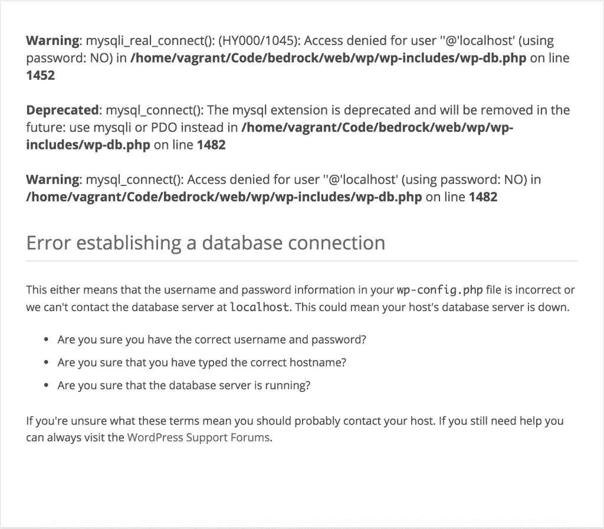

# 用基岩开发现代 WordPress

> 原文：<https://www.sitepoint.com/modern-wordpress-development-with-bedrock/>

如果你正在开发 WordPress 插件或主题，那么你可能听说过 [Roots.io](https://roots.io) 。它最初是一个入门主题，后来发展成了一系列工具。Roots 是开发 WordPress 主题、插件和网站的最完整的工具集之一。

根包括:

1.  [圣人](https://roots.io/sage/)
2.  [基岩](https://roots.io/bedrock/)
3.  [棚架](https://roots.io/trellis/)

在本文中，我们将讨论基岩。WordPress stack 是一个帮助你为现代网络建立网站的工具。你也可以把你的 WordPress 文件夹放到一个像 MAMP 或 WAMP 的环境中，但是基岩会走得更远。


## 关于基岩的几句话

基岩是标准的 WordPress 加上一些额外的东西，使配置，依赖管理和文件夹结构在开发时更加友好。

我喜欢基岩的一点是它包含了[十二因素应用](http://12factor.net)。最初由 [Heroku](http://heroku.com) (一个针对 web 应用的 PaaS)提出，它是一套现代 web 应用应该如何运行的“规则”。此外，根背后的人已经为 WordPress 写了一个可应用的方法论，你可以在这里找到。

在这篇文章中，我们将向您展示如何启动和运行家园和基岩。之后，您还可以查看 [Trellis](https://roots.io/trellis/) 以获得更完整的设置。如果你不知道什么是宅基地，那就快速浏览一下他们的[文件](http://laravel.com/docs/5.1/homestead)。在您的系统上设置 Homestead 环境，然后按照下面的步骤操作。

## 装置

这些步骤也在基岩文档中，但由于宅基地环境，有些是附加步骤。

```
homestead edit 
```

我的配置文件如下所示:

```
---
ip: "10.1.1.33 "
memory: 2048
cpus: 1
provider: virtualbox

authorize: ~/.ssh/id_rsa.pub

keys:
    - ~/.ssh/id_rsa

folders:
    - map: ~/projects/Homestead/
      to: /home/vagrant/Code

sites:
    - map: bedrock.app
      to: /home/vagrant/Code/bedrock/web

databases:
    - homestead
    - bedrock

variables:
    - key: APP_ENV
      value: local 
```

您将看到我们在主目录中有一个名为`projects`的文件夹，在其中，有一个名为`Homestead`的文件夹。这里是我们安装基础文件的地方。因为我的主操作系统的`~/projects/Homestead/`被映射到`/home/vagrant/Code/`，那么我的基础路径将看起来像`/home/vagrant/Code/bedrock/`。在我的配置中，我用的是`/home/vagrant/Code/bedrock/web`。这是因为`index.php`(引导所有文件的文件)位于那个文件夹中。

```
cd ~/projects/Homestead
git clone https://github.com/roots/bedrock.git 
```

基岩的文件夹结构有点不同。在基岩文件夹中有`.env.example`。这是一个环境文件。在该文件中，您可以添加可通过项目访问的变量。不过，首先你得把它重命名为`.env`。

到目前为止，我们只知道你的项目的梗概。实际上还没有安装 WordPress 文件。由于这个框架是由 Composer 驱动的，我们必须安装额外的包。

```
homestead ssh
cd Code
cd bedrock
composer install 
```

如果您尝试在浏览器中打开`bedrock.app`,您会得到以下错误:



问题出在`.env`文件里。如果你打开这个文件，你会看到一些数据库连接的变量， **SITE_URL** ， **HOME** 和 **ENV** 本身。在`homestead.yaml`中，我们指定了数据库名‘基岩’。对于每个新的数据库，homestead 将用户名设置为“Homestead”，密码设置为“secret”， **DB_HOST** 被更改为 localhost， **WP_HOME** 和 **WP_SITEURL** 被更改为`http://bedrock.app`和`http://bedrock.app/wp`，因为这是我们在开发环境中的真实 URL。

现在，让我们在浏览器中再次检查`bedrock.app`。这次一切都很好。

我的`.env`配置:

```
DB_NAME=bedrock
DB_USER=homestead
DB_PASSWORD=secret
DB_HOST=localhost

WP_ENV=development
WP_HOME=http://bedrock.app
WP_SITEURL=http://bedrock.app/wp

# Generate your keys here: https://api.wordpress.org/secret-key/1.1/salt/
AUTH_KEY='!+H!/A6=1q|%~[r|wlxjj08D/:]PIC}Gd 66WlQyAqj(:/-`EBxAu-f}@G,rh-!Z'
SECURE_AUTH_KEY='3:NWn8%*w>Y7V;H_IM<kj:i@|a2gT&K`WZwJZ?o=S?yd~d1huGv=7]i5q%Ia02mm'
LOGGED_IN_KEY='N=*D115ejwdp|6g]KLiggtg4@`<Nl.g9n1F*@HV<!.8WqJC#u(?8-eW91RI~r6kD'
NONCE_KEY='XIRn1WSc4d=3VM!,7DyC;dF2S-KRuf/2GqNtO-Le=x5P<8+~=.|{+C47@!1Bh/z>'
AUTH_SALT='#lZGMcjd?pU/4Nh-4&R.By$BW3>o(4VkIH6T0c@+E_*9*)vY21*zwMC`]WJ:4mHd'
SECURE_AUTH_SALT='v?${}-#bZI>SaoZbQ*-ZP/ c^Ic3YhN&|si}&U0B!+UPCZE8(bg)&;Tz)8=0$U>['
LOGGED_IN_SALT='~;7I1PZ-o>JRMVEWPxeAiDlN1<%|!g@4^H+aU*3#=%vZ}q<7uC)ScK:5@_TI=`k;'
NONCE_SALT='EMtD>gE l)!u+:QW ;$hf2B0^NTV-])?>_6T6Iv=S*LOuzL&+n|P]{hZ]<0Jg-`b' 
```

如果你要在远程服务器上安装，URL 会有所不同，这只是针对本地安装。还要记住，`.env`应该在你的`.gitignore`里。因为您希望在服务器上有不同的配置，所以代码本身是环境不可知的(阅读关于 12 因素应用程序方法的更多信息)。

## 文件夹结构

为了更好地理解如何使用基岩，首先你应该了解它的文件夹和文件结构。

在顶层文件夹中，我们看到一个 Composer 文件、Travis 文件、gitignore 文件、rulset.xml 和 wp-cli 配置。

让我们从特拉维斯的档案开始。如果您正在使用 BitBucket 或 GitHub，您可以链接到您的 Travis CI 设置来运行您已经定义的测试。在基岩 Travis 文件的例子中，它从 PEAR 中提取[代码嗅探器](http://pear.php.net/package/PHP_CodeSniffer/redirected)，并使用`ruleset.xml`根据一些编码标准扫描文件的代码质量。

一切都由 Composer 管理。就连代码 WordPress 脚本都是 Composer 安装的。更有趣的是，这个 Composer 配置使用 [wpackagist](http://wpackagist.org/) 作为额外的存储库。这就是 WordPress 核心文件的来源。

```
"wordpress-install-dir": "web/wp" 
```

这是`composer.json`上定义放置 WordPress 文件的那一行。

`wp-cli.yml` ( [Wp-CLI](http://wp-cli.org/) )仅指定 WordPress 目录:

```
path: web/wp 
```

`Vendor`是安装每个 Composer 软件包的文件夹。但是，来自 wpackagist 的包将安装在不同的位置。稍后我会讲到。

网络目录是你花费大部分时间的地方。该目录包含`wp`和`app`文件夹。`wp`是大 WordPress 文件存放的地方，app 文件夹是插件、主题和上传的地方。此外，在`composer.json`中，您将看到下面的配置，它将插件和主题安装在这个目录中:

```
"installer-paths": {
   "web/app/mu-plugins/{$name}/": ["type:wordpress-muplugin"],
   "web/app/plugins/{$name}/": ["type:wordpress-plugin"],
   "web/app/themes/{$name}/": ["type:wordpress-theme"]
} 
```

这样，你就可以把所有的东西都分开。`.gitignore`这个也可以帮你。web/WP 目录不包括在 Git 提交中。都不是。env，因为您的服务器上应该有一个不同的。这是因为您的数据库配置是不同的(还有您存储在那里的任何其他配置)。

最后也是最重要的是配置。如果您有三个不同的环境，比如说**开发**、**试运行**和**生产**，那么您可能希望每个环境都有不同的配置。在 config 文件夹中，您会看到`application.php`拥有三种环境中最常见的配置。但是，如果您想要更改配置，请检查 config/environments 文件夹。

## 要记住的事情

我希望你现在对基岩感兴趣。我使用 Homestead 是因为它是一个很好的工具，而且我对它很熟悉。在你走之前，请检查一下[棚架](https://roots.io/trellis/)。Roots.io 的好处是，他们开发了一系列产品，从 Sage starter 主题到 Trellis，可以设置整个服务器。每种产品都能很好地配合使用。

你觉得基岩怎么样？请在下面留下你的评论。

## 分享这篇文章