# A-Frame:当今将虚拟现实带入网络的最简单方式

> 原文：<https://www.sitepoint.com/a-frame-the-easiest-way-to-bring-vr-to-the-web-today/>

世界各地的 Web 开发人员不需要出去学习全新的语言或像 Unity 或 Unreal Engine 这样的游戏引擎来开始开发虚拟现实。现在有各种各样的方法可以在网络上开始体验虚拟现实，而 A-Frame 框架是最简单的入门方法之一。

## 什么是 a 字架？

A-Frame 是一个开源框架，使用定制的 HTML 元素来创建 WebVR 体验。这些元素使用 [three.js](http://threejs.org/) 和 [WebGL](https://developer.mozilla.org/en-US/docs/Web/API/WebGL_API) 在场景中创建支持 VR 的元素，而不需要开发人员学习 WebGL 等低级 API 来构建简单的 VR 体验。

A-Frame 团队正在努力创建一个可扩展的 VR web，允许开发人员构建相互竞争的 API 和想法，这些 API 和想法一旦被广泛采用和建立，就可以成为定义的标准的一部分。这使得我们今天可以通过 JavaScript 框架和实验性的浏览器构建来使用新的功能，而不需要等待标准被实现并进入浏览器。

## 设备兼容性

下一个——也是非常重要的——最有可能被问到的问题是*“A-Frame 跨浏览器兼容吗？”*。令人惊讶的是，A-Frame 体验在各种平台上都很好，只要[浏览器与 WebGL 兼容](http://caniuse.com/#feat=webgl)，3D 场景(没有 VR)就可以作为后备。这意味着 Chrome、Firefox、Edge 和 Opera 都展示了交互式 3D 版本的桌面体验。对于虚拟现实体验，Oculus Rift 可以连接到一些浏览器的网络虚拟现实版本，以实现虚拟现实兼容性(见下面“你需要什么”下的链接)。

智能手机方面，运行 iOS 和 Android 的最近两代以内的现代智能手机最好(iPhone 6 及以上，三星 Galaxy S6 及以上，我的 HTC One M9 好用)。当插入谷歌 Cardboard 耳机时，其中大多数还支持虚拟现实，因此 VR 兼容性实际上比试图让 VR 在你的桌面上工作更高，也更容易管理！

## 你需要什么

要跟随并尝试使用 A 型框架，您需要以下物品:

*   **对于基本的非虚拟现实体验—** 如上所述的支持 WebGL 的浏览器。
*   **桌面虚拟现实体验—**
    *   支持网络虚拟现实的浏览器版本，如最新的 Chromium 网络虚拟现实版本或 T2 的火狐浏览器版本。
    *   一个 Oculus Rift 耳机(也可能是 HTC Vive，我还没能测试这个！).
*   **对于移动虚拟现实体验—**
    *   大多数现代智能手机至少能够显示场景，并允许你在半虚拟现实视图中环顾四周(没有耳机，但移动手机会移动你的视图)。
    *   谷歌 Cardboard 或 Gear VR 耳机。

## 入门指南

要开始使用，请前往 [A-Frame 入门页面](https://aframe.io/docs/guide/getting-started.html)。A-Frame 团队为 A-Frame 实验提供了各种选项，包括 CodePen 片段、npm 构建、可下载的或 CDN 可用的框架 JS 文件，以及 HTML 和本地 dev 服务器的样板文件，作为最佳实践指南。为了让事情尽可能简单，我们将直接从[下载并使用 A-Frame 样板](https://github.com/aframevr/aframe-boilerplate/archive/master.zip)。

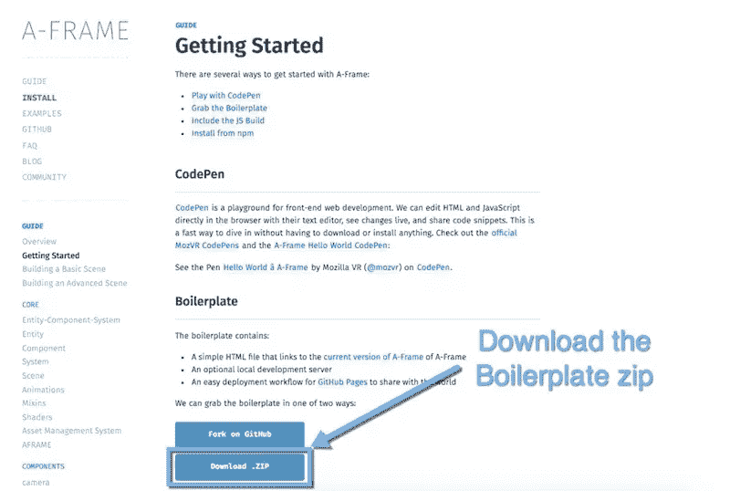

将样板文件提取到您希望系统中包含 web 项目的任何地方。它不一定需要运行在本地 web 服务器上。样板文件使用他们的 CDN 中的 A-Frame，所以它主要是我们要找的`index.html`文件。`package.json`提供了一个基于 npm 的本地 web 服务器用于测试，我们将在本文中使用它——然而，没有必要测试它。

## 运行我们的本地服务器

如上所述，A-Frame 样板文件带有自己的本地 web 服务器，随时可供使用。虽然在测试 A 帧场景时这并不总是必要的，但这样做是一种很好的做法，并且可以减少在通过计算机上的文件系统运行网页时经常出现的各种跨原点策略问题的混淆。

要运行本地 web 服务器，请在终端/命令提示符下转到包含样板文件项目的文件夹，并运行以下命令:

```
npm install && npm start
```

这将为 web 服务器安装所有必需的文件，然后为您运行它。此后，如果您想再次运行服务器，只需运行`npm start`。

在运行本地 web 服务器时，它应该会自动打开我们的 web 浏览器并加载我们的样板网页。它带有 livere load——这意味着无论何时你做了改变，它都会自动刷新。

如果您需要在不同的设备上打开网页，或者如果在您运行本地 web 服务器后它没有自动打开，您可以通过在浏览器中转至`http://localhost:3000`或`http://192.168.0.1:3000`来打开它，其中该 IP 地址是您电脑的 IP 地址。

您应该看到的初始场景是这样的:


## 构建新场景

让我们清理样板代码，删除除了`<a-scene>`之外的`<body>`标签中的所有内容。我们所有的 A-Frame 元素都将放在这个`<a-scene>`组件中:

```
<!DOCTYPE html>
<html>
  <head>
    <meta charset="utf-8"/>
    <title>Our First A-Frame Experience</title>
    <script src="https://aframe.io/releases/0.2.0/aframe.min.js"></script>
  </head>
  <body>
    <a-scene>

    </a-scene>
  </body>
</html>
```

A-Frame 附带了一组图元，为我们提供了一系列 VR 场景的常用元素。让我们添加一些我们自己的来建立一个自定义场景。

## 建立我们的天空

每个场景都需要一个天空(或者某种背景)。这可以是平面颜色，也可以是全景等矩形图像。这个的原语是`<a-sky>`。

单一平面颜色天空的代码如下所示:

```
<a-scene>
  <a-sky color="#C500FF"></a-sky>
</a-scene>
```

这为我们的场景创造了一个可爱而自然的亮紫红色天空:

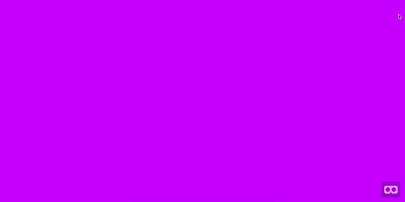

尽管天空如此壮丽，但如果有 360°全景图像，它会更好看。Flickr 是一个找到可以用来试验的天空盒的好地方。这里有[一系列等矩形的照片](https://www.flickr.com/search/?text=equirectangular&license=4%2C5%2C9%2C10)，它们都有许可证，允许你重复使用。

我上了 Flickr，发现了下面这张卢卡·比亚达的照片,为了在一个项目中使用，这张照片确实需要注明出处(一定要检查许可条款！):

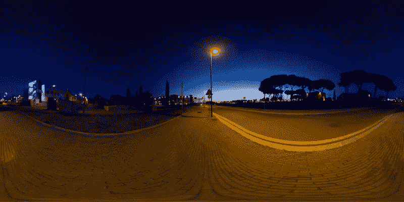

图片来源:[卢卡·比亚达](https://flic.kr/p/bCMJ4X)

当我们使用下面的代码将它放到场景中时:

```
<a-scene>
  <a-sky src="street.jpg"></a-sky>
</a-scene>
```

我们得到该场景 360°背景:

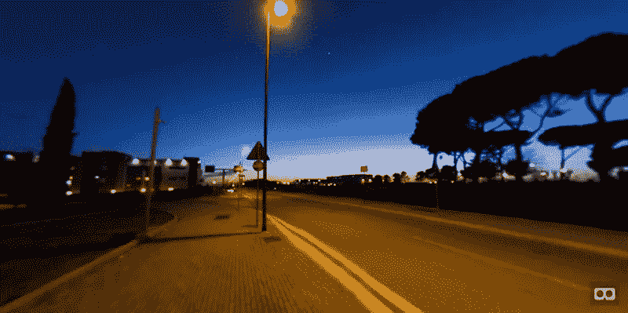

## 添加盒子

现在我们有了一个场景，让我们给它添加一些元素。使用`<a-box>`原语，我们可以在场景中放置立方体和盒子。以下代码在场景中的道路上添加了一个橙色方框:

```
<a-box color="#B76705" depth="2" height="2" width="4" position="0 0 -1.25"></a-box>
```

属性的工作方式与我们的天空盒相同，为我们的盒子元素设置纹理颜色。然后我们有了`depth`、`height`和`width`的属性，这些属性赋予了它形状。我们的箱子是 2 x 2 x 4，这使它成为一个宽箱子，当放在路上时，它看起来有点像一辆箱式汽车。为了将它放置在场景中的不同位置，我们可以使用`position`属性来移动它的位置。该属性有三个值，每个轴一个:`x y z`。

我们的盒子上面有代码，在我们的场景中看起来是这样的:

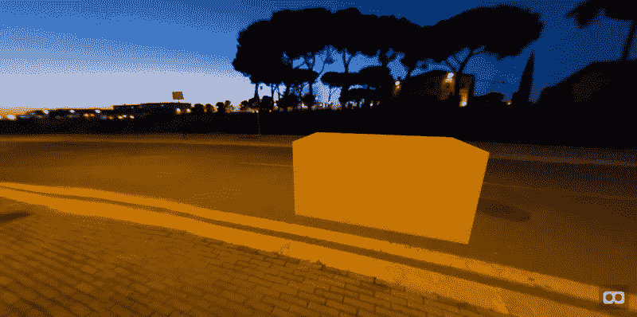

## 添加一些圆柱体

现在，我们将使用圆柱体图元向场景中添加一些额外的街柱:

```
<a-cylinder color="#1E130E" height="40" radius="0.5" position="-40 0 -8"></a-cylinder>
```

`color`和`position`属性的工作方式与我们的盒子相同，但是我们有两个新属性——`height`和`radius`，它们分别为我们的圆柱体设置高度和半径。这是我们的场景，有一个微妙的新极点:

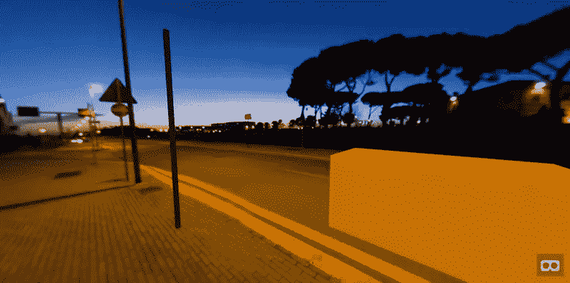

扩展这个想法非常容易，所以通过下面的代码，我们可以添加一整行极点:

```
<a-cylinder color="#1E130E" height="40" radius="0.5" position="-40 0 -8"></a-cylinder>
<a-cylinder color="#1E130E" height="40" radius="0.5" position="-10 0 -8"></a-cylinder>
<a-cylinder color="#1E130E" height="40" radius="0.5" position="20 0 -8"></a-cylinder>
<a-cylinder color="#1E130E" height="40" radius="0.5" position="50 0 -7"></a-cylinder>
```

看起来是这样的:

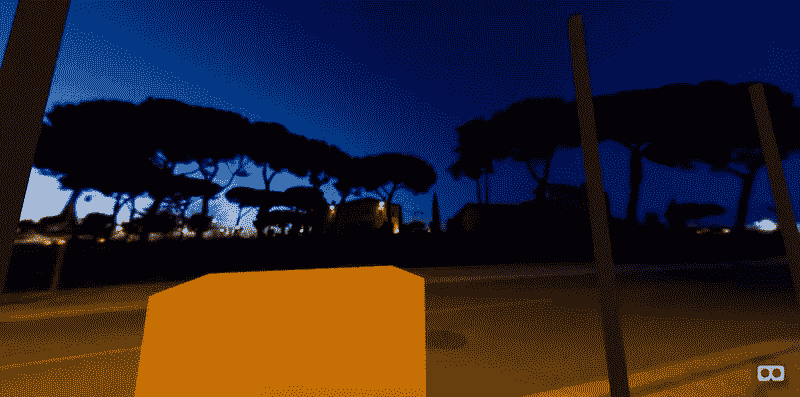

气缸实际上在 A-Frame 中有一系列其他选项，请在气缸文档中随意探索这些选项[。](https://aframe.io/docs/primitives/a-cylinder.html)

## 添加球体

3D 空间中另一个非常常见的形状是球体。我们可以像这样使用`<a-sphere>`原语创建球体:

```
<a-sphere color="#000000" radius="2" position="0 15 20"></a-sphere>
```

这段代码非常简单，在我们身后的天空中创造了一个令人毛骨悚然的黑色球体:

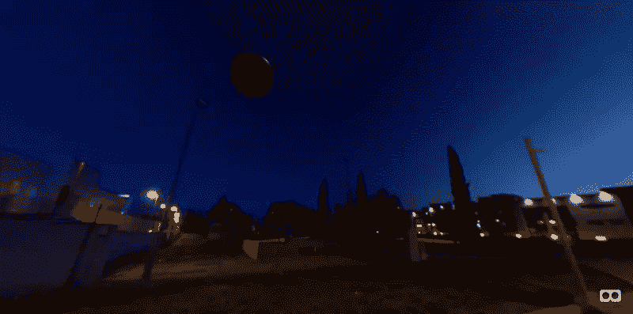

## 使用资源添加纹理

我们可以通过`<a-assets>`标签给我们的基本体添加纹理，比如盒子、圆柱体和球体。这建立了一个 A-Frame 资产管理系统，使我们能够定义资产，然后在我们的形状上使用它们。这是推荐的场景纹理化方法。

我下载并调整了一个简单(但非常酷)的重复模式，作者是来自微妙模式的卡洛斯·阿吉拉尔。我们可以像这样将资产添加到场景中:

```
<a-assets>
  
</a-assets>
```

`id`给了我们一个名字，当我们引用我们的纹理并在我们的场景中的物体上使用它的时候。属性告诉 A 帧我们想要哪个图像。为了给场景中的对象赋予纹理，我们可以在对象的`src`属性中包含纹理，在纹理的 ID:

```
<a-sphere src="#darktexture" radius="2" position="0 15 20"></a-sphere>
```

这给了我们天空中随机的、怪异的球体一个更好的、相当科幻的纹理:

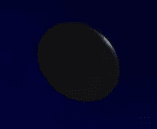

## 在虚拟现实中

要在 VR 中看到这些体验，你要么需要一个连接到 PC 的 Oculus Rift，要么需要一个现代的智能手机！对大多数人来说，智能手机是最简单的选择。如果你没有虚拟现实耳机，当你在智能手机上进入场景时，你仍然可以看到一切，并可以通过移动手机四处查看:

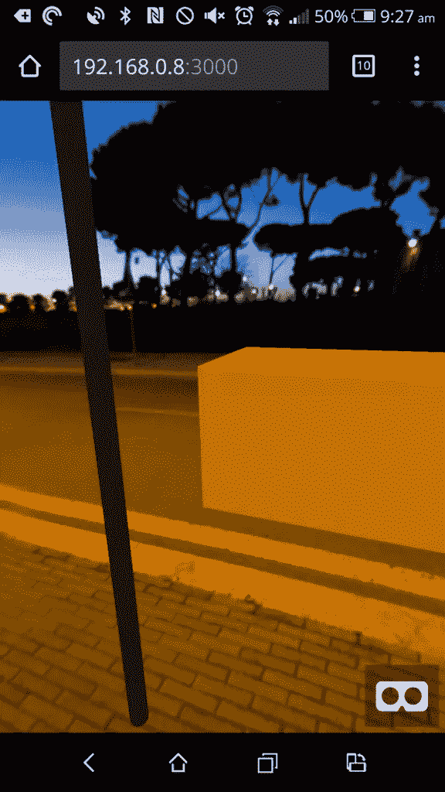

如果你有谷歌 Cardboard 耳机配合手机使用，你可以点击右下角的 VR 图标进入 VR 视图:

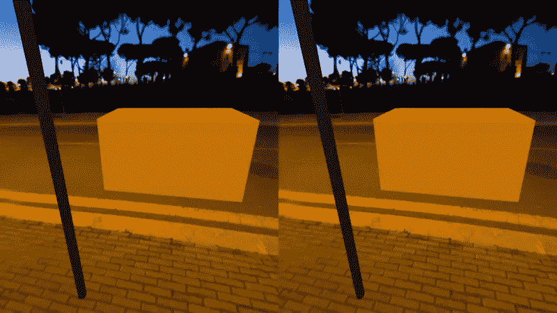

## 在行动中尝试

如果你想试试我们在本教程中一起制作的 A 型框架街道演示，你可以在这里看到它。

## 结论

说到 WebVR，A-Frame 是一个非常简单易用的框架，可以将相对跨浏览器兼容的 VR 体验放在一起。使用 A-Frame 还可以做更多的事情，我迫不及待地想在 SitePoint 的未来文章中探索更多。

如果你是 WebVR 的粉丝，我们上周讨论了如何用 Primrose 和 WebVR 在 VR 中构建虚拟现实，一定要看看！Primrose 是另一个令人兴奋的针对生产力应用的 WebVR 框架。Elio Qoshi 还在 SitePoint 上写了最近的 [WebVR 1.0 API 草案提案](https://www.sitepoint.com/webvr-1-0-api-draft-proposal)，如果你正在使用 WebVR，这值得一读。

如果你已经在你自己的虚拟现实网络体验中使用了 A-Frame，我很想看看你是怎么组装的！请在下面的评论中告诉我，或者在 Twitter 上通过 [@thatpatrickguy](https://www.twitter.com/thatpatrickguy) 与我联系。

## 分享这篇文章