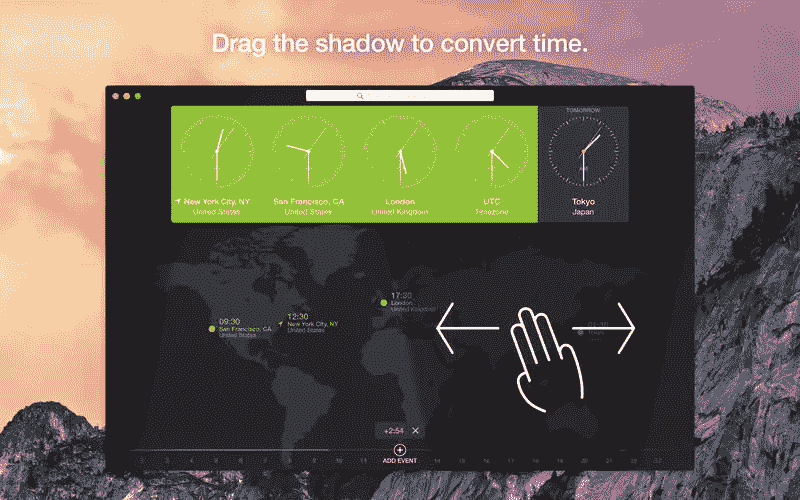
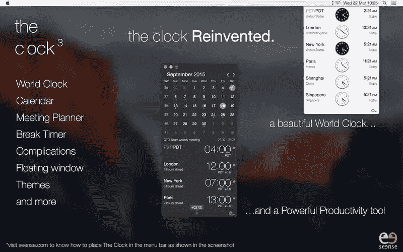
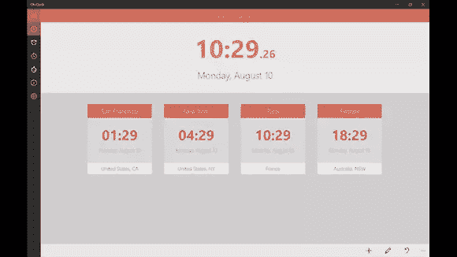
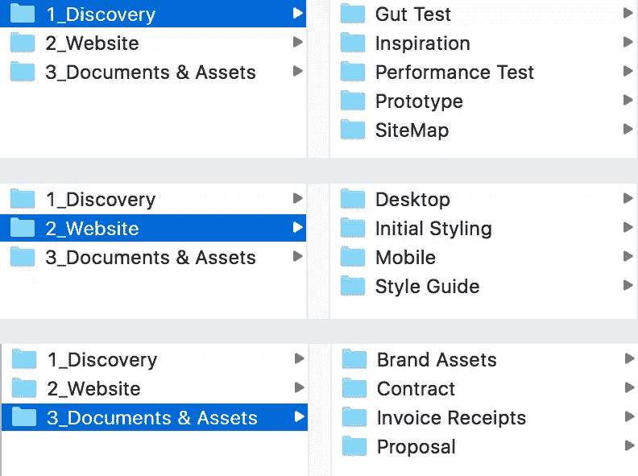
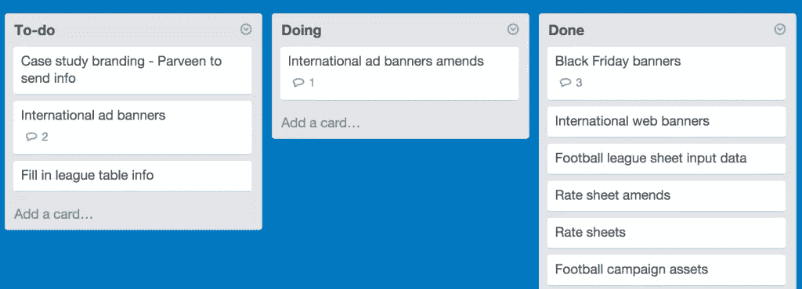

# 如何与客户远程协作

> 原文：<https://www.sitepoint.com/how-to-collaborate-with-clients-remotely/>

啊，远程工作。

我们可以跳过通勤(除非是去最喜欢的咖啡店)，我们可以穿我们想穿的(我听到有人说兔子拖鞋了吗？)，而且最棒的是，我们没有任何人在背后窥视，对我们的设计、代码或内容提供非常有用的“建议”。

我非常支持在远离办公室的环境下工作。无论您是在家工作还是以数字游牧的方式环游世界，它都能提高工作效率和生活质量。毕竟，快乐的自由职业者是好的自由职业者，对吗？

然而，远程工作确实有它的挑战。如果做得不对，我们会冒着疏远客户的风险，给他们一个糟糕的体验。

因此，这里是我多年来学到的六件事，将帮助自由职业者远程工作*和*让他们的客户开心。

## 1.弄清楚你的时区

当你得到一个新客户时，你需要做的第一件事就是记住他们的时区。

这听起来显而易见，但你会惊讶地发现，当你同时应付几个客户时，忘记这一点是多么容易。

我建议你使用某种形式的视觉显示来跟踪这一点，无论是 Mac 或 PC 上的标准时钟小工具还是专用应用程序。

这里有几个适合 Mac 的例子:

 **[世界时钟](https://itunes.apple.com/nz/app/world-clock/id858446756?mt=12)

 **[时钟](https://itunes.apple.com/gb/app/the-clock-the-best-world-clock/id488764545?mt=12)

对于 PC:

 **[哦时钟](https://www.microsoft.com/en-us/store/apps/oh-clock/9wzdncrfj0dr)

 **[世界时钟–时区](https://www.microsoft.com/en-us/store/apps/world-clock-time-zones/9wzdncrfjck2#app-details)

了解客户所在城市的时间对于给他们一个好的体验非常重要。不仅如此，你还可以对他们可能会收到你的来信设定预期，还可以在适当的时候祝他们早上好或晚上好。

当我这样做的时候，客户们喜欢它——他们总是评论它是多么的周到，尽管对我来说这不费吹灰之力。

## 2.给他们看看你的脸

给远程客户良好体验的另一个关键是尽可能早地让他们看到你的脸。

这是因为远程工作的最大问题之一是信任(或缺乏信任)。一些简单的事情，比如你的客户可以看到你的脸和你的反应，会让他们觉得他们是在和一个真实的人一起工作。

我还发现，当我们在提案发出之前进行面对面的讨论，而不仅仅是电话交谈时，我的项目成交率会高得多。

因此，尽可能早、尽可能频繁地使用 Skype，向客户表明远程工作并不意味着你必须失去高质量的关系。

## 3.保持一切井井有条，方便取用

当与客户远程工作时，他们可以在任何时间点访问文件是很重要的。

即使您不在不同的时区工作，有时客户也可能想在您的工作时间之外做一些事情。也许他们有一份全职工作，这是一个兼职项目，所以他们在晚上和周末工作。

当你试图和家人一起吃饭时，你不希望(第无数次)收到索要商标的电子邮件。

因此，利用基于云的存储系统，无论是 [Dropbox](https://www.dropbox.com/) 、 [Google Drive](https://drive.google.com/) 、 [Droplr](http://droplr.com/) 还是其他什么，将它们添加到自己的文件夹中，在那里他们可以找到与他们的项目相关的一切。

现在，根据你所做的自由职业工作的类型，这可能会对你的项目有所不同，但这里有一个我的大部分网站设计工作的文件夹结构的例子。

试着在项目开始的时候创建这些文件夹，以确保所有的东西都有条理(这也有助于你跟踪你的可交付成果)。

不要忘记包括所有的管理部分，如建议书、合同和任何发票。

## 4.不要从雷达上消失

远程工作时，最好确保客户在整个项目过程中都保持知情。

不管你是否在他们的项目上努力工作，如果你只是保持沉默，他们会认为你已经忘记了他们。

然而，你决定让他们更新是你的事。您可以每周打一次 Skype 电话来讨论进展情况。或者你可以在每天开始或结束时发一封电子邮件，详细说明你将要做的事情。

你甚至可以利用类似于 [Trello](https://trello.com/) 的东西，这样他们就可以看到你目前正在做的事情，即将发生的事情和已经完成的事情。我发现一个简单的待办事项、正在做的事情、已经完成的事情比任何太复杂的事情都要好。

让客户能够定期检查你，应该有望让他们远离微观管理者。

### 关于即时消息的说明

像 [Slack](https://slack.com/) 这样的应用已经被创造出来，以帮助团队更有效地沟通。电子邮件可能又慢又痛苦，而即时通讯则快速且协作性强。

然而，如果你是一名与多个客户合作的自由职业者，当心即时通讯应用程序，因为你很容易被吸引去迎合一百万个*“你能不能”*请求，而你永远不会真正完成你的任何主要任务。

如果你是一个团队的全职客户，这些应用程序可能会很棒——但是如果你同时处理几个项目，它们通常会带来更多的麻烦。

## 5.尝试一些自动化策略

远程工作的美妙之处在于，你可以利用自动化策略给你的客户带来良好的体验，而且没人会知道。

在你的下一个项目中，记下其他项目中常见的任务的电子邮件。这些可以是像入职电子邮件这样的东西，你可以用客户的名字和任何特定于他们的额外细节进行定制。

或者可能是一封电子邮件，提醒他们一些内容几天后到期，或者甚至是一个工作簿，你可以发送帮助他们写所说的内容。

这样做可以确保即使你被客户的工作压得满满的，你仍然可以给每个人一个好的体验，而不会占用你太多的时间。

有很多方法可以让这个过程完全自动化( [GetDrip](https://www.getdrip.com/) 就是一个很好的例子)，但我更喜欢自己设置模板并发送它们，这样我就可以添加特定于客户的细节。

## 6.抑制你的软件成瘾

我给远程工作的自由职业者的最后一个建议可能会引起争议。

那就是**除非万不得已，尽量不要依赖项目管理软件。**

如果你是一个和小团队一起工作的自由职业者，你真的没有理由需要使用项目管理软件。您不仅必须将客户端装载到您的流程中，还必须将它们装载到您选择的任何服务中。

尽可能保持你的工作流程有机。以我的经验来看，客户发现注册不同的服务是一件麻烦的事，他们最终只会求助于普通的旧邮件。

此外，所有这些软件的月成本确实会增加。不幸的是，我从第一手经验中知道这一点。

所以当你选择你的工具时，试着选择那些可以无缝集成到客户工作流程中的东西。我发现一些有用的工具是:

### [Skype](http://www.skype.com/en/)

Skype 几乎是视频通话的首选工具。这是因为和我交谈的每个人似乎都有一个 Skype 帐户，所以你很少要求任何人注册他们只需要和你一起工作的东西。

### 特雷罗

首先，我发现特雷罗对我很有用。我为我的家臣或任何更大的项目建立了公告板，并给客户提供了查看它们的选项*，如果他们想查看的话*。有些客户使用 Trello，喜欢看到我在做什么，有些客户不喜欢。但是无论他们是否使用它，都不会对项目产生任何影响。

### [收获](https://www.getharvest.com/)

我对我的发票使用 Harvest，因为我发现它非常有用，可以快速搜索并找到旧发票。你也可以设置逾期发票提醒，这有助于那些讨厌的逾期付款者。

### [Dropbox](https://www.dropbox.com/)

如前所述，云存储对于远程工作非常有用。Dropbox 是我最喜欢的，纯粹是因为客户似乎已经很熟悉它了。

### [地狱战车](https://www.hellosign.com/)

远程工作时，合同可能会很棘手，但 HelloSign 提供了一种无需打印、扫描和上传即可签署合同的简单方法。

## 结论

希望这篇文章能给你一些想法，让远程工作变得更棒。但值得注意的是，对一些人有用的东西对另一些人未必有用。

因此，请随意尝试这些策略，也可以修改它们，添加您自己的策略，并与我们分享您的结果。

考虑到这一点:

## 为了更好地与客户进行远程协作，您可以添加哪些技巧？

## 分享这篇文章********