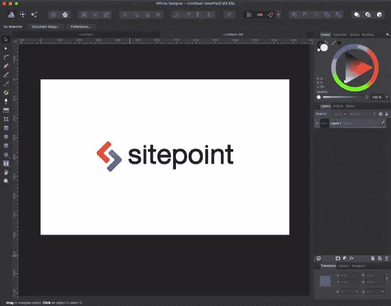
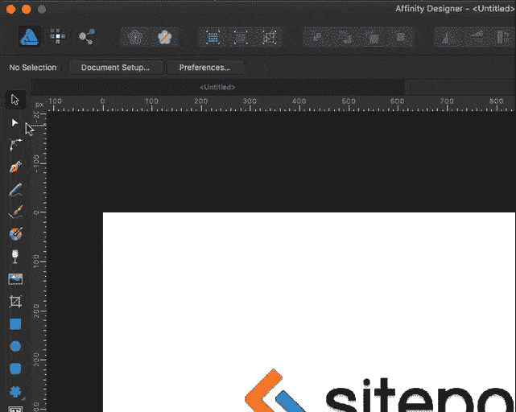
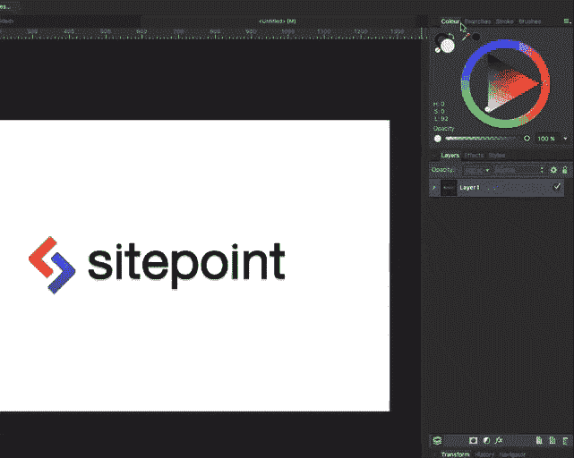
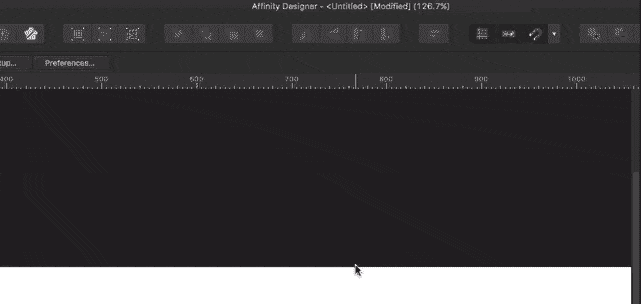
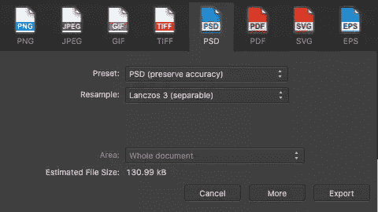
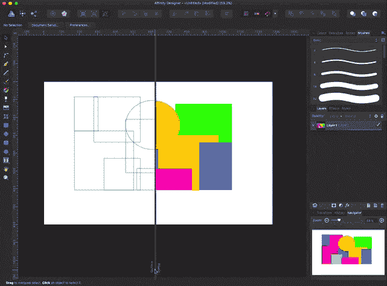

# Affinity 设计师:49 美元的矢量编辑器真的能剪吗？

> 原文：<https://www.sitepoint.com/affinity-designer-review/>

**更新:**自原始文章撰写以来，价格已更新。

概念化和建立一个专业的设计是两件截然不同的事情。为了建立一个好的设计，艺术家必须对他面前的工具感到舒适。

长期以来，行业标准一直是 Adobe stack (Photoshop、Illustrator 等)。在这篇文章中，我将仔细看看这些经典的现代新替代品。

## 简介

[**亲和力设计师**](https://affinity.serif.com/en-gb/designer/) 是一款面向 Mac 的专业平面设计 app。由于其矢量编辑心脏，它在许多方面可以与 Adobe Illustrator 和 Sketch app 相媲美。

然而，与更加繁忙的经典 Adobe Illustrator UI 相比，Affinity 采用了一个干净、现代、直观的界面，使其易于学习并且非常适合初学者。

Affinity 的商业模式有一个巨大的优势。在动力和价格之间有一个很好的平衡。花费~~24.99 美元~~49.95 美元即可获得许可证！

## 用户界面

该应用程序的用户界面与我们在 Adobe package 或 Sketch 应用程序中看到的非常相似。它拥有一个顶部工具栏，两个侧边工具栏，工作画布和一个位于页面底部的提示栏。

顶部栏本身分为三个主要部分:

1.  角色工具栏
2.  默认功能工具栏
3.  上下文工具栏

##### 人物工具栏

角色工具栏是一个关键概念，也是 Affinity Designer 区别于其他应用的一个特性。人物角色是用来根据你的目标在不同的工具和功能之间轻松快速地切换的。在写这篇文章的时候有三个角色:

### 1.抽奖角色

它改变了用户界面，使其成为创建或修改矢量图形的有用工具。

### 2.像素角色

Pixel persona 允许您基于像素编辑矢量图。您将可以使用画笔、修饰工具和像素选择工具等工具。

### 3.导出角色

导出角色用于以您选择的格式将整个层、组、对象或区域输出为图形。

人物角色使得找到你需要的工具变得非常容易。每次访问角色时，左侧工具栏都会发生变化，根据当前活动的角色提供其他功能和工具。

### 默认工具栏

默认工具栏保留最常用的工具。例如:*按钮–允许您在标准或视网膜查看模式之间切换。

*   用于排序的对象控件(前移或后移等。)
*   变换(旋转)
*   对准
*   强烈地
*   结合
*   把…作为目标

### 上下文工具栏

在上下文工具栏中，不同的选项会根据您选择的当前活动工具或功能而变化。动态用户界面可以非常直观地找到您想要的内容，而不必像您通常所期望的那样在菜单和子菜单中走得太远。

### 提示栏

提示栏位于页面的底部。它根据鼠标悬停或选择的功能、工具或选项提供提示和快捷方式，从而节省了大量时间。

### 右侧栏

右边栏由许多有用的选项卡面板组成。在右边栏中，你可以与图层、笔刷、样本、颜色、效果、样式等交互。

当导出角色处于活动状态时，右边的栏会随着三个新的选项卡面板而变化。“导出设置”、“切片”面板和“层”选项卡，这些选项使您可以有选择地选择要导出的内容，并配置“设置”面板中显示的许多导出变量。

## 布局

如果这种布局不适合你的工作风格，你可以通过导航到`Window > Separated Mode`来改变它。这将使 UI 组件相互分离，让你在屏幕上随意流动它们，并定制面板布局。所以你根据你的工作流程来安排。

这样，你就可以随时保持你的工具整洁有序，并且触手可及，不会迷路。

## 可用性

Affinity Designer 具有 1，000，000%的缩放比例，这意味着它可以处理非常大的文档而不会降低速度。这是一个非常有用的工具，当涉及到有很多细节和大画布尺寸的项目时。

### **进出口 PSDs**

另一个巨大的优势是能够从 Photoshop 导入和导出项目。例如，如果你已经在 Photoshop 中设计了一个移动应用程序，现在你想继续在 Affinity Designer 上工作，你可以毫无问题地这样做，整个设计将保持不变。

反之亦然。当您在 Affinity Designer 中有一个移动应用程序设计，但需要在 Photoshop 中处理它时，您可以非常容易地导出它。

PSD 支持是一个很棒的特性，因为现在的行业标准是 Adobe Photoshop。这样，您仍然可以与没有使用 Affinity Designer 的设计师团队合作。

### SVG 支持

当然，当我们谈到矢量和网络时，很难不提到 SVG。我看过 2014 年的评论，提到 Affinity Designer 的 SVG 支持有点古怪。虽然我不熟悉旧版本，但当前版本似乎对 SVG 有非常坚实的支持——尽管一些面向 web 的文件的手动优化可能仍然是有序的。

### 模式镜像

模式镜像允许您同时查看两种状态。例如轮廓/矢量视图和像素视图。

## 底线

Affinity Designer 是一个非常适合初学者的程序，这得益于它直观的布局和现代的设计。如果你已经使用 Photoshop 作为你的首选设计应用，你可能会马上有宾至如归的感觉。

虽然您无法将其与 Photoshop 或 Illustrator 等行业标准进行真正的比较，但您可以将 Affinity Designer 视为从两者中吸取一些好的方面的东西，因为它提供了一套广泛的矢量绘图工具，以及一些基本的基于像素的操作。

有没有更简单、更节省预算的选择？是的，我想是的。

## 分享这篇文章