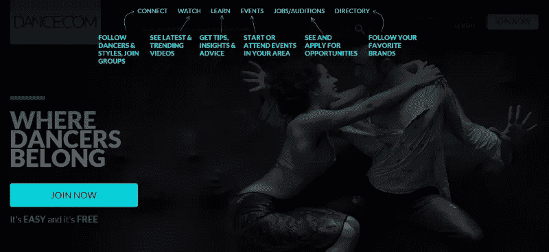
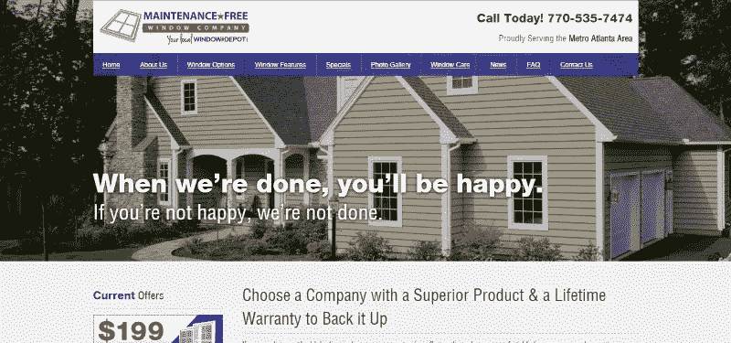
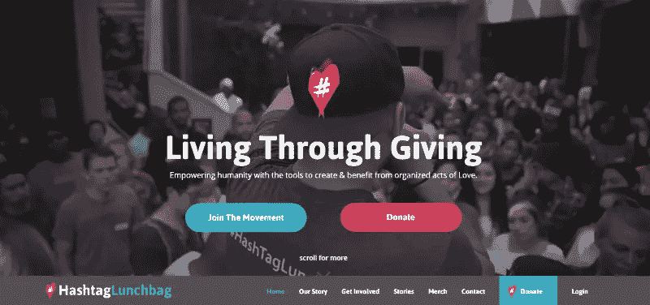
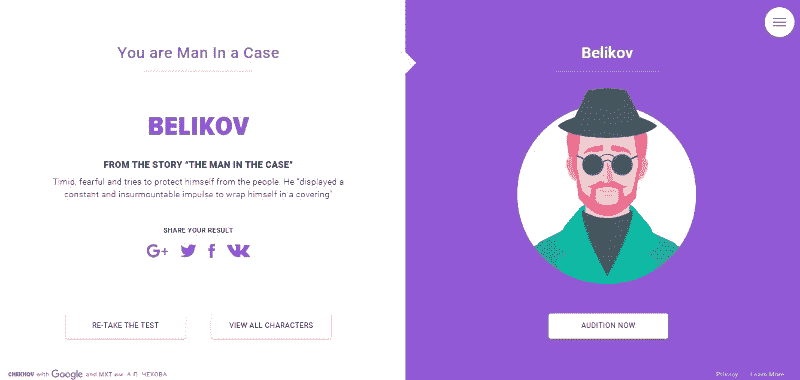
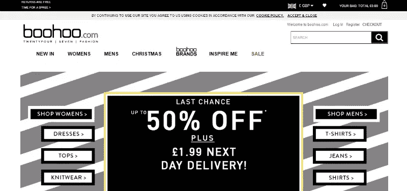
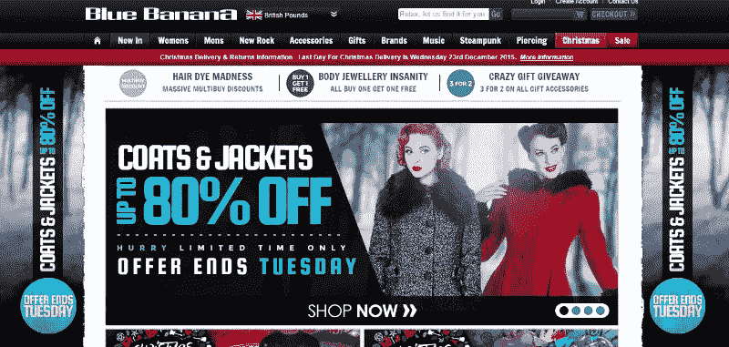
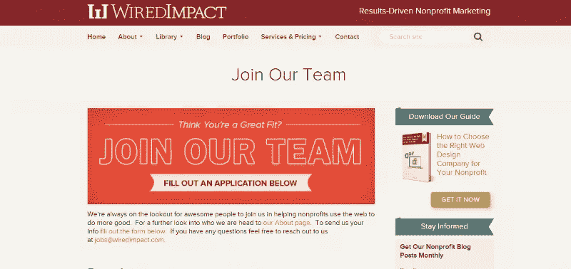
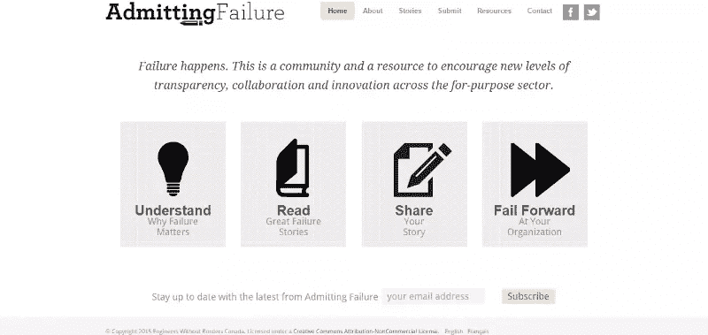
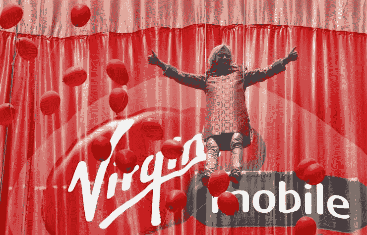

# 利用心理学在 2016 年提升你的转化率

> 原文：<https://www.sitepoint.com/using-psychology-to-boost-your-conversions-in-2016/>

去年，UI 和 UX 设计受到了很多关注——但是用户交互的心理动机呢？

虽然我们不会在网上谈论“心理学驱动的设计”，但广告公司从一开始就热衷于研究公众心理。不出所料，他们的工资单上通常有一两个心理学家。

所以，这就引出了一个问题:你能利用心理学来提高你的网络转化率吗？答案是:绝对可以。为什么不在今年尝试一下，因为你的网站已经起步了。

## 正面挑战

正面强化——或奖励良好行为的理念——与文明本身一样古老。虽然有些人可能认为这是一种操纵行为，但事实是好的设计会改变人们的想法。但是你如何将它转化为你的转化呢？

每年一月，我们都会看到很多“买一送一”的优惠活动，但是不要害怕提供更多的优惠。你想挑战你的访客，因为大多数人喜欢好的挑战。

试着精心措辞，让自己看起来有点“脆弱”，就像上图中的免维护者一样。你希望你的访问者说“接受挑战”。

实现这一点的最简单的方法之一是“100%保证或退款”，但也要尝试跳出框框思考。用高额奖励来减轻他们对承诺的恐惧。也许你会说:“*我们 100%确定你会喜欢你的会员资格，我们把房子都押在这上面了*”。

好吧，也许没那么大，但你明白了。

## 提供更多选择

缩小消费者选择的范围是有其道理的，但这也可能会限制某些人的选择。相反，过多的选择会产生所谓的“选择悖论”。这是由于提供了太多的选择，反过来麻痹和压倒消费者，使他们不高兴。

在“选择的悖论”和单行道之间找到平衡至关重要。这通常意味着提供 2-3 个行动选择，而不是只有一个。你的用户更有可能找到最适合他们的选择，并最终转化。

例如，你的目标可能是鼓励用户下载你的应用。除了仅向他们提供下载选项，您可能还想提供三个 CTA，在这种情况下，您可以将它们命名为“查看现场演示”、“查看功能”和“立即下载”。实际的标签和可执行的操作完全取决于您。

## 建立倒计时

截止日期是激励。当试图让潜在消费者真正消费时，启动倒计时可能是有益的，尤其是在一年中的这个时候。

想想每年黑色星期五销售背后的驱动力。当然，大幅降价很重要，但核心因素是灌输给大众的潜意识恐惧。这是“FOMO”——害怕错过。

稀缺推动需求，而需求转化为销售，所以考虑为你的产品或服务使用“限时”信息。设计倒计时的目的是鼓励人们做出决定。

试试这个作为测试。下次你提议和朋友一起看电影的时候，一定要加上最后通牒，比如“我需要在明天午饭前知道”。你可能会惊讶地发现，实际上不需要做太多工作，你就能得到更具决定性的答案。设计也是如此。

## 不要拐弯抹角

今年头两个月肯定会有很多网站冒出来，其中一些是合法的，另一些则不那么合法，所以用户会小心。这就是你必须坦诚的原因。让潜在的皈依者知道你想要什么，以及他们在皈依过程中和皈依后应该期待什么。

分享任何相关信息，甚至是无关紧要的信息，可以让用户对你和你的企业产生信任。你得到的信任越多，转变的可能性就越大。

心理学研究员、作家兼教授杰弗瑞·a·辛普森在他的书《信任的心理基础》中写道:

> “信任涉及到人们最崇高的希望和愿望与他们最深切的忧虑和恐惧的并列”。

虽然很难获得信任，但由于担心和恐惧这些潜在的复杂因素，很容易失去信任。

提供描述性文本只是共享信息的一种方式。另一个可行的选择是显示一个动画或静态的视觉向导来显示他们应该如何进行转换。除了这些，还有很多选择，所以真的没有任何理由要保密。

## 转换失败

没有多少人知道[任天堂早在 1889 年就成立了](https://en.wikipedia.org/wiki/History_of_Nintendo)生产手工制作的 hanafuda 卡。他们通过每隔几十年就彻底改造他们的整个业务，已经繁荣了一百多年。

同样肯定的是，没有一个单一的计划或想法可以保证你持续的成功，这意味着你需要不断地改进你的方法。

随着网络和移动设计的进步，增加转化率的策略也会进步。

如果你在转换目标上失败了，回头看看你在哪里犯了错误。这就是研究、调查和测试发挥作用的地方。不要害怕看到类似的利基市场，并试图找出他们如何在你失败的地方取得成功。保持积极的心态，忠于你的品牌，不要因为失败而沮丧。

以英国第 12 大富豪理查德·布兰森爵士为例。布兰森患有阅读障碍和认知障碍，在学校表现很差。后来他的校长评论说，他要么进监狱，要么成为百万富翁。他是正确的。

证明人们错了的动力和拒绝接受多次商业失败让布兰森继续前进。正是他的坚韧不拔、坚持不懈和不断从错误中学习的承诺给他带来了成功。

正如摩根·伍顿曾经说过的那样，你从失败中学到的比赢的多。你学会了如何坚持下去。“因此，如果你不转换，这不是世界末日，也不是你的网站的末日。你只需要找到适合你的方法。

## 清盘

这就是你要的，五个简单而有效的基于心理学的练习。为了更好的成功，一定要精心制作，以适合你的特殊环境。了解你的市场，再加上这些巧妙的心理技巧，有望让你获得更多的皈依者。

如何看待在网页设计营销中运用心理战术？你用吗？请在评论中告诉我们。

## 分享这篇文章