# 将插件发布到 WordPress 插件目录

> 原文：<https://www.sitepoint.com/publishing-a-plugin-to-the-wordpress-plugin-directory/>

2001 年，Michel Valdrighi 推出了一个名为 b2/cafelog 的博客工具。马特·莫楞威格和迈克·利特尔在 2003 年创立了 b2/cafelog 和 WordPress。根据 WordPress.org 的说法，“WordPress 是出于对一个优雅的、架构良好的个人出版系统的渴望而诞生的，这个系统建立在 PHP 和 MySQL 之上，并在 GPL 下获得许可”。2004 年，插件被引入来扩展 WordPress 的核心功能。以下是 2004 年 11 月 WordPress 插件目录的样子:

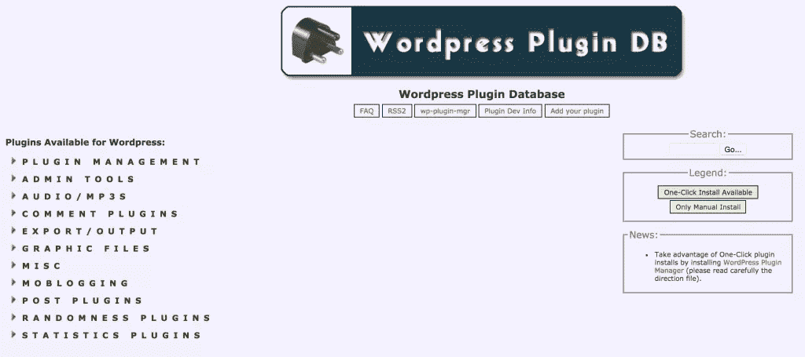
*来源:[http://web . archive . org/web/20041129215547/http://WP-plugins . net/](http://web.archive.org/web/20041129215547/http://wp-plugins.net/)*

在 2004 年，WordPress 有 46 个插件。在不到 11 年的时间里，现在在 WordPress 插件目录中有超过 42697 个插件，并且有超过**1161033914 个**插件下载。以下是 2016 年 1 月 WordPress 插件目录的样子:

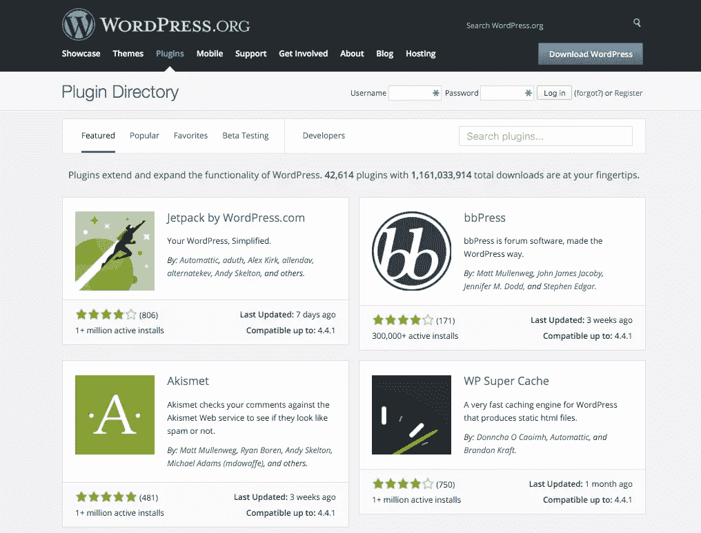

出现在 WordPress 插件目录中的所有插件都可以免费使用和分发。它们是在通用公共许可证(GPL)下授权的。许多先驱已经在 WordPress 插件目录中发布了插件，我和我的兄弟想成为这个独家俱乐部的一员。我们将通过分享我们在 WordPress 插件目录中决定创建、创建和发布插件的经验，让你深入了解 WordPress 插件目录提交过程。我们还将为 Mac 和 Windows 用户提供如何将你的插件添加到 WordPress 的中央 Subversion 资源库的分步指导。

## 为什么要发布你的 WordPress 插件？

人们在 WordPress 插件目录中发布插件的原因显然是多种多样的。下面解释几个例子:

*   您看到目录中的插件不存在对功能的需求
*   你看到了市场机会
*   你想围绕你的插件建立一个社区
*   你最喜欢的插件没有提供你想要的额外功能
*   你对一些插件收取额外扩展的费用感到沮丧，你认为你可以以更低的成本构建这些功能
*   你想以一种不存在的方式简化功能
*   为了成为社区的一部分，你想为 WordPress 插件目录做贡献

## 我们的推理

用 WordPress 做了大量的客户工作后，我们和我们的客户都对电子商务领域插件的复杂性和成本非常不满。这两个因素阻止了一些客户探索 WordPress 的新机会，并采取措施改变他们的生活。我们希望简化整个电子商务过程，并提供更低成本的选择，以便任何人都可以参与。我们还相信，在用户参与、创新、创造新功能和客户服务请求方面，我们可以做得更好。因此，我们决定建立我们的 WPMerchant 电子商务插件。

### WordPress 插件提交过程

下面，我们将这个过程分解成最简单的部分，这样任何人都可以参与这个插件创建的冒险。我们也按照我们希望在决定创建我们的插件时所采取的顺序来呈现这些步骤！

#### **1。阅读指南。**

在创建和提交你的插件之前，阅读[详细指南](https://wordpress.org/plugins/about/guidelines/)来节省你的时间和金钱。确保你遵守所有这些规则。这些规则包括:

*   确保你的插件是 GPL 兼容的
*   存储用户信息前需要用户同意
*   不向用户发送垃圾邮件
*   不包括混淆代码
*   不做任何违法或违反道德的事情
*   不在公共网站上嵌入外部链接

#### **2。检查 WordPress 目录中的插件名称。**

前往[wordpress.org/plugins](http://www.wordpress.org/plugins)并在“搜索插件…”输入中输入你想要的插件名称。


如果不存在同名的插件，仍然有可能插件已经以该名称提交，而用户只是还没有提交他们的第一个 Subversion 提交；所以不要太激动。你会想要尽快提交你的插件，以保证你得到这个名字。如果插件名确实存在，我们真的很抱歉；这太糟糕了。你需要集思广益来得到一个新的。

##### **3。创建一个有效的插件。**

我们使用 WordPress 插件样板框架([http://wppb.io/](http://wppb.io/))创建了我们的插件。这是一个在坚实基础上快速起步和跑步的好方法。

SitePoint 有一系列的文章，探讨了使用 WordPress 插件样板的插件开发过程。
1。使用 WordPress 插件样板文件加速开发是本系列的第一篇，它让你很好地理解 WPPB 中不同文件背后的目的。
2。[本系列的第二篇文章](https://www.sitepoint.com/wordpress-plugin-boilerplate-part-2-developing-a-plugin/)将带您创建一个 WPPB 插件，并创建一个包含不同字段的选项页面，您可以在整个插件中使用这些字段。
3。[第三部分](https://www.sitepoint.com/the-wordpress-plugin-boilerplate-part-3-the-last-steps/)带你实现演示插件面向公众的功能。

在创建我们的插件后，我们不得不无数次地更新代码并测试所有的功能，以便所有不同的部分都按照我们想要的方式工作。

#### **4。验证自述文件。**

自述文件用于填充你的插件的 WordPress 插件目录页面。如果你真的想让你的插件页面脱颖而出，Jérémy Heleine 写了一篇关于为你的插件创建令人敬畏的 WordPress.org 页面的文章。为了给你一个大概的概述，你应该输入你的插件名称，贡献者(WordPress 作者 id)，贡献链接，标签，需要的 WordPress 版本和插件已经测试过的 WordPress 版本，许可证(它必须是 GPL)和你的插件的简短描述。对于标签，我们建议根据竞争插件中列出的标签和与你的插件相关的流行标签来选择标签。你可以通过查看他们的目录页面并滚动到页面底部或者通过检查他们的`readme.txt`文件来找到来自竞争插件的标签。

添加完这些信息后，你应该添加插件的主要描述、安装说明、常见问题和截图。确保在插件的资源目录中包含截图、横幅和图标。截图越多越好。一旦你对你的`readme`文件满意了，运行它通过[自述验证器](https://wordpress.org/plugins/about/validator/)。我们的`readme.txt`出色地通过了(我们是不是很特别！):


##### **5。提交您的插件以供审查。**

一旦你完成了以上所有的工作，是时候提交你的插件进行人工审查了。

你需要先创建一个 WordPress 账户。

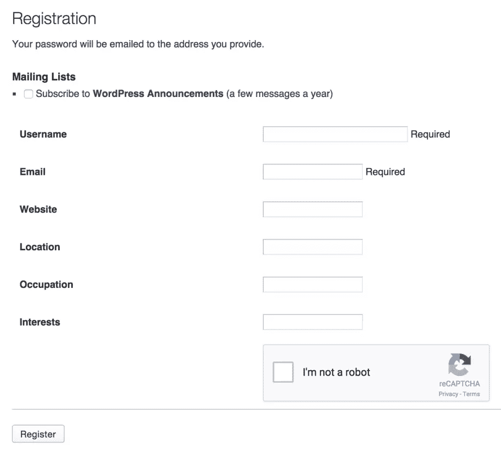

然后，去[https://wordpress.org/plugins/add/](https://wordpress.org/plugins/add/)

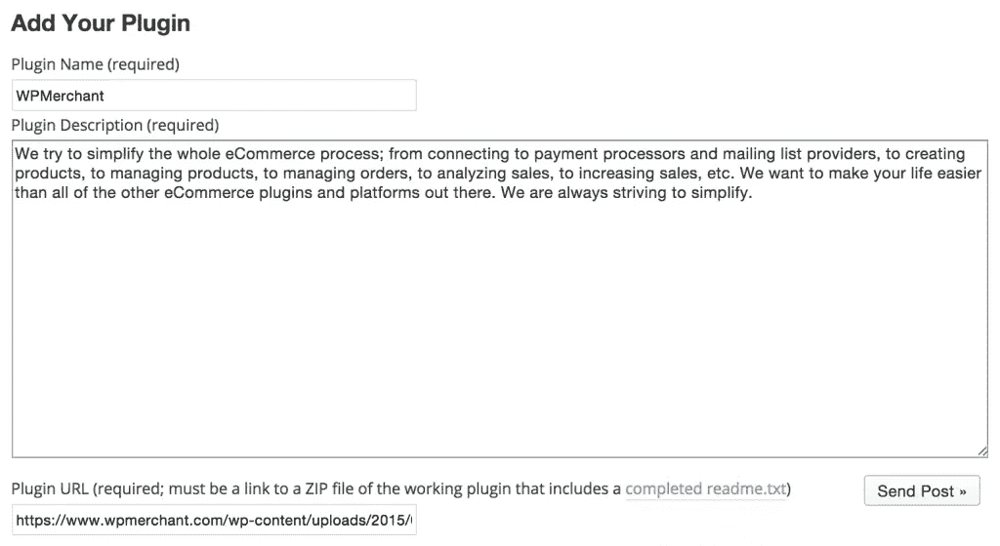

添加你的插件名称和描述。对于插件 URL，您需要压缩您的插件文件，并将您的`plugin.zip`文件上传到您的网站或您可以访问的网站。您应该能够将压缩文件上传到 Dropbox 或 Google Drive，并向插件 zip 文件添加一个公共链接。

或者，您可以将其添加到您选择的网站。

#### **6。等待批准。**

所有的 WordPress 插件目录插件都是人工审核的，根据 WordPress 的说法，你应该“在某个模糊定义的时间内”收到回复。这不是很有帮助。但是 WPMerchant 审核通过大概花了 8 个小时。


#### **7。认可。**

你刚刚收到 WordPress 的回复，他们让你知道你的插件被批准了(woot woot！).收到这封邮件后，我们跳了一会儿舞！

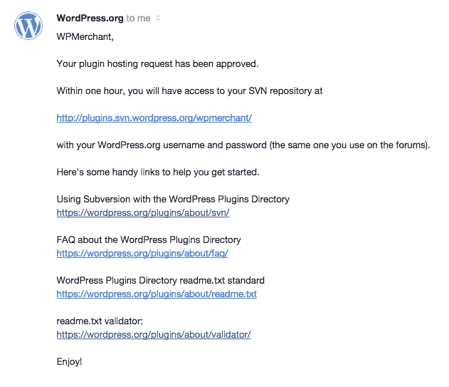

#### **8。将你的插件存储在 WordPress Subversion 仓库中。**

Subversion 是一个版本控制工具，它允许你跟踪所有的“变化(对你的插件所做的),这样你就可以在需要的时候回头查看旧版本或修订版”。如果你熟悉 Git(另一个版本控制系统)，你会很快学会。

现在你的插件已经被批准了，是时候在你的 WordPress Subversion 存储库中存储一份拷贝了。这个库是存储插件文件的地方。任何人都可以从库中获得你的插件文件的副本，但是你的`readme`文件中列出的贡献者是唯一可以对你的插件库进行修改的人。

我们有两套将你的插件存储在 WordPress Subversion 存储库中的说明；一个面向使用 Mac 的用户，另一个面向使用 Windows 的用户。我们从下面的 Mac 指令开始。

##### 在 Mac 上:

我们将使用命令行把你的插件存储在 WordPress Subversion 库中。打开您的终端应用程序。找到你希望你的插件存在的父目录。

*   使用 ***cd【目录名】*** 命令打开一个目录。
*   使用 ***光盘..*** 命令移出当前目录，进入其父目录。
*   使用 ***ls -a*** 命令列出当前目录下的所有文件和目录。

导航到父目录后，在终端窗口中运行下面的命令(svn 是 Subversion 的缩写，co 是 checkout 的缩写)。


这个命令将你的所有中央 WordPress Subversion 存储库的文件添加到你的本地存储库中。一个重要的提示，确保用你的插件批准邮件中提供的 URL 替换[https://plugins.svn.wordpress.org/wpmerchant](https://plugins.svn.wordpress.org/wpmerchant)(你可以在上面的邮件中看到我们的库的 URL)；应该是[https://plugins.svn.wordpress.org/your-plugin-name](https://plugins.svn.wordpress.org/your-plugin-name)的格式。并且，将命令末尾的`wpmerchant`替换为您想要命名的目录(我们只是使用了我们插件的名称)。

您将得到一个询问以下内容的响应:

```
(R)eject, accept (t)emporarily or accept (p)ermanently? 
```

输入`t`或`p`并点击`Enter`。然后，您会收到下面的消息。这表明在您的计算机上创建了`wpmerchant`目录，并且在 wpmerchant Subversion 存储库目录中添加了标签、资产、主干和分支目录。

```
A    wpmerchant/tags
A    wpmerchant/assets
A    wpmerchant/trunk
A    wpmerchant/branches
Checked out revision 111111. 
```

将你所有的插件文件放在**主干**目录中。既然主干目录中已经有了插件文件，那么就需要将这些文件添加到 Subversion 存储库中，以便可以对它们进行跟踪。您可以通过运行下面的终端命令来做到这一点。


然后，您需要通过在您的终端窗口中运行以下命令，将对您的本地存储库所做的更改推送到中央 WordPress 存储库。


您需要输入电脑的登录用户名和密码。

然后，你会被要求输入你的用户名和密码。

一旦提供了这些凭证，你的插件文件将会被转移到 WordPress 中央储存库。将显示传输文件数据消息，完成后，将显示提交修订消息。


搞定了。你应该会收到一封来自 WordPress 的解释新提交的邮件。现在，让我们去看看我们的 WordPress 插件目录页面。

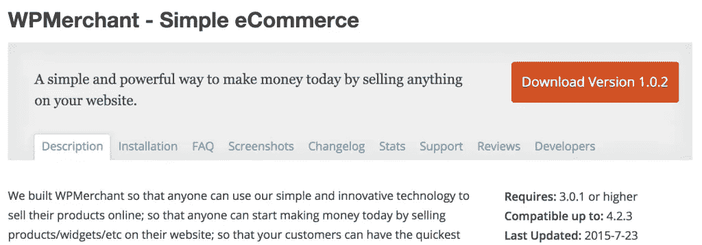

如你所见，我们的不包括顶部的横幅。它也没有包含我们希望在截图部分显示的截图。我们真的想要那个横幅和那些截图——我们做错了什么？我们没有将图像添加到资产目录中(这是主干目录的兄弟)。确保将资产图像放在该目录中。然后，运行以下终端命令:


现在，您需要将变更提交到中央存储库。


现在查看你的 WordPress 插件目录页面，你应该会看到图片。是的，我们有！！


如果你在多台计算机上或者有多个贡献者开发你的插件，确保在提交任何改变之前运行更新命令(如下所示)。这将把存在于中央 WordPress 知识库中的更改拉进你的本地插件知识库中。


##### 在个人电脑上:

为了在 Windows 机器上发布你的插件，你需要从下载一个兼容版本的 Subversion 客户端开始，[乌龟 SVN](http://tortoisesvn.net/downloads.html) 是一个流行的选择。一旦下载完成，双击，你应该看到安装向导的第一步。

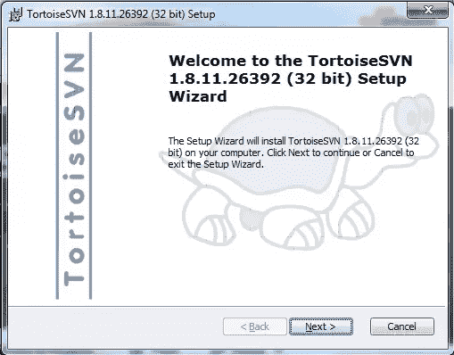

单击下一步按钮。

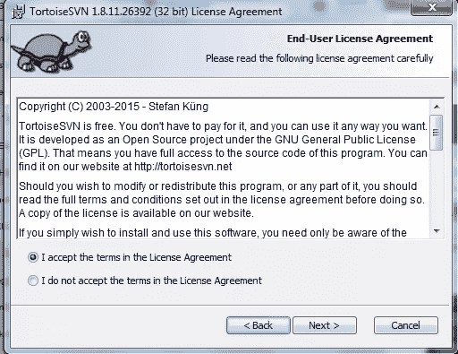

同意条款和条件，然后单击下一步按钮。

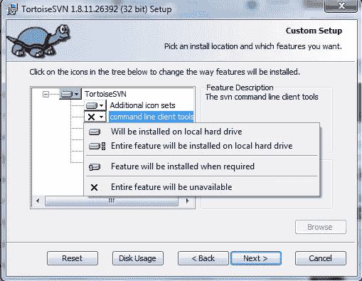

如果您想安装命令行工具，请单击命令行客户端工具并选择“将安装在本地硬盘上”不管怎样，请单击“下一步”按钮。

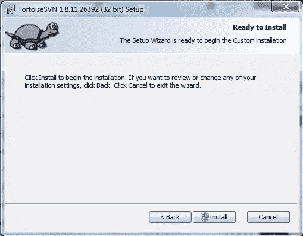

单击安装按钮。

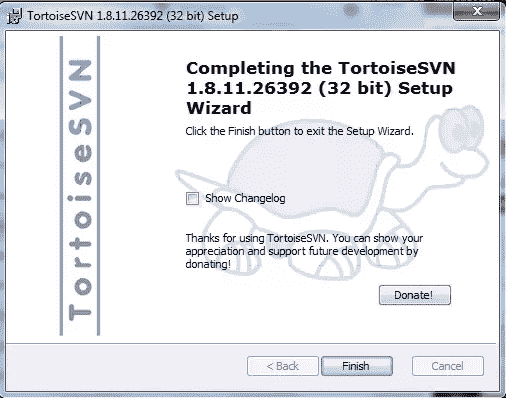

单击“完成”按钮完成安装。厉害！既然所有的垃圾都处理完了，我们就开始实际使用 Subversion (SVN)的有趣部分。打开 Windows 资源管理器。导航到你想要你的 WordPress SVN 知识库所在的目录，点击那个目录，然后右键点击那个目录图标。

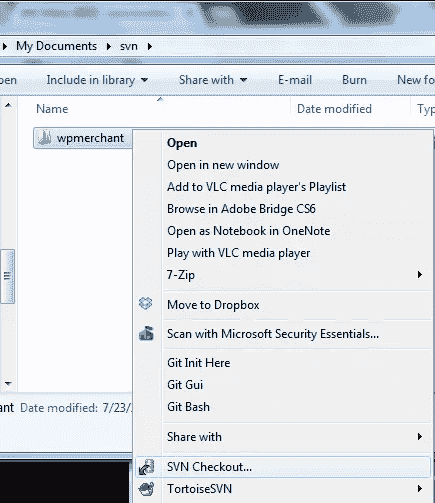

点击 SVN 结帐下拉菜单选项。

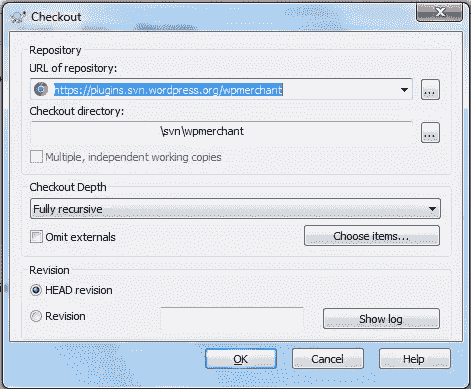

在字段中输入存储库的 URL 查看你的 WordPress 批准邮件来找到那个 URL。你的可能是 https://plugins.svn.wordpress.org/your-plugin-name 的格式。单击确定按钮。

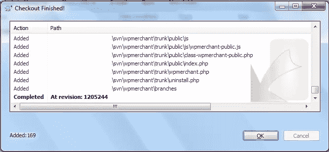

上面的屏幕截图确认您的结账已完成。这意味着存在于 WordPress 中央储存库中的所有文件和目录已经被下载到你的计算机上，你指定的目录中。

您选择的目录现在应该包含资产、主干、分支和标记目录。您需要将您的插件的所有文件添加到新添加的**主干**目录中。然后，您需要打开 Windows 资源管理器，单击您的 SVN 存储库目录图标，并右键单击该目录图标。

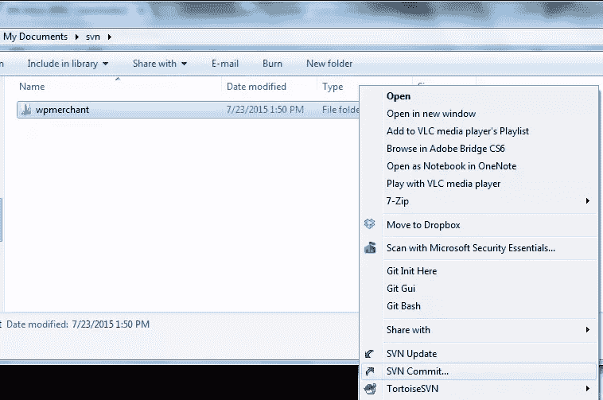

单击 SVN 提交选项。下一个屏幕截图显示了在您的 SVN 存储库中添加和修改的不同文件。请确保仅选中存储库中要跟踪的文件旁边的复选框。你应该检查所有的复选框，以便将你的插件文件添加到 WordPress 中央存储库中。


点击确定按钮。现在，所有你修改过的和新添加的文件都应该存在于中央 WordPress SVN 储存库中，以及你的本地机器上。如果你在多台计算机上工作，确保运行 SVN 更新功能来同步你的本地知识库和 WordPress 中心知识库。通过使用 Windows 资源管理器找到您的 SVN 存储库目录，单击该目录，然后右键单击该目录图标。


点击 SVN 更新选项。如前所述，这确保了你的存储库副本与中央 WordPress 存储库保持一致。

## 有问题吗？

这就是她(或他在这种情况下)写的全部！如果您有任何问题/我们可以改进的地方，请告诉我们，我们很乐意听到您的意见！

## 分享这篇文章