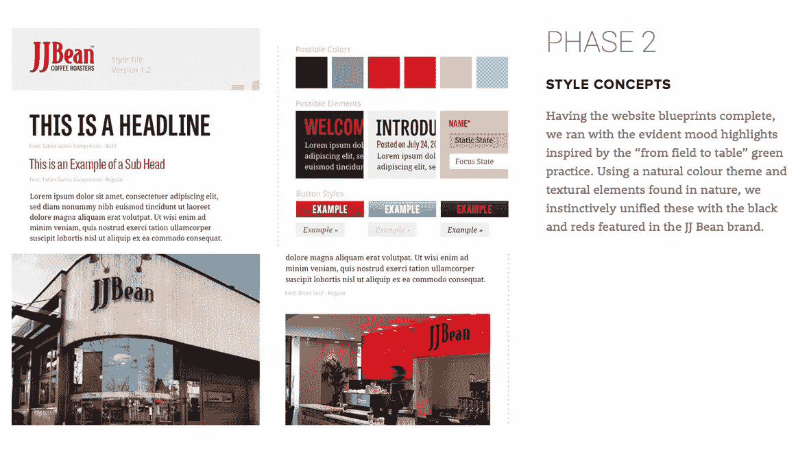

# 强大的网页设计案例研究的秘密

> 原文：<https://www.sitepoint.com/secrets-powerful-web-design-case-studies/>

如果你还不知道案例研究的力量，请密切关注；他们即将成为你最好的朋友。

在很大程度上，案例研究是几乎每个行业的支柱。所有类型的公司都使用案例研究向世界展示他们是如何帮助一个特定的客户解决问题的。

还记得在学校的时候，老师要你展示你的作品吗？案例研究也是基于同样的原理。有些客户想“一窥幕后”，看看你工作中的流程。

他们不仅想看到成品的样子，还想看到从开始到结束的整个过程。

*   你是如何解决客户的问题并提出解决方案的？
*   花了多长时间，一路上都涉及到什么？
*   你的思维过程是什么，为了解决客户的问题或实现他们的目标，你做了什么？

这些是案例研究中通常会回答的一些问题，它们为客户提供了很多见解。

案例研究也可以采取多种形式，甚至可能根本不叫案例研究。例如，我的网站 thedeependdesign.com 称它们为“成功故事”你可以定制你自己的短语，创造一些吸引人的和适合你的东西。

不管头衔如何，案例研究讲述了你如何帮助一个特定客户的故事。这很重要，因为如果未来的客户能够认同过去的客户——他们的问题，他们的目标，无论是什么——他们就能看到你如何以类似的方式帮助他们。

奇怪的是，似乎很少有自由职业者使用案例研究，而大公司——尤其是在创意行业——却广泛使用案例研究。这是一个真正错过的机会，但如果你停下来想想，这对你来说是一个好消息。

如果你是你的市场中唯一一个利用案例研究的企业，你真的可以脱颖而出。如果你是使用这种技巧的少数人之一，这将使你和你的企业对潜在客户更有吸引力。

就其本质而言，案例研究也表明你理解并有解决问题的经验。他们帮助向客户展示，你可以采取独特的情况，问题或目标，并创建一个过程来帮助您的客户得到他们想要的东西。

## 第 1 部分:如何构思一个引人注目的网页设计案例研究

### 仔细选择你的主题。

成功案例研究的第一步是选择正确的主题。如果你有很多过去的客户可供选择，那么选择一个大多数未来客户都能认同的“普通人”客户可能是明智的。一个人们可以理解的人，他有很多其他企业共有的问题或目标。

从一个需要大量解释的晦涩或复杂的行业中选择一个客户，会让潜在客户更加难以理解。如果人们不能认同你的案例研究，他们就不太可能看到你解决他们的问题。

面向消费者的客户，如餐馆、零售店或酒店，通常有容易识别的目标，并有助于进行出色的案例研究。

此外，在选择主题时，要记住你的目标客户群。确保你选择的候选人能够吸引你想要吸引的客户类型。

例如，如果你碰巧在为建筑行业制作网页设计方面取得了成功，试着坚持你的案例研究领域，否则你就有可能与你的客户脱离关系。

在案例研究中能够认同客户是至关重要的，因为我们希望读者能够很容易地站在客户的角度思考问题。你希望他们读完之后，坐下来想，他为那个人做了一件伟大的工作，我也有类似的问题。我打赌他也能帮我。

然而，如果你是一家新公司，你可能没有一个很长的客户名单，所以你不会那么挑剔。但是没关系——每个人都从某个地方开始，随着你获得更多的客户，你可以写越来越多的案例研究，并且随着时间的推移越来越挑剔。

如果你碰巧是新客户，没有以前的客户来写案例研究，你可以实时写一个案例研究。这实际上是一件好事，因为你可以写一个你正在帮助的客户的案例研究，所有的细节都会在你的脑海中记忆犹新。

### 开始写作！

现在你已经选好了你的客户，是时候开始制作了。记住，你要从头到尾讲一个故事。从你的客户第一次来找你开始:

*   最初驱使他们来找你的问题或目标是什么
*   他们需要你解决什么？
*   他们需要设计一个标志，写一篇新闻稿，或者设计一个全新的网站吗？

谈论项目附带的所有先决条件。例如，一个客户可能来找你，想要一个可以由他们自己的员工轻松更新的网站，他们希望引入他们现有徽标的颜色和主题，或者能够收集电子邮件地址。

这些先决条件都会限制你的创造力。这是一个很好的展示，因为它告诉未来的客户，你可以在客户要求的范围内运作。

你还应该包括你在这个过程中考虑到的其他未言明的因素。这可能包括您在研究中偶然发现的行业标准特性。

一个很好的例子是，如果一家新餐馆希望你为他们建立一个网站，而你在研究阶段发现大多数餐馆都在使用一种叫做“OpenTable”的服务进行在线预订。

**说说:**

*   所有需要的元素。
*   客户端*明确请求的所有元素。*
*   你自己发现的事情。

包括当你想出最终产品的解决方案时，你是如何考虑所有这些因素的。解释你决策背后的思维过程，展示你的决策是如何影响和惠及项目和客户的。

### 尽可能量化。

尽可能包含真实、准确的数字。说"*我的网页设计为建筑公司的成功做出了贡献是一回事。*，但更好的说法是*‘我为 XYZ 客户设计的网站每月有 10，000 名独立访客，其中 10%转化为销售线索。’*

这些是可量化的统计数据，未来的客户可以阅读并容易理解。访问者不必想知道它实际上是什么意思，或者抽象地思考你的陈述——它是容易解释的真实世界的数据。

他们想知道如果他们雇佣你做一个项目，你会给他们带来什么结果。而真正的结果是用数字来衡量的，而不是温暖模糊的感觉。

## 第二部分:如何展示你的案例研究

一旦你确定了有效案例研究的内容，就该把注意力放在演示上了。人们不希望阅读一本关于你过去客户的 400 页的小说，所以以一种容易理解的方式呈现案例研究是很重要的，这将使人们想要阅读它们。

首先也是最重要的，你要确保你的案例研究的格式适合网络，特别是你的网站。想一想那些提供大量信息的博客和其他网站——它们中的大多数都做得很好，能够以一种易于浏览和阅读的方式呈现信息。他们通过将内容分成一口大小的块来做到这一点。

### 分开它。

拆分段落是一种简单的开始方式。对读者来说，它看起来更好看，而且比一堵巨大的文字墙更容易阅读。太多的文本看起来令人生畏，坦白地说，读起来像是一件苦差事。

把它分成几个段落会让它看起来更容易理解，如果潜在客户不想阅读整个页面，他们可以跳来跳去，看看哪个段落最让他们感兴趣。

### 使用标题。

此外，在适当的地方使用标题和副标题。这些可以让你更进一步的分解你的内容，也增强了读者浏览和找到他们真正感兴趣的内容的能力。在大多数情况下，人们通常不会阅读整个案例研究。人们的网上阅读习惯实际上相当懒惰——所以大多数人只是浏览内容，阅读他们特别感兴趣的内容。

### 使用列表。

你的案例研究中有没有可以做成列表的信息？列表和项目符号是让内容易于使用的有效方法。

项目符号特别适合列出项目的具体需求、您实现的功能，或者关于项目如何使您的客户受益的统计数据。

### 使用图像。

尽可能使用图片——尽可能在内容旁边展示项目的不同阶段。任何时候你可以展示而不是讲述，这是一件好事。

[信用:福吉和史密斯](http://forgeandsmith.com/our-case-studies/jj-bean-coffee/)

如果你能在尽可能多的阶段展示你的项目，那就这样做。例如，如果你在做一个 logo，你可能想展示你开始草图的截图。

然后继续讲述你是如何开始寻找各种颜色的，展示你可能在设计中加入的配色方案的图片。再说一遍，案例研究就是讲述一个项目的故事，所以尽可能用图片来做这件事。

说到图像，问问你的客户你是否可以用他们的照片。毕竟，这也促进了他们和他们的业务。

简单地添加一张客户照片，就能让他们对其他潜在客户更加“真实”。如果人们能看到你在谈论谁，这将使整个案例研究更具关联性和人性化。

## 第 3 部分:定位您的案例研究以获得最大影响

你知道超市是怎么把口香糖、糖果、汽水和杂志放在收银台的吗？这不是偶然的。他们知道，一旦你到了那里，这些小的、无害的、低价的商品会看起来像是你已经购买的东西的完全合理的附加物。这只是达成额外销售的最后一次“推动”。

嗯，案例研究可以以类似于你的作品集网站的方式工作。

既然你已经花了很多时间和精力去写一个令人信服的案例研究，并以一种有效的方式来展示它，你会想把它放在你的作品集网站上最好的位置。和你网站上的其他东西一样，位置也有很大的不同。那么你的案例研究的最佳地点在哪里呢？

### 位置 1:专用页面

第一个也是最明显的位置是在一个专门的“案例研究”页面上，包含在主导航中。点击导航会将访问者带到包含所有案例研究的主页。

即使你一开始只有一个，它仍然是一个强大的工具。当你开始建立越来越多的客户时，你可以按照自己的步调增加他们。

在页面上，你可以随意布置它们，尽管布局通常取决于你要处理的案例数量。

如果你有几个，你可能想在最上面放一个特色案例研究，这样就可以叫出来了。特色案例研究可以在主页上提供大量信息。这就是项目符号或数字列表派上用场的地方。添加一两张图片和案例研究的概述，包括所涉及的要点，可以帮助吸引人们。“阅读更多”链接允许人们查看整个案例研究。

其他案例研究可以排列为特色案例下方的缩略图，人们可以快速浏览视觉图像并点击其中一个吸引他们的图像。每个缩略图下方的快速链接，可能带有客户和项目名称，可以让人点击更深入，了解更多信息。

如果您刚刚起步，只有一个案例研究，您可能希望使用相同的格式，但将所有信息放在主页上，而不是行动号召，以了解更多信息。你可以在页面底部写下类似“更多即将推出”的内容，并在积累的过程中添加更多。

你可以把你的案例研究有策略地散布在网站的其他区域，并链接回案例研究主页，这样可以使你的案例研究更加有效。将它们添加到其他页面上，就像我之前提到的，就像在超市里的“冲动购买”商品一样；只是一些额外的东西来吸引那些可能对联系你持观望态度的访问者。那么，在你的网站上添加研究还有什么意义呢？

### 位置 2:在侧边栏上

一个有效的方法是将病历报告或病历报告的缩略图添加到“我的工作”页面的边栏中。这样，浏览你以前作品的客户可以选择更深入地挖掘，如果他们愿意的话，可以读得更深入一点。

因为它就在那里，而且他们已经看过你的作品了，大多数严肃的客户都会点击，至少会浏览案例研究主页。

### 位置 3:在主页上

主页通常是网站上访问量最大的页面，你的主页也不例外。因此，这是另一个放置特色案例研究的好地方。在主页中，您可以在许多位置添加特色案例研究。

如果你使用一个大的幻灯片，为什么不设计一个能引出你的特色案例研究的幻灯片呢？你可以包括一个完成项目的伟大形象，一个简单的标题，以及一个点击阅读整个故事的链接。

或者你可以把其中的几个放在页面稍低的位置，或者是并排的缩略图，或者你甚至可以设计一个迷你滑块，旋转 3 或 4 个案例研究，当然还有链接。

可能性实际上是无限的。要有创意，把你的案例研究放在你网站上有意义的地方，尤其是可以增强页面内容的地方。将它们添加为行动号召或“冲动购买”有助于增加你网站的可信度，让人们在你的网站上停留更长时间。

## 分享这篇文章