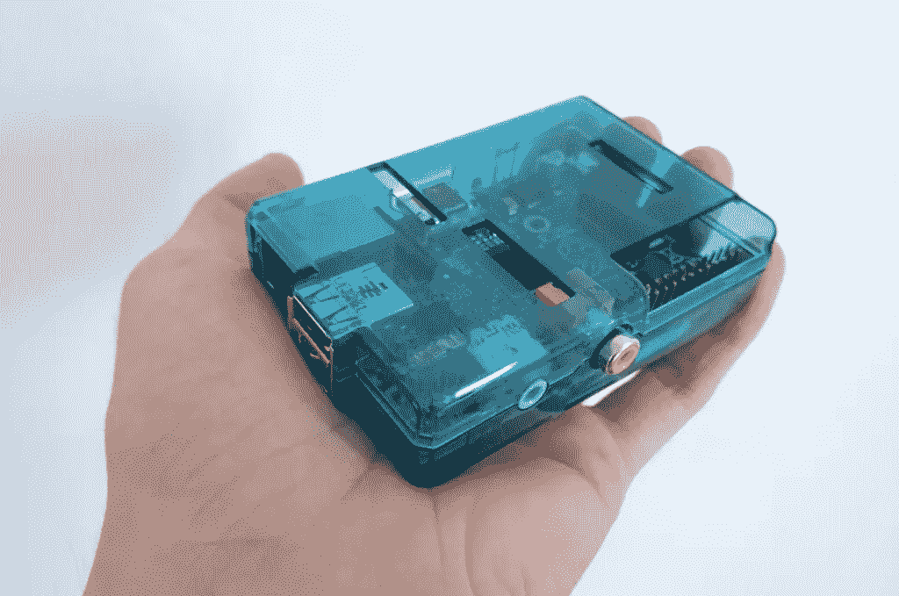
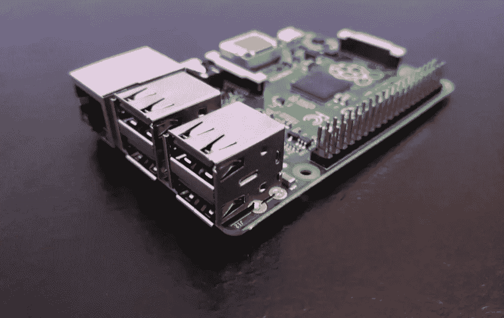

# 用一台 5 美元的 Raspberry Pi 电脑创造惊人的项目

> 原文：<https://www.sitepoint.com/creating-amazing-projects-with-a-5-raspberry-pi-computer/>

树莓派是一台微型电脑。在这篇文章中，我将更多地解释它是什么，以及我们可以用它做一些令人惊奇的事情。

## 关于树莓派

正如你在下图中看到的，树莓皮大约有你的手那么大:

Pi 于 2012 年 2 月首次发布，旨在让任何人学习如何使用电脑。这是一个很棒的产品，价格很有吸引力——根据版本的不同，通常从 20 美元到 40 美元不等，尽管只需 5 美元就可以买到 [Raspberry Pi Zero](https://www.raspberrypi.org/blog/raspberry-pi-zero/) 。

已经发布了几个版本的 Raspberry Pi，每个版本都有自己的规范。有些有四个 USB 端口，而有些没有以太网端口，等等。您通常会根据项目的需求选择一个版本。您可以看到树莓 Pi 的第一个版本(如上图)和树莓 Pi 2(如下图)之间的明显差异:

你可以在[维基百科](https://en.wikipedia.org/wiki/Raspberry_Pi#Specifications)上了解更多关于不同树莓 Pi 电脑组件的信息。

### 电源和操作系统

树莓派本身就是你上图看到的主板。它通过 microUSB 端口供电，没有任何硬盘。相反，它有一个 SD 插槽(或 microSD 插槽)，操作系统从 SD 卡上运行。

就操作系统(OS)而言，有几种可供 Pi 使用。其中大部分都是基于众所周知的 Linux 发行版，比如 Raspbian。但是如果你愿意，你也可以在你的树莓 Pi 2 上安装 [Windows。(dev.windows 网站展示了](https://www.sitepoint.com/running-windows-10-iot-core-on-a-raspberry-pi/)[许多有趣的项目](https://dev.windows.com/en-us/iot)你可以在 windows 上试试树莓派。)树莓派的官方网站上有一个专门的页面[，可以帮助你决定什么样的操作系统最适合你。](https://www.raspberrypi.org/downloads/)

## 树莓派能做什么

2015 年 2 月 18 日，树莓派基金会宣布[售出了 500 万个树莓派](https://www.raspberrypi.org/blog/five-million-sold/)。到第二年 6 月，这个数字达到了 600 万。这是一个巨大的成功，有一个很好的理由:树莓派可以用在很多不同的项目中。让我们看一些例子。

### 媒体中心

一些可用于 Pi 的操作系统使得在几分钟内获得一个工作的和完整的媒体中心成为可能。例如，[Kodi](http://kodi.tv/)——一个开源的媒体中心——可以安装在 Raspbian 等各种 OS 上。

借助 Kodi，您可以使用自己熟悉的设备(如电视遥控器)播放整部电影和系列收藏。

### 服务器

因为 Raspberry Pi 可以像任何其他计算机一样充当计算机，所以您可以在它上面安装软件，以便它可以用作服务器。例如，您可以安装 LAMP 解决方案来将您的 Raspberry Pi 转换为 web 服务器，或者您可以安装 Git 来获得 Git 服务器。

尽管 Pi 不适合为拥有大量受众的流行网站提供服务，但作为测试 web 服务器，甚至为小型个人网站提供服务，它是完美的。

### 摄像机

有一些外围设备你可以插在树莓皮上。例如，有一个相机模块可以让你把你的微型电脑当作相机来使用。另一个相机模块 NoIR 可以在黑暗中进行红外拍摄。

还有一个机器人可以看到它的环境，还有一个摄像头可以记录某个房间里发生的事情。连接到互联网，一个带有摄像头模块[的树莓 Pi 可以用作 IP 摄像头](https://www.sitepoint.com/streaming-a-raspberry-pi-camera-into-vr-with-javascript/)。

### 机器人或连接的物体

Raspberry Pi 有一些 GPIO 引脚，允许它与外部事物通信。例如，通过正确的程序，你可以摆弄发光二极管或电机。换句话说，一旦你把正确的偶极子连接到正确的 GPIO 管脚，你就可以写一个程序通过 Raspberry Pi 来控制它们。如果你把树莓派连接到互联网上，你可以从任何地方控制这些偶极子。

这就是为什么树莓派可以用来控制一个小机器人，或建立连接的物体。如果你访问 Kickstarter，你有时会看到一个 Raspberry Pi 被用来构建一个随机对象的工作原型(通常是一个连接的对象)。

2014 年，一组研究人员用树莓皮制作了一盏灯，里面有一个连接到互联网的麦克风。一旦被放置在任何地方，这种灯就能听到随机人群的对话，并把其中一些发布到 Twitter 上。(恰恰是那种会让你偏执的经历！)

同样在 2014 年，Michael Teeuw 建造了一个运动控制的智能镜子。镜子后面的屏幕显示一些事情，如当天的气象条件，或简单的信息，如<q>你是个好人</q>，用赞美开始一天。这个显示器是用树莓派控制的。

## 结论

虽然不是一台功能强大的计算机，但有大量不同的项目可以用 Pi 来建立——通常比用一台功能更强大的计算机更容易。

我现在有两个覆盆子馅饼。我用一个作为 IP 摄像头，另一个作为 web 服务器、Git 服务器和媒体中心。它连接到全高清电视，可以提供良好流畅的体验。

用一个树莓派最大的好处大概就是它的价格了。我们上面看到的所有项目都可以用其他计算机实现，甚至可以用专用印刷电路实现(例如，用于连接对象的原型)。然而，这些其他选项更昂贵，这并不总是可行的。

如果你正在寻找一台便宜的电脑用于个人项目，或者用于一个更雄心勃勃的项目的原型，看看 Raspberry Pi。你可能会对它的表现感到惊讶！

如果你用圆周率做了一些有创意的事情，请在评论中告诉我们！

## 分享这篇文章