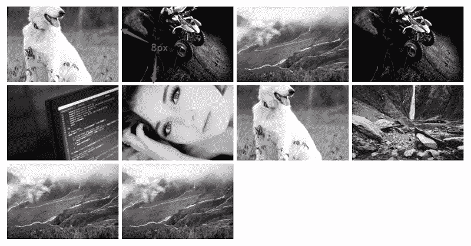
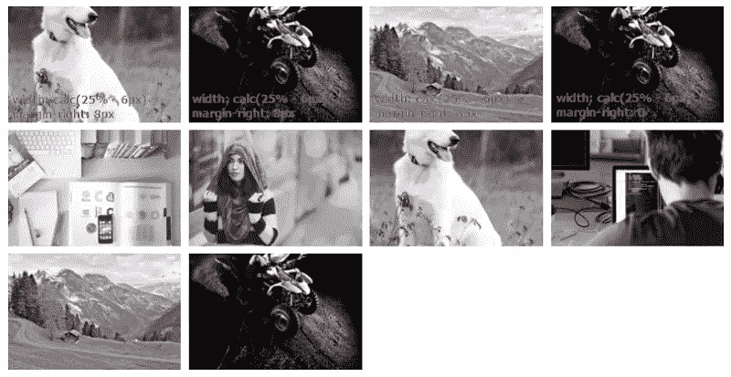
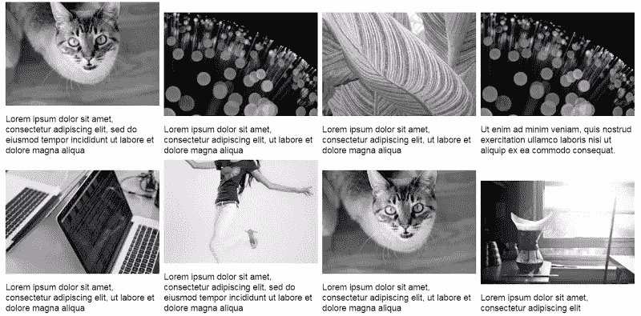
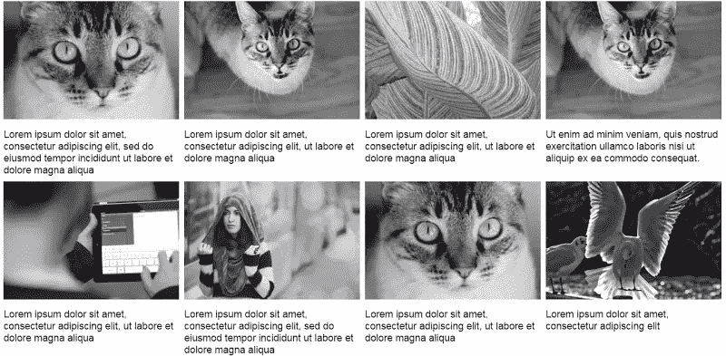
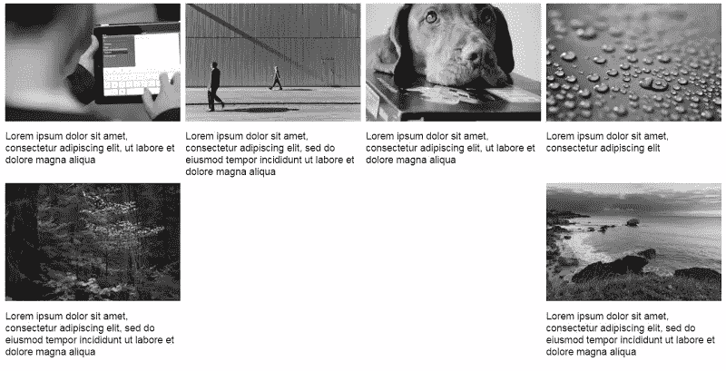
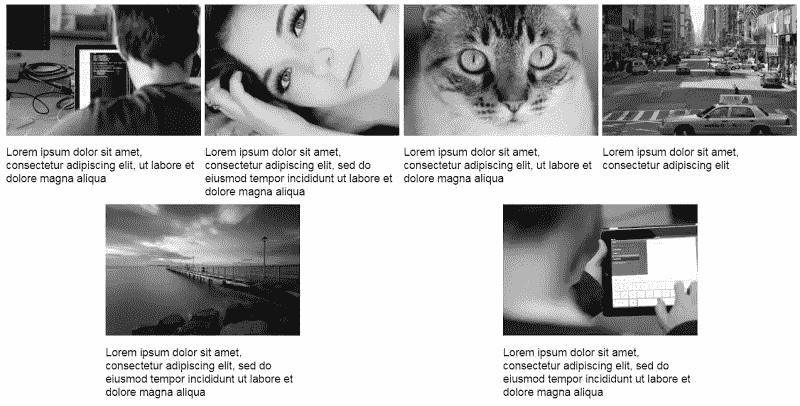

# 使用现代 CSS 构建响应性图像网格

> 原文：<https://www.sitepoint.com/using-modern-css-to-build-a-responsive-image-grid/>

构建定制的响应式布局总是令人兴奋的。本文研究了一种技术，我们可以用它来完全控制网格列之间的距离。为了演示这一点，我将使用一个响应式图片库的例子。

*了解更多关于响应式布局的信息。观看我们的截屏视频[在 Flexbox](https://www.sitepoint.com/premium/screencasts/creating-multiple-column-layouts-in-flexbox) 中创建多列布局。*

## 构建响应式布局

首先，让我们假设在大屏幕上我们的图库应该是这样的:



在较小的屏幕上(即小于 50em)，它应该具有以下外观:


标记很简单:

```
<div>
  <a href="path-to-the-image">
    <figure>
      
    </figure>
  </a>

  <!-- other anchors here ... -->

</div>
```

您可能已经知道，我们可以利用不同的布局方法来生成所需的结果。在我检查这些可能的方法中的两个之前，让我们注意一下我们的初始需求(参见前面的可视化):

*   我希望在中等和更小的屏幕(即< 50em)上使用 2 列布局，在大屏幕(50em 或以上)上使用 4 列布局。
*   列间距应为 8px。

## 使用内嵌块

我将首先使用`display:inline-block`方法来建立我们的画廊。考虑以下 CSS:

```
div {
  font-size: 0;
}

a {
  font-size: 16px; 
  display: inline-block;
  margin-bottom: 8px;
  width: calc(50% - 4px);
  margin-right: 8px;
}

a:nth-of-type(2n) {
  margin-right: 0;
}

@media screen and (min-width: 50em) {
  a {
    width: calc(25% - 6px);
  }

  a:nth-of-type(2n) {
    margin-right: 8px;
  }

  a:nth-of-type(4n) {
    margin-right: 0;
  }
}
```

以下是我所做的解释:

默认情况下，[的`inline-block`元素](https://css-tricks.com/fighting-the-space-between-inline-block-elements/)之间有一个空格。一种替代方法是将父元素的字体大小设置为零。这可能还需要我们重置所有子元素的字体大小(在我们的例子中没有必要)。

在小屏幕上，我有一个 2 列的布局，我指定了 8px 的列间距。

我们的列宽计算如下:

*   每行各列之间的总间距= 1 * 8px => 8px。导出的值是 8px 而不是 16px，因为我在小屏幕上删除了每隔一列的右边距。
*   每列的宽度= calc(50%–4px)。通过计算得出的值 4px:每行的列间距/每行的列数(8px / 2 => 4px)。


在大屏幕上，我有一个 4 列的布局，我指定了 8px 的列间距。因此，我们的列宽计算如下:

*   每行各列之间的总间距= 3 * 8px => 24px。同样，导出的值是 24px，而不是 32px，因为我删除了每第四列的右边距。
*   对于列宽，我使用 calc(25%–6px)。通过以下简单计算得出的值 6px:每行的列间距/每行的列数(24px / 4 => 6px)。



[**点击**](http://codepen.io/SitePoint/pen/XXEmXj) 查看代码笔演示

## 使用 Flexbox

上面的解决方案工作得很好，但是有一些缺点。为了说明一个缺点，让我们假设每张图片都包含一个标题。

考虑这个稍微更新的标记:

```
<div>
  <a href="path-to-the-image">
    <figure>
      
      <figcaption>Some text here</figcaption>
    </figure>
  </a>

  <!-- other anchors here ... -->

</div>
```

这是大屏幕上我们画廊的新版本:



[**使用带字幕的内嵌块查看 CodePen 演示**](http://codepen.io/SitePoint/pen/yeKYJN)

结果并不吸引人，因为网格项有不同的高度。我们可以用 flexbox 来解决这个问题，flexbox 是一种现代的布局方法，它将允许我们克服许多常见的布局问题(例如`inline-block`元素之间的默认间隙)。为了激活这个方法，我只需更新父元素(flex 容器)的 CSS:

```
div {
  display: flex;
  flex-wrap: wrap;
}
```

令人高兴的是，如果我们现在预览图片库，我们将在所有屏幕上获得预期的结果(即，相等高度的列)。这是它在大屏幕上的样子:



[**使用带有改进字幕的 flexbox 查看 CodePen 演示**](http://codepen.io/SitePoint/pen/bEvVqP)

在这一点上，还有最后一件事我必须澄清。Flexbox 提供了 [`justify-content`](https://developer.mozilla.org/en-US/docs/Web/CSS/justify-content) 属性，将 flex 项目沿 flex 容器当前行的主轴对齐。但是，请注意，该属性没有定义一个允许我们构建所需图库布局的值。例如，`space-between`值会导致以下布局:



而`space-around`属性产生了这个:



在这两种情况下，最后两项都笨拙地分布在最后一行。这个方法的 CSS 看起来像这样:

```
div {
  display: flex;
  flex-wrap: wrap;
  justify-content: space-between; /* or space-around */
} 

a {
  display: inline-block;
  margin-bottom: 8px;
  width: calc(50% - 4px);
}

@media screen and (min-width: 50em) {
  a {
    width: calc(25% - 6px);
  }
}
```

在这种情况下，我没有给 flex 项目分配一个`margin-right`属性。这是因为，根据`justify-content`属性的值，浏览器负责将 flex 项分布到它们的容器中。

[**使用 justify-content 属性**](http://codepen.io/SitePoint/pen/RrMWjq) 查看 CodePen 演示

## 结论

这篇文章介绍了一些在响应图像网格中控制网格列之间距离的技术。虽然内嵌块方法已经足够了，但是 flexbox 使它变得更加简单和方便，尤其是在与`calc()`函数结合使用时。

*充分利用 Flexbox 布局，观看我们在[上的截屏，在 Flexbox](https://www.sitepoint.com/premium/screencasts/creating-multiple-column-layouts-in-flexbox) 中创建多列布局。*

如果你有解决这个问题的其他方法，请在评论中提出来。

## 分享这篇文章