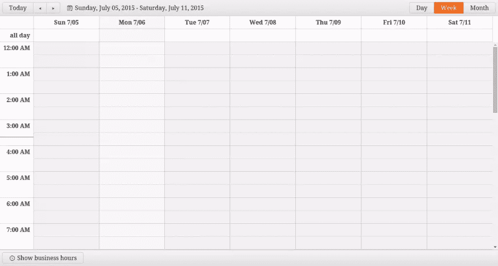
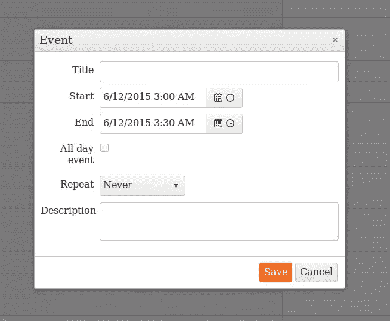
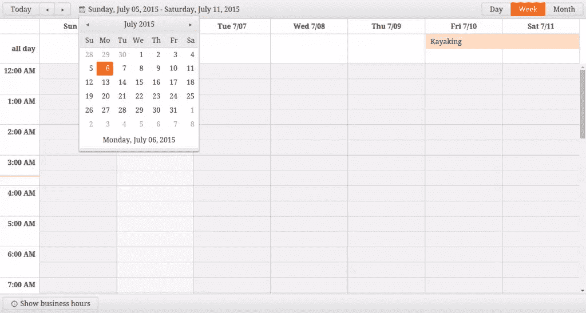
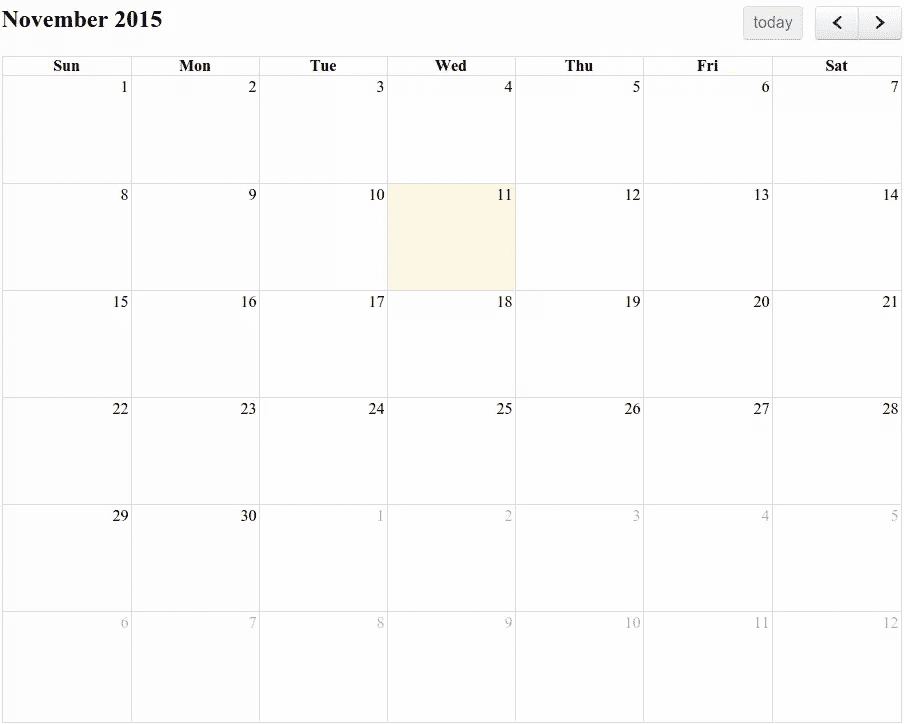
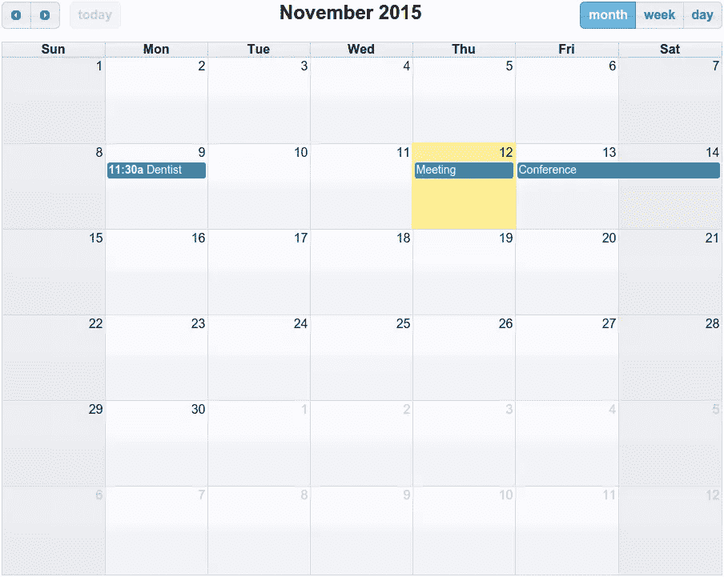
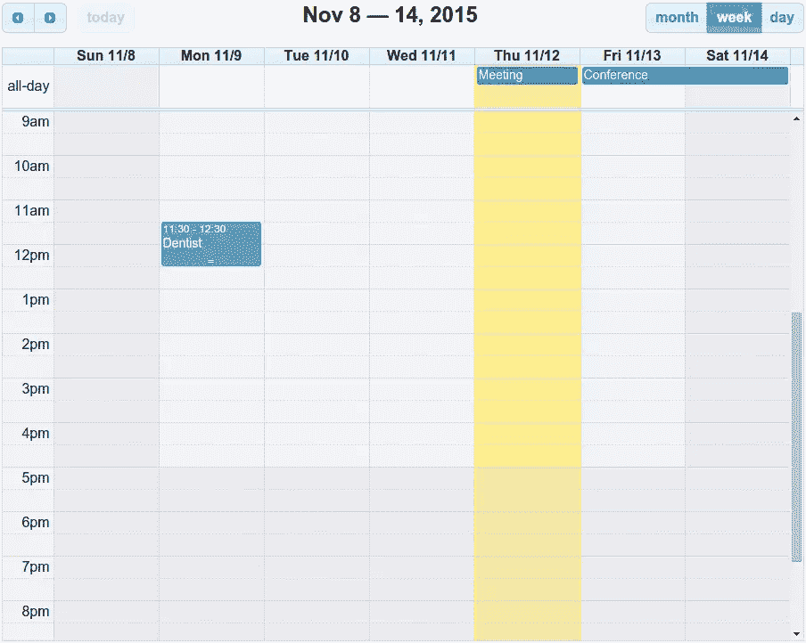
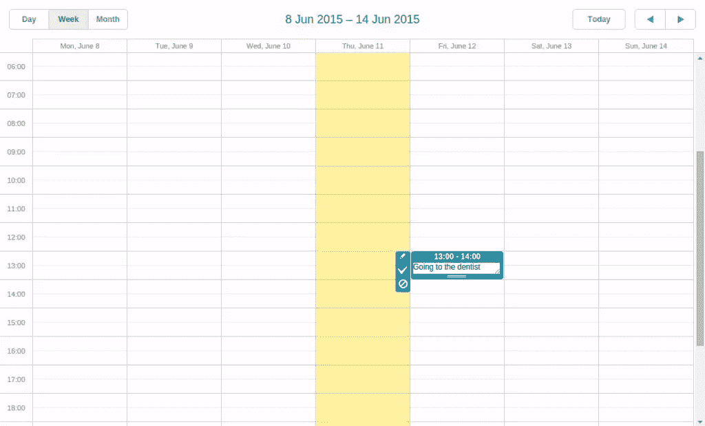
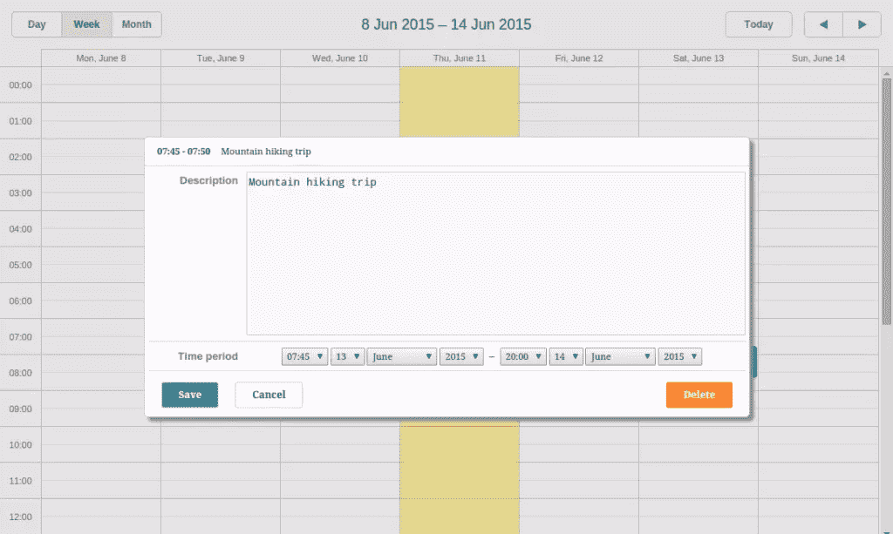
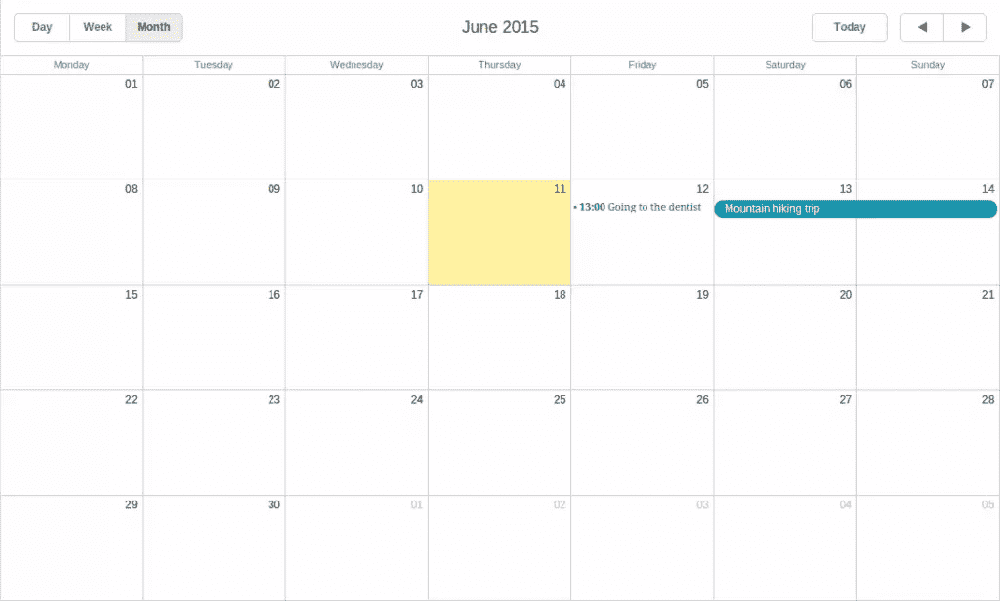

# JavaScript 日历和调度程序的比较

> 原文：<https://www.sitepoint.com/comparison-javascript-calendars-schedulers/>

日子过得很快，现代人会选择一个在线日程 app 而不是一堆便利贴来组织生活。在线应用可以在智能手机或笔记本电脑上使用。并且不需要在设备之间同步数据。如果你想创建自己的日历或日程表，但不知道从哪里开始，不要害怕。这篇文章的目的是帮助你做出决定。

为什么要创建自己的调度程序而不是使用现有的？这里有一些使用案例:

*   当您构建不必访问外部 web 的 Intranet 应用程序时。在这种情况下，您可能需要一个独立的组件，它不需要外部服务，并将数据存储在您希望的位置。或者，如果您希望完全控制您的应用程序，并且不想依赖外部服务
*   当您使用调度程序来可视化和管理系统中已有的数据时，它不一定由按日期/标题/描述定义的“约会”组成。例如，这些数据可以包含涉及大量业务规则的各种实体
*   当你需要一些高级功能时，谷歌日历并不支持。或者当您需要定制组件的外观或逻辑时，例如，多个资源视图、显示工作/非工作时间等。

我们将看看三种不同类型的 JavaScript 日历:

*   [剑道 UI 调度器](http://demos.telerik.com/kendo-ui/scheduler/index "Kendo UI Scheduler")，它是[剑道 UI](http://www.telerik.com/kendo-ui "Kendo UI home page") 框架的一部分
*   第三方 [jQuery](https://jquery.com/ "jQuery home page") 插件 [FullCalendar](http://fullcalendar.io/ "FullCalendar home page")
*   dhtmlxScheduler —一个独立的 JavaScript 事件日历

## 创建调度程序


在开始之前，让我们定义一下哪些特征对我们有价值:

*   使用条款
*   出现
*   可用性
*   编码复杂性

好吧，让我们现在开始。

## 剑道 UI 调度程序

你应该得到完整的[库包](http://www.telerik.com/download/kendo-ui "Kendo UI download page")来使用这个调度器。或者，自定义下载允许您选择想要的模块，但您需要有商业许可证才能使用它。要获得 30 天的试用期，你需要通过填写网络表格或通过你的社交网络帐户进行注册。顺便说一下，还有一个免费的剑道 UI 开源版本。它叫做[剑道 UI 核心](http://www.telerik.com/kendo-ui/open-source-core "Kendo UI Core page")，你可以在这个 [GitHub 页面](https://github.com/telerik/kendo-ui-core "Kendo UI Core")上查看详情。但是，不幸的是，调度程序不是它的一部分。

提取库之后，您可以创建一个基本的调度程序。首先，包括所需的文件:

```
<link rel="stylesheet" href="styles/kendo.common.min.css" />
<link rel="stylesheet" href="styles/kendo.default.min.css" />
<script src="js/jquery.min.js"></script>
<script src="js/kendo.all.min.js"></script> 
```

注意，应该在 Kendo UI JavaScript 文件之前包含 jQuery。

下一步是定义样式。除了设计`<html>`和`<body>`标签的样式之外，您还应该为调度器的容器定义合适的样式，使其在全屏模式下看起来更好。

```
html, body{
  margin:0;
  padding:0;
  height: 100%;
}
#scheduler {
  border-width: 0;
  height: 100%;
} 
```

现在，您可以使用构造函数来初始化调度程序:

```
<div id="scheduler"></div>
```

```
 $("#scheduler").kendoScheduler({
  // The current date of the scheduler
  date: new Date(),
  views: [
    "day",
    { type: "week", selected: true },
    "month"
  ]
}); 
```

`views`属性允许您启用日、周和月视图，并选择最初选定的视图。

这段代码将创建一个基本的调度程序，如下所示:



双击将打开新事件创建窗口。



创建的事件是可拖移的，因此您可以根据需要重新排列它们。另一个方便的功能是一个迷你日历，有助于浏览日程安排。



*显示营业时间* / *显示全天*切换按钮将有助于从常规事件中过滤出您的工作时间事件。您可以在计划程序的底部找到它:


该计划是直观的，并有你可能需要的所有基本功能。您可以创建一个事件并在日历网格中移动它。迷你日历和*显示营业时间*按钮等附加功能相当方便。

默认情况下，这就是我们所能得到的，所以让我们继续。

## 完整日历

这个日历是在麻省理工学院的许可下发布的，所以你可以使用它，几乎没有任何限制。有不同的方法可以安装这个日历:你可以使用 [Bower](http://bower.io/ "Bower") ，通过 [CDNJS](http://cdnjs.com/ "CDNJS") 将所需文件添加到你的页面，或者下载包含 JavaScript 和 CSS 文件的包。查看[下载页面](http://fullcalendar.io/download/ "FullCalendar Download Page")了解更多详情。

在前进之前还有一件事。因为 FullCalendar 是一个 jQuery 插件，所以不要忘记将它添加到您的页面中。另一个依赖项是 [Moment.js](http://momentjs.com/ "Moment.js Home Page") ，这是一个处理日期的 JavaScript 库。以下是在使用 CDN 的情况下，如何将文件包含在页面中:

```
<link rel='stylesheet' href='https://cdnjs.cloudflare.com/ajax/libs/fullcalendar/2.6.0/fullcalendar.css' />

<script src='https://code.jquery.com/jquery-1.11.3.min.js'></script>
<script src='https://cdnjs.cloudflare.com/ajax/libs/moment.js/2.11.1/moment.min.js'></script>
<script src='https://cdnjs.cloudflare.com/ajax/libs/fullcalendar/2.6.0/fullcalendar.min.js'></script> 
```

之后，您可以定义一个保存日历的 DIV 容器，定义 CSS 规则(如果需要),最后初始化日历。例如，我们有一个容器:

```
<div id='calendar'></div> 
```

初始化过程如下所示:

```
$(document).ready(function() {
  // page is ready
  $('#calendar').fullCalendar({
      // calendar properties
  })
}); 
```

如您所见，您不需要太多代码就可以让这个日历工作。默认情况下，您可以使用的功能并不多。

在这里，您可以看到默认调度程序的样子:



这是突出显示当前日期的月份视图，可以更改显示的月份，还有一个*今日*按钮。仅此而已。你看，FullCalendar 是一种 DIY 工具。你可以使用很多方便的功能，但是默认的日历是*非常*基本的。如果你想创建只需要最少功能的极简应用程序，这是一个很好的选择。

让我们编写一些代码，使我们的应用程序看起来和工作起来更好:

```
// enable theme
theme: true,
// emphasizes business hours
businessHours: true,
// event dragging & resizing
editable: true,
// header
header: {
  left: 'prev,next today',
  center: 'title',
  right: 'month,agendaWeek,agendaDay'
}, 
```

由于我们想要使用自定义主题，我们应该添加所需的 CSS 文件:

```
<link rel='stylesheet' href='./lib/cupertino/jquery-ui.min.css' /> 
```

快好了！最后一步是定义一些要呈现的事件。你可以用不同的方式定义事件:[作为数组](http://fullcalendar.io/docs/event_data/events_array/ "Events as an Array")，[作为 JSON 提要](http://fullcalendar.io/docs/event_data/events_json_feed/ "Events as a JSON Feed")，甚至[作为函数](http://fullcalendar.io/docs/event_data/events_function/ "Event as a Function")。

这里有一个例子:

```
events: [
  // all day event
  {
    title  : 'Meeting',
    start  : '2015-11-12'
  },
  // long-term event 
  {
    title  : 'Conference',
    start  : '2015-11-13',
    end    : '2015-11-15'
  },
  // short term event 
  {
    title  : 'Dentist',
    start  : '2015-11-09T11:30:00',
    end  : '2015-11-09T012:30:00'
    allDay : false // will make the time show
  }
] 
```

现在，让我们检查结果:



这次好多了！现在，您可以更改视图，拖动现有事件并调整其大小，强调营业时间，周视图和日视图从其他视图中过滤全天事件:



以下是对 FullCalendar 的整体印象。它被设计成一个轻量级的工具，让你完全控制你的应用程序。您可以创建一个低功能的基本应用程序，然后逐个添加您想要的功能。还有很多:颜色、事件、现有视图定制等。查看此[文档页面](http://fullcalendar.io/docs/ "FullCalendar Documentation Page")获取完整列表。

## dhtmlxScheduler

如果你查看[下载页面](http://dhtmlx.com/docs/products/dhtmlxScheduler/download.shtml "dhtmlxScheduler download page")，你会发现有一个免费的标准版。而且有两个特别版可选:移动版和 Windows 8 版。如果你想获得更多的功能，你可以购买专业版。

要创建一个基本图表，您应该将一些来自 *codebase* 文件夹的文件包含到您的 HTML 文件中:

```
<script src="codebase/dhtmlxscheduler.js"></script>
<link rel="stylesheet" href="codebase/dhtmlxscheduler.css" /> 
```

现在我们可以定义必要的`<div></div>`部分:

```
<div id="scheduler_here" class="dhx_cal_container" style='width:100%; height:100%;'>
  <div class="dhx_cal_navline">
    <div class="dhx_cal_prev_button">&nbsp;</div>
    <div class="dhx_cal_next_button">&nbsp;</div>
    <div class="dhx_cal_today_button"></div>
    <div class="dhx_cal_date"></div>
    <div class="dhx_cal_tab" name="day_tab" style="right:204px;"></div>
    <div class="dhx_cal_tab" name="week_tab" style="right:140px;"></div>
    <div class="dhx_cal_tab" name="month_tab" style="right:76px;"></div>
  </div>
  <div class="dhx_cal_header"></div>
  <div class="dhx_cal_data"></div>
</div> 
```

最后，我们可以初始化我们的调度程序:

```
<body onload="init();">
<!--insert your divs here-->
```

```
 function init() {
  scheduler.init('scheduler_here',new Date(),"week");
} 
```

方法初始化一个 dhtmlxScheduler 对象。在这种情况下，调度程序将在先前定义的`scheduler_here`容器中初始化。`new Date()`将当前日期设置为调度程序初始日期值。`"week"`参数设置初始视图。其可能值为`"day"`、`"week"`和`"month"`。

一切都准备好了，我们可以看到默认调度程序的样子:


默认情况下，可以在日、周和月视图之间切换。今天的日期会突出显示，但是如果您在日程安排中迷失了自己，请使用*今天*按钮。

您可以通过双击适当的日历区域来创建新事件。调整事件的大小将会改变其持续时间。拖放事件重新排序也是可用的。



要创建长期活动，您应该使用活动左侧的*详细信息*按钮。



要更改它在计划中的位置，您应该选择月视图。



## 总体结果

### 剑道 UI 调度程序

剑道 UI 是一个大而先进的 JavaScript 框架。它包含大量的小部件和工具。如果您对其他组件不感兴趣，使用它的调度器小部件可能不是一个好主意。剑道 UI 文档写得很好，你可以查看一堆补充了代码示例的[调度器演示](http://demos.telerik.com/kendo-ui/scheduler/index "Kendo UI Scheduler demos")。关于编码，构建一个基本的调度程序并添加一些功能不会花费太多时间。默认视图有点简单，但是很容易改变。

### 完整日历

对于知道自己想要什么的人来说，这是一个不错的选择。没有详细的一步一步的指南来描述如何达到目标。只有简短的[入门指南](http://fullcalendar.io/docs/scheduler/ "Getting Started")和[文档页面](http://fullcalendar.io/docs/ "Documentation Page")。轻量级。

### dhtmlxScheduler

如果您只需要一个调度程序，这是一个很好的选择。有一个[与谷歌地图](http://dhtmlx.com/docs/products/dhtmlxScheduler/sample_map.shtml "Google maps integration")集成的例子，所以如果你需要，你可以扩展基本功能。[文档页面](http://docs.dhtmlx.com/scheduler/index.html "dhtmlxScheduler documentation page")包含一套可能对初学者有用的指南。让这个调度器工作所需的一堆`<div>`容器可能会让你一开始就感到困惑，但是整个编码过程是非常清楚的。

## 分享这篇文章