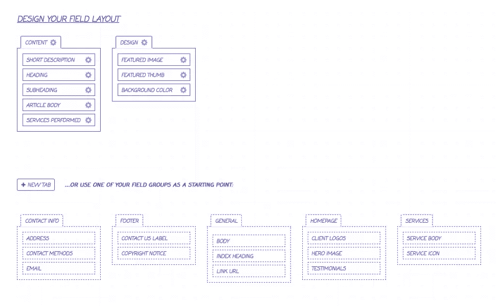
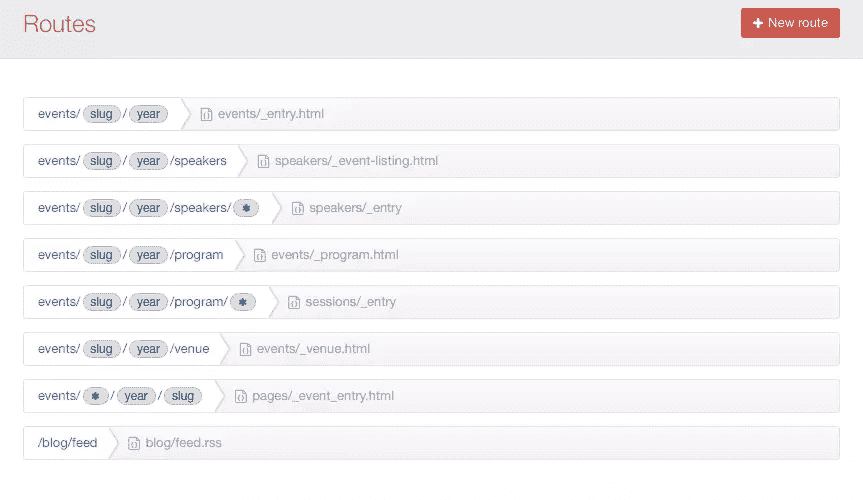
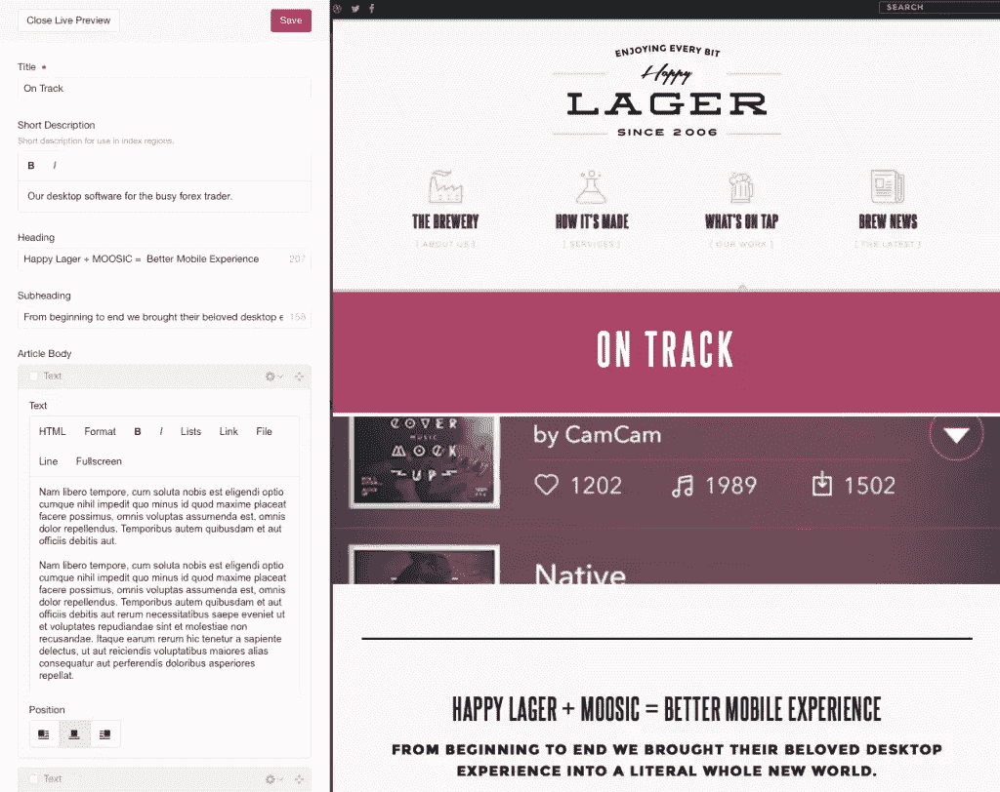

# Craft CMS 简介

> 原文：<https://www.sitepoint.com/introduction-to-craft-cms/>

*我们最近特别报道了两个流行的内容管理系统——[Perch](https://www.sitepoint.com/building-lightning-fast-extensible-websites-with-perch-cms/)和 [Statamic](https://www.sitepoint.com/building-database-free-websites-with-statamic-cms/) 。在本文中，Ryan Irelan 介绍了 Craft，这是近年来广受好评的另一款 CMS。*

* * *

 [Craft](http://craftcms.com/ "Craft CMS") 是一款数据库驱动的内容管理系统，可以轻松构建和管理内容密集型网站。它最初是由 Pixel & Tonic 在 2013 年发布的，Pixel&Tonic 是一家网络开发公司，它开始为 ExpressionEngine CMS 构建商业插件。

Craft 不是一个网站建设者——你仍然需要熟悉 HTML 和 CSS 来构建你的网站的前端层——但它旨在尽可能地提供更好的开发和创作体验。

可以在 Craft 网站的[特色版块看到 Craft 的特色。每个主要功能都有视频、描述和截图。它会让你对飞船的能力有一个很好的了解。](http://craftcms.com/features "Craft CMS features")

## 手工艺商业模式

Craft 是一个商业 CMS，但是有一个免费的选项(称为个人许可证),所以你可以毫无风险地试用该软件。通过在 Craft 内部购买<q>应用程序内</q>，升级到两个付费许可证中的一个非常简单。

您可以在本地运行 Craft 的付费版本(例如`craft.dev`或`mysite.dev`)而无需购买，因此您可以试验商业特性或在客户端网站上工作而无需处理许可，直到项目启动(此时您需要购买适当的许可证)。

许可如下:

*   个人:**免费**
*   客户: **$199 每个站点**
*   Pro: **$299 每个站点**

个人许可证将您限制为一个用户帐户，并且不包括其他一些功能。客户端许可证增加一个额外的<q>客户端</q>用户，Pro 是无限用户。所有许可证都包括无限的内容部分、字段等。[阅读定价页面，了解每种许可类型包含的所有详细信息](https://craftcms.com/pricing "Craft CMS Pricing")。

## 工艺如何工作

像许多内容管理系统一样，Craft 允许您定制您的条目表单，并将您的内容和数据组织到内容桶中。

Craft 方式类似于其他一些 CMS，但有一些便利之处(比如跨不同内容部分多次重用一个字段的能力)。

让我们来看看 Craft 的不同部分以及它们是如何工作的。

### 部分

在 Craft 中，您将内容存储在节中。每个部分可以是三种部分类型之一:

*   频道–用于收集相关内容，如博客、新闻文章、新闻稿或产品。
*   结构——也用于相似内容的集合，但需要某种层次结构。工艺文档是结构的一个很好的例子。
*   single–用于一次性页面。单曲的一个常见用途是用于主页

### 字段、字段布局和条目类型

Craft 中的每个部分都有一个或多个[条目类型](https://craftcms.com/docs/sections-and-entries#entry-types "Craft Entry Types")。这些条目类型允许您创建字段布局(字段的集合)并将其分配给部分条目类型。这意味着一个部分可以有多个内容变体。

字段布局由单个字段组成。Craft 提供了多种自定义字段类型，包括以下类型(但不止这些！):

*   纯文本
*   富文本(想想所见即所得)
*   桌子
*   资产(用于文件上传和关联)
*   条目(用于关联一个或多个条目)
*   矩阵(用于创建由多个字段组成的可定制内容结构—[在专题视频](https://craftcms.com/features/matrix)中查看更多关于矩阵的信息)



字段可以跨字段布局和部分使用。创建尽可能通用的字段是值得的，这样您就可以在多个部分中重用它们。

### 使用 Twig 的模板

像任何好的 CMS 一样，Craft 允许你使用你自己的 HTML/CSS/JS，并且照原样使用它，而不需要创建一个主题或者妥协一套漂亮的编码模板。

为了实现这一点，Craft 使用 [Twig 模板引擎](http://twig.sensiolabs.org "Twig Docs")来解析和显示你的网站模板。除了允许你使用自己的 HTML & CSS 之外，Twig 的优势还在于它速度快，有一个非开发人员也能理解的语法，同时对于开发人员使用高级功能来说也很灵活(也很优雅)。

使用 Twig 的另一个好处是，它由第三方( [Sensio Labs](http://twig.sensiolabs.org "Sensio Labs Twig") )维护，因此 Pixel & Tonic 不必花费宝贵的时间来改进和支持渲染引擎，而是使用他们的资源来改进核心产品。

要了解更多关于 Twig 的信息，请查看 Sensio Labs 的 [Twig 模板设计师指南](http://twig.sensiolabs.org/doc/templates.html "Twig for Template Designers")或参加我的 [Twig 和工艺视频课程](https://mijingo.com/craft "Craft Video Tutorials by Mijingo")。

#### 在工艺中使用树枝

在 Twig 中使用 Craft 有相当多的地方，但是这里有几个常见的例子可以让你了解模板代码是什么样子的。

您可能经常想要输出存储在一个节中的条目。要在 Craft 和 Twig 中实现这一点，您需要执行以下操作:

```

    <h1>{{ entry.title }}</h1>
    {{ entry.body }}

```

这个例子使用了一个`for`-循环来遍历`craft.entries.section("news").`返回的所有条目

Twig 最好的特性之一(在笔者看来)是支持布局，因此您可以灵活地重用模板代码。

通过继承一个基本模板(布局)，然后使用块覆盖它的一部分，可以做到这一点:

```

 
    {# override the same block in the _base.html layout #}
 
```

Twig 还允许您将数据存储到模板中的变量中。使用与前面相同的例子，让我们将`craft.entries.section("news")`的输出存储到一个名为`newsEntries`的变量中:

```

```

然后，我们可以迭代分配给变量的数组，并输出条目:

```

    ...

```

Twig 也有标准的东西，如条件，和方便的东西，如过滤器。[Twig](http://twig.sensiolabs.org/doc/filters/index.html "Filters in Twig")中的过滤器允许您操作分配给变量的数据:

```
{{ entry.title | upper }}
```

这将大写条目的标题。Craft 自带过滤器,允许你做一些事情，比如格式化货币，甚至根据共同属性(比如创建年份)将项目(比如条目)分组。

### 路线

我最近做了一个 Craft 实现，它需要一个 Craft 不支持的定制 URL 结构。嗯，和路线有关。

Routes 救了我，因为它们几乎无限灵活地重新路由 URIs 来呈现你想要的模板。



通过 Routes，你可以告诉 Craft 处理一个指定的 URI(精确的或者基于通配符和正则表达式来解释动态 URIs)并渲染一个指定的模板。

你可能不会在你的第一个或第二个项目中使用 Craft 的路线，但是当你需要它的时候，你会感激它的！

## 飞船控制面板

Pixel & Tonic 擅长简单而优雅的用户界面设计，他们的控制面板显示了这一点。

Craft 控制面板反应灵敏，这意味着你可以可靠地(不像许多 CMS 那样笨拙地)从任何设备编辑和创建 Craft 网站上的内容。

### 实时预览

Craft 为部分条目提供了实时预览功能。编辑条目时，您可以切换实时预览，查看内容发布后的样子。实时预览使用与网站前端相同的模板，并响应内容更改。



要观看现场预览，[请在 Craft 网站](https://craftcms.com/features/live-preview)上观看现场预览视频。

### 一键更新

Craft 提供了从控制面板内一键更新的功能。当有新版本时，您会收到通知，并且只需单击一下就可以就地安装。Craft 在更新之前首先备份你的文件和数据库，如果遇到更新失败，它甚至会自动回滚。

## 为什么要用 Craft？

每个人都有自己使用 Craft 的理由。

开发者喜欢 Twig 模板的灵活性和性能，以及 CMS 通过插件的可扩展性。

设计师喜欢他们的设计能够在不妥协和不尊重的情况下实现。

客户喜欢优雅简单的创作体验。

## 尝试工艺

如果你想使用 Craft，你可以[建立一个免费的沙盒网站](http://demo.craftcms.com "Spin Up a Craft Demo Site")自己去看一看。

## 社区和资源

我制作了一系列视频课程，帮助你快速有效地学习手工艺。你可以在我的训练网站 Mijingo 找到更多关于他们的信息。

此外，还有一些工艺资源可供您使用:

*   [直上工艺](http://straightupcraft.com "Straight Up Craft")
*   [工艺栈交换](http://craftcms.stackexchange.com/ "Craft CMS Stack Exchange")
*   [工艺食谱](http://craftcookbook.net/ "Craft Cookbook")
*   [工艺松弛](https://craftcms.com/community#slack "Craft Slack")
*   [`#craftcms`推特上的标签](http://search.twitter.com?q=craftcms "Craft CMS on Twitter")

如果你有任何关于手艺的问题，或者经验分享，请在下面留下评论！

## 分享这篇文章