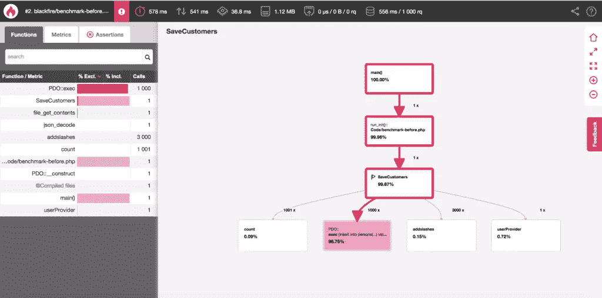
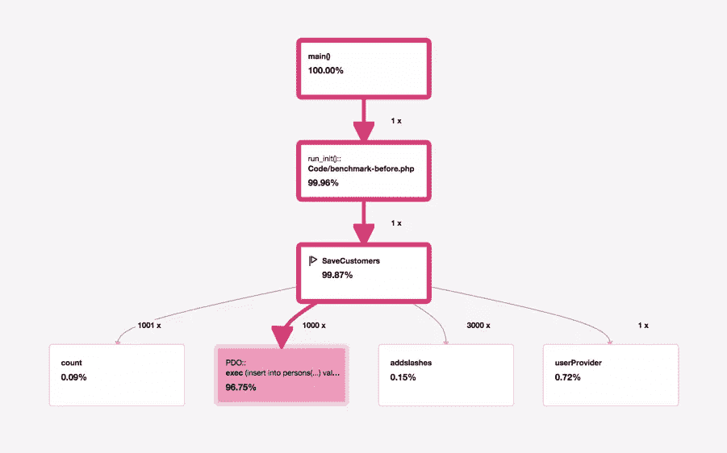
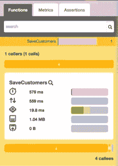
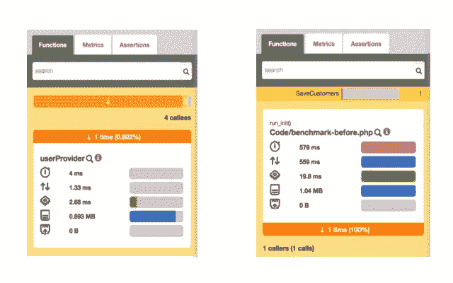
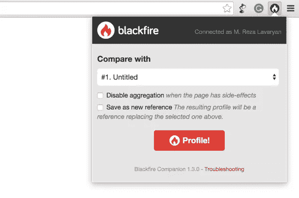
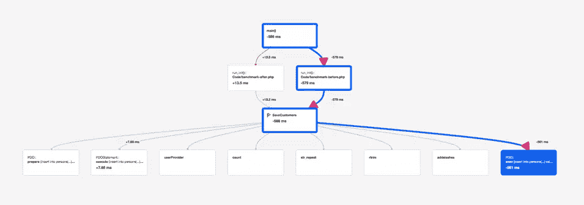
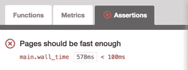

# 用 Blackfire 增强应用程序的深度演练

> 原文：<https://www.sitepoint.com/an-in-depth-walkthrough-of-supercharging-apps-with-blackfire/>

没有人讨厌健壮且可扩展的应用程序，尤其是当数据库快速增长，每天需要处理数百万个请求时。分析是程序分析的一种形式，用来测量程序消耗的时间和资源。通过概要分析，我们可以发现代码中的性能瓶颈，并采取相应的措施。有各种各样的分析工具，每一种都采用不同的方法。


剖析方法主要有两种:**取样**和**仪器**。

在采样方法中，分析器以一定的时间间隔对**调用堆栈**或**内存**进行采样，并更新其统计数据。这种方法对性能的影响较小，因为它根本不修改代码。然而，采样有其开销，可以通过增加采样频率来调整。

在插装方法中，分析指令由程序员或者由分析器自动插入到代码中(在字节码级别)。这种方法对应用程序有显著的性能影响，但提供了运行时代码中到底发生了什么的精确细节。

Blackfire.io 是新一代的 web profilers，它采用了自动检测方法，但不会对我们的应用程序造成性能影响。它是由 [Sensio 实验室](https://sensiolabs.com/)开发的， [Symfony 框架](https://www.sitepoint.com/blog/)背后的团队。

Blackfire 的特别之处在于，它帮助我们**连续**测试我们的应用程序的性能，而无需添加一行代码。

我们可以使用其花哨的 Google Chrome 扩展或命令行工具来分析任何 PHP 脚本。

Blackfire 易于安装，因为它受到许多云服务器提供商和虚拟机的支持，包括 Homestead。在本教程中，我们将学习如何使用 Blackfire 来构建更快的应用程序。像往常一样，我们将使用 [Homestead Improved](https://www.sitepoint.com/quick-tip-get-homestead-vagrant-vm-running/) 来建立我们的开发环境。

## 入门指南

一旦虚拟机启动，我们已经使用`vagrant ssh`成功地 ssh 到系统中，我们就可以开始使用 Blackfire 了！

但是等等，首先我们需要在这里创建一个 Blackfire 账户[。如果我们已经有了一个，我们可以把我们的 Blackfire 凭证放在`homestead.yaml`文件中，这个文件位于我们的流浪者盒子的根目录中。](https://blackfire.io/signup)

要获得我们的 Blackfire 凭证，我们登录到 [Blackfire](http://blackfire.io) ，点击页面右上角的个人资料照片，然后点击我的凭证。

凭证分为两类:`Client Credentials`和`Server Credentials`。


我们需要在我们的`Homestead.yaml`文件中取消对 Blackfire 设置的注释，并将凭证放入适当的位置:

**home tead . yml**

```
blackfire:
    - id: "Server Id here"
      token: "Server token here"
      client-id: "Client Id here"
      client-token: "Client token here" 
```

## 逆火的建筑材料

Blackfire 由五个主要组件组成:

*   **Probe**是一个 PHP 扩展，它检测应用程序并收集性能相关信息(目前在 **Linux** 和 **macOS** 上工作)
*   **代理**是一个服务器端的守护进程，它将配置文件信息聚集并转发给[黑火](http://blackfire.io)。
*   **配套的**是 Google Chrome 扩展，用于从浏览器运行 profiler 可以从[这个网址](https://blackfire.io/docs/integrations/chrome)安装。
*   **客户端**是 Companion 的命令行等价物，我们用它来分析 API、web 服务、网页等。
*   **基于网络的界面**以图表和表格的形式比较和可视化档案信息。

> 如果我们使用 Homestead 改进的流浪盒，那么探头、代理、客户端都是预先安装的。

## 开始前需要了解一些术语

*   **参考资料:**我们通常需要运行我们的第一个资料作为**参考资料**。这个概要文件将是我们应用程序的性能**基线**。我们可以将任何概况与参考进行比较，以衡量绩效成就。

*   **独占时间:**花费在要执行的函数/方法上的时间，不考虑其外部调用所花费的时间。

*   **包含时间:**执行一个函数所花费的总时间，包括所有的外部调用。

*   **热路径:**热路径是我们的应用程序中在分析期间最活跃的部分。这些可能是消耗更多内存或占用更多 CPU 时间的部分。

## 剖析脚本

在这一节中，让我们分析一个简单的 PHP 脚本，看看它有多快或多慢。为了获得真实的分析结果，我们将编写一个包含数据库交互和函数调用的小 PHP 脚本。该脚本向数据库表中插入 1，000 行随机用户数据。

### 生成虚拟数据

为了生成伪数据，我们使用 [Faker](https://github.com/fzaninotto/Faker) ，这是一个方便的库，可以生成几乎任何东西的随机数据。在虚拟机和项目文件夹中，我们通过执行以下命令来安装它:

```
composer require fzanintto/faker 
```

接下来，我们创建一个数据提供者脚本，它用虚拟数据填充 JSON 文件。我们将在主 PHP 脚本中使用这个 JSON 文件。

为什么我们不在主脚本中这样做呢？如果我们在主脚本中使用`Faker`,那么分析结果也将包括`Faker`库的所有操作。这将使我们的概要分析更加复杂，而我们需要一些更基本的东西来完成本教程。

我们将该文件命名为`UserProviderJSON.php`:

```
<?php

require_once('vendor/autoload.php');

$num = isset($_GET['num']) ? $_GET['num'] : 1000;
$data = [];

$faker = Faker\Factory::create();

if(!file_exists('data')) {
    mkdir('data');
}

for ($i = 0; $i < $num; $i++) {
    $data[] = ['name' => $faker->name, 'email' => $faker->email, 'city' => $faker->city,];
}

file_put_contents('data/users.json', json_encode($data));

echo 'JSON file generated.'; 
```

数据提供程序脚本包含一个函数，该函数生成一个虚拟数据数组，将该数组转换为 JSON 格式，并将其保存为一个文件。

然后，我们可以使用`php UserProviderJSON.php`运行数据提供者脚本。

因此，将在我们项目根目录的`data`目录中创建一个名为`users.json`的文件。这个文件应该包含 1000 个 JSON 格式的随机用户信息条目。

### 设置 MySQL 数据库

如果到目前为止一切顺利，我们可以创建 MySQL 数据库来存储数据。

然后，我们运行 MySQL 的命令行客户端:

```
mysql -h localhost -u homestead -psecret 
```

现在，我们创建一个名为`blackfire_tutorial`的数据库:

```
CREATE DATABASE blackfire_tutorial;
USE blackfire_tutorial; 
```

和表:

```
CREATE TABLE IF NOT EXISTS `sample_users` (
  `id` int(11) NOT NULL,
  `name` varchar(255) DEFAULT NULL,
  `email` varchar(255) DEFAULT NULL,
  `city` varchar(255) DEFAULT NULL
) ENGINE=InnoDB DEFAULT CHARSET=utf8; 
```

### 编写主脚本

我们把它命名为`benchmark-before.php`:

```
<?php

$db = new PDO('mysql:host=localhost;dbname=blackfire_tutorial;charset=utf8', 'homestead', 'secret');

function SaveCustomers ($db) {

    // Providing data
    $users = userProvider();

    for ($i = 0; $i < count($users); $i++) {

        foreach($users[$i] as $key => $value) {
            $$key = addslashes($value);
        }

        $db->exec("INSERT INTO sample_users (name, email, city) VALUES ('$name', '$email', '$city')");

    }
}

function userProvider () {

    return json_decode(file_get_contents('data/users.json'), true);

}

// Storing data
saveCustomers($db);
echo 'Users imported successfully.'; 
```

在前面的代码中，我们创建了一个名为`saveCustomers()`的函数，它接受一个 PDO 对象作为参数。`saveCustomers()`调用`userProvider()`将`data/users.json`的内容加载到数组中。

因此，它遍历数组的元素，并将它们逐个插入数据库。

为了运行这个脚本，我们通过`/benchmark-before.php`相对 URL 访问它。如果一切正常，MySQL 表将填充一千行随机用户信息。

要检查操作是否成功:

```
mysql -h localhost -u homestead -psecret
use blackfire_tutorial;
select count(id) as rows from sample_users; 
```

预期的输出应该如下所示:

```
+-------+
| rows  |
+-------+
| 1000  |
+-------+
1 row in set (0.01 sec) 
```

### 运行第一个配置文件

我们将在脚本的当前状态下对其进行概要分析，并将其设置为**参考概要文件**，然后我们将进行一些微优化，并再次运行概要文件。

要分析页面，在`benchmark-before.php`页面上，我们点击浏览器工具栏中的 Blackfire 图标。然后在`Compare With`选择框中，选择`Create New Reference`，点击`Profile`。


*注意:要使用配套的 Chrome 扩展，首先，我们需要确保我们登录了 [Blackfire.io](http://blackfire.io) 。*

如果一切设置正确，我们应该在页面顶部看到 Blackfire 工具栏。

要查看档案详情，我们点击 Blackfire 工具栏右侧的`View profile`。

### 分析简档信息

点击`View profile`后，我们将被重定向到网络界面，在这里我们可以找到关于此档案运行的所有详细信息:



web 界面由几个部分组成:

#### 工具栏

工具栏包含概要信息的摘要，包括墙时间、I/O 时间、内存使用、CPU 时间等。对于我们的第一个配置文件，工具栏包含以下信息:


```
| Wall Time | I/O    | CPU Time | SQL Queries      |
|-----------|--------|----------|------------------|
| 578 ms    | 541 ms | 36.8 ms  | 556 s / 1000 rq  | 
```

#### 调用图

这一部分以图形的形式可视化我们代码的执行流程。图中的每个节点代表应用程序中的一个函数/方法，以及它执行的时间。



图中所有的**节点**都用颜色编码。规则很简单:**红色越深，这个节点在每次请求时就越活跃。**

彩色边框显示应用程序的**热路径**(我们的应用程序在分析期间最活跃的部分)，而彩色背景显示最**强烈的**节点。在许多情况下，热路径并不意味着性能瓶颈，因为一些例程通常会在我们的应用程序中承担繁重的工作。然而，当试图定位瓶颈时，这是一个很好的起点。

通过快速浏览图表，我们可以发现最活跃的节点。在我们的例子中，`saveCustomers()`使用了**总时间的 99.27%** (包括外部调用)。

**PDO::exec** (由`saveCustomers()`调用)是图中最密集的节点，因为从`saveCustomers()`开始我们已经调用这个方法一千次了。根据图表显示，**花费了总时间的 92.56%** ！

#### 功能列表



通过单击每个节点，我们可以看到关于它的所有细节(在左侧面板上)，包括调用次数和花费的时间。

例如，我们单击`saveCustomers()`节点。根据上面的截图，我们可以看到这个函数已经被调用过一次**(1 个调用者)，它有四个**被调用者**(外部函数/方法调用)。**

 **还有几个水平条形图，显示该节点在每个**维度**中的包含/排除时间(墙时间、I/O 时间、内存、CPU 时间等)。).深色表示独占时间，浅色表示包含时间。如果我们将鼠标移到条形上，我们可以看到每个维度的时间/百分比。

我们还可以通过点击 **1 呼叫者(1 次呼叫)**标签下方的按钮来查看该功能的**呼叫者(一个或多个)**。

如果我们向下滚动一点，我们还可以看到**被呼叫者**。在 **4 被叫**标签的上方，有几个**不同**宽度的按钮相邻。通过点击这些按钮，我们将看到来自`saveCustomer()`的每个外部调用的性能信息。例如，`userProvider()`是`saveCustomers()`的被调用者之一。



#### 逆火度量

Blackfire 提供了一些现成的指标，允许我们从其他角度评估应用程序的性能，如 SQL 查询、PDO 连接、HTTP 响应大小、编译和执行的文件数量等等。


这些指标可以用于持续的性能测试。我们很快就会谈到这一点。

### 优化现有代码

好了，现在让我们对现有脚本做一些微优化，以提高一点性能。在现有的代码中，我们对每个条目发出一个数据库请求，这意味着在每个请求中有 1000 次数据库交互。如果我们能把这个数字减少到只有**一个**请求呢？考虑以下语句:

```
INSERT INTO persons (name, email, city) VALUES (?, ?, ?),(?, ?, ?),(?, ?, ?),(?, ?, ?)...(?, ?, ?) 
```

在上面的语句中，所有的值都被连接成一组括号(用逗号分隔)。这条语句显然会使用更多的内存，但会比现有的语句快得多。让我们来看看它的实际应用:

```
<?php

$db = new PDO('mysql:host=localhost;dbname=blackfire_tutorial;charset=utf8', 'homestead', 'secret');

function SaveCustomers($db) {

    // Providing data
    $users = userProvider();

    $params = [];
    $num = count($users);
    $placeholders = rtrim(str_repeat('(?, ?, ?), ', $num), ', ');

    for ($i = 0; $i < $num; $i++) {

        $params[] = $users[$i]['name'];
        $params[] = $users[$i]['email'];
        $params[] = $users[$i]['city'];

    }

    $q = $db->prepare('INSERT INTO sample_users (name, email, city) VALUES ' . $placeholders);
    $q->execute($params);

    unset($params);
    unset($placeholders);
}

function userProvider () {

    return json_decode(file_get_contents('data/users.json'), true);

}

//Saving data
saveCustomers($db);
echo 'Users imported successfully.'; 
```

我们称这个文件为`benchmark-after.php`，并在浏览器中运行它。现在，我们再次运行侧写程序。这次在**与**比较选择框中，我们选择我们的参考轮廓。



分析完成后，我们点击`View Comparisons`进入网络界面。


正如我们所看到的，web 界面现在有点不同，因为我们正在比较两个不同的概要文件。通过快速浏览工具栏，我们可以看到，墙时间已经显著优化了 **98%** (从 **578 ms** 到 **14 ms** )并且数据库请求的数量减少到只有一个！内存使用量虽然增加了**97%**(2.42 MB)。

如果与参考配置文件相比，性能有所提高，工具栏上的相应值应显示为绿色。红色表示性能已经降低(在我们的例子中是内存使用):

```
| Wall Time | I/O    | CPU Time | Memory | SQL Queries      |
|-----------|--------|----------|--------|------------------|
|   -98%    |  -98%  |   -89%   |  +117% |  -99% / -999 rq  | 
```

第二次配置运行中的工具栏信息显示百分比差异(当前配置和参考之间)。要查看当前轮廓的信息，切换工具栏右侧的`Delta`开关:


通过查看图表，我们还可以看到性能有所提高。该图中的节点是蓝色的。每个节点中的负值表示我们节省的时间量。



在我们的例子中 **PDO::执行**受到的影响最大(时间减少了 555 毫秒)。通过单击该节点，我们可以在左侧窗格中看到它的详细信息。该数据图表和参考数据图表的性能信息并排显示**。**

 **通过单击 metric 选项卡，我们可以从其他角度看到改进。例如，在我们最后一次运行概要文件时，`PDO Queries`已经减少到只有一个。


嗯，这不是性能调优的一课，但足以触及 Blackfire 的表面。

## 使用命令行界面

Blackfire 还提供了一个叫做`blackfire`的漂亮的命令行工具，允许我们直接从终端分析任何 PHP 脚本，包括网页、web 服务、API 调用或命令行脚本。

### 分析 HTTP 请求

为了从命令行分析一个 web 页面，我们使用`curl`子命令，后跟页面 URL:

```
blackfire curl http://192.168.10.10/benchmark-before.php 
```

因此，Blackfire 会将一些与性能相关的信息连同 URL 一起输出到 web 界面:

```
Profile URL: https://blackfire.io/profiles/b8fceed1-06be-4a0f-b28f-7841457e0837/graph
  Total time:   628 ms
    CPU time:    74 ms
         I/O:   554 ms
      Memory:  1.23 MB
     Network:      n/a
         SQL:   570 ms  1000 rq 
```

为了得到更精确的结果，我们可以通过传递`--sample`选项来获取同一请求的几个**样本**，后跟我们想要的样本数量。Blackfire 默认取 10 个样本，所以如果在第一次运行概要文件后数据库表包含 11，000 行，不要感到惊讶。

```
blackfire --sample 15 curl http://192.168.10.10/benchmark-before.php 
```

我们还可以像使用 Companion 一样创建新的参考资料:

```
blackfire --new-reference curl http://192.168.10.10/benchmark-before.php 
```

或者将其与先前创建的参考简档进行比较。为此，我们传递`--reference`,后跟引用概要文件 id:

```
blackfire --reference=7  curl http://192.168.10.10/benchmark-after.php 
```

*参考配置文件 id 在 web 界面中可用，或在使用`--new-reference`选项时作为配置文件输出的一部分。*

### 分析 CLI 脚本

通过使用`blackfire`实用程序，我们也可以分析任何命令行脚本。这可以通过`run`子命令实现:

```
blackfire run php benchmark-before.php 
```

与`curl`子命令一起使用的所有选项也可以与`run`一起使用。

## 性能测试

Blackfire 的另一大特点是持续的性能测试。如前所述，Blackfire 提供了各种现成的指标，我们可以用它们来编写性能测试。该功能仅提供给高级用户，但也提供为期两周的试用。断言可以基于时间维度或其他维度，如数据库请求的数量、内存使用或响应大小。

所有的测试都应该在我们项目根目录下的`.blackfire.yml`中。

Blackfire 测试类似于以下代码:

```
tests:
    "Pages should be fast enough":
        path: "/benchmark-before.php" # run the assertions for all HTTP requests
        assertions:
            - "main.wall_time < 100ms" # wall clock time is less than 100ms 
```

正如我们所看到的，所有的测试都应该在`tests`主键值下。

测试由以下部分组成:

*   一个名字(在上面的例子中:**页面应该足够快**)
*   一个正则表达式(路径)，所有 HTTP 请求必须**匹配**，测试才能执行。
*   一组由**度量**和**断言值**组成的**断言**。

每次针对包含`.blackfire.yml`文件的项目运行概要分析器时，Blackfire 都会自动运行所有测试，并将结果反映在 web 界面中(左侧面板中的**断言**选项卡)。



在上面的例子中，测试是针对`benchmark-before.php`运行的。`main.wall_time`是执行脚本所需总时间的 Blackfire 指标。在上面的断言中，我们检查它是否小于`100ms`:

这是另一个例子，有更多来自 Blackfire 文档的断言:

```
tests:
    "Homepage should not hit the DB":
        path: "/"     # only apply the assertions for the homepage
        assertions:
            - "metrics.sql.queries.count == 0"      # no SQL statements executed
            - "main.peak_memory < 10mb"             # memory does not exceed 10mb
            - "metrics.output.network_out < 100kb"  # the response size is less than 100kb 
```

上面的测试是针对主页运行的(`/`)。在断言中，我们确保主页上没有数据库请求，内存使用不超过`10 MB`，响应大小小于`100 KB`。

要了解更多关于断言的信息，请参考[断言参考](https://blackfire.io/docs/reference-guide/assertions)。

我们还可以在我们的断言中有**自定义指标**，这在[文档](https://blackfire.io/docs/reference-guide/metrics#metrics-custom-metrics)中有完整的介绍。

注意:为了验证测试，我们可以使用 Blackfire 的[验证器](https://blackfire.io/docs/validator)。

## 包扎

Blackfire.io 是一个强大的 web 分析器，它无需添加一行代码就能检测应用程序。它由五个主要组件组成:探针、代理、伴侣、CLI 工具和 web 界面。探测器和代理负责检测代码并将分析结果转发给 Blackfire 服务器。

我们可以通过使用 Companion 或`blackfire`命令行实用程序来分析应用程序。

Blackfire 提供了一个 web 界面，可以可视化分析结果的详细信息。我们可以设置一个概要文件作为参考，然后使用它作为性能基线来与未来的概要文件进行比较。

## 分享这篇文章****