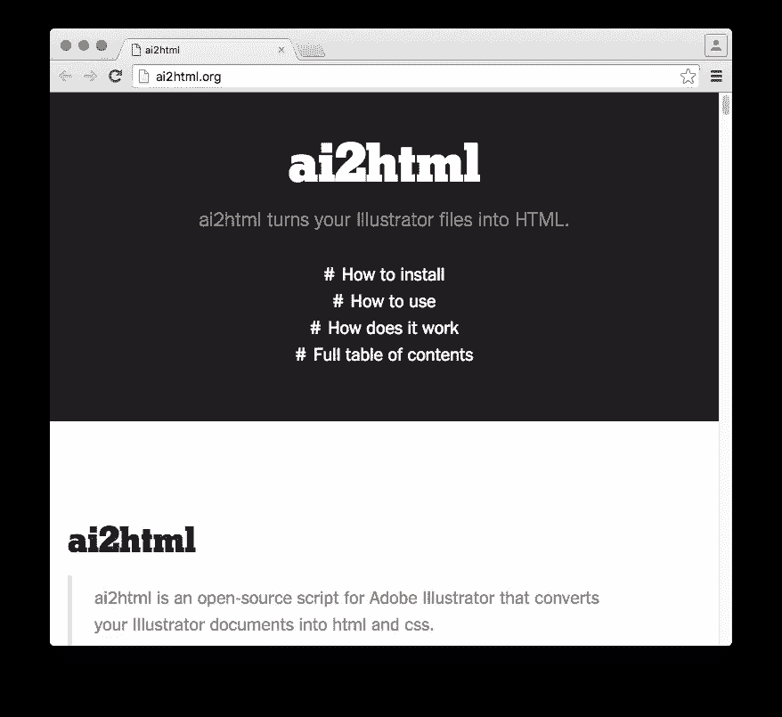
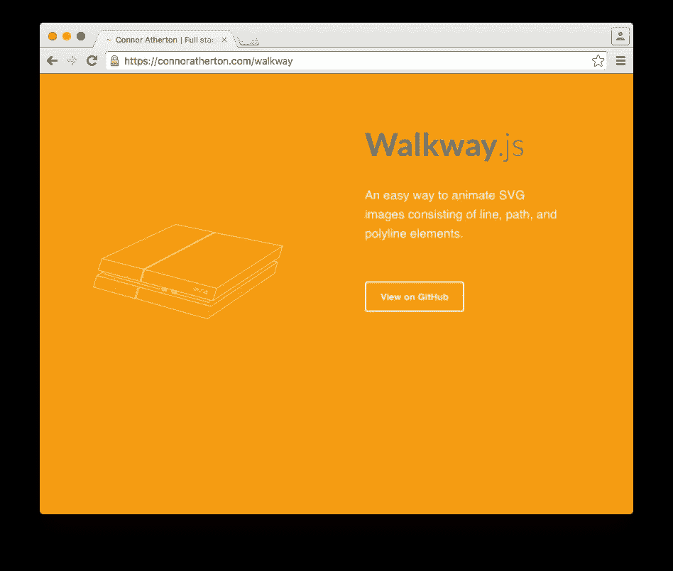

# 前端工具:2015 年我最喜欢的一些发现

> 原文：<https://www.sitepoint.com/front-end-tools-favorite-finds-2015/>

2015 年就要结束了，我相信你们都同意这又是一年，充斥着新的网页设计和开发工具。在做我的时事通讯时，我遇到了很多有趣的事情，所以我想在年终文章中总结一些我最喜欢的发现会很酷。

在我开始之前，我应该提一下:

*   我不能保证这些工具的质量或安全性。
*   我在 2015 年发现它们，并不意味着它们是在 2015 年建造的(其中一些比那要古老得多)。
*   它们没有任何特定的顺序。
*   并非所有这些都是必要的“前端”工具，但我在这个背景下讨论它们。

所以让我们开始吧！

## [ai2html](http://ai2html.org/)

让我们先来看一个当它第一次出现时肯定让许多人震惊的例子。这来自于《纽约时报》编辑室的开发者，它被描述为:

> Adobe Illustrator 的开源脚本，可将您的 Illustrator 文档转换为 html 和 css。



它是用 JavaScript 编写的，通过拖放。js 文件放到 Illustrator 安装的“脚本”文件夹中。完成后，您需要遵循以下步骤:

1.  创建您的插画作品。
    *   将画板调整到您希望 div 在网页上显示的尺寸。
    *   确保您的`Document Color Mode`设置为`RGB`。
2.  通过选择:文件>脚本> ai2html 来运行脚本。
3.  转到包含您的 Illustrator 文件的文件夹，并找到位于`ai2html-output`文件夹中的 HTML 文件。

您可以自定义图像格式的导出、PNG 和 JPEG 质量、页面响应性、HTML 文件的数量以及[等等](http://ai2html.org/#settings)。《纽约时报》甚至收集了他们团队的[和](https://delicious.com/archietse/ai2html,nyt)[其他团队](https://delicious.com/archietse/ai2html,others)如何使用它的例子。

## [sloc](https://github.com/flosse/sloc)

这真是太棒了。这是一个命令行工具，可以帮助您在源代码上建立统计数据。默认情况下，输出只是一个简单的结果列表，但是您可以将其转换为 CSV、JSON 或 CLI-table 格式。通过 npm 安装后，您将运行如下命令:

```
sloc index.html
```

我在我的一个项目上运行了上面的命令，这个项目有一个非常大的 HTML 文件，结果如下:

```
---------- Result ------------

            Physical :  9788
              Source :  6340
             Comment :  645
 Single-line comment :  0
       Block comment :  645
               Mixed :  642
               Empty :  3445

Number of files read :  1

------------------------------
```

请注意注释类型的细分

以及以下命令，该命令以 JSON 格式输出:

```
sloc --format json index.html
```

我们得到以下结果:

```
{
  "files": [
    {
      "path": "index.html",
      "stats": {
        "total": 9788,
        "source": 6340,
        "comment": 645,
        "single": 0,
        "block": 645,
        "mixed": 642,
        "empty": 3445
      },
      "badFile": false
    }
  ],
  "summary": {
    "total": 9788,
    "source": 6340,
    "comment": 645,
    "single": 0,
    "block": 645,
    "mixed": 642,
    "empty": 3445
  }
}
```

你也可以在一个节点模块中使用它，通过浏览器中的 JavaScript，或者作为一个普通插件。

## [走道](https://github.com/ConnorAtherton/walkway)

随着最近 SVG 工具和资源的爆炸式增长，在本文中加入一些 SVG 内容是再合适不过的了。这是一种“制作 SVG 元素动画的简单方法”。我可以保证它的易用性。



这个项目的主页上有一个你可以用这个库做什么的例子。

它支持`path`、`line`和`polyline`元素的动画，并允许您定义持续时间值和缓动函数。我用[一些公共领域的 SVG 艺术](http://publicdomainvectors.org/en/free-clipart/Apple-vector-art/1640.html)在几分钟内完成了下面的演示。

参见 [CodePen](http://codepen.io) 上 SitePoint ( [@SitePoint](http://codepen.io/SitePoint) )的 Pen[walky . js 示例 SVG 动画](http://codepen.io/SitePoint/pen/YwGPqy/)。