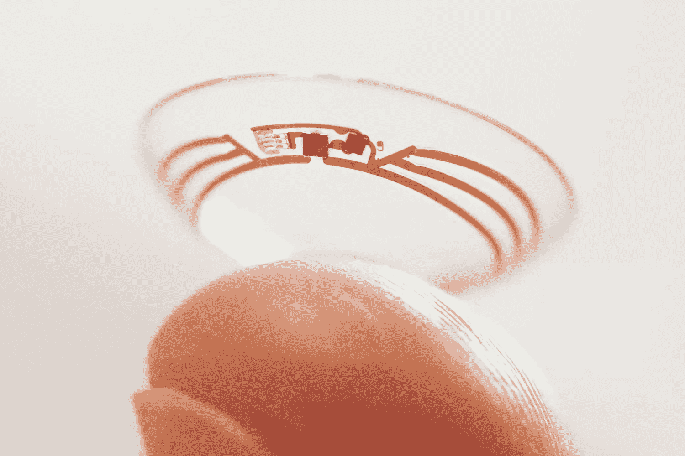
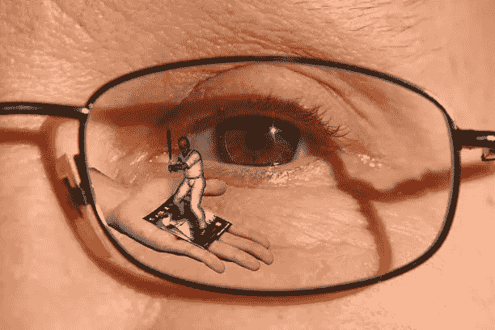
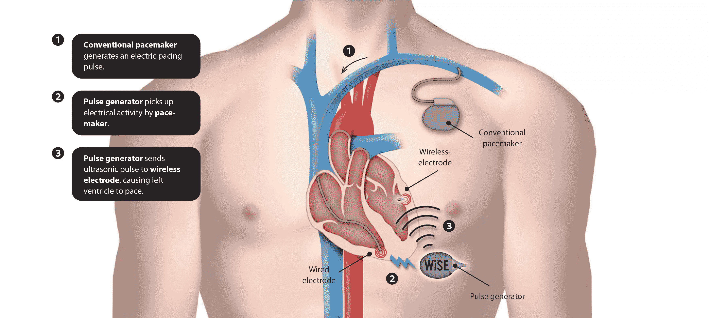
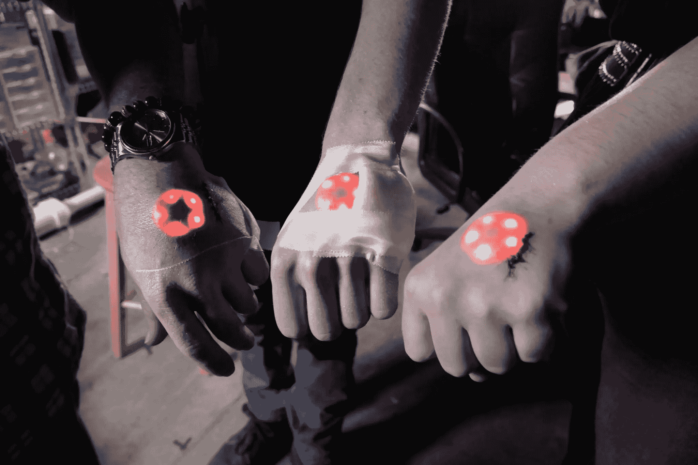
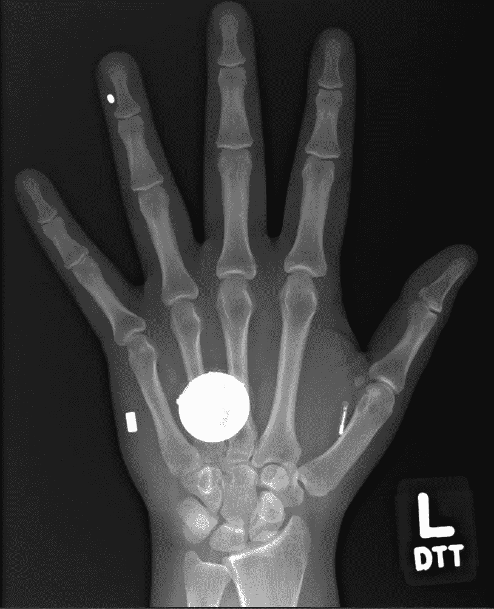

# 可穿戴设备在人体内移动的 6 种方式

> 原文：<https://www.sitepoint.com/6-ways-wearables-are-moving-inside-the-body/>

有趣的是，一些人对植入可穿戴设备的想法感到畏缩。[耳蜗植入](https://en.wikipedia.org/wiki/Cochlear_implant)从 20 世纪 80 年代就已经出现，[避孕植入](https://en.wikipedia.org/wiki/Etonogestrel_contraceptive_implant)从 20 世纪 90 年代末开始，从髋关节置换到起搏器，大量的植入设备长期以来一直在维持人们的生命并提高生活质量。随着可穿戴设备变得越来越小，设想在体外监测皮下(皮肤下)设备和产品的时代是一种小小的想象。在这篇文章中，我打算看看未来会是什么样子。

## 1.可佩戴隐形眼镜

2014 年，Google X 对糖尿病管理进行了测试，开发了一种智能隐形眼镜[用于测量眼泪中的葡萄糖水平，使用无线芯片和嵌入在两层软性隐形眼镜材料之间的小型化葡萄糖传感器。其目的是用发光二极管每秒产生一次读数，发光二极管可以显示葡萄糖水平超过或低于特定阈值。已经进行了多项临床研究，合作伙伴诺华公司希望在五年内将该产品在 T2 上市。](https://googleblog.blogspot.de/2014/01/introducing-our-smart-contact-lens.html)

初创公司 Innovega 多年来一直致力于开发一种增强现实隐形眼镜原型，它可以将智能手机或电脑上的透明数据直接放入用户的视野。当与该公司改良的眼镜配合使用时，这种镜片允许用户在其周边视觉中聚焦于高科技显示器。这些联系人有资金支持，该公司正在等待美国食品和药物管理局的批准，将他们的产品推向市场。在这段 YouTube 视频中，你可以了解更多关于他们联系方式背后的科学知识。

[https://www.youtube.com/embed/H5qMCl4SgVw](https://www.youtube.com/embed/H5qMCl4SgVw)

他们最大的挑战可能是说服那些不喜欢把手指放进眼睛里的人试一试。

## 2.心脏设备

10 月，全球首款无线起搏器(WiSE)在欧盟和美国获得认可。[心内膜无线刺激](http://ebrsystemsinc.com/wp-content/uploads/2015/10/Press-Release-CE-Mark-Approval-FINAL.pdf) (WiSE)由植入左心室的电极组成。随着每一次心跳，它都会从放置在两根肋骨之间的小型发射器接收到同步的超声波信号。声波被转换成电能，提供心脏起搏。该技术消除了对左心室导线的需求，旨在让医生将刺激点放置在左心室内最佳的患者特定位置。

随着法国公司 CARMAT 在第三次尝试中成功移植了第一颗生物相容、自动调节的全人工心脏，人工心脏的可及性变得更近了。值得注意的是，Carmat 的第一位移植患者是一名 76 岁的男子，他在手术后两个半月于去年 3 月去世，第二位患者是在人工心脏因电机控制故障而出现故障后去世的，这使得全人工心脏的概念仍然是一种冒险的做法。

## 3.用于治疗神经疾病的大脑植入物

对基于大脑的疾病的研究导致了像[迷走神经模拟](http://www.epilepsy.com/learn/treating-seizures-and-epilepsy/devices/vagus-nerve-stimulation-vns)这样的治疗方法来治疗严重的癫痫。精神病神经技术[研究人员](http://www.maprc.org.au/psychiatric-neurotechnology-investigative-studies)专注于[经颅直流电刺激](https://en.wikipedia.org/wiki/Transcranial_direct-current_stimulation)和[经颅磁刺激](https://en.wikipedia.org/wiki/Transcranial_magnetic_stimulation)治疗慢性疼痛、抗药性抑郁症、纤维肌痛、强迫症、帕金森和精神分裂症等疾病。

更进一步，大脑的深度电刺激(也称为[深度脑刺激](https://en.wikipedia.org/wiki/Deep_brain_stimulation))可以治疗严重的[强迫症](http://america.aljazeera.com/watch/shows/america-tonight/articles/2015/3/13/ocd-patient-brain-implant-gave-me-a-chance-at-happiness.html)、[抑郁症和一系列其他疾病](http://www.technologyreview.com/featuredstory/542176/a-shocking-way-to-fix-the-brain/)，使卫生专业人员能够针对大脑中导致特定疾病的特定部位。电极被植入大脑，一个装有电池和脉冲发生器的装置被植入胸部或腹部，用电线将电极连接到颅骨。当打开时，该设备发出电流，刺激神经纤维将信息从与动机相关的原始大脑区域传输到额叶。

可以预见的是，当大脑的其他部分得到更好的理解，植入物处于治疗一系列大脑疾病的前沿时。一些人推测，改善记忆和智力的植入可能比我们想象的更近，并为寻求新挑战的开发者提供了机会。

## 4.取代安全装置的植入物

你丢过钥匙吗？厌倦了在工作中必须记住照片复印机的代码？2014 年，瑞典科技公司 Sime 的员工有机会测试植入他们手中的米粒大小的 RFID 芯片，该芯片对信息进行编码，使他们能够开门，并通过刷卡使用办公室打印机。

这种便利是引人注目的。这种大小的设备在出现故障或感染的情况下很容易移除，但我很好奇它需要多久升级一次。你会走多远？无现金交易？放弃签名的需要？植入物在未来的黑市上被窃取和交易有多容易？

## 5.DIY 黑客

搜索互联网，你会发现一大群人在从事生物黑客活动，这是一种自我健康监测的形式，旨在将专业知识从健康专业人士手中转移到个人手中，可穿戴设备是其中的一大部分。一方面是测量睡眠和心率的简单工具。另一端是一系列自测身体工具和调节器，如植入的生物磁体，可用于拾取小物品。磁铁听起来很荒谬，直到你考虑到手控不好的人的好处。

爱好者称自己为研磨者，聚集在[会议](http://biohackersummit.com/)和[论坛](http://forum.biohack.me/discussion/278/so-you-want-to-put-a-magnet-in-your-finger/p1)分享信息和资源。有太多的教程和视频(有些不建议在午餐时间观看)，也不乏愿意扩展身体能力的人。

瑞安·奥谢的图片

*grind house Wetware 的图片*

匹兹堡创业公司 Grindhouse wetware 的成员创造了北极星 V1，一种简单的装置，

> …将技术植入人体的可能性，并将为更先进的功能增强铺平道路。

他们的目标是推出北极星版本 2，a

> 可充电设备，增加了手势识别和蓝牙功能，使用户能够通过手部动作控制电子设备，并为 LED 添加图案或颜色变化。

人们很容易陷入生物黑客的新奇元素中，但这些实验程序成为公认的医疗实践可能只是时间问题。

## 6.智能数字纹身

如果植入的概念，无论多小，看起来都太不舒服，还有 Underskin 项目，这是一个由 [Fast Company](http://www.fastcodesign.com/) 和[New Deal Design](http://newdealdesign.com/)(Fitbit 的设计者)合作的项目，旨在创建一个植入你手上的智能数字纹身，它可以与你接触的任何东西进行交互。

> 它可以打开你的前门，通过握手来交换数据，甚至可以告诉你是否有低血糖。

新政设计公司认为 Underskin 项目可能在五年内准备就绪，并已经在计划第二次纹身，这将监测生命统计数据，并放置在佩戴者的手掌上。

## 结论

在思考可穿戴设备的未来时，我最感兴趣的是超越将身体视为“人体手袋”的机会，以及专注于改善个人生活的机会，无论是通过预防、预测或治疗疾病，还是通过其他方式让生活变得更好。由于无数的道德和法律问题，R&D 可能会进展缓慢，但进步正在到来。

*我很想听听你的想法*

## 分享这篇文章