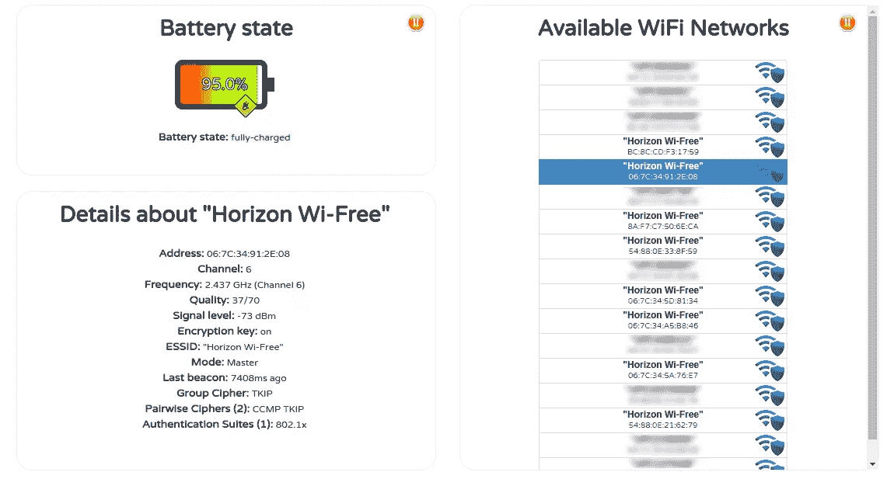

# 如何使用 Node.js 和 Ractive.js 构建 WI-FI 仪表盘

> 原文：<https://www.sitepoint.com/how-to-build-a-wi-fi-dashboard/>

这篇文章由马克·托勒同行评审。感谢 SitePoint 的所有同行评审员使 SitePoint 的内容尽可能做到最好！

在过去的几个月里，我发表了一个关于仪表盘的迷你系列。在标题为[“使用 Node.js 创建电池 viz:入门和服务器”](https://www.sitepoint.com/creating-a-battery-viz-using-js-getting-started-and-server/)的第一篇文章中，我展示了如何创建 Node.js 服务器来检查笔记本电脑的电池状态并返回一些有用的信息。在第二篇文章中，标题是[“使用 Node.js: Client 创建一个 Battery viz”](https://www.sitepoint.com/creating-a-battery-viz-using-node-js-client/)，我解释了如何构建一个 Web 应用程序来以一种更好的、用户友好的方式可视化这些信息。

在本文中，我们将在这个仪表盘上添加关于可用 WI-FI 网络的信息。将显示可用网络的列表，其中包含最相关的详细信息(名称、地址、受保护与开放等)的摘要，选择后，网络的更多详细信息将出现在另一个面板中。

看看我们的目标:



如果你愿意，你可以把它当作一个起点。我强烈建议你定制它，因为这是用我们将要使用的技术提高你的技能的最好方法。

## 计算机网络服务器

在服务器端，我们将重用和扩展我们为电池创建的东西，即。在本教程中，我们将专注于 Ubuntu，但服务器代码是以这样一种方式构建的，你只需要编写几个适配器来支持 Mac 或 Windows 的机器。

### Bash 命令

首先，我们通过为新端点添加命令和回调来扩展原始配置方法。有必要进行一些重命名，以防止与电池小部件的命令发生冲突。

```
function switchConfigForCurrentOS () {
      switch(process.platform) {
        case 'linux':
          return {
            batteryCommand: 'upower -i /org/freedesktop/UPower/devices/battery_BAT0 | grep -E "state|time to empty|to full|percentage"',
            batteryProcessFunction: processBatteryStdoutForLinux,
            wifiCommand: 'iwlist wlan0 scanning | egrep "Cell |Address|Channel|Frequency|Encryption|Quality|Signal level|Last beacon|Mode|Group Cipher|Pairwise Ciphers|Authentication Suites|ESSID"',
            wifiProcessFunction: processWifiStdoutForLinux
          };
        case 'darwin': //MAc OsX
        ...
      }
    }
```

### 处理命令输出

我们处理命令输出的方式与我们已经为电池所做的非常相似。我们逐行检查输出，并对其进行处理，以从我们的读数中提取有意义的参数。但是在这种情况下，我们得到的是一系列项目的读数，而不是一个项目！因此，我们需要确定一个新项目何时在输出中实际开始，并为每个项目创建一个新对象。然后，我们将过滤有效的行，将我们读取的属性添加到当前项目中。

```
function processWifiStdoutForLinux(stdout) {
      var networks = {};
      var net_cell = "";
      var cell = {};

      stdout.split('\n').map(trimParam).forEach(function (line) {
        if (line.length > 0) {
          //check if the line starts a new cell
          if (stringStartsWith(line, NET_CELL_PREFIX)) {
            if (net_cell.length > 0) {
              networks[net_cell] = mapWifiKeysForLinux(cell);
            }
            cell = {};
            line = line.split("-");
            net_cell = line[0].trim();
            line = line[1];
          }
          //Either way, now we are sure we have a non empty line with (at least one) key-value pair
          //       and that cell has been properly initialized
          processWifiLineForLinux(cell, line);
        }

      });
      if (net_cell.length > 0) {
        networks[net_cell] = mapWifiKeysForLinux(cell);
      }
      return networks;
    }
```

在详细了解`processWifiLineForLinux`内部发生的事情之前，让我强调几点:

*   因为我们只有在下一个单元的描述开始时才添加一个单元到我们的散列中，否则我们会错过最后的`if`语句(以捕获输出中的最后一个网络)。
*   上面的代码假设两个单元格不能共享同一个名称。这是一个合理的假设，因为网络不是根据它们的名称进行索引的(该信息由`ESSID`字段捕获)。它们被列出并被分配一个渐进的标识符 ***【单元 0X】***。
*   在存储属性之前，我们做的最后一件事是调用`mapWifiKeysForLinux`,在这种情况下，它们只是返回未更改的键。

甚至处理每一行的函数也与我们为电池创建的函数非常相似:因为每一行都包含一个字段名及其值，所以我们首先检查需要以特殊方式处理的边缘情况，对于剩余的行，我们只需将它们分开并适当地存储键值对。

```
function processWifiLineForLinux(cell, line) {
      var key;
      var val;

      line = line.trim();
      if (line.length > 0) {

        switch (true) {
        case stringStartsWith(line, NET_ADDRESS_PREFIX):
          line = line.split(':');
          line.splice(0, 1);
          //INVARIANT: Address in the format Address: DC:0B:1A:47:BA:07
          if (line.length > 0) {
            cell[NET_ADDRESS_PREFIX] = line.join(":");
          }
          break;
        case stringStartsWith(line, NET_QUALITY_PREFIX):
          //INVARIANT: this line must have a similar format: Quality=41/70  Signal level=-69 dBm
          line = line.split(NET_SIGNAL_PREFIX);
          cell[NET_QUALITY_PREFIX] = line[0].split("=")[1].trim();
          if (line.length > 1) {
            cell[NET_SIGNAL_PREFIX] = line[1].split("=")[1].trim();
          }
          break;
        case stringStartsWith(line, NET_EXTRA_PREFIX):
          //INVARIANT: this line must have a similar format: Extra: Last beacon: 1020ms ago
          line = line.split(":");
          //we can ignore the prefix of the string
          if (line.length > 2) {
            cell[line[1].trim()] = line[2].trim();
          }
          break;
        default:
          //INVARIANT: the field must be formatted as "key : value"
          line = line.split(":");
          if (line.length > 1) {
            //Just stores the key-value association, so that coupling with client is reduced to the min:
            //values will be examined only on the client side
            cell[line[0].trim()] = line[1].trim();
          }
        }
      }
      return cell;
    }
```

这次讨论是向您展示我最近从一位同事那里“借用”的一个巧妙技巧的绝佳机会。它将允许我们使用 switch 语句来代替一连串的`if`–`else`。

### 端点

由于 Node 的`HHTP`模块和我们在之前的教程中创建的 helper 方法，向我们的服务器添加新的端点很简单。我们只需要为我们想要响应的路径定义正则表达式，并向服务器回调添加一个`if`语句，在收到请求时触发:

```
var server = http.createServer(function (request, response) {
      var requestUrl = request.url;
      var filePath = BASE_URL + requestUrl;

      if (requestUrl === '/' || requestUrl === '') {
        response.writeHead(301,
          {
            Location: BASE_URL + 'public/demo.html'
          });
        response.end();
      } else if (RE_BATTERY.test(requestUrl)) {
        getBatteryStatus(response, onBatteryInfo, onError);
      } else if (RE_NETWORKS.test(requestUrl)) {
        getWifiStatus(response, onWifiInfo, onError);
      }  

      ...

    }
```

在这一点上，我们所要做的只是创建一个回调函数来运行命令，转换它的输出，并最终将`JSON`结果发送给客户端，该结果被包装在由`http.createServer`提供的`HTTP`响应中。

```
function getWifiStatus(response, onSuccess, onError) {

      child_process.exec(CONFIG.wifiCommand, function execWifiCommand(err, stdout, stderr) {
        var wifi;

        if (err) {
          console.log('child_process failed with error code: ' + err.code);
          onError(response, WIFI_ERROR_MESSAGE);
        } else {
          try {
            wifi = CONFIG.wifiProcessFunction(stdout);
            onSuccess(response, JSON.stringify(wifi));
          } catch (e) {
            console.log(e);
            onError(response, WIFI_ERROR_MESSAGE);
          }
        }
      });
    }
```

对于最后一步，注意我们重用了为电池端点方便定义的`onSuccess`函数(对于`onError`处理程序也是如此)。

## 客户

现在，让我给你介绍这个例子中最有趣的部分。我们将在网络客户端大量使用 [Ractive.js](http://www.ractivejs.org/) 。这是一个轻量级的、强大的框架，结合了双向绑定(AngularJS 风格)和 HTML 模板(像[小胡子](https://mustache.github.io/)或[把手](http://handlebarsjs.com/))。

对模板的压力(甚至超过 AngularJS，远远超过 [React](https://facebook.github.io/react/) )确实是 Ractive.js 的标志之一，以及其惊人的快速性能，这是一个智能引擎的结果，该引擎总是计算出最小的可能 DOM 元素，以便在数据变化时进行刷新。

我们将向仪表板添加两个面板:

*   一个是我们周围的网络列表(显示每个项目的简短摘要)。
*   另一个仅在选择网络后出现，显示该 WI-FI 连接的详细信息。

### 模板

让我们从讨论显示数据的 HTML 模板开始，然后我们将看到如何将服务器的数据绑定到它们。

#### Wi-Fi 列表

我们需要的最复杂的模板是显示可用网络列表的模板。前十几行只是定义了容器面板，并使用 Ractive.js 的绑定来有条件地显示一个关于服务器错误的图标警告，以及一个暂停/恢复服务器轮询的按钮:

```
<div class='col-md-6 outer-panel'>
      <div class='inner-panel networks-panel'>
        <span class='title'>Available WiFi Networks</span>

        <div class='update-error' style={{!networksUpdateError ? 'visibility:hidden;' : ''}} data-toggle="tooltip" data-placement="top" title='Unable to refresh WiFi data'>
        </div>

        <div class='play-button' on-click='networks-play' style={{!networksPaused ? 'display:none;' : ''}} data-toggle="tooltip" data-placement="top" title='Restarts WiFi updates'>
        </div>
        <div class='pause-button' on-click='networks-pause' style={{networksPaused ? 'display:none;' : ''}} data-toggle="tooltip" data-placement="top" title='Pause WiFi updates'>
        </div>

        <br>  
        <br>
        {{^wifiNetworks}}
            LOADING...
        {{/wifiNetworks}}
        <div class="list-group">
        {{#wifiNetworks: num}}
          <a href="javascript:" class="list-group-item" id={{'network_' + num}} on-click="expandWifi">
            <h5 class="list-group-item-heading">{{ESSID}}</h5>
            <p class="list-group-item-text">{{Address}}</p>
            {{#isNetworkEncrypted(this)}}
              <div class='protected-wifi'>
              </div>
            {{/Encription}}
          </a>
        {{/wifiNetworks}}
        </div>

      </div>
    </div>
```

双栈`{{ }}`，如小胡子和把手，是动态注入内容的标记。Ractive.js 允许我们在括号内使用表达式和运行函数，只要这些函数和使用的数据是全局可用的(例如，`Math.round`)或者已经添加到绑定到模板的 JavaScript 对象的`data`字段中。

括号内的表达式的结果将被转义，所以它将是纯文本。但是有时您可能需要在元素中添加几行 HTML 代码。有另一种方法可以做到这一点，但如果你真的认为你需要它，你可以使用三层堆栈。

使用三层堆栈是安全的，因为脚本将被转义而不被执行，但是它比两层堆栈慢，所以你应该尽可能地避免它。
模板的第二部分要有趣得多。我们用`{{#wifiNetworks: num}}`遍历网络列表，捕获`num`变量中每一项的索引。

对于列表中的每一项，我们都添加了一个处理点击的回调函数(见下文),并显示其值的摘要。

请注意，结束标记不必与开始标记文本匹配:

```
{{#isNetworkEncrypted(this)}}
      ...
    {{/Encription}}
```

开始的标签是一个`if`标签，它的条件是一个函数，在结束的标签中再次运行它会很奇怪。因此，我们可以使用一个有意义的消息来配对这两个标签，只是为了便于维护。

#### 选定的 Wi-Fi 详细信息

```
{{#selectedNetwork !== null}}  
      <div class='inner-panel network-details-panel'>
      <span class='title'>Details about {{selectedNetwork.ESSID}}</span>
      <br>
      <br>
      {{#selectedNetwork:key}}
        <span class='key'>{{key}}:</span> <span class='value'>{{this}}</span>
        <br>
      {{/selectedNetwork}}  
      </div>
    {{/selectedNetwork}}
```

网络详细信息的面板非常简单:只有在我们给`ractive`对象中的`selectedNetwork`字段赋值时，我们才会显示它。然后我们显示网络的名称(`ESSID`字段)，并显示我们从服务器收到的所有键值对。

这是为了获得尽可能低的耦合，但是当然你可以修改它来突出一些信息或者以一种更有意义的方式显示它们。

### Java Script 语言

我们将设置一个轮询守护进程，以给定的时间间隔异步查询服务器。每个 Ajax 调用都会提供 WI-FI 网络的更新列表。当我们收到来自服务器的 JSON 响应时，我们所要做的就是确认我们收到了一个成功的响应，并更新我们在`ractive`对象中存储网络列表的字段。

#### 设置

正如我们在[上一篇文章](https://www.sitepoint.com/creating-a-battery-viz-using-node-js-client/)中所展示的，要将模板绑定到一些数据，我们只需要创建一个新的`Ractive`对象，用模板的 ID(下面的`#meterVizTemplate`)和目标 DOM 元素(即 DOM 树中将要成为模板的父节点的节点)(下面的`panels`)将它连接起来。

然后我们只需要添加我们想要在模板中使用的所有对象或值作为`ractive.data`的字段。这可以在初始化时(如下)或稍后使用`ractive.set()`完成。

```
ractive = new Ractive({
      el: 'panels',
      template: '#meterVizTemplate',
      data: {
        wifiNetworks: []
        ...
      }
    });
```

#### 守护进程

我们将对守护进程使用相同的机制，并像对电池一样暂停/重新开始查询服务器。为了简洁起见，我们在这里不再赘述，但是如果你想深化这个话题，你可以看看这篇文章或者去 [GitHub 库](https://github.com/sitepoint-editors/battery_viz)。

#### Ajax 调用

我们的新守护进程所做的唯一一件事，就是发出一个 Ajax 调用，然后在成功的情况下更新我们的数据，或者在出错的情况下发出网络问题的信号。

```
function updateWifiNetworksList () {
      $.ajax(WIFI_SERVICE_URL, {
          dataType: 'json',
          jsonp: false
        })
        .then(function (networks) {
          ractive.set('networksUpdateError', false);
          ractive.set('wifiNetworks', networks);
        }).fail(function () {
          ractive.set('networksUpdateError', true);
        });
    }
```

我们还应该检查我们得到的 JSON 文件的格式是否正确。我们不必担心脚本注入，因为在将字段值添加到 DOM 之前，Ractive.js 已经对它们进行了转义。

值得注意的是，`jQuery.getJSON()`方法是上面使用的`$.ajax()`方法的快捷方式，只要满足以下条件，它就是安全的:

1.您没有在 URL 中包含`'callback='`字符串(这将允许执行`JSON`代码)。
2。您可以信任您呼叫的服务器。

因为我们没有为 URL 使用用户提供的内容，所以人们会认为这不应该是一个问题。

然而，如果我们的服务器受到威胁，那么我们将没有屏障来保护我们免受注入代码的攻击。如果没有设置显式的`'dataType'`头，那么`jQuery`将试图从响应中猜测内容，来自恶意服务器的响应可能包含 JavaScript 代码。

虽然这种可能性不太常见，但也不能完全排除。出于这个原因，以多输入一点的代价增加一层额外的保护并不是一个坏主意。

#### 更新仪表板

与此步骤最相关的附加功能是，我们响应列表上的点击，并显示所选网络的详细信息:

```
expandWifi:   function (event) {
      var selectedNetworkItem = ractive.get('selectedNetworkItem'),
          currentSelection = $(event.node);
      if (selectedNetworkItem && $.isFunction(selectedNetworkItem.toggleClass)) {
        selectedNetworkItem.toggleClass("active");
      }
      currentSelection.toggleClass("active");
      ractive.set('selectedNetworkItem', currentSelection);
      ractive.set('selectedNetwork', event.context);
    },
```

为此，我们定义了一个*特定的*事件处理程序。如上所述，当我们点击任何列表条目时，它都会被调用，然后与点击相关联的事件将携带关于所选网络本身的信息。

现在，如果我们不使用 Ractive.js，假设我们只使用 jQuery，我们必须:

*   调用采用所选网络 ID 的方法；
*   使用它来查找该 ID 的网络对象(可能存储在字典中)；
*   找到“所选网络面板”的 DOM 元素；
*   移除面板中的旧 DOM 树，迭代创建一个显示键值关联的新列表，在 JavaScript 代码中混合大量 HTML 字符串。

Ractive.js 将为我们处理所有这些事情，并且它会比我们做得更好(平均来说)，只改变最小的 DOM 子树。

首先，发送到`on-click`处理程序的事件对象将有一个`context`字段，其中包含绑定到 DOM 元素的数据。换句话说，我们“免费”获得网络数据对象。

一旦我们有了它，我们唯一要做的就是用它来更新我们的`ractive`对象，已经绑定到模板了。Ractive.js 的引擎将完成剩下的工作，更新 DOM 并显示更改。

## 结论

完了！我们有我们的仪表板“拉皮条”。正如我在介绍中所说，这只是一个起点。如果您已经完成了，现在您应该能够轻松地显示复杂项目的列表，处理项目选择，并安全地与服务器通信。

您可以将这些技能用于许多其他任务，不一定涉及显示笔记本电脑的统计数据。从显示用户周围的餐馆列表到列举家用电器，你都可以通过网络界面或手机来控制。选择权在你，没有限制。

如果您想深化本文涉及的主题，我建议您看看这些好资源:

*   [使用 Node.js 创建电池 viz:入门和服务器](https://www.sitepoint.com/creating-a-battery-viz-using-js-getting-started-and-server/)
*   [关于 Ractive.js 的互动教程](http://learn.ractivejs.org/hello-world/1/)
*   [Jquery `$.getJSON`方法](http://api.jquery.com/jquery.getjson/)
*   [关于`jQuery.get()`法](http://stackoverflow.com/questions/29044209/is-jquerys-get-safe-to-call-on-an-untrusted-url)的 Stackoverflow 的讨论

## 分享这篇文章