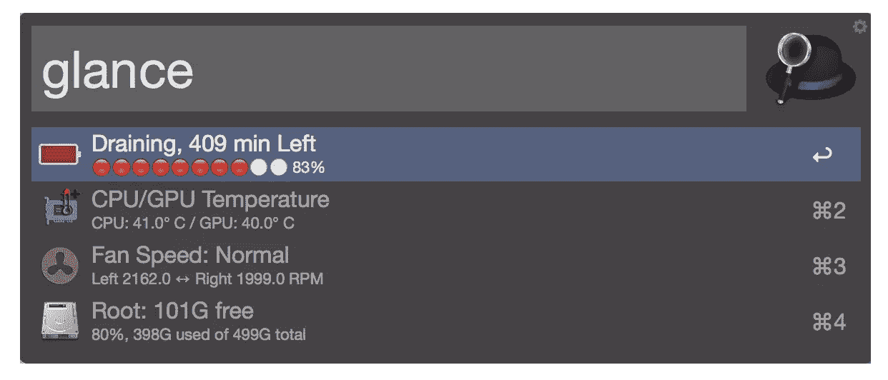
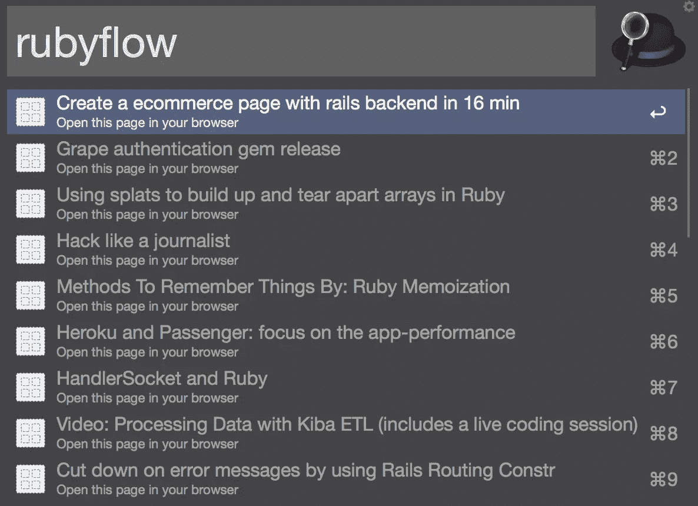
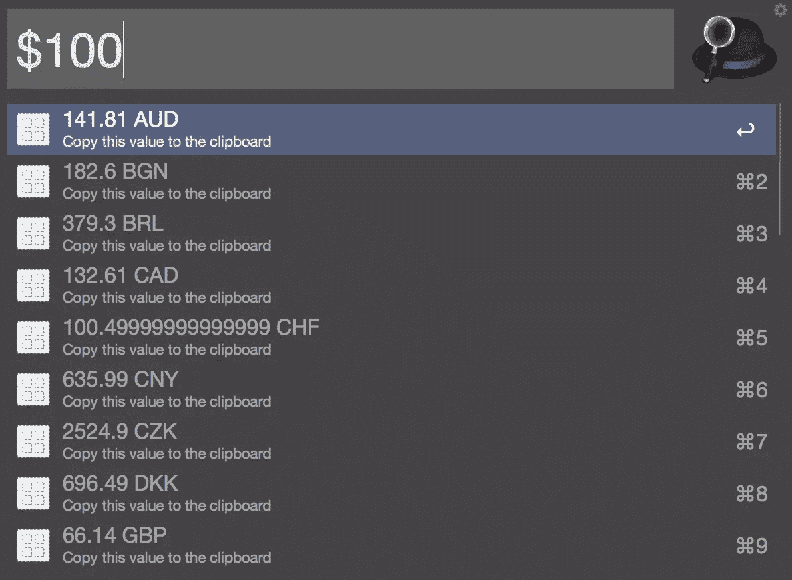
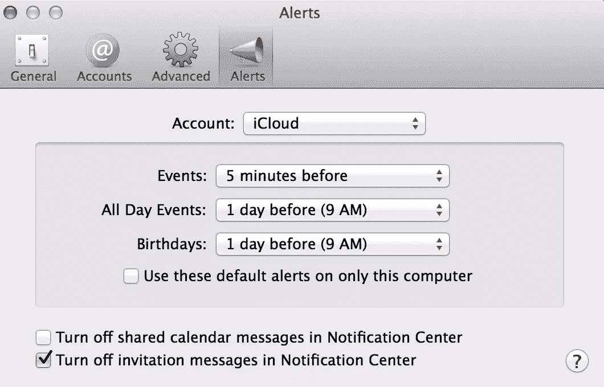

# Ruby 中有趣且实用的 Alfred 工作流

> 原文：<https://www.sitepoint.com/fun-and-practical-alfred-workflows-in-ruby/>



Alfred 是一款 OS X 生产力工具，可以将用户指定的命令转化为行动。这些被称为工作流，可以用多种语言编写，包括 Ruby。

在[之前的一篇文章](https://www.sitepoint.com/holy-hacking-batman-create-alfred-workflows-in-ruby)中，我展示了如何创建一个 Alfred 工作流来生成一个随机数列表供用户选择，并将选择的数字存储在剪贴板中。在本文中，我们来看看一些更实际的用例，例如:

1.  使用屏幕抓取显示网站上的内容
2.  使用 JSON API 和 symbol 关键字进行快速货币转换
3.  用自然语言生成 OS X 日历事件

如果你是 Alfred 的新手，一定要通读一下[以前的文章](https://www.sitepoint.com/holy-hacking-batman-create-alfred-workflows-in-ruby)以加快速度。

注意:*您需要购买[阿尔弗雷德动力包](https://www.alfredapp.com/powerpack/buy/)来使用和创建工作流*。

## 罗马沙司

以前，我们通过将 Ruby 散列转换成 XML(使用`gyoku` gem)然后打印到`stdout`来向 Alfred 发送信息。在本教程中，我们将使用一个宝石来简化这一点:[阿尔弗雷多](https://github.com/djfpaagman/alfredo)。

首先，安装`alfredo`宝石。*与任何工作流 gem 一样，确保在工作流 bash 脚本*，通常是`/usr/bin/ruby`中为您使用的任何 Ruby 安装它:

```
$ gem install alfredo 
```

然后通过创建工作流对象、向其添加项目以及打印 XML 来使用它:

```
require 'alfredo'

workflow = Alfredo::Workflow.new
workflow << Alfredo::Item.new({
  title: "Example",
  arg: "example"
})
workflow.output! 
```

关于`alfredo`的一个好处是，它将使用智能默认值来填充缺少的工作流项目属性，如`uid`(用于跟踪您的行为以进行预测)和`autocomplete`。如果不想要这些属性，一定要在`Alfredo::Item`构造函数中指定它们。

## 屏幕抓取

“屏幕抓取”可能有点用词不当。我们不会拍摄一张截图，然后将像素值交给机器学习算法来获取字符。虽然，这可能有很多应用。

幸运的是，对于网站来说，这个过程通常是这样的:

1.  向 HTML 端点(URL)发送 GET 请求
2.  将 HTML 响应字符串解析为可遍历的哈希
3.  使用哈希

如果有很多 JavaScript，那么步骤 1 可能需要一个带有 JS 引擎的无头浏览器。

让我们创建一个 Alfred 工作流，它将在 [rubyflow](http://rubyflow.com) 的首页显示标题，然后打开选中的页面。我们所需要的是一个空白的工作流，其中一个`Inputs->Script Filter`节点连接到一个`Actions->Open URL`节点。

在脚本过滤器中，将`bash`设置为脚本类型，将一个 Ruby 脚本添加到工作流文件夹中，然后使用`/usr/bin/ruby`运行它:

```
require 'net/http'
require 'nokogiri'
require 'alfredo'

url = "http://www.rubyflow.com"
uri = URI.parse(url)

body = Net::HTTP.get(uri)
html = Nokogiri::HTML(body)

workflow = Alfredo::Workflow.new

html.css(".body h1 a").each do |el|
  if el.text != ""
    workflow << Alfredo::Item.new({
      title: el.text,
      subtitle: "Open this page in your browser",
      arg: url + el["href"]
    })
  end
end

workflow.output! 
```



有多简单？

## 用 JSON API 进行货币转换

工作流关键词不一定要*字*，一定要。如果您需要一个快速的货币转换器，请创建一个脚本过滤器工作流，将货币符号作为关键字，然后将金额作为参数。请确保取消选中脚本过滤器节点中的“带空格”，以便您可以使用像“$100”这样的金额，而不是“$ 100”。

我们可以使用 [Fixer.io](http://fixer.io) 提供的免费货币转换 API。

```
require "json"
require "net/http"
require "alfredo"

amount = ARGV[0] || 1.0
base = "USD"

amount = amount.to_f
amount = 1.0 if amount == 0.0
url = "http://api.fixer.io/latest?base=#{base}"
uri = URI.parse(url)
body = Net::HTTP.get(uri)
json = JSON.parse(body, symbolize_names: true)

workflow = Alfredo::Workflow.new

json[:rates].each do |rate|
  # rate is in the format [:CUR, float]
  total = rate[1].round(4) * amount
  workflow << Alfredo::Item.new({
    title: total.to_s + " " + rate[0].to_s,
    subtitle: "Copy this value to the clipboard",
    arg: total
  })
end

workflow.output! 
```

因为我们在这里使用了关键字参数，所以我们通过将它传递给脚本来通过`ARGV[0]`访问它，比如

```
$ /usr/bin/ruby your_script.rb {query} 
```

对于要复制到剪贴板的选定值，请确保添加一个以`{query}`为文本的`Outputs->Copy to Clipboard`节点，并将其连接到脚本过滤器的输出。



## 提醒工作流

让我们创建一个工作流，让我们根据自然语言设置 OS X 日历通知。例如，我们可以说`rem "pay the light bill on tuesday"`。事情是这样的:

1.  从关键字参数中获取提醒和时间
2.  用一个单独的字符串给 AppleScript(Alfred 现在似乎只支持一个
    参数)
3.  拆分字符串并在`Calendar`中创建一个事件。

我们将使用`nickel`gem(https://github.com/iainbeeston/nickel)进行时间解析，因为它可以一起解析消息和时间:

```
$ gem install nickel 
```

打开`irb`来看看`nickel`将解析什么样的时间。

```
> require 'nickel'
> event = Nickel.parse "pay the light bill on tuesday"
=> message: "pay the light bill", occurrences: [#<Occurrence type: single, start_date: 20151103>]
> event.occurrences.first.start_date.day
=> 3 
```

注意`nickel`目前并不擅长推断事物。如果使用这种格式，您将需要指定 AM/PM，它适用于 24 小时制:

```
> Nickel.parse "Go to the gym at 5:00 pm"
=> message: "Go to the gym", occurrences: []
> Nickel.parse "Go to the gym today at 5:00 pm"
=> message: "Go to the gym", occurrences: [#<Occurrence type: single, start_date: 20151101, start_time: 170000>] 
```

好了，现在我们来写工作流程:

```
require 'nickel'
require 'alfredo'

query = ARGV[0]
parsed = Nickel.parse(query)
workflow = Alfredo::Workflow.new

if parsed != nil && parsed.occurrences.size > 0
  event = parsed.occurrences.first
  reminder = parsed.message
  date = event.start_date || DateTime.new
  time = event.start_time || DateTime.new

  date_string = date.to_date.strftime "%m/%d/%Y"
  time_string = time.to_time.strftime "%I:%M %p"
  time_string[0] = '' if time_string[0] == '0'

  workflow << Alfredo::Item.new({
    title: "Remember \"#{reminder}\" on #{date_string} at #{time_string}",
    arg: "#{reminder};#{date_string} #{time_string}"
  })
end

workflow.output! 
```

### AppleScript

接下来，我们需要一些 AppleScript 来创建基于由`nickel`处理的时间的日历事件。AppleScript 通过向可脚本化的 OS X 应用程序发送苹果事件，赋予了我们自动化它们的能力。

要知道一个应用程序支持什么样的脚本行为，我们需要检查它的 AppleScript 字典。这可以通过打开 AppleScript 编辑器(在**实用程序文件夹**中找到，称为**脚本编辑器**)然后转到`File->Open Dictionary`并选择所需的应用程序来显示。

查看日历字典，我们可以看到创建新事件需要哪种属性:


在工作流节点视图中，添加一个`Actions->Run NSAppleScript`节点，并将其连接到脚本过滤器节点。然后添加以下代码:

```
-- Found at http://erikslab.com/2007/08/31/applescript-how-to-split-a-string/
on split(theString, theDelimiter)
  -- save delimiters to restore old settings
  set oldDelimiters to AppleScript's text item delimiters
  -- set delimiters to delimiter to be used
  set AppleScript's text item delimiters to theDelimiter
  -- create the array
  set theArray to every text item of theString
  -- restore the old setting
  set AppleScript's text item delimiters to oldDelimiters
  -- return the result 
  return theArray
end split

on alfred_script(query)
  tell application "Calendar"
    tell calendar "Home"
      set inputString to query
      set inputArray to my split(inputString, ";")
      set reminder to item 1 of inputArray
      set dateString to item 2 of inputArray
      set newDate to my date (dateString)
      make new event at end with properties {description:reminder, summary:reminder, location:"Event Location", start date:newDate, end date:newDate}
    end tell
  end tell
end alfred_script 
```

请注意，我们从脚本过滤器节点获取参数，参数为`on alfred_script`而不是通知节点中的`{query}`。

另外，一个可能不明显的 AppleScript 关键字是`my`。这告诉 AppleScript 该上下文是顶层脚本，而不是`tell`块的目标。我们需要这样做，因为如果在当前上下文中没有明确定义某些内容，AppleScript 将不会继续查找。

现在，调出工作流程，它会告诉我们日期和时间，一旦我们结束了引用的论点，就会添加日期和时间。


为了接收日历事件的通知，我们需要在日历应用程序的首选项(`CMD-,`)中打开它们。您可以设置提醒是在事件开始时出现还是在之前某个时间出现。



`Nickel`可以解析事件是否以每天或每月的间隔发生，以及两次之间的时间段。因此，提醒工作流程中可以添加很多内容。

## 结论

像 Alfred 这样的工具才出现了几年，所以我们可能只是触及了表面。对于需要将口头命令与复杂行为联系起来的残疾用户来说，这可能尤其有益。

哦，如果你想要文章顶部的工作流程图，可以在 [GitHub](https://github.com/zhaocai/alfred2-top-workflow) 上找到。

对工作流程有什么好主意吗？请在评论中告诉我们。

## 分享这篇文章