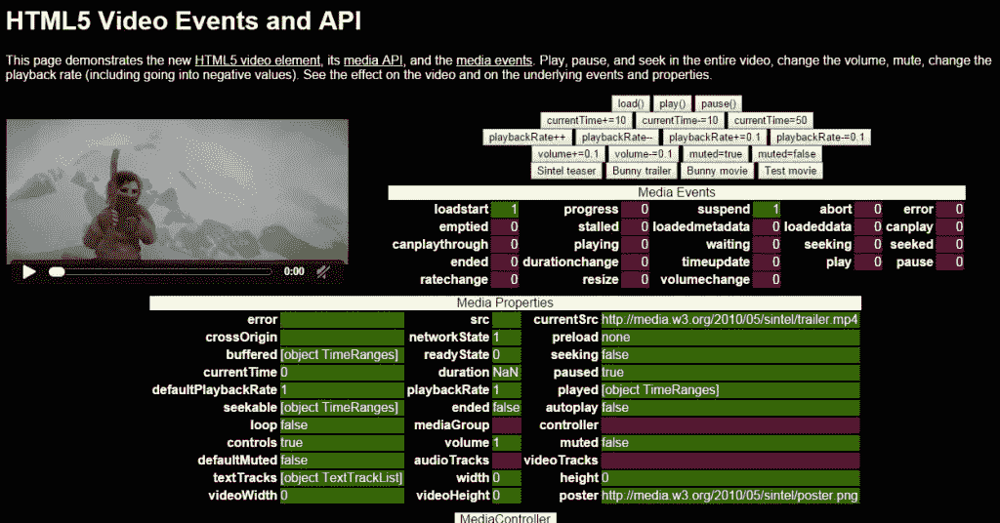
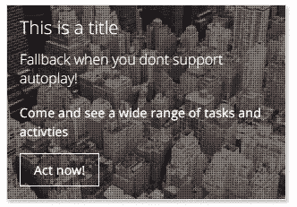

# 使用视频 API 创建交互式视频展示

> 原文：<https://www.sitepoint.com/interactive-video-showcase-video-api/>

*这篇文章由[汤姆·格列柯](https://www.sitepoint.com/author/tgreco/)和[马克·托勒](https://twitter.com/marctowler)进行了同行评审。感谢 SitePoint 的所有同行评审员使 SitePoint 的内容尽可能做到最好！*

随着对原生[视频元素](https://developer.mozilla.org/en/docs/Web/HTML/Element/video)及其 API[相当全面](http://caniuse.com/#feat=video)的支持，现在是一个很好的机会来看看如何利用视频为用户创造一些有趣和互动的东西。

在整篇文章中，我们将研究 API 的基础知识，在了解了方向之后，我们将研究一个实际的例子。这将是一个多视频滑块，其中视频播放一个接一个，无缝加载和动画内容，因为他们播放。

## 视频 API–简介

本质上，当我们谈论视频 API 时，我们实际上是在谈论[媒体 API](https://www.w3.org/TR/html5/embedded-content-0.html#media-elements)——一种 JavaScript API，允许您与网页上的音频和视频元素进行交互。

该 API 实现了一个名为 [HTMLMediaElement](https://developer.mozilla.org/en-US/docs/Web/API/HTMLMediaElement) 的接口，该接口添加了支持音频和视频常用的基本操作(如加载媒体、改变搜索位置、结束回放等)所需的[属性](https://developer.mozilla.org/en-US/docs/Web/API/HTMLMediaElement#Properties)、[方法](https://developer.mozilla.org/en-US/docs/Web/API/HTMLMediaElement#Methods)和[事件](https://developer.mozilla.org/en-US/docs/Web/Guide/Events/Media_events)。它由 [HTMLVideoElement](https://developer.mozilla.org/en-US/docs/Web/API/HTMLVideoElement) 和 [HTMLAudioElement](https://developer.mozilla.org/en-US/docs/Web/API/HTMLAudioElement) 两者扩展，它们提供了自己的特殊属性和方法。

我们主要关心的是`video`元素，所以我们将关注与 API 这一部分的交互。为了感受 API，你可以访问展示最常用元素的[交互式 HTML5 视频示例](https://www.w3.org/2010/05/video/mediaevents.html)页面。



### 浏览器支持

虽然 Chrome、Firefox、Safari、Opera 和 Internet Explorer 都支持视频元素，但它们可以播放的格式有所不同，每个浏览器都有一个支持的视频格式列表，这些格式也可能基于浏览器本身的版本。

在撰写本文时，所有现代桌面和移动浏览器都会播放`mp4`格式。此外，大多数浏览器将长期支持`ogg`或`webm`格式。这里是[对当前支持状态的全面概述](https://en.wikipedia.org/wiki/HTML5_video#Supported_video_formats)。

虽然你可以只提供`mp4`版本，但你可能应该把`ogg`和`webm`两种格式都包括进来，作为一个全面的解决方案。

## 互动视频展示

我们将使用`video`元素创建一个展示特征。我们的展示将连续播放一系列小视频剪辑，并在特定时间触发动画。使用像这样的视频元素，我们研究它的一些属性、方法和事件，并展示使用这个 API 可以实现的控制级别。


和以往一样，你可以在我们的 [GitHub repo](https://github.com/sitepoint-editors/Multi-video-playback-and-animations) 上找到本教程的代码，以及在文章结尾的[成品展示的演示。](#demo)

## 构建 HTML 布局

我们的 slider 示例将一个接一个地播放每个视频，在播放的过程中，每个视频的相关标题会淡入。如果我们不支持视频播放/在移动设备上，我们将退回到静态图像将字幕文本。

为你的滑块创建一个轮廓包装器，并在里面添加你想要定义的每个视频部分

```
<!--Main video wrapper-->
<div class="video-wrapper" id="video-container">
  <!--first video-->
  <div class="video-container"></div>
  <!--second video-->
  <div class="video-container"></div>
  <!--Nth video-->
  ...
</div> 
```

### 每个视频部分的标记

对于我们想要播放的每个视频，我们必须设置一些元素，以便我们可以显示视频，淡入字幕元素并跟踪视频的整体进度。

```
<!--Progress bar-->
<div class="progress-bar">
  <div class="progress">
    <div class="progress-inner">
      <span class="progress-time"></span>
      <span class="progress-value"></span>
    </div>
  </div>
</div>

<!--Progress bar overlay-->
<div class="progress-overlay"></div>

<!--Video Elements-->
<video preload="none">
  <source src="videos/video1/video1.mp4" type="video/mp4">
  <source src="videos/video1/video1.webm" type="video/webm">
  <source src="videos/video1/video1.ogg" type="video/ogg">
</video>

<!--Video overlay-->
<div class="overlay"></div>

<!--Caption Elements-->
<div class="caption">
  <h1 data-animation-percent="10">Amazing New Adventures</h1>
  <h3 data-animation-percent="20">Come visit new parts of the world</h3>
  <p data-animation-percent="40">
    Don't wait, there is a wide world out there that you can explore!
    Contact us to see what we can do
  </p>
  <div class="readmore" data-animation-percent="60">Find out more</div>
</div> 
```

视频元素将包含`video`标签，其所有的`source`子元素被设置为不同的数据类型，以最大化兼容性。阅读更多关于[增加对多种视频格式的支持](https://www.sitepoint.com/web-foundations/introduction-audio-video-html5/#adding-support-for-multiple-video-formats)。

字幕元素将包含您希望在视频播放时淡入的所有标记。您可以添加您想要的任何内容，但是它必须具有值在`0`和`100`之间的`data-animation-percent`属性。这将告诉滑块视频完成的百分比来淡入元素。

进度条显示当前视频进度(秒和百分比)。这将定期更新。酒吧将是互动的；当您将鼠标悬停在它上面时，视频会暂停，您将能够浏览它，更新视频位置。

## 为移动浏览器提供后备

为了帮助涵盖我们所有的基础，我们还将设置一个后备元素，用于当前浏览器是移动设备的情况。

在主视频包装结束之前添加以下标记

```
<!--Fallback-->
<div class="fallback-container">
  <div class="image"></div>
  <div class="overlay"></div>
  <div class="caption">
    <h1 data-animation-percent="15">This is a title</h1>
    <h3 data-animation-percent="25">Fallback when you dont support autoplay!</h3>
    <p data-animation-percent="50">Come and see a wide range of tasks and activities</p>
    <div class="readmore" data-animation-percent="70">Act now!</div>
  </div>
</div> 
```

这将与我们的视频功能相似。当用户加载页面时，我们将根据在`data-animation-percent`属性中设置的值，触发所有的字幕元素淡入。我们使用的是背景图像，而不是视频。

### 检测移动浏览器

我们的滑块将使用 video 元素的`autoplay`属性来自动播放第一个视频。然而，大多数移动浏览器会阻止这一功能(以便限制数据使用)，这意味着最好的策略是检测我们是否在移动设备上，并相应地显示后备内容。通常我们会使用特征检测来做到这一点，然而，[检测对自动播放属性的支持是很棘手的](https://github.com/Modernizr/Modernizr/issues/353)。

尽管浏览器/ UA 嗅探可能很难看，但它将为我们提供一种方法，根据已知的移动设备列表来测试当前的浏览器，并从那里检测我们应该如何进行。我们可以使用下面的正则表达式来做到这一点:

```
var mobile = navigator.userAgent.match(/Android|BlackBerry|iPhone|iPad|iPod|Opera Mini|IEMobile|IEMobile/i); 
```

我们可以这样使用它:

```
if(!mobile){
  //main video slider functionality
} else {
  //fallback functionality
} 
```

## 当前和下一个视频设置

**注意**:对于 JavaScript 功能，我使用 jQuery，所以[去拿一份](https://developers.google.com/speed/libraries/?hl=en#jquery)放在页面底部。

一旦我们很高兴我们不在移动设备上，我们就用`video-container`类搜索我们所有的元素，并将集合分配给我们的`videos`变量。这些元素将是每个视频及其标题内容的主要包装器。然后我们找到每个容器的`video`元素，并将其赋给局部`video`变量。

现在我们有了当前的视频，我们需要找到下一个视频元素，这样我们就可以触发它开始加载，并在当前视频完成时播放它。

如果我们有另一个`video-container`元素，我们把它赋给`nextVideo`变量。如果我们没有另一个`video-container`元素，我们循环回到第一个。

```
var videos = $('.video-container');

videos.each(function(index){
  var video = $(this).find('video'),
      nextVideo;

  if(index !== (videos.length - 1)){
    nextVideo = $(this).next('.video-container').find('video');
  } else {
    nextVideo = videos.first().find('video');
  }
}); 
```

您可以添加任意数量的`video-container`元素，并定义额外的视频和字幕。滑块将找到下一个视频，并创建一个循环，以便无限期地继续下去。

## 开始第一个视频的视频播放

对于我们的第一个视频，我们需要设置一些东西，这样我们就可以让一切都动起来。

*   我们将`active`类添加到第一个视频的`.video-container`中(这将使用相对定位来设置视频的样式，以便显示它)
*   将视频的`preload`属性设置为`auto`,告诉浏览器开始获取视频
*   调用视频的`play()`方法，以便立即开始播放

```
//first video, preload and play 
if(index === 0){ 
  video.parents(‘.video-container’).addClass(‘active’);
  video[0].preload = ‘auto’; 
  video[0].play(); 
}
```

### 视频的辅助变量

对于每个视频，我们需要设置一些变量，我们将在稍后的活动中使用这些变量

```
var caption = video.siblings('.caption');
var captionItems = caption.find('[data-animation-percent]');
var videoBar = video.siblings('.progress-bar');
var dragging = false;
var nextLoaded = false; 
```

*   是所有动画字幕元素的容器
*   `captionItems`保存将在回放过程中动画显示的每个元素
*   `videoBar`指每个视频上的进度条(稍后在我们的活动中使用，以可视化方式更新正在发生的事情)
*   `dragging`将在我们搜索/跳过视频以改变其播放位置时使用
*   将使用`nextLoaded`,以便我们知道何时已经开始在当前视频播放的末尾加载下一个视频(防止我们多次调用`load()`)

## timeUpdate 事件

当我们的视频播放时，它会定期调用 [timeupdate](https://developer.mozilla.org/en-US/docs/Web/Events/timeupdate) 事件。我们将使用该事件进行一些处理:

```
$(video).on('timeupdate', function(){
  //processing to go in here
}); 
```

在回调(我们传递给 jQuery 的`on`方法的匿名函数)中，我们想要获得当前视频的时间。我们通过找到视频的[当前时间](https://developer.mozilla.org/en-US/docs/Web/API/HTMLMediaElement/currentTime)并将其除以其[持续时间](https://developer.mozilla.org/en-US/docs/Web/API/HTMLMediaElement/duration)乘以 100 来设置`videoTime`变量。这将让我们知道视频有多完整。

```
var videoTime = ((this.currentTime /  this.duration) * 100); 
```

### 触发字幕元素的动画

如果当前视频有字幕元素，我们将需要检查视频的当前时间，看看我们是否应该使元素活动或不活动。

在我们的函数中，我们添加了以下内容

```
$(video).on('timeupdate', function(){
  var videoTime = ((this.currentTime /  this.duration) * 100);

  if(captionItems.length > 0){
    captionItems.each(function(){
      var item = $(this);
      var animTime = parseInt(item.attr('data-animation-percent'));

      if(videoTime >= animTime){
        item.addClass('active');
      } else {
        item.removeClass('active');
      }
    });

    if(captionItems.filter('.active').length !== 0){
      caption.addClass('active');
    } else {
      caption.removeClass('active');
    }

    if(videoTime >= 90){
      caption.removeClass('active');

      captionItems.each(function(){
        $(this).removeClass('active');
      });
    }
  }
}); 
```

这是我们正在做的事情的明细

*   如果我们的`captionItems`的长度大于`0`，这意味着我们有需要跟踪的元素。
    *   对于每个`captionItems`，我们需要收集存储在其`data-animation-percent`属性中的值，并将其分配给`animTime`(它应该是一个介于`0`和`100`之间的值)。
    *   如果当前的`videoTime`大于我们的元素`animTime`，那么我们需要通过添加`active`类来激活这个元素。
*   我们还获得了`captionItems`集合并使用了 jQuery 的[。过滤](http://api.jquery.com/filter/)方法来检查我们是否有任何`active`类项目。如果我们这样做，我们希望将活动类添加到标题包装器中(`caption`变量)。
*   我们还检查当前的`videoTime`是否大于`90`(意味着我们完成了 90%)。如果我们接近完成，我们会检查所有的标题并删除它们的`active`类，同时也从`caption`中删除它

### 加载下一个视频

在同一个`timeupdate`事件中，我们还想检查当前视频的持续时间，看看我们是否应该开始加载下一个视频。

```
if(videoTime >= 70 && nextLoaded === false){
  nextVideo.preload = 'auto';
  nextVideo.load();
  nextLoaded = true;
} 
```

您可以在完成的演示中看到这一点—当前视频完成大约 70%时，下一个视频应该会出现/加载到您的控制台的网络选项卡中，在结束事件触发调用它播放之前给它几秒钟的时间。


## 回放期间更新进度条

因为我们希望进度条经常更新，所以我们不能把它放在`timeupdate`函数中(因为浏览器决定了它被调用的频率)。相反，我们调用 [setInterval](https://developer.mozilla.org/en-US/docs/Web/API/WindowTimers/setInterval) ，并将其赋给我们的`videoInterval`变量。每隔 100ms 我们将调用`updateProgressAuto`函数，并传入当前播放的视频

```
setInterval(function(){
  updateProgressAuto(video);
}, 100); 
```

### 用 UpdateProgressAuto 自动更新进度条

每 100 毫秒进度条将需要更新。我们使用这个功能就是为了这个目的。

```
function updateProgressAuto(video){
  var videoBar = $(video).siblings('.progress-bar');
  var videoPercent = ((video[0].currentTime / video[0].duration ) * 100);

  videoBar.find('.progress').css('width', videoPercent + '%');
  videoBar.find('.progress-value').html(parseFloat(video[0].currentTime).toFixed(2) + ' : ' + parseFloat(video[0].duration).toFixed(2));
  videoBar.find('.progress-time').html(parseInt(videoPercent) + '%');
} 
```

事情是这样的。

*   我们正在获取进度条元素，通过将视频的`currentTime`除以它的`duration`并乘以 100 来找到`videoPercent`。
*   我们更新进度条的宽度来反映`currentTime`百分比
*   我们更新视频的当前时间/持续时间，这样我们就可以准确地知道视频何时结束。
*   我们用当前百分比更新视频栏上显示的百分比

## 统一的事件

当当前视频结束时，它触发[事件。在这里，我们将把活动类切换到`nextVideo`的容器，然后调用它的`play`函数开始回放](https://developer.mozilla.org/en-US/docs/Web/Events/ended)

```
video[0].onended = function() {     
   nextVideo.parents('.video-container').addClass('active');
   video.parents('.video-container').removeClass('active');
   nextVideo[0].play(); 
}; 
```

### 手动更新视频播放

作为一项附加功能，滑块还允许您手动搜索视频，在您点按或拖移时更改视频的当前回放时间(允许您倒带或快进视频)。

我们将几个事件处理程序绑定到`videoBar`变量的`click`、`mousedown`、`mouseup`和`mousemove`事件。这样做的目的是转换鼠标的点击位置/拖动位置，以更新视频的位置。


```
//seeking with the video bar
videoBar.on('click', function(e){
  updateProgressManual((e.pageX - $(this).offset().left) , video);
});

//mouse moving
videoBar.on('mousedown',function(e) {
  dragging = true;
  updateProgressManual(e.pageX - $(this).offset().left, video);
});

//mouse up (choose time to seek to)
videoBar.on('mouseup',function(e) {
  dragging = false;
  updateProgressManual(e.pageX - $(this).offset().left, video);
});

//mouse dragging (actively seeking)
videoBar.on('mousemove',function(e) {
  if(dragging === true){
    updateProgressManual(e.pageX - $(this).offset().left, video);
  }
}); 
```

所有这些事件都调用`updateProgressManual`函数，该函数将更新视频的播放时间。我们收集的值将是当前的`pageX`位置减去视频栏的当前左边的`offset`(这将给我们进度条上的正确位置)

### 使用 UpdateProgressManual 功能手动更新播放

当我们手动搜索当前视频时，会调用该函数。它的目的是获得被点击的位置，并将其转换成视频应该寻找的时间。

```
//Manually updates the video when we seek using the progress bar
function updateProgressManual(progressBarPosition, video){
  var videoBar = $(video).siblings('.progress-bar');
  var videoPercentage = ((progressBarPosition / videoBar.outerWidth()) * 100);

  videoBar.find('.progress').css('width', videoPercentage + '%');
  videoBar.find('.progress-value').html(parseFloat(video[0].currentTime).toFixed(2) + " : " + parseFloat(video[0].duration).toFixed(2)); 
  videoBar.find('.progress-time').html(parseInt(videoPercentage) + '%');
  video[0].currentTime = ((video[0].duration * videoPercentage) / 100);
} 
```

这是正在发生的事情的详细分析

*   我们计算`videoPercentage`的方法是，获得通过位置的电流，并将其除以视频条的`outerWidth`乘以 100。这将告诉我们，我们要寻求多大的百分比。
*   我们将`videoBar`中的`progress`元素的宽度设置为我们想要的百分比。
*   我们还想更新酒吧中的视觉回放时间。这是通过获取视频的`currentTime`和`duration`来完成的
*   最后，我们设置视频的`currentTime`值，使视频搜索到指定的时间段。

## 附加功能

该滑块还有一些其他功能，您可能会觉得有用。

当`videoBar`与我们的鼠标相交时，我们扩展进度条，以便更容易点击/拖动(寻找视频)。此外，我们还暂停视频，并激活我们的覆盖。当鼠标移开时，一切都恢复原状，开始播放并删除类。

我们还检查您是否将鼠标移动到了`caption`区域及其元素上。如果字幕当前处于活动状态，它将通过 [`playbackRate`](http://www.w3schools.com/tags/av_prop_playbackrate.asp) 属性减慢视频播放速度(使播放速度减半)。当我们移开鼠标时，视频恢复正常速度。

```
//When hovering over progress bar, pause video and restyle
videoBar.on('mouseover', function(){
  $(this).siblings('.progress-overlay').addClass('active');
  $(this).addClass('expanded');
  video[0].pause();
});

//When not hovering, unpause video and restyle back to normal
videoBar.on('mouseout', function(){
  $(this).siblings('.progress-overlay').removeClass('active');
  $(this).removeClass('expanded');
  video[0].play();
});

//if we have caption elements, slow playback on hover
if(captionItems.length !==0){
  video.parents('.video-container').on('mouseover','.caption.active', function(){
    video[0].playbackRate = 0.5;
  });
  video.parents('.video-container').on('mouseout','.caption.active', function(){
    video[0].playbackRate = 1;
  });
} 
```

### 我们的移动唯一后备内容

如果我们在移动设备上，我们不会显示我们的视频，而是显示备用内容。您可以在演示中通过将`mobile`变量设置为 true 来测试这一点。

大部分功能与我们处理每个视频的方式相似。我们寻找它的所有元素，然后决定它们什么时候需要淡入。



```
var fallbackInterval = setInterval(function(){
  currentTime = (parseInt(currentTime) + timeInterval);
  fallbackElements.each(function(){
    var animationPercent = parseInt($(this).attr('data-animation-percent'));
    if((currentTime / animationDuration * 100) >= animationPercent){
      $(this).addClass('active');
    } else {
     $(this).removeClass('active');
    }
  });

  //if we have any caption elements faded in
  if(fallbackElements.filter('.active').length !== 0){
    fallbackElements.parents('.caption').addClass('active');
  }

  //if we have ended, finish
  if(currentTime >= animationDuration){
    clearInterval(fallbackInterval);
  }

}, timeInterval); 
```

让我们来看看发生了什么

*   我们找到了`fallback`和`fallbackElements`，并设置了要激活的`fallback`容器。
*   我们将`currentTime`设置为`0`，这给出了我们的开始时间。然后我们将`animationDuration`设置为`5000`,表示完整的动画需要 5 秒钟。最后，我们将`timeInterval`设置为`50`，这意味着每隔 50 毫秒我们将进行一次更新。
*   我们用`setInterval`函数创建我们的主循环(将它赋给我们的`fallbackInterval`变量)。我们将间隔设置为每 50 毫秒运行一次。
*   在主间隔内，我们获得新的当前时间(通过将`timeInterval`加到`currentTime`变量)。
*   我们根据这个新时间的百分比检查每个标题元素，看看我们是否应该激活这个元素。
*   如果我们的`currentTime`大于我们的`animationDuration`，我们使用 [clearInterval](https://developer.mozilla.org/en-US/docs/Web/API/WindowTimers/clearInterval) 清除`fallbackInterval`来完成所有事情。

## 演示

最后，这是成品展示的演示。你可以点击视频来切换播放。

参见 [CodePen](http://codepen.io) 上 SitePoint ( [@SitePoint](http://codepen.io/SitePoint) )的 Pen [视频 API 互动展示](http://codepen.io/SitePoint/pen/MaRNZw/)。