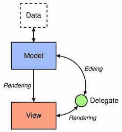
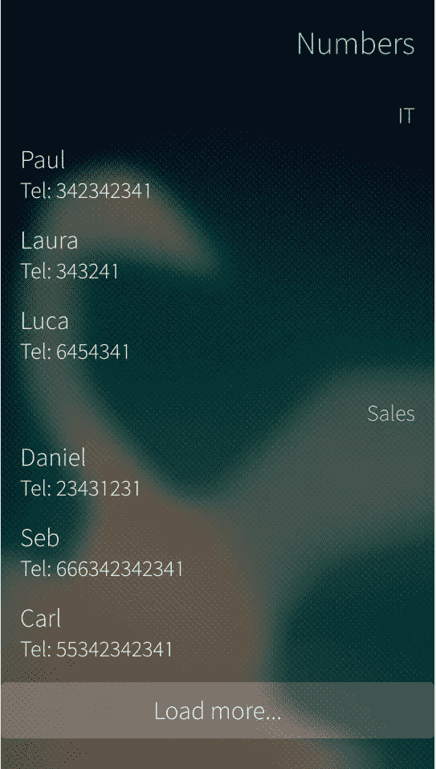
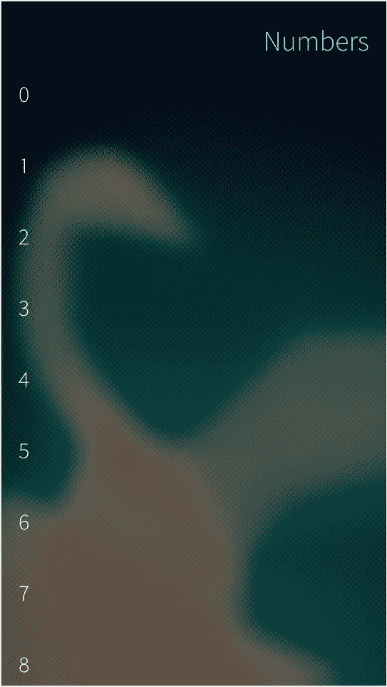

# 用于在 Sailfish 操作系统中显示数据的列表和网格

> 原文：<https://www.sitepoint.com/lists-and-grids-for-displaying-data-in-sailfish-os/>

这篇文章由马克·托勒同行评审。感谢所有 SitePoint 的[同行评审](https://www.sitepoint.com/introduction-to-sitepoints-peer-review/)让 SitePoint 的内容尽可能做到最好！

* * *

列表和网格是任何移动应用程序的基本构件之一。

在本文中，我将介绍`SilicaListView`和`SilicaGridView`的设计，这些常见元件的硅实现。我们将看到一些如何显示数据类型、处理点击等等的例子，尽可能保持代码的简单。

## MVD 设计

Sailfish OS UIs 基于 [QML](https://en.wikipedia.org/wiki/QML) ，一种由 [QT 框架](http://www.qt.io/qt-framework/)提供的声明性语言。为了让开发人员或设计人员控制应用程序的不同方面，QT 使用模型-视图-委托设计模式来模块化数据的可视化。



模型保存数据及其结构，视图是显示数据的容器。在我们的例子中，视图将是一个列表或一个网格。最后，委托决定了单个数据在视图中的显示方式。

## 硅酸盐列表视图

让我们从一个简单的例子开始:

```
import QtQuick 2.0
import Sailfish.Silica 1.0

Page {
    id: page

    SilicaListView {
        width: parent.width;
        height: parent.height
        model: ListModel {
        ListElement { name: "Paul"; telephone: "342342341" }
        ListElement { name: "Laura"; telephone: "343241" }
        ListElement { name: "Luca"; telephone: "6454341" }
        ListElement { name: "Daniel"; telephone: "23431231" }
        ListElement { name: "Seb"; telephone: "666342342341" }
        ListElement { name: "Carl"; telephone: "55342342341" }
        }

        delegate: Item {
            width: parent.width
            height: Theme.itemSizeMedium
            Label {
                text: name
                font.pixelSize: Theme.fontSizeMedium
                anchors {
                            left: parent.left
                            right: parent.right
                            margins: Theme.paddingLarge

                        }
            }
        }
    }

}
```

除了页面组件(查看[这篇文章](https://www.sitepoint.com/silica-components-user-interfaces-sailfish-os/)中关于 Silica 组件的介绍)，我们声明了一个带有硬编码模型的`SilicaListView`。列表将如下所示:


每个`ListElement`是一个具有两个属性的对象——一个名字和一个电话号码。

该代理只是一个`Item`(基本的 QML 组件)，其“宽度”属性设置为填充`ListView`宽度，其“高度”设置使用`Theme`对象，实际大小在运行时计算，使其适应使用中的显示。

代理包含一个显示联系人姓名的`Label`。要显示电话号码，我可以向代理人添加另一个标签:

```
Item {
            width: parent.width
            height: Theme.itemSizeMedium
            anchors {
                        left: parent.left
                        right: parent.right
                        margins: Theme.paddingLarge

                    }

            Label {
                id: cName
                text: name
                font.pixelSize: Theme.fontSizeMedium
                anchors {
                            left: parent.left
                            right: parent.right
                        }
            }

            Label {
                text: "Tel: " + telephone
                font.pixelSize: Theme.fontSizeSmall
                anchors {
                            left: parent.left + Theme.paddingSmall
                            right: parent.right
                            top: cName.bottom
                        }
            }
```


模型和委托可以内联定义，但是随着模型变大，最好把它移到另一个 QML 文件中。

例如，您可以创建一个包含以下内容的 *ContactsModel.qml* 文件:

```
import QtQuick 2.0

ListModel {
        ListElement { name: "Paul"; telephone: "342342341"; team: "IT" }
        ListElement { name: "Laura"; telephone: "343241"; team: "IT"}
        ListElement { name: "Luca"; telephone: "6454341"; team: "IT" }
        ListElement { name: "Daniel"; telephone: "23431231"; team: "Sales" }
        ListElement { name: "Seb"; telephone: "666342342341"; team: "Sales" }
        ListElement { name: "Carl"; telephone: "55342342341"; team: "Sales" }
        }
```

并将其用作列表模型:

```
 model: ContactsModel {}
```

我添加了在下一个示例中使用的 team 属性。

一个`List`有时候需要分成几节。使用`section`属性来定义用作分组元素的模型键和用作节头的委托。

在`SilicaListView`中定义截面属性:

```
 section {
        property: "team"
        criteria: ViewSection.FullString
        delegate: SectionHeader {
                text: section
            }
        }
```


现在是处理点击事件并对其做出反应的时候了。

```
 MouseArea {
                anchors.fill: parent
                onClicked: {
                    var name = list.model.get(index).name
                    console.log(name);
                }
```

我们定义了一个`MouseArea`元素来填充我们的委托。这样我们可以捕捉和处理点击事件，并使用列表模型`get`和`index`属性获得被点击的元素。

每个列表都可以有一个附加到相应列表属性的页眉和页脚。这些是有用的，因为你不应该在另一个可滚动元素中包含一个`SilicaListView`或`GridView`。如果您需要列表/网格之前或之后的内容，请使用这些属性。

```
 SilicaListView {
        id:list
        width: parent.width;
        height: parent.height
        model: ContactModel {}
        header: MyHeader {}
        footer: Button {
            width: parent.width
            anchors.margins: Theme.paddingSmall
            text: "Load more..."
              onClicked: console.log("clicked!")
          }

        section {
            property: "team"
            criteria: ViewSection.FullString
            delegate: SectionHeader {
                    text: section
                }
            }

        delegate: Item {
            width: parent.width
            height: Theme.itemSizeMedium
            anchors {
                        left: parent.left
                        right: parent.right
                        margins: Theme.paddingLarge

                    }

            Label {
                id: cName
                text: name
                font.pixelSize: Theme.fontSizeMedium
                anchors {
                            left: parent.left
                            right: parent.right
                        }
            }

            Label {
                text: "Tel: " + telephone
                font.pixelSize: Theme.fontSizeSmall
                anchors {
                            left: parent.left
                            right: parent.right
                            top: cName.bottom
                        }
            }

            MouseArea {
                anchors.fill: parent
                onClicked: {
                    var name = list.model.get(index).name
                    console.log(name);
                }
            }
        }
    }
```

我们可以选择以内联方式或者在单独的文件中声明对象。例如，我用这个内容创建了一个名为 *MyHeader.qml* 的文件，并将页脚声明为内联:

```
 import QtQuick 2.0
import Sailfish.Silica 1.0

PageHeader {
        title: "Numbers"
}
```



## 模型

为了简化开发人员的生活，QML 定义了一套现成的模型，如`SqliteModel`、`XmlListModel`和`SparqlModel`。你可以使用 [C++ QT API](http://doc.qt.io/qt-5/reference-overview.html) 定义你自己的模型。

例如，我们可以使用站点的 RSS 提要显示最新的 Sitepoint 新闻。让我们使用预定义的`XmlListModel`来定义我们的模型:

```
 XmlListModel {
     id: feedModel
     source: "https://www.sitepoint.com/feed/"
     query: "/rss/channel/item"
     XmlRole { name: "title"; query: "title/string()" }
     XmlRole { name: "link"; query: "link/string()" }
     XmlRole { name: "description"; query: "description/string()" }
     XmlRole { name: "pubDate"; query: "pubDate/string()" }
}
```

在这里，我们定义提要的源和设置模型范围的查询属性。只有`<item>`孩子会被使用，三个`XmlRole`作为`ListElement`里面的一个属性。

现在，我们可以使用这个模型创建列表视图，完整的示例如下所示:

```
 import QtQuick 2.0
import Sailfish.Silica 1.0
import QtQuick.XmlListModel 2.0
Page {
    id: page

    SilicaListView {
        id:list
        width: parent.width;
        height: parent.height
        model: XmlListModel {
            id: feedModel
            source: "https://www.sitepoint.com/feed/"
            query: "/rss/channel/item"
            XmlRole { name: "title"; query: "title/string()" }
            XmlRole { name: "link"; query: "link/string()" }
            XmlRole { name: "description"; query: "description/string()" }
            XmlRole { name: "pubDate"; query: "pubDate/string()" }
       }

        header: MyHeader {}
        footer: Button {
            width: parent.width
            anchors.margins: Theme.paddingSmall
            text: "Load more..."
              onClicked: console.log("clicked!")
          }

        delegate: Item {
            width: parent.width
            height: Theme.itemSizeMedium
            anchors {
                        left: parent.left
                        right: parent.right
                        margins: Theme.paddingLarge

                    }

            Label {
                id: cName
                text: title
                font.pixelSize: Theme.fontSizeSmall
                anchors {
                            left: parent.left
                            right: parent.right
                        }
            }

            MouseArea {
                anchors.fill: parent
                onClicked: {
                    var name = list.model.get(index).name
                    console.log(title);
                }
            }
        }
    }

}
```


我们需要解决没有项目可显示的情况，例如当提要仍在加载时。

我们可以使用`ViewPlaceholder`元素来处理这个问题，将其可见性绑定到列表视图的`count`属性:

```
ViewPlaceholder {
enabled: list.count == 0
text: "Loading..."
hintText: "Be patient my friend"
}
```


## Js 中的模型

如果需要生成一个<q>即时</q>模型，可以使用 javascript。我们获取并显示一个从 1 到 100 的数字列表，如下所示:

```
import QtQuick 2.0
import Sailfish.Silica 1.0

Page {
    id: page

    SilicaListView {
        id:list
        width: parent.width;
        height: parent.height
        model: ListModel {
           id: myJSModel

        }
        header: MyHeader {}
        footer: Button {
            width: parent.width
            anchors.margins: Theme.paddingSmall
            text: "Load more..."
              onClicked: console.log("clicked!")
          }
        delegate: Item {

            width: parent.width
            height: Theme.itemSizeMedium
            Label {
                text: value
                font.pixelSize: Theme.fontSizeMedium
                anchors {
                            left: parent.left
                            right: parent.right
                            margins: Theme.paddingLarge

                        }
            }

            MouseArea {
                anchors.fill: parent
                onClicked: {
                    var value = list.model.get(index).value
                    console.log(value);
                }
            }
        }

        Component.onCompleted: {
            for(var i=0;i<=100;i++) {
                var myElement = { "value" : i }
                myJSModel.append(element)
            }
        }
    }

}
```

`myElement`可以是一个任意的 javascript 对象，我们可以根据需要添加任意多的属性，并在我们的委托中使用它们。

我们在`Component.onCompleted`事件中定义了 JavaScript 模型。这样，当相关组件准备好并显示出来时，我们的代码就会被调用。

## Gridviews

`GridView`的行为与列表视图类似，共享大部分属性。

```
import QtQuick 2.0
import Sailfish.Silica 1.0

Page {
    id: page

    SilicaGridView {
        id:list
        width: parent.width;
        height: parent.height

        cellWidth: width / 2
        cellHeight: width / 2

        model: ListModel {
           id: myJSModel

        }
        header: MyHeader {}
        delegate: Item {
            width: list.cellWidth
            height: list.cellHeight

            Label {
                text: value
                font.pixelSize: Theme.fontSizeMedium
                anchors {
                            left: parent.left
                            right: parent.right
                            margins: Theme.paddingLarge

                        }
            }

            MouseArea {
                anchors.fill: parent
                onClicked: {
                    var value = list.model.get(index).value
                    console.log(value);
                }
            }
        }

        Component.onCompleted: {
            for(var i=0;i<=100;i++) {
                var element = { "value" : i }
                myJSModel.append(element)
            }
        }
    }

}
```




我们必须定义列表视图的另外两个属性，`cellWidth`和`cellHeight`，它们是自解释的。

## 结论

列表和网格很流行，但并不总是容易实现。

多亏了 QML，Sailfish 拥有关于这两个关键组件的最干净和最方便的 API 之一，允许开发人员毫不费力地实现可用的 UI。

我很想听听你的想法和评论，以及你是否尝试过 Sailfish 的开发。

## 分享这篇文章