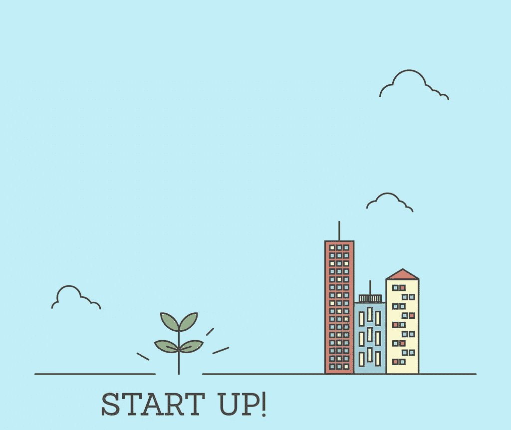
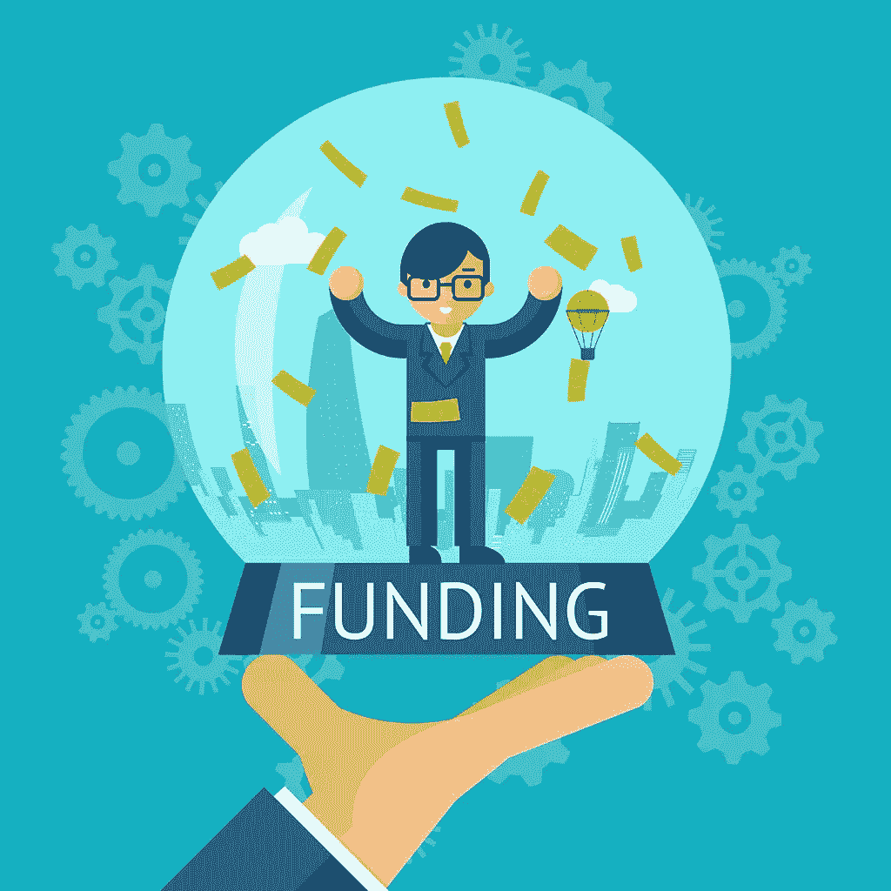

# 何时、为何及如何转向:一个简短而甜蜜的指南

> 原文：<https://www.sitepoint.com/when-why-how-to-pivot-a-short-sweet-guide/>

这是“精益”的时代。经营企业的精益方法已经变得非常流行，这是有充分理由的:它帮助你的团队保持竞争力、创新力和适应性。

然而，如果不对旋转开放，你就不能采用精益方式。旋转——或者快速改变你的商业模式、产品或目标市场——是可以理解的可怕。

请继续阅读，了解何时、为何以及如何转向。

## 知道什么时候

那么，你如何判断何时是转向的最佳时机呢？你不希望如此依赖你的商业产品，以至于忽略了它失败的所有迹象，但你也不希望如此优柔寡断，以至于每次你得到负面反馈或坏消息时，你都要改变整个公司。

连续创业者 Steve Blank [看到了前一个](http://venturebeat.com/2012/08/27/knowing-when-to-pivot-and-when-to-hold-the-line/)发生在 Yuri 身上，Yuri 是一名学生，他创办了一家大数据分析公司，并一直在旋转。

空白写入:

> “每个人都不敢做决定，因为他们猜不到尤里那周想做什么。一些工程师以为创始人会宣布他们 90 天后就完蛋了，于是更新了他们的简历。该公司已经赢得了缺乏连贯战略的名声。

毫不奇怪，知道你的支点是一门艺术，而不是一门科学——但是有几个衡量标准你可以并且*应该*应用。

首先，在过去的几个月里，你的许多用户都说了些什么？

让我们想象一下，你像 Handy 一样经营一家“清洁优步”创业公司。如果你从与用户的交谈中不断了解到，他们可以接受或放弃清洁服务，但更喜欢使用你的杂工服务，那么你肯定应该考虑关闭你的业务的清洁部分，只专注于修复部分。

然而，如果你在三个月的时间里只从 5%的客户那里听到了同样的观点，你可能会想推迟做出任何改变。

此外，专注于制造能说服人们购买的支点。例如，如果你有一个免费的播客流媒体应用程序，问问那些从未升级过的客户为什么不升级。这将有助于你找到增加收入的变化。

第二，你团队的其他高层是怎么想的？可以说，你的联合创始人或创始成员也在第一线，这意味着他们也应该倾听客户的声音。如果他们所听到的证实了你所听到的，那就是另一个你应该关注的信号。

第三，确保你所做的改变不是渐进式的。做支点需要努力和时间；另外，你可能会失去你已经聚集的顾客。为了让这一转变物有所值，它需要明显好于(或不同于)你已经在做的事情。

第四，向你的顾问委员会征求意见。他们了解你的产品、团队和商业前景，并且在吸引或缺乏吸引方面有丰富的经验。他们的指导将是无价的。

## 保留正在工作的内容

做出大的改变不等于从零开始。当你转向时，分析你的商业策略中实际有效的元素——然后保留或扩展它们。

一个很好的例子，让我们看看 Groupon 的历史。你今天用来购买餐厅优惠券、折扣健身课程和预算友好的美容护理的网站曾经是非常非常慈善的。它始于 2007 年,是一个让人们能够设定集体目标的网站(比如“清理梅森小道”或“向海地捐款 2000 美元”))然而，只有当参与者达到“临界点”时，活动才会成功。

Point 获得了 100 万美元的天使投资，但具有讽刺意味的是，它从未获得足够多的会员。这家初创公司似乎注定要失败。

然而，创始人安德鲁·梅森意识到集体购买的想法是有潜力的。

关于这一点，最有效的宣传活动围绕着团体聚在一起买东西。

他开始为当地企业做日常交易广告；与大多数促销活动不同，这些活动不仅在有限的时间内提供，而且数量有限。

例如，[第一笔交易](http://www.businessinsider.com/groupon-pivot-2011-3?op=1)(2008 年 10 月)给了 20 个人以一个披萨的价格购买两个披萨的选择权。

在转向之后，Groupon 扩展到了 160 多个美国城市和 25 个国家。Groupon 折扣总共为用户节省了超过 13 亿美元。

旋转过程的一个关键部分是认识到你的业务中哪些元素在起作用。在 Groupon 的案例中，唯一真正有效的活动是让消费者作为一个群体来购买商品——所以 Mason 采用了这种方式。

如果你的创业公司的模式不起作用，认为你需要放弃一切是危险和愚蠢的。通过提问，弄清楚要维持什么，什么最赚钱？我们的顾客对什么赞不绝口？什么帮助我们吸引了新客户？

## 认识外力

你可能有一个惊人的想法和一个惊人的团队。但如果你没有产品-市场契合度，那也没关系。

当你没有获得牵引力时，可能是因为市场没有为你做好准备，或者只是对你的产品没有足够大的需求。

这就是发生在 Tote 身上的事情，这是一个绝对领先于时代的移动应用程序。它让用户能够将他们喜欢的商品放入收藏中，查看这些商品何时打折，甚至可以获得最近商店的方位。

但是当 Tote 上线的时候，移动支付技术远没有现在这么先进——在智能手机上买东西是一个痛苦的过程。“收藏”功能是唯一有用的功能。因此，Tote 重生为 Pinterest，一个数字收藏网站。

现在，五年后， [Pinterest 价值 110 亿美元](http://www.nytimes.com/2015/03/17/business/dealbook/pinterest-valuation-at-11-billion-after-new-round-of-fund-raising.html?_r=0)，成为世界上最有价值的创业公司之一。

但真正有趣的是，移动购物应用程序[已经变得非常流行](http://www.forbes.com/sites/briansolomon/2015/01/06/shopping-apps-are-now-the-fastest-growing-thing-in-mobile/)。自从 Tote 推出以来的五年里，在你的智能手机上购物已经变得几乎没有摩擦。

重要的是要认识到什么时候你需要转向，因为市场还没有为你准备好——在这种情况下，坚持只会伤害你。

## 让您的团队参与进来

即使你完全认同 pivot，获得团队的认可也是至关重要的。你的联合创始人对这个决定负有同等责任吗，还是你必须说服他们？如果是后者，准备好客户反馈、市场预测、使用数据、个人观察——无论你需要什么，向他们展示这一举措是战略性的，而不是绝望或冲动的。

花点时间听听他们的观点或保留意见，如果他们有的话。花几天时间讨论这个支点，确保你的员工感觉有人在听，这比马上冲进去让他们心存疑虑要好。

但幸运的是，被吸引到创业公司的人通常对风险感到舒适，所以如果你雇佣了合适的团队成员，他们应该会过来。

几乎每个创业公司都必须决定是否在旅程中的某个时刻转向。

幸运的是，你已经有很多成功实现这一目标的公司的例子来指导你。

## 分享这篇文章