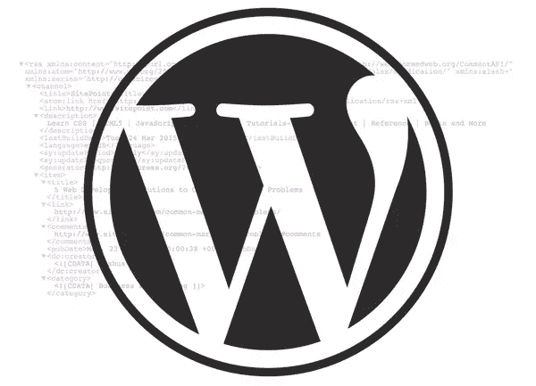

# 如何安装和使用 WP-CLI 管理 WordPress 网站

> 原文：<https://www.sitepoint.com/wp-cli/>

加快你的工作进程应该是你的首要任务之一。简单来说，如果你用更少的时间做更多的工作，那么你将有更多的时间做更多的项目，学习和休息。

WP-CLI 是一个命令行工具，专门用于通过命令行管理你的 WordPress 网站。通过几个简单的命令，你可以管理 WordPress，甚至不需要登录你的 WordPress admin 并浏览页面。



在本教程中，我们将学习什么是 WP-CLI，如何安装它，以及这个工具的基本命令的概述。

如果你是一个 WordPress 开发者，系统管理员或者经营一个围绕 WordPress 建立的企业，WP-CLI 将会特别有用。这个命令行工具将极大地帮助您在更短的时间内做更多的事情。例如，备份、更新 WordPress 和插件、发布内容和查询数据库可以相对快速地完成。

## WP-CLI 的要求

要安装 WP-CLI，请确保您有一个可以访问 SSH 的托管帐户。大多数共享主机提供商不允许您访问 SSH。如果你喜欢安装自己的服务器，像 DigitalOcean、Linode 和 AWS 这样的提供商是理想的选择。

其他要求是基本的:

1.  PHP 5.3.2 或更高版本。
2.  WordPress 3.4 或更高版本。
3.  类似 UNIX 的环境，如 Linux。

## 如何安装 WP-CLI

### 第一步

首先通过 SSH 连接到服务器的命令行。您可以使用 cURL 或 wget 命令安装最新版本的 WP-CLI。WP-CLI 安装文件以 phar 文件的形式提供，最新版本可在以下位置找到:

[https://raw . github . com/WP-CLI/builds/GH-pages/phar/WP-CLI . phar](https://raw.github.com/wp-cli/builds/gh-pages/phar/wp-cli.phar)

使用 cURL 命令，键入:

```
curl -O https://raw.githubusercontent.com/wp-cli/builds/gh-pages/phar/wp-cli.phar 
```

这会将 WP-CLI 文件下载并解压缩到您的 root 用户目录。

### 第二步

接下来，我们将设置权限以使其可执行。输入以下命令:

```
chmod +x wp-cli.phar 
```

### 第三步

或者，我们可以将 wp-cli.phar 移动到一个文件夹中，并将其重命名为 wp。这将有助于我们使用 WP-CLI 命令，只需在命令开头键入“WP”。

```
 sudo mv wp-cli.phar /usr/local/bin/wp 
```

就是这样！现在我们可以开始使用许多 WP-CLI 命令了。

## 基本 WP-CLI 命令

为了简单起见，我们将概述基本的 WP-CLI 命令。你可以在这里探索更多的[命令。](http://wp-cli.org/commands/)

## 使用 WP-CLI 帮助系统

WP-CLI 附带完整的帮助系统，您可以通过键入“wp help”来访问，例如:

```
wp help cache 
```

将信息显示为:

### 名字

```
wp cache 
```

### 描述

```
Manage the object cache. 
```

### 摘要

```
wp cache <command> 
```

### 子命令

`add`–向对象缓存添加一个值。
`decr`–减少对象缓存中的值。
`delete`–从对象缓存中删除一个值。
`flush`–刷新对象缓存。
`get`–从对象缓存中获取一个值。
`incr`–在对象缓存中增加一个值。
`replace`–替换对象缓存中的现有值。
`set`–给对象缓存设置一个值。
`type`–尝试确定正在使用哪个对象缓存。

### 例子

```
wp cache set my_key my_value my_group 300                                                                                                

wp cache get my_key my_group 
```

您可以使用帮助系统来了解如何使用这些命令及其各自的子命令。

## 用 WP-CLI 安装 WordPress

如果你还没有在你的服务器上使用任何其他方法安装 WordPress，那么你可以使用 WP-CLI 命令`wp core install`轻松完成。随着该命令，我们需要传递参数，如网址，标题，管理员用户名，密码和管理员电子邮件。

```
wp core install --url="your_domain"  --title="Blog Title" --admin_user="admin username" --admin_password="enter_your_password" --admin_email="enter_your_email" 
```

## 使用 WP-CLI 安装主题

通过 WP-CLI 导入和安装主题比进入 WordPress admin，搜索然后激活它要快得多。

它将你的服务器直接连接到 [WordPress 主题库](https://wordpress.org/themes/)，并在几秒钟内导入主题。例如，要安装 TwentyTen 这样的主题，我们将使用以下命令:

```
wp theme install twentyten 
```

同样，要安装 P2 主题，我们的命令将变成:

```
wp theme install p2 
```

要激活 WordPress 网站上的主题，你需要使用以下命令:

```
wp theme activate p2 
```

## 使用 WP-CLI 安装插件

就像主题一样，插件也可以直接从官方库安装。安装是无缝的，几乎不需要时间。

例如:`wp plugin install woocommerce`

上面的命令会在你的网站上安装 WooCommerce 插件。要激活它，我们将使用以下命令:

```
wp plugin activate woocommerce 
```

类似地，要停用任何插件，命令变成:

```
wp plugin deactivate woocommerce 
```

## 用 WP-CLI 更新 WordPress 核心、主题和插件

更新 WordPress 核心、主题和插件的重复且耗时的任务可以通过命令行轻松完成。

要将 WordPress 核心更新到 WordPress 的最新稳定版本，命令是:

```
wp core update 
```

如果你想更新到一个特定的版本，例如你有 WordPress 3.7，并想转移到 WordPress 4.0 而不是 WordPress 4.3，使用命令:

```
wp core update --version=4.0 
```

或者，如果出于某种原因，你想把你的 WordPress 站点恢复到以前的版本，命令是:

```
wp core update --version=3.9 --force 
```

要更新插件，你可以定义一个插件来更新，或者更好的是，一次更新所有插件。

```
wp plugin update woocommerce

wp plugin update --all 
```

类似的方法也适用于主题。你可以用以下命令通过 WP-CLI 更新 WordPress 主题

```
wp theme update twentyten
wp theme update --all 
```

## 结论

WP-CLI 确实是一个强大的工具，可以用来通过命令行管理你的 WordPress 站点。还有更多的命令来管理你的数据库，备份，管理文章，评论和 WordPress multisite。它无疑加快了你的任务，使管理网站变得非常容易。幸运的是，有些主机提供商在他们的 WordPress 安装上默认提供 WP-CLI([你可以在这里找到一个维护列表](https://github.com/wp-cli/wp-cli/wiki/List-of-hosting-companies))。

## 分享这篇文章